# SAMANVAY — the complete solution walkthrough

**ISRO / Smart India Hackathon problem ID26166 — lunar image registration.**
A judge-facing reference: what the system does, how every stage works, why each choice was
made, what has been measured, and what has not.

> **Revised 2026-09-05.** Since first writing, three matched physics-ablation pairs have
> landed — two of them on **real** imagery (Chandrayaan-2 TMC ↔ TMC and LROC NAC ↔ NAC) —
> closing the "you only ablated on synthetic data" gap. See
> **[12 §10](#10-the-physics-ablation-on-real-data--added-2026-09-05)**. Two claims in the
> earlier draft were superseded and are corrected in place: the inlier ratio now has a
> passing run (`runs/demo_pass`, 0.9357), and Chandrayaan-2 evidence is no longer
> pipeline-stale. Nothing else changed; every other number was re-verified against its
> artifact and still holds.
>
> **How to use this document.** It is a reference to search, not a document to read end to
> end. The cheat sheet below is what you need in the first sixty seconds. The table of
> contents is next. **[Part V — Anticipated questions](#18-anticipated-questions-with-answers)**
> is the one to have open during Q&A.
>
> **The rule this document is written under is the rule the repository is written under:
> every number is one somebody ran, with the artifact it came from named beside it. Where
> no number exists, it says so.** If you cannot find the measurement, do not quote the
> claim. A jury forgives a gap it was told about; it does not forgive one it discovers.

---

## The sixty-second cheat sheet

**What it does.** Registers Chandrayaan-2 optical imagery (OHRC / TMC-2 / IIRS) against
LRO NAC/WAC and SELENE reference imagery to sub-pixel accuracy, with tie-points spread
uniformly across the frame instead of clustered wherever the texture was easy.

**Why it is hard, in one sentence.** A source acquired at 70° solar incidence and a
reference at 20° are not correlatable as raw DN — the same crater is a bright rim in one
image and a dark shadow in the other — so gradient-based descriptors (SIFT/ORB) match
crater floors to crater rims and fail outright.

**The two-pillar answer.**
1. **Divide out predicted illumination before matching** — rendered from a DEM through a
   Lommel-Seeliger / Lunar-Lambert disk function where the DEM actually resolves the
   terrain, low-frequency-only where it does not, empirical where there is no DEM. What
   remains is close to surface albedo, which two sun angles agree on.
2. **Match on phase congruency, not intensity** — a dimensionless ratio of local energy to
   summed Fourier amplitude, so any linear brightness or contrast change cancels in the
   numerator and denominator. Invariant *by construction*, not by training.

Everything is classical and inspectable: **no learned matcher, no training data, no GPU,
air-gap installable.**

### The five numbers to know

| | number | where it came from |
|---|---|---|
| **Held-out accuracy, real data** | **1.2753 source px** over **1062 held-out tie-points** (fitted on 4511) | `runs/docs_real_nac_dsun115/metrics.json` — LROC NAC ↔ NAC, Apollo 16, Δsun 115.4°, with DEM |
| **The ablation that carries the thesis — on REAL data** | canonicaliser **off** on real Chandrayaan-2 TMC ↔ TMC: **400 inliers → 5**, SDI **0.571 → 0.054**, coverage **87.5% → 18.75%** | `runs/demo_ch2` vs `runs/demo_ch2_nophysics` — same pair, same config, `photometry.canonicalise` the only variable |
| **The same ablation with ground truth** | canonicaliser **off** → true error **1.60 px → 69.70 px**, model **fails outright, 0 inliers** | `runs/pitch` vs `runs/pitch_nophysics` (synthetic `dsun_50` + DEM). On `synth_pair_A` the same switch gives 2.93 px → 28.66 px (`runs/deploy_ablate2/ablation.csv`) |
| **The matcher choice, measured** | `auto` delivers a model on **all 14** Δsun pairs (0.024–6.824 px true error); pinned SIFT delivers **no model at all** from Δ60° to Δ180° | `bench/baselines.md` §1, 14-pair synthetic sweep with analytic ground truth |
| **The bar we miss** | inlier ratio **0.8294** against the plan's **0.85** — a **FAIL**, and the closest any pair gets | `runs/docs_real_nac_dsun115/metrics.json` |

### The three things to say before a judge finds them

1. **`gt_rmse_px` is `null` on every real pair.** There is no ground-truth transform for
   real lunar imagery, so real-world geodetic accuracy is **unknown**. What we report on
   real data is held-out self-consistency, which is a different quantity. Synthetic pairs
   have analytic truth; real ones do not, and we do not blur the two.
2. **The inlier ratio clears the plan's 0.85 bar only on easy pairs, and misses it on
   every hard one.** It passes at **0.9357** on `runs/demo_pass` (synthetic `dsun_20`,
   Δsun 10° as the engine measures it, resolving to SIFT — true error **0.1575 px**,
   held-out **0.443 px**, SDI **0.8113**), and on the Δ0/Δ10/Δ20 sweep pairs (0.994 /
   0.986 / 0.930). It **fails on all eleven remaining sweep pairs** and on every real pair
   — closest is **0.8294** on the real NAC Δ115° pair. The CLI prints the miss rather than
   hiding it. The reason is structural: the tiled matcher *relaxes* its ratio test to fill
   per-cell quotas, so the denominator grows with how hard the pair is — which is why
   `inlier_ratio` is not a quality score and `inlier_ratio_strict` is reported beside it.
   Read honestly, the bar is met exactly where the differentiator is not needed.
3. **The container has never been built and CI has never run on GitHub.** No Docker daemon
   on the authoring machine. The test suite, the smoke gate and the air-gap gate were all
   run by hand, and those results are real; the runner steps are not.

### The demo, in one command

```bash
make setup && make fixture && make demo      # ~30 s total; writes runs/demo_01
open runs/demo_01/report.html
```

**The showcase built for the stage** — `runs/demo_showcase/index.html` is a self-contained
dark-themed run index over the four runs that make the argument in one screen: real
Chandrayaan-2 with and without the physics stage, and real LROC NAC with and without it.
It carries no external asset and opens straight from `file://`.

```bash
open runs/demo_showcase/index.html
```

`make demo` registers the **hard** fixture — 2× scale ratio, 10° rotation, 100° sun-azimuth
difference, a source geotransform wrong by ~49 px, and no DEM. It reports held-out error
**1.5712 px**, true error **2.9287 px**, and an inlier ratio of **0.2936 that FAILS the
bar** — and prints all three. A 1:1 upright fixture lets fragile code look healthy until it
meets real data.

To show the differentiator failing on purpose, pin the matcher SIFT would have used:

```bash
samanvay register --source fixtures/synth_pair_A/source.tif \
  --ref fixtures/synth_pair_A/reference.tif --set match.method=sift --out runs/demo_fail
# FAILED: verify_status=failed — no model survived robust fitting ... exit=1
```

---

## Contents


**[Part I — The problem, and the shape of the answer](#part-i--the-problem-and-the-shape-of-the-answer)**

- [1. The problem, stated precisely](#1-the-problem-stated-precisely)
- [2. Why this is genuinely hard](#2-why-this-is-genuinely-hard)
- [3. The thesis — what SAMANVAY does differently](#3-the-thesis--what-samanvay-does-differently)
- [4. The pipeline, end to end](#4-the-pipeline-end-to-end)
- [5. Every technology used, and why](#5-every-technology-used-and-why)

**[Part II — The pipeline, stage by stage](#part-ii--the-pipeline-stage-by-stage)**

- [6. Stage 0 — Ingest: I/O, metadata extraction and preflight](#6-stage-0--ingest-io-metadata-extraction-and-preflight)
- [7. Stage 1 — Photometric canonicalisation: the physics stage](#7-stage-1--photometric-canonicalisation-the-physics-stage)
- [8. Stage 3 — Feature detection, description and matching](#8-stage-3--feature-detection-description-and-matching)
- [9. Stage 2 & 4 — Geometric initialisation, verification, model selection and sub-pixel refinement](#9-stage-2--4--geometric-initialisation-verification-model-selection-and-sub-pixel-refinement)
- [10. The orchestrator — config, stage graph, auto-resolution and the CLI](#10-the-orchestrator--config-stage-graph-auto-resolution-and-the-cli)
- [11. Outputs — reports, the dashboard, and the air-gapped viewer](#11-outputs--reports-the-dashboard-and-the-air-gapped-viewer)

**[Part III — The evidence, and the plan it is measured against](#part-iii--the-evidence-and-the-plan-it-is-measured-against)**

- [12. Evidence — synthetic ground truth, benchmarks, ablation and calibration](#12-evidence--synthetic-ground-truth-benchmarks-ablation-and-calibration)
  - [↳ 12 §10. The physics ablation on real data — added 2026-09-05](#10-the-physics-ablation-on-real-data--added-2026-09-05)
- [13. Plan compliance matrix](#13-plan-compliance-matrix)
- [14. Deliberate departures from the plan](#14-deliberate-departures-from-the-plan)

**[Part IV — Engineering, and what we do not claim](#part-iv--engineering-and-what-we-do-not-claim)**

- [15. Engineering, deployment and reproducibility](#15-engineering-deployment-and-reproducibility)
- [16. Known limitations and failure modes](#16-known-limitations-and-failure-modes)
- [17. Roadmap — what three more months buys](#17-roadmap--what-three-more-months-buys)

**[Part V — The briefing](#part-v--the-briefing)**

- [18. Anticipated questions, with answers](#18-anticipated-questions-with-answers)
  - [18.1 On the accuracy claims — the hard ones, answered first](#181-on-the-accuracy-claims--the-hard-ones-answered-first)
  - [18.2 On the science](#182-on-the-science)
  - [18.3 On the engineering](#183-on-the-engineering)
  - [18.4 On scope and next steps](#184-on-scope-and-next-steps)


---

# Part I — The problem, and the shape of the answer
## 1. The problem, stated precisely

SAMANVAY is built against a single written specification, [`docs/ISRO_ID26166_Prototype_Plan.md`](docs/ISRO_ID26166_Prototype_Plan.md), and every claim in this document is measured against that file rather than against a restatement of it.

**The deliverable.** Register Chandrayaan-2 optical imagery (OHRC, TMC-2, IIRS) against LRO NAC/WAC and SELENE reference imagery to **sub-pixel accuracy**, producing **uniformly distributed tie-points** across the frame rather than tie-points clustered wherever texture happened to be easy. [README.md](README.md) states the same scope in the first paragraph.

**The explicit success criteria the plan sets**, quoted from its own sections:

| criterion | where the plan states it | what it demands |
|---|---|---|
| Illumination / shadow-inversion invariance | Part 1 §1 | "Standard gradient-based descriptors (SIFT/ORB) mistake crater floors for crater rims, failing completely." The named remedy is **Phase Congruency (RIFT)**. |
| Enforced spatial uniformity | Part 1 §2 | **Quad-Tree ANMS** plus grid-based feature allocation, and the metrics must "natively calculate and output a **Spatial Distribution Index (SDI)**". |
| Hyperspectral→panchromatic bridging | Part 1 §3 | SNR-screen IIRS bands, drop noisy ones, **PCA**, take PC1 as a pseudo-panchromatic structural map. |
| Independent check points | Part 1 §4 | Split tie-points into **control** and **independent check points**; compute **sub-pixel RMSE only on the check points**. |
| Sub-pixel refinement | Part 2 Step 4 | 16×16 or 32×32 windows, **FFT phase correlation**, 2-D Gaussian peak fit "down to a 0.05 sub-pixel accuracy". |
| Non-rigid model | Part 2 Step 5 | MAGSAC++ then a **Thin Plate Spline**, "unlike basic homography (which assumes the moon is completely flat)". |
| **Inlier ratio** | Part 3 §4 | **"Inlier Ratio (> 85%)"** — the 0.85 bar. |
| Packaging | Part 3 | A CLI of the shape `--source … --ref … --out … --metrics report.json`, a GUI/visualiser, registered GeoTIFFs preserving spatial metadata, a **CSV of sub-pixel match points** (`Source X, Source Y, Ref X, Ref Y`), a JSON/PDF metrics report, and a **Dockerfile** so judges can run it without dependency hell. |

Two of those criteria deserve to be flagged now rather than buried later. First, the **0.85 inlier-ratio bar is missed by every pair quoted in this repository** — 0.8294 on the best real pair ([`runs/docs_real_nac_dsun115/metrics.json`](runs/docs_real_nac_dsun115/metrics.json), `inlier_ratio_pass: false`), 0.2936 on the shipped synthetic demo, and cleared on only 3 of the 14 sweep pairs (0.994 / 0.986 / 0.930 at Δsun 0°/10°/20°, [`bench/baselines.md`](bench/baselines.md) §1). The CLI prints the miss; it does not hide it. Second, the plan's Part 2 prescribes **LoFTR** for coarse alignment. SAMANVAY does not use it, and §3 below argues why that substitution is deliberate rather than a shortfall.

---

## 2. Why this is genuinely hard

**The central difficulty is that the two images are not the same measurement.** A source frame acquired at 70° solar incidence and a reference acquired at 20° are not correlatable as raw DN. The same crater is a bright rim in one and a dark shadow-filled bowl in the other; the DN at a pixel is the product of an albedo you want and an illumination field you do not. [`samanvay/photometry/normalize.py`](samanvay/photometry/normalize.py) opens with exactly that statement: "OHRC at 70 deg incidence and LRO NAC at 20 deg incidence are not correlatable as DN, but their albedo estimates are." A gradient-based descriptor keys on the *sign and orientation* of local intensity change, and cross-illumination inverts both.

The measured shape of that failure, on 14 pairs where **only the source sun azimuth changes** and geometry, DEM, albedo, sun elevation and noise are byte-identical ([`bench/baselines.md`](bench/baselines.md) §1, measured 2026-09-02): pinned SIFT returns 292 inliers at Δ20°, 69 at Δ30°, 23 at Δ40°, **9 at Δ50°, and then no model at all on all eight pairs from Δ60° to Δ180°**. It is a cliff, not a degradation.

The same sweep also **contradicts the plan's own intuition**, and this is worth putting in front of a hostile jury before they find it: true error on the shipped `auto` arm peaks at **6.824 px at Δ120°** and falls back to **0.592 px at Δ180°**. Opposite suns — the plan's literal "inverse shadows" case — is the *easiest* cell in the entire RIFT range. A phase-congruency descriptor keys on where structure is; an inverted shadow is the same edge in the same place, while a shadow rotated 90° is a different edge somewhere else. Nothing in this project's docs said that before the sweep was run ([`bench/baselines.md`](bench/baselines.md) §1, "What this says" #2).

The secondary difficulties are each independently sufficient to break a naive pipeline:

- **GSD ratios up to ~240×.** SLDEM2015 is ~60 m/px; OHRC is ~0.25 m/px. You cannot render 0.25 m shading from a 60 m DEM — what comes out is interpolation artefacts wearing a physics costume, and dividing by them makes the image *worse* ([`docs/decisions.md`](docs/decisions.md) D2, [`docs/limitations.md`](docs/limitations.md) §1). The same ratio breaks descriptor matching directly: OHRC against WAC is a ~400× scale step, and cross-tier chaining (OHRC→NAC→WAC) is **not implemented** ([`docs/limitations.md`](docs/limitations.md) §4).
- **Extreme aspect ratios.** The real LROC NAC strip registered here is **888 × 11952** — 13.5:1. On a fixed 4×4 uniformity grid that gives 13:1 cells, and both `coverage_pct` and the per-cell quotas are then measured on a partition nobody would defend ([`samanvay/geometry/uniformity.py:6`](samanvay/geometry/uniformity.py#L6)).
- **Geotransform priors that are missing or wrong.** The metadata prior is not a nuisance, it is the thing being corrected. The shipped fixture's source geotransform is deliberately wrong by **49.2 source pixels** at the worst corner ([`fixtures/synth_pair_A/README.md`](fixtures/synth_pair_A/README.md)); the sweep fixtures carry 36.2 px. Worse, that same error poisons the physics: a DEM is sampled onto the image grid *through the image's own geotransform*, so a wrong pose renders illumination misaligned with the terrain that made it. Measured verdict in [`samanvay/photometry/normalize.py:27`](samanvay/photometry/normalize.py#L27): "full-resolution shading from a wrong pose is *worse than no shading at all*."
- **No ground truth on real lunar data.** Every real pair in this repository reports `gt_rmse_px: null`. There is no truth transform for LROC NAC ↔ Chandrayaan-2, so what a real run produces is **held-out self-consistency, never geodetic error** ([`docs/limitations.md`](docs/limitations.md) §6). And the sweep shows the size of that gap: over eight cells where true error runs 2.110 → 6.824 px, `check_rmse_px` stays inside 1.05–1.75 px. Held-out points catch blunders; they cannot catch a fit that is consistent with its own tie-points and wrong.
- **Featureless mare.** Smooth maria genuinely contain no tie-points. The system reports `insufficient_texture` per cell rather than manufacturing correspondences, and a majority-shadow cell is dropped from the coverage *denominator* as `masked_invalid` ([`samanvay/geometry/uniformity.py:26`](samanvay/geometry/uniformity.py#L26), [`docs/limitations.md`](docs/limitations.md) §2).
- **Clustering violates the uniformity requirement directly.** Tie-points pile up where texture is easy. The measurement: at Δ50° the pinned-SIFT arm's 9 surviving points cover **37.5%** of the grid at **SDI 0.148**, against the `auto` arm's 100% and 0.749 on the same pair ([`bench/baselines.md`](bench/baselines.md) §1). Uniformity is not a cosmetic metric — a tie-point field covering half the frame warps the other half.

---

## 3. The thesis — what SAMANVAY does differently

**Pillar (a): divide out predicted illumination, at the scale the DEM can actually defend.**

Rather than one photometric correction, [`samanvay/photometry/normalize.py`](samanvay/photometry/normalize.py) selects one of three modes per product and writes it to `CanonicalImage.params["illum_mode"]`, so no number leaves the pipeline without the provenance of how its illumination was handled:

- `dem` — full physical render: Lommel-Seeliger over DEM surface normals with a ray-marched cast-shadow field, divided out. Entered only when `dem_gsd / image_gsd <= dem_gsd_ratio_max`, default **4.0** ([`samanvay/photometry/normalize.py:111`](samanvay/photometry/normalize.py#L111)). Realistic at TMC (~5 m) and IIRS (~80 m) scale.
- `dem_lowfreq` — render, then divide out **only the low-frequency component** (Gaussian, sigma derived from the GSD ratio). Structure finer than the DEM can resolve is deliberately left alone. This is the OHRC-against-SLDEM case, and it is the mode the real NAC pair actually ran in (`illum_mode: dem_lowfreq`, [`runs/docs_real_nac_dsun115/metrics.json`](runs/docs_real_nac_dsun115/metrics.json)).
- `empirical` — no usable DEM or no sun geometry: the image's own low-frequency envelope, divided out.

A second, independent axis guards the pose problem: `illum_scale` defaults to `"auto"` and takes the full-resolution render **only when the pose is trustworthy** — asserted by the caller, or a supplied image→DEM transform, or a stated uncertainty inside `pose_trust_px` ([`samanvay/photometry/normalize.py:31`](samanvay/photometry/normalize.py#L31), [`:112`](samanvay/photometry/normalize.py#L112)). Low-frequency removal is robust to tens of pixels of pose error precisely because it only removes structure far coarser than the pose is wrong by.

The rejected alternative is named in [`docs/decisions.md`](docs/decisions.md) D2: rendering full-resolution physics at OHRC scale from SLDEM and presenting one "physics-based correction" number. It lost because "an ISRO domain jury contains people who know SLDEM's resolution by heart. They *will* ask… **Naming it first converts the project's biggest weakness into its most credible moment.**"

**Pillar (b): match on phase congruency, invariant by construction rather than by training.**

[`samanvay/photometry/phasecong.py`](samanvay/photometry/phasecong.py) implements Kovesi log-Gabor phase congruency in the frequency domain (defaults `nscale=4, norient=6, min_wavelength=3.0, mult=2.1, sigma_onf=0.55, k=2.0, cut_off=0.5, g=10.0`, [`phasecong.py:44`](samanvay/photometry/phasecong.py#L44)). The invariance is structural, not empirical: the PC ratio's numerator and denominator both scale linearly with contrast, and the guard term `eps` is set to `1e-4 × img.std()` specifically so that `pc(a·I) == pc(I)` holds for any `a > 0` ([`phasecong.py:67`](samanvay/photometry/phasecong.py#L67)). That is a proof obligation the code discharges in one line, not a property a training set has to supply.

On top of it, [`samanvay/match/describe.py`](samanvay/match/describe.py) builds RIFT (Li et al., arXiv:1804.09493), which histograms the **Maximum Index Map** — per pixel, the *index* of the log-Gabor orientation carrying maximum energy. The docstring states why this beats the earlier attempt: an index is a discrete label, so a non-linear intensity change "has to move a pixel's energy from one orientation channel to another before the descriptor notices — a far higher bar than perturbing a continuous angle." Two documented departures from the paper: **upright-only** (rotation invariance costs `norient` MIMs per keypoint; D3 assumes near-upright imagery, ceiling ~±20° relative rotation) and **multi-scale patches** `(24, 34, 48, 68, 96)` because the paper's single patch size silently assumes both images share a pixel scale, and a 2× ratio breaks that ([`describe.py:38`](samanvay/match/describe.py#L38)).

The two pillars are joined by a switch that resolves itself: `match.method` ships as `"auto"` ([`samanvay/pipeline/config.py:96`](samanvay/pipeline/config.py#L96)) and resolves from the pair's circular Δ sun azimuth against a **20.0°** bar ([`samanvay/pipeline/stages.py:52`](samanvay/pipeline/stages.py#L52)) — RIFT at or above it, SIFT below. The bar is not tuned; it is the value `io/preflight.py` already recommends on, so `auto` cannot recommend one thing and do another ([`docs/decisions.md`](docs/decisions.md) D7). This is stated as a correction of a real mistake: the old default was the fixed string `"sift"`, which meant a judge running the tool with no flags got the arm that does not survive the problem the project exists to solve.

Two honest asymmetries, stated here rather than left to be found. **RIFT is worse than SIFT below the bar** — the only figure available is an archived one (0.26 px pinned-RIFT against 0.02 px raw SIFT at Δ0°, [`bench/baselines.md`](bench/baselines.md) §5), and D7 says so. And **CLAHE, which the plan explicitly asks for, is switched off on the RIFT arm** (`clahe: "auto"`, [`config.py:87`](samanvay/pipeline/config.py#L87)) because a spatially varying non-linearity perturbs exactly the quantity phase congruency measures. That decision is measured and **split against itself**: on `synth_pair_A` the default wins every column (2.929 vs 6.757 px true error, 64 vs 23 inliers); on `dsun_50` CLAHE-on is 2.8× better on *true* error (0.664 vs 1.887 px) while losing on held-out error, inliers and uniformity ([`docs/decisions.md`](docs/decisions.md) D8). The default is the arm better on `check_rmse_px` on both fixtures. D8 ends: "must not claim the RIFT half is unmeasured, and must not claim it is settled."

**The engineering thesis: everything classical and inspectable.**

No learned matcher, no training data, no GPU, no network at runtime. `make airgap` is a CI gate that passes only if no generated HTML references an external URL and no import falls outside `requirements.lock`. Every default is a config key in one file ([`samanvay/pipeline/config.py`](samanvay/pipeline/config.py)), so an ablation is a `--set` flag rather than a rewrite, and every run writes `metrics.json`, `provenance.json` (git SHA, dirty flag, seed, full config, package versions, per-field `meta_source`) and `transform.json` to disk.

**"Why not LoFTR, SuperGlue, R2D2?"** — the argument, in four parts:

1. **No lunar training corpus with truth.** Section 2 established that no real Chandrayaan-2 ↔ LRO pair in this project has a ground-truth transform. That is not a resourcing gap, it is the same missing quantity a supervised matcher would need thousands of instances of. Training on synthetic renders — both images from one DEM and one albedo field — teaches the matcher the renderer, and [`docs/limitations.md`](docs/limitations.md) §6 already names that trap for our own metrics.
2. **No GPU in the target deployment.** An ISRO ground-segment tool that must install air-gapped and run on operator hardware cannot assume CUDA. The whole pipeline is NumPy/SciPy/OpenCV; the real 10.6 Mpx NAC pair registers in **194.7 s** of wall clock on a laptop ([`runs/docs_real_nac_dsun115/metrics.json`](runs/docs_real_nac_dsun115/metrics.json)).
3. **No auditability.** When a registration is wrong, `illum_mode`, `match_method_reason`, `clahe_reason`, per-cell `cell_states` and `tps_status` say which stage decided what and why. A learned matcher's failure is a weight tensor.
4. **A learned matcher cannot be ablated to prove which component earned the accuracy.** The claim this project makes is that illumination canonicalisation plus phase congruency is what survives Δsun 100°, and it is provable only because each stage has an off switch and a one-switch row ([`bench/ablate.py`](bench/ablate.py), [`bench/baselines.md`](bench/baselines.md) §2).

**And the fair acknowledgement**, which the repository makes before any judge does: [`docs/limitations.md`](docs/limitations.md) §5 states plainly that this is "a deliberate scope choice… It is still a limitation: **on hard cross-modal pairs a learned matcher would very likely beat this**", and `MatchSet.method` is a per-point uint8 code ([`samanvay/types.py`](samanvay/types.py)) so a learned rung can be added to the ladder rather than requiring a rewrite. A LoFTR-class detector-free matcher would almost certainly find correspondences in the low-texture mare where SAMANVAY correctly returns `insufficient_texture`, and would likely hold more inliers through the Δ90–120° trough where our true error peaks at 6.824 px. The argument is not that learning is worse; it is that an unauditable, untrainable, GPU-bound component is the wrong trade for a ground-segment tool whose accuracy on real data nobody can yet verify.
## 4. The pipeline, end to end

Everything below is the code path of `samanvay register`, in the order it actually executes. The entry point is the console script `samanvay = "samanvay.pipeline.run:cli"` ([pyproject.toml:43](pyproject.toml#L43)); the whole orchestration is one function, [`run_pipeline`](samanvay/pipeline/stages.py#L366), 220 lines, no framework, no DAG engine.

### 4.1 The stage graph

```mermaid
flowchart TD
  CLI["run.py register<br/>flags → load_config()<br/>DEFAULTS → YAML → dict → --set"] --> SEED["_apply_seed(cfg.seed)<br/>cv2.setRNGSeed ONLY"]
  SEED --> LOAD["① load — load_product ×2<br/>band_cfg → reduce_bands"]
  LOAD --> AUTO{"resolve_auto()<br/>UNTIMED"}
  AUTO -->|"Δsun az unknown or ≥ 20.0°"| RIFT["method=rift<br/>PC=True · CLAHE=False"]
  AUTO -->|"Δsun az &lt; 20.0°"| SIFT["method=sift<br/>PC=False · CLAHE=True"]
  AUTO -->|"match.method pinned"| PIN["pass through,<br/>reason says 'pinned'"]
  RIFT --> INIT
  SIFT --> INIT
  PIN --> INIT
  INIT["② coarse_init — coarse_init_info()<br/>1 geotransform → 2 gsd_ratio → 3 identity"] --> CANON{"③ canonicalise<br/>photometry.canonicalise?"}
  CANON -->|false| PASS["_passthrough_canonical<br/>illum_mode='none', pc=0"]
  CANON -->|"true (cache miss)"| MODE{"illum_mode<br/>_illumination()"}
  MODE -->|"DEM + sun + gsd,<br/>pose trusted, ratio ≤ 4.0"| DEM["'dem'"]
  MODE -->|"DEM but pose untrusted<br/>or ratio &gt; 4.0"| LF["'dem_lowfreq'"]
  MODE -->|"no/unreadable DEM,<br/>no sun, no gsd"| EMP["'empirical'"]
  PASS --> GRID
  DEM --> GRID
  LF --> GRID
  EMP --> GRID
  GRID["grid_shape() → rows×cols<br/>cell_budgets(n_cells) — UNTIMED"] --> MATCH{"④ match<br/>match.cascade_enabled?"}
  MATCH -->|true| CASC["match_cascade<br/>K levels, coarse→fine"]
  MATCH -->|false| TILED["match_tiled directly"]
  CASC --> CASCB{"per level"}
  CASCB -->|"fit ok"| SEEDNEXT["lift matches, seed level k-1"]
  CASCB -->|"fail, nothing fitted yet"| SKIP["status=skipped<br/>next level keeps coarse init"]
  CASCB -->|"fail after a success"| REJ["status=rejected — STOP<br/>return finest working level"]
  SEEDNEXT --> VINIT
  SKIP --> VINIT
  REJ --> VINIT
  TILED --> VINIT
  VINIT{"verify_init source"} -->|"cascade_info.transform ≠ None"| VC["'cascade_transform'"]
  VINIT -->|else| VI["'coarse_init' / 'none'"]
  VC --> VER
  VI --> VER
  VER["⑤ verify — verify_matches()<br/>init gate → check split →<br/>similarity/affine/homography ladder"] --> TPS{"TPS gate<br/>geometry.tps"}
  TPS -->|"held-out RMSE improves AND<br/>settled check pts not degraded"| TPSA["tps_status='applied'<br/>model_type += '+tps'"]
  TPS -->|"no improvement / no hold-out /<br/>&lt;25 control / singular"| TPSR["rejected_no_improvement /<br/>too_few_control / singular"]
  TPSA --> REF
  TPSR --> REF
  REF{"⑥ refine<br/>geometry.subpixel?"}
  REF -->|"refine.method='phase'"| PH["refine_matches()<br/>phase_cross_correlation"]
  REF -->|"refine.method='lsm'"| LSM["lsm_refine()<br/>Gauss-Newton, 8 params"]
  REF -->|false| NOREF["skip"]
  PH --> REV["verify_matches AGAIN<br/>same verify_init<br/>(timed inside 'refine')"]
  LSM --> REV
  REV --> MET
  NOREF --> MET
  MET["⑦ metrics — compute_metrics()<br/>+ acceptance() three-bar gate"] --> WARP{"⑧ warp<br/>registration.warp?"}
  WARP -->|None| WP["cv2.warpPerspective"]
  WARP -->|"TPS present"| RM["meshgrid → tps.pullback → cv2.remap"]
  WP --> WR
  RM --> WR
  WR["⑨ write — write_outputs()<br/>10 artifacts"] --> EXIT["exit 0, or 1 if<br/>verify_status≠ok OR accepted=False"]
```



### 4.2 Stage by stage

Runtime fractions are quoted from two real `metrics.json` files: **`runs/demo_01`** (`fixtures/synth_pair_A`, 1715×1715 source vs 1024×1024 reference, warm canonicalisation cache) and **`runs/docs_real_nac_dsun115`** (the README's headline real pair, LROC NAC 888×11952 ≈ 10.6 Mpx per image, [README.md:92](README.md#L92)).

**0. Config resolution and seeding (untimed).** [`load_config`](samanvay/pipeline/config.py#L183) merges `DEFAULTS` → YAML → the CLI's `overrides` dict → `--set key=value` pairs, then `resolve()` pushes `grid_n` and `grid_aspect` down into `geometry` so three modules cannot disagree. [`_apply_seed`](samanvay/pipeline/stages.py#L213) calls `cv2.setRNGSeed` and *nothing else*, and records `seed_applied_to: "cv2 global RNG (RANSAC/MAGSAC sampling in geometry/verify)"` — the docstring states plainly that the control/check split is a coordinate hash, ANMS breaks ties by index, and no numpy generator exists under `samanvay/` outside `trn.py`, so `--seed` is not allowed to imply reproducibility it does not deliver.

**1. `load`.** In: two paths. Runs: [`load_product`](samanvay/io/loaders.py#L99) twice. Out: two `Product`s. A single-band raster whose band 1 exceeds `MAX_INMEMORY_BYTES = 1 << 29` (512 MiB) gets a `TiledReader` instead of an ndarray ([loaders.py:30](samanvay/io/loaders.py#L30)); a multi-band cube never does, because the tiled reader is band 1 and [`reduce_bands`](samanvay/io/bands.py) exists precisely to stop `src.read(1)` on a 250-band IIRS cube. `max_pixels` decimation is **off by default** — "a slow read is recoverable, a silently rescaled GSD is not" ([loaders.py:99](samanvay/io/loaders.py#L99)) — and when a caller does opt in, `_fold_decimation` rewrites `shape`, `geotransform` and `gsd_m` together. Failure mode: `FileNotFoundError` on a missing product (never a mock). Cost: 0.04 s of 10.74 (demo_01), 0.454 s of 194.7 (dsun115) — under 0.5% either way.

**2. `resolve_auto` — untimed, and it must be here.** [`resolve_auto`](samanvay/pipeline/stages.py#L96) is called *between* load and coarse init, outside any timer block. It computes `delta_sun_az_deg` **circularly** ([stages.py:78](samanvay/pipeline/stages.py#L78) — 350° and 10° are 20° apart, not 340°), then resolves three switches against the bar `_AUTO_SUN_BAR_DEG = 20.0`: `match.method` → `rift` if Δsun is unknown **or** ≥ 20°, else `sift`; `photometry.phase_congruency` → `True` iff the method is in `("rift","l2")`; `photometry.clahe` → `True` iff the method is in `("sift","orb")`. The 20° bar is *not* tuned — it is `io/preflight.py`'s bar reused verbatim so `samanvay check` and `samanvay register` cannot be two engines. Rejected alternative, on measurement: the old fixed default `"sift"` collapses to 9 inliers at Δ50° and produces **no model at all** on all eight pairs from Δ60°–180°, where `auto` delivers 46–73 inliers at 2.11–6.82 px ([docs/decisions.md D7](docs/decisions.md#L312)). A pinned method is passed through untouched, and `match_method_recommended` still records what the rule *would* have said, so `run.py` prints a yellow "preflight would recommend…" line when the two disagree ([run.py:110](samanvay/pipeline/run.py#L110)).

**3. `coarse_init`.** In: two `Product`s (metadata only). Runs: [`coarse_init_info`](samanvay/geometry/init.py#L125). Out: a 3×3 float64 source→reference matrix plus `{method, reason, crs_match, scale}`. **This stage runs before canonicalisation**, which surprised me on first read — it is correct, because the init is built from geotransforms and GSDs, not pixels. Three-rung degradation ladder, never raises: `geotransform` (`inv(A_ref) @ A_src`, with the +0.5 pixel-centre offset baked in) → `gsd_ratio` (scale-only, centred on both images) → `identity`. Disable with `match.coarse_init=false`, which sets `init_info = {"method": "disabled"}`. Cost: 0.000–0.002 s in every run in `runs/`.

**4. `canonicalise` — pillar P1, the live ablation toggle.** In: `Product` + `cfg["photometry"]`. Runs: [`_canonicalise_cached`](samanvay/pipeline/stages.py#L266) → [`canonicalise`](samanvay/photometry/normalize.py#L482), or [`_passthrough_canonical`](samanvay/pipeline/stages.py#L244) when `photometry.canonicalise=false` (`--no-canonicalise`). Out: two `CanonicalImage`s. The three-way `illum_mode` split lives in [`_illumination`](samanvay/photometry/normalize.py#L353): `"dem"` needs a readable DEM **and** sun az/el **and** a GSD **and** a trusted pose **and** `dem_gsd_ratio <= dem_gsd_ratio_max = 4.0`; otherwise `"dem_lowfreq"` (render, then remove only the low-frequency field at a sigma floored by `max(2.0, ratio)` and, when the pose is untrusted, by `pose_uncertainty_px`); otherwise `"empirical"` (flat-field: the image's own envelope at `sigma = max(8.0, max(h,w)/16)`). The pose gate is the reason the default is `dem_lowfreq` on every real run in `runs/`: a DEM is sampled through the image's own geotransform, which carries the very ~36–49 px error the project exists to correct, and "full-resolution shading from a wrong pose is *worse than no shading at all*" ([normalize.py:22-28](samanvay/photometry/normalize.py#L22)). Invalid pixels are inpainted (`mask_fill="reflect"`, Telea) into the **PC input only**; the returned albedo keeps its zeros. Measured: boundary PC 35.5× the interior with `"zero"`, 1.07× with `"reflect"` on a contiguous cast shadow, and the docstring explicitly warns *not* to quote the dsun sweep as evidence for the fill (0.926 → 0.940 px, a wash). Cache key = sha256 over `(product_id, params, size, mtime_ns, abspath, shape)` — the absolute path and nanosecond mtime were added because `synth/sweep.py` fixtures collided on everything else and two Δsun steps silently shared one albedo ([stages.py:283-290](samanvay/pipeline/stages.py#L283), [decisions.md D-cache](docs/decisions.md#L639)). Cost: **0.016 s warm / 74.99 s cold** — it is the second-biggest stage on real data (38% of dsun115's `runtime_s`) and effectively free on a cache hit.

**5. `match` — pillars P3 + P5.** Before the timer opens, [`grid_shape`](samanvay/geometry/uniformity.py#L36) computes `rows × cols` from the *canonical albedo* shape (`grid_n=4` counts cells along the **short** axis; the long axis scales with aspect, capped at `_MAX_LONG_CELLS = 64`), and [`cell_budgets`](samanvay/pipeline/config.py#L199) allocates `{min_matches: 5, max_matches: 50}` per cell over `rows*cols` — passing `grid_n**2` instead would leave a strip's extra cells with no budget entry and silently fall back to `match_tiled`'s hardcoded quotas. dsun115 runs a **54 × 4** grid on its 13.5:1 strip. With `match.cascade_enabled=true` (default), [`match_cascade`](samanvay/match/cascade.py#L208) plans `K = 1 + ceil(log(r)/log(4))` levels, capped so the coarsest level leaves both images ≥ `_MIN_LEVEL_SIDE = 192` px and at `_MAX_LEVELS = 6`; the **finer** image is decimated to meet the coarser (never upsampled), so every level matches at ratio ≈ 1. Search margin contracts 64 → 32 → 16 px, floor 8. Its fallback logic is the subtle part: a level that fails **before any level has succeeded** is `skipped` (the next finer level inherits the same coarse init direct matching would have used); a level that fails **after** a success is `rejected` and halts the descent, returning the finest level that worked. The `_MIN_SEED_INLIERS = 8` bar is applied only while `k > 0`, because at the finest level the matches *are* the deliverable — without that exception the cascade returned 0 matches on an 80× OHRC-class pair where disabling it fitted a similarity at `gt_rmse_px 0.543` ([cascade.py:381-393](samanvay/match/cascade.py#L381)). Inside each level, [`match_tiled`](samanvay/match/tile.py#L111) detects+describes once per tile, runs one BFMatcher `knnMatch(k=2)`, then relaxes the Lowe ratio from `ratio_threshold` (0.90 for rift/l2, 0.75 otherwise) in `relax_ratio_step=0.05` steps up to `ratio_ceiling=0.95`, at most `relax_attempts=4` times, until the cell's `min_matches` is met — and publishes the relaxation accounting so `inlier_ratio_strict` is recoverable. Over-quota cells are thinned by [`anms_quadtree`](samanvay/match/anms.py#L99) (`match.anms=true`), not by a score sort, so 8 points come 2-per-quadrant rather than 8 from one corner. Finally, one tie-point per `(src, ref)` **location**: SIFT/ORB emit one keypoint per dominant orientation, and counting the duplicates inflated `inlier_count` **3.6×** on a real cross-mission pair while the run still claimed `rmse_trustworthy: true` ([tile.py:340-345](samanvay/match/tile.py#L340)). Out: `MatchSet` + `cell_info`. Cost: **10.42 s / 97% (demo_01)** and **108.7 s / 56% (dsun115)** — matching is the dominant stage on both.

**6. `verify` — pillar P2.** In: `MatchSet`, `cfg["geometry"]`, and an init. **The init is not always the coarse init**: if the cascade fitted a transform, `verify_init_source` becomes `"cascade_transform"` ([stages.py:456-458](samanvay/pipeline/stages.py#L456)) — measured, gating on the stale metadata prior instead collapsed 188 matches and a healthy fit to `verify_status=failed`, 0 inliers, `gt_rmse_px 66.2`, because exactly 4 matches passed the gate. Every real run I read reports `verify_init_source: "cascade_transform"`. [`verify_matches`](samanvay/geometry/verify.py#L266) then, in this order: (a) the **init gate**, `init_gate_px` defaulting to `max(16.0, 0.05 × match-bbox diagonal)`, with a documented ponytail ceiling that the bbox stands in for the real image diagonal — and a hard fallback that re-admits everything if fewer than `_MIN_INLIERS = 4` survive, so a bad init cannot kill every match; (b) the **control/check split**, `check_fraction=0.2`, stratified per cell and ordered by an FNV-1a + splitmix64 hash of coordinates quantised at 1e-3 px — deterministic without an RNG, so it survives a different match order, machine or numpy version; it is made only if ≥ `_MIN_CHECK = 8` check points remain *and* control keeps `_CONTROL_MULTIPLE(4) × min_sample(4) = 16` points; (c) the threshold conversion, `ransac_thresh_px` (3.0 source px) × the scale implied by the init, or by a rough similarity pre-fit **on control points only**; (d) the ladder — `similarity` (RANSAC; USAC is refused by OpenCV 5.0 in `estimateAffinePartial2D`, a named ponytail ceiling), `affine` and `homography` (both `USAC_MAGSAC`), `maxIters=5000`, `confidence=0.999`; each must clear `_MIN_INLIERS = 4` and `redundancy ≥ _MIN_REDUNDANCY = 2`, or it is recorded in `models_rejected` as "exactly determined". Candidates are then compared on **one common point set** (the best-supported candidate's inliers) so an 8-dof fit cannot win by shrinking its own inlier set, and the *simplest* model within `model_margin = 0.10` wins. `rmse_trustworthy` is `redundancy ≥ _TRUST_REDUNDANCY = 10`, measured in `runs/calibrate/redundancy.md` as the first bin where no fit understates its own error by more than 3×. (e) The **TPS gate**: fitted on control inliers only (needs `tps_min_control = 25`, `tps_lambda = 0.5`), kept only if `check_rmse_all_px` improves **and** the already-settled check points are not degraded. Both conditions are required: on `bench/fake_matches` with 20% gross outliers the first condition alone accepts 7/15 splines that should be rejected, both conditions accept 0/15, and on synthetic relief both accept 5/5 ([verify.py:466-494](samanvay/geometry/verify.py#L466)). With `tps: true` forced and no hold-out, `tps_status` is `"applied"` with null before/after — the artifact says no comparison stands behind it. Cost: 0.007 s (demo_01), 1.685 s (dsun115).

**7. `refine` — pillar P4.** Gated on `geometry.subpixel` and `len(matches.src_xy) > 0`. Default [`refine_matches`](samanvay/geometry/refine.py#L149): `patch=32`, `upsample=100`, `min_peak=0.30`, `min_peak_ratio=1.25`, `max_shift_px=patch/4=8`. Sigma is Förstner-style with `_NEFF_K = 0.22`, **refit by `bench/calibrate.py` on 2026-08-29** (the old 0.35 read 1.27× optimistic), and returns **NaN above `_RHO_MAX_VALIDATED = 0.99`** because there the error is a resampling-bias floor the model cannot see (1.7×–4.5× optimistic over 4362 samples). `refine.method=lsm` swaps in [`lsm_refine`](samanvay/geometry/lsm.py#L246) instead — ~2× more accurate on the points it accepts, but it accepts 100%/64%/2% across `dsun_00`/`dsun_50`/`synth_pair_A`, and its virtue on the hard pair is that it *refuses*. Then — and this is the load-bearing part — **`verify_matches` runs a second time** on the corrected points, seeded with the same `verify_init`, because "refining and then keeping the pre-refinement transform measures nothing" ([stages.py:464](samanvay/pipeline/stages.py#L464)). `refined_count` is recomputed here as points whose coordinates *actually moved* (`> 1e-9`), because counting finite sigma undercounts real refinements. Cost: 0.252 s (demo_01), 8.929 s (dsun115) — this figure includes the second verify.

**8. `metrics`.** [`compute_metrics`](samanvay/geometry/metrics.py#L103) assembles `rmse_px`, `inlier_ratio` (with `inlier_ratio_pass` against `_INLIER_RATIO_TARGET = 0.85`), the uniformity block (`coverage_pct`, `dispersion_cv`, `sdi = (coverage/100) × 1/(1+cv)`), `mean_sigma_px`, and — only if a `gt.json` sits beside the source — `gt_rmse_px` on a 9×9 grid over the source extent, evaluated through `tps.pullback` so it measures the **delivered** model rather than its 3×3 part. Then `stages.py` layers on the auto-resolution record, the seed record, the canonicaliser's decisions, `cell_info` and the whole `cascade` info block. Last, [`acceptance`](samanvay/pipeline/stages.py#L168) applies three bars that are all pre-existing thresholds, not new numbers: `verify_status == "ok"`, `check_status == "ok"`, `rmse_trustworthy`. It exists because on the real TMC→WAC pair a fit on **4 inliers with zero held-out check points** reported `verify_status: "ok"` and exited 0. Cost: 0.006–0.03 s everywhere.

**9. `warp`.** [`_warp`](samanvay/pipeline/stages.py#L322): no spline → `cv2.warpPerspective` with `warp_interp="cubic"`. Spline accepted → a full `meshgrid` over the **reference** shape, `tps.pullback(matrix, points, warp)`, then `cv2.remap` with `BORDER_CONSTANT 0` (the same fill `warpPerspective` leaves, which is what the writer declares as nodata). Warping with the 3×3 alone while `metrics.json` advertises `tps_applied: true` would ship "a number on a slide the product does not honour". `output.grid` defaults to `"both"`, so the un-resampled source array is also carried forward.

**10. `write`.** [`write_outputs`](samanvay/io/writers.py#L543) emits, into `out_dir`: `registered.tif`, `registered_source_grid.tif`, `matches.csv` (11 columns, blanks never zeros), `transform.json` (including the serialised `warp` block), `metrics.json`, `provenance.json` (git SHA/branch/dirty parsed from `.git` with stdlib only), `report.html`, `metrics_report.pdf`, `control_network.pvl`, `tiepoints.csv` — verified by `ls runs/demo_01`. The ISIS export and the rich report are both wrapped so a failure costs the artifact, not the run. The source-grid product's georeferencing is `GT_ref @ params` with an explicit centre↔corner half-pixel conversion, whose omission was measured at **80.0 m** of ground offset on the `ch2_wac` fit.

### 4.3 Three ordering facts a judge should be told before they ask

1. **`runtime_s` ends at the metrics stage.** It is computed as `time.perf_counter() - started` *inside* the metrics block ([stages.py:503](samanvay/pipeline/stages.py#L503)), so it excludes `warp` and `write`. Arithmetic check on `runs/demo_01`: `0.04 + 0.0 + 0.016 + 10.42 + 0.007 + 0.252 + 0.006 = 10.741` against a reported `runtime_s` of `10.736` — the 2.379 s warp is *not* in it. Same on `docs_real_nac_dsun085`: stages sum to 184.4 = `runtime_s` 184.391, with a 71.081 s warp on top.
2. **`stage_s` has no `"write"` key, ever.** `registration.metrics["stage_s"] = timer.stages` is assigned at the *top* of the `with timer("write")` block, and `metrics.json` is serialised by `write_outputs` before that timer's `__exit__` records the entry. Every `metrics.json` in `runs/` confirms it: eight keys, `load`…`warp`.
3. **`inlier_ratio_strict` is injected by the writer**, not by the metrics stage — `_strict_inlier_metrics` mutates the same `registration.metrics` dict inside `write_outputs` ([writers.py:568](samanvay/io/writers.py#L568)), so it reaches `metrics.json` and the returned dict but is invisible to `acceptance()`.

### 4.4 The intermediate data structures

All four are frozen in [samanvay/types.py](samanvay/types.py) under a contract-change protocol ([docs/CONTRACTS.md §5](docs/CONTRACTS.md)). Conventions, repo-wide: `(x, y) = (column, row)`, pixel centre at integer coordinates, every transform maps **source → reference**, every residual and RMSE is in **source pixels**.

| Type | Field | Shape / dtype | Invariant |
|---|---|---|---|
| `Product` | `path` | `str` | the file that was opened |
| | `array` | `(h,w)` native dtype **or** `TiledReader` | reader iff single-band and > 512 MiB |
| | `meta` | `dict` | `product_id, instrument, gsd_m, sun_az_deg, sun_el_deg, incidence_deg, emission_deg, geotransform, crs, shape, dtype, nodata, meta_source, band_reduction, read_decimation`. **Unknown stays `None`** — never a plausible substitute |
| `CanonicalImage` | `albedo` | `(h,w) float32` | in `[0,1]`, and forced to `0.0` wherever `mask != 0` |
| | `pc` | `(h,w) float32` | in `[0,1]`; all-zeros when `pc_status ∈ {"disabled","unavailable","skipped_empty"}` |
| | `pc_orient` | `(h,w) float32` | radians, `= o·π/norient` for winning channel `o`, so the MIM index is recoverable exactly |
| | `mask` | `(h,w) uint8` | frozen codes `0=valid 1=shadow 2=nodata 3=saturated`; precedence nodata > saturated > shadow |
| | `params` | `dict` | always carries `illum_mode ∈ {dem, dem_lowfreq, empirical, none}` and `pc_status ∈ {computed, disabled, unavailable}` |
| `MatchSet` | `src_xy`, `ref_xy` | `(N,2) float64` | source px / reference px |
| | `score` | `(N,) float32` | `1 - d1/(d2+1e-6)`; `≥ strict_score_min = 1 - ratio_threshold` marks the un-relaxed subset |
| | `method` | `(N,) uint8` | `0=sift 1=orb 2=rift/l2` |
| | `cell` | `(N,) int32` | `col + cols*row`, the same ids `assign_cells` recomputes |
| | — | — | **all five arrays have length N; `N == 0` is legal everywhere and must not raise** |
| `Registration` | `model_type` | `str` | `similarity\|affine\|homography\|failed`, optional `+tps` |
| | `params` | `(3,3) float64` | the **global** model, always, even when `warp` is set |
| | `init_params` | `(3,3) float64` | the init it started from, or identity |
| | `inliers` | `(N,) bool` | control RANSAC inliers **∪** check points inside the threshold |
| | `residuals` | `(N,2) float64` | source px, of the **delivered** model (spline included) |
| | `sigma` | `(N,) float64` | `NaN` = uncertainty unknown, which is *not* "not moved" and *not* zero |
| | `roles` | `(N,) uint8 \| None` | `0=control 1=check`; `None` ⇒ every `check_*` metric is `null` |
| | `warp` | `ThinPlateSpline \| None` | evaluate only via `tps.pullback(params, ref_xy, warp)` |
| | `metrics` | `dict` | undefined quantities are `null`, never `0.0` |

### 4.5 What the arrays actually are, and how memory stays bounded

Per image, a `CanonicalImage` is 3 × float32 + 1 × uint8 = **13 bytes/px**: at 10.6 Mpx that is ~138 MB per image, ~276 MB for the pair, and it is resident for the whole run. Everything else is bounded by a stated constant:

* **Read.** `MAX_INMEMORY_BYTES = 512 MiB` decides ndarray vs `TiledReader`; `TiledReader.read_all` then **refuses** above `READ_ALL_MAX_PX = 64_000_000` px rather than silently allocating ([core/tiling.py:13](samanvay/core/tiling.py#L13)) — a genuine ceiling, since the canonicaliser calls `read_all()`, so a true gigapixel OHRC strip stops the pipeline instead of thrashing it. The windowed path exists (`read_window`, `iter_tiles` with a halo) but `canonicalise` does not use it.
* **Cube reduction.** `_SAMPLE_BUDGET = 16_000_000` samples and `_MAX_SIDE = 512` cap the screening read; PC1 is then evaluated at full resolution **one band at a time**, so peak memory is one band plus the output, never the cube.
* **Phase congruency**, the runtime hog. Only `O(nscale)` complex arrays live at once, never `O(nscale × norient)`. The float32-vs-float64 promotion fix at [phasecong.py:99](samanvay/photometry/phasecong.py#L99) is measured: 4096² went **16.25 s / 4.57 GB → 9.09 s / 3.03 GB**, 6144² **83.02 s → 19.72 s**. `_lowpass` computes wide Gaussians on a decimated copy (a direct σ=256 convolution on a 4k image cost ~15 s for nothing).
* **Matching** never holds both full images in descriptor space: it works cell by cell over `core + halo_px=64`, and each tile caps at `_MAX_KEYPOINTS = 2000` detections × 5 RIFT patch sizes × 216 float32 dimensions ≈ 8.6 MB of descriptors.
* **TPS evaluation** chunks at `_CHUNK = 4096` query points, "because a dense map over a 3000×3000 output grid against 200 control points would otherwise ask for a single 14 GiB allocation" ([tps.py:49](samanvay/geometry/tps.py#L49)).
* **The one unbounded spot is the TPS warp.** `_warp` builds a full `float64` meshgrid over the reference shape and a `(H·W, 2)` coordinate stack, and `apply_transform` allocates two more `(H·W, 3)`-scale float64 arrays. At 10.6 Mpx that is roughly a gigabyte of transients, and it is why `docs_real_nac_dsun085` (`affine+tps`) spent **71.081 s** in `warp` against 0.014 s for `docs_real_nac_dsun115`, which fitted the same-size pair but had its spline rejected. No chunking exists on that path and no `ponytail:` comment marks it — I am naming it as an unmarked ceiling, not quoting one.
## 5. Every technology used, and why

Nine runtime packages, one optional external tool, and the Python standard library. Every version below is copied verbatim from [requirements.lock](requirements.lock) — the file is the full transitive closure read out of the dev venv via `importlib.metadata`, not a `pip freeze`, so it installs with `pip install --no-deps -r requirements.lock` and nothing can drift underneath it. [tests/test_deploy.py:49](tests/test_deploy.py#L49) fails the build if any line is not exactly `==`-pinned; [tests/test_deploy.py:56](tests/test_deploy.py#L56) fails it if a package the code imports is missing from the lock.

| Technology | Exact version | Where it is used | What it does for us | Why it and not the alternative |
|---|---|---|---|---|
| **Python** | 3.11 (measured runtime `3.11.15`, [README.md:148](README.md#L148)) | [Dockerfile](Dockerfile) `python:3.11-slim-bookworm`; `SYSPY ?= python3.11` in [Makefile:38](Makefile#L38); CI on 3.11 | The whole implementation language | Not 3.12+/3.14: the lock header states rasterio/GDAL publish no wheels for 3.14 and "building GDAL from source is not a one-command install". 3.11 is what the venv, CI and image all run, so the image is not a third untested environment ([Dockerfile:2-12](Dockerfile#L2)) |
| **NumPy** | `2.2.6` | 52 import sites — essentially every module | Array substrate, and `np.linalg` does all the small dense algebra: `solve`/`inv` for the TPS system ([tps.py](samanvay/geometry/tps.py)), `solve`+`cond` for the least-squares-matching normal equations ([lsm.py](samanvay/geometry/lsm.py)), `svd`/`det` for degeneracy checks ([verify.py](samanvay/geometry/verify.py)), `eigh` for the TRN error-covariance eigen-decomposition ([trn.py](samanvay/trn.py)) and for band reduction ([bands.py](samanvay/io/bands.py)) | Systems are 3×3 to (n+3)×(n+3); `np.linalg` is LAPACK already. Pulling `scipy.linalg` in for these would add an import, not accuracy |
| **SciPy** | `1.17.1` | Four submodules, four purposes, nothing else | `scipy.fft` — the log-Gabor phase-congruency bank is computed entirely in the frequency domain ([phasecong.py:11](samanvay/photometry/phasecong.py#L11)); `scipy.ndimage.map_coordinates` — resamples the DEM-derived illumination field into image pixels ([normalize.py:91](samanvay/photometry/normalize.py#L91)); `scipy.stats.chi2` — the 2-DOF χ² quantile that turns a position covariance into a confidence ellipse in the TRN demo ([trn.py:39](samanvay/trn.py#L39)); `scipy.ndimage` in [bench/calibrate.py:40](bench/calibrate.py#L40) to apply exact Fourier/spline shifts when calibrating σ | Deliberately **not** `scipy.optimize`, `scipy.spatial` or `scipy.linalg`. The transform fits go through OpenCV's robust estimators, the ANMS spatial spread is a hand-written quad-tree ([anms.py](samanvay/match/anms.py)) because a KD-tree gives nearest neighbours, not the even *regional* allotment P2 needs |
| **rasterio** | `1.4.4` (wheel vendors GDAL, PROJ) | 15 import sites: [io/loaders.py:23](samanvay/io/loaders.py#L23), [io/metadata.py](samanvay/io/metadata.py), [io/preflight.py](samanvay/io/preflight.py), [io/writers.py](samanvay/io/writers.py), [viewer/tiles.py](viewer/tiles.py), [synth/render_pair.py](synth/render_pair.py) | All raster I/O: windowed/decimated reads (`rasterio.windows.Window`, `Resampling.average`), CRS and geotransform round-trip on `registered.tif`, `GroundControlPoint` emission. Above `MAX_INMEMORY_BYTES = 1 << 29` (512 MiB) a tiled reader is attached instead of loading the scene ([loaders.py:30](samanvay/io/loaders.py#L30)) | It is the Python API over GDAL, so PDS4 `.xml`, PDS3 `.img`, ISIS cubes and GeoTIFF all open through one call. The rejected alternative is shelling `gdal_translate`/`gdalwarp` — see the subsection below |
| **pds4-tools** | `1.4` | **Declared and locked, but imported by no module.** A repo-wide grep finds it only in [requirements.lock:34](requirements.lock#L34), [pyproject.toml](pyproject.toml) and the lock-coverage assertion at [tests/test_deploy.py:60](tests/test_deploy.py#L60) | Nothing, today. PDS4 labels are parsed by `_parse_pds4_label` in [io/metadata.py:92](samanvay/io/metadata.py#L92) using stdlib `xml.etree.ElementTree` ([metadata.py:13](samanvay/io/metadata.py#L13)), and the raster itself is opened by GDAL directly — "the PDS4 `.xml` **is** the raster handle, not a sidecar" ([preflight.py:374](samanvay/io/preflight.py#L374)) | Stated plainly rather than dressed up: it is a pinned-but-unused dependency. It is kept because it is the escape hatch for a label GDAL cannot open, and dropping it would be a lock change nobody has needed yet. No measured benefit is claimed for it |
| **opencv-python-headless** | `5.0.0.93` (`cv2 5.0.0`, [README.md:148](README.md#L148)) | 21 import sites | SIFT/ORB detection ([detect.py:20](samanvay/match/detect.py#L20)), `BFMatcher` with `NORM_L2`/`NORM_HAMMING`, the robust model ladder — `estimateAffinePartial2D`, `estimateAffine2D`, `findHomography` with `maxIters=5000, confidence=0.999, refineIters=10` and `_USAC = getattr(cv2, "USAC_MAGSAC", cv2.RANSAC)` ([verify.py:70,102-110](samanvay/geometry/verify.py#L70)), all warping (`warpAffine`, `warpPerspective`, `remap`), CLAHE, Sobel, JPEG encode for DZI tiles, and `cv2.setRNGSeed` as the determinism knob ([stages.py:228](samanvay/pipeline/stages.py#L228)) | **Headless specifically**: the non-headless wheel drags in libGL/libX11. [Dockerfile:60-63](Dockerfile#L60) says the previous image installed `libgl1-mesa-glx` for it; headless leaves `libglib2.0-0` as the single apt package in the runtime layer. No pipeline stage ever calls `imshow` |
| **scikit-image** | `0.26.0` | Exactly two functions | `phase_cross_correlation` — upsampled cross-correlation for P4 sub-pixel refinement ([refine.py:13](samanvay/geometry/refine.py#L13)); `peak_local_max` — enforced-separation NMS on the phase-congruency map, replacing a bare `maximum_filter` equality test that admitted whole plateaus ([detect.py:22](samanvay/match/detect.py#L22)) | Both are correct-on-edge-cases implementations of things that are easy to get subtly wrong. [pyproject.toml](pyproject.toml) carries a comment that scikit-image and matplotlib are **not** optional because both are imported at module scope and omitting them made `pip install -e .` produce a package that ImportErrors on the first registration |
| **matplotlib** | `3.11.1` | [report/render.py:18-22](samanvay/report/render.py#L18) | Every figure in `report.html` (embedded base64 PNG at `dpi=110`) and the multi-page `metrics_report.pdf` via `backends.backend_pdf.PdfPages` ([render.py:965](samanvay/report/render.py#L965)) | `matplotlib.use("Agg")` is called **before** the pyplot import ([render.py:20](samanvay/report/render.py#L20)), with `MPLBACKEND=Agg` also set in the image env and the CI env — otherwise a headless container throws a backend error "that reads like a bug in the science code". PdfPages is reused rather than adding a PDF library ([render.py:895](samanvay/report/render.py#L895)) |
| **Click** | `8.5.0` | [pipeline/run.py:13,18](samanvay/pipeline/run.py#L13); console script `samanvay = "samanvay.pipeline.run:cli"` | The `register` / `fixture` / `check` command group, `--set KEY=VALUE` multi-option config overrides, paired `--subpixel/--no-subpixel` ablation flags | `argparse` would need hand-rolled subcommands and paired boolean flags. Click is already transitively present — `rasterio`'s own `rio` CLI depends on it (`click-plugins`, `cligj` are in the lock), so it costs nothing new |
| **PyYAML** | `6.0.3` | [pipeline/config.py:45,188](samanvay/pipeline/config.py#L45) (`yaml.safe_load`), [bench/harness.py:21](bench/harness.py#L21) | Loads the run config and the benchmark pair manifest | `safe_load` only. One parser covers both formats: [harness.py:40](bench/harness.py#L40) notes "YAML is a superset of JSON" |
| **pytest** | `9.1.1` | 19 test modules under [tests/](tests/) | The suite: **430 passed, 0 failed** on 2026-09-03, 56.7 s ([README.md:31](README.md#L31)) | No fixtures directory, no conftest.py, no plugins — plain functions and asserts |
| **Transitive only** | `affine 3.0.1`, `attrs 26.1.0`, `certifi 2026.7.22`, `click-plugins 1.1.1.2`, `cligj 0.7.2`, `contourpy 1.3.3`, `cycler 0.12.1`, `fonttools 4.63.0`, `ImageIO 2.37.4`, `iniconfig 2.3.0`, `kiwisolver 1.5.1`, `lazy-loader 0.5`, `networkx 3.6.1`, `packaging 26.3`, `pillow 12.3.0`, `pluggy 1.6.0`, `Pygments 2.21.0`, `pyparsing 3.3.2`, `python-dateutil 2.9.0.post0`, `six 1.17.0`, `tifffile 2026.3.3` | Pulled in by rasterio, scikit-image, matplotlib and pytest | Nothing in `samanvay/` imports any of them directly | They are in the lock because the lock is the full closure, not because we chose them |
| **Frontend** (`viewer/`) | no version — it is not a dependency | [viewer/index.html](viewer/index.html) (7.6 KB), [viewer/app.js](viewer/app.js) (19.4 KB) | Vanilla ES5-style JS in one IIFE, hand-written pan/zoom on a plain `<canvas>`, inline `<style>` with CSS custom properties. **Zero external assets**: no CDN `<script>`, no `<link>` to Google Fonts, no `fetch`. The one `<script src="app.js">` is string-replaced with the inlined file by [dashboard.py:352](samanvay/report/dashboard.py#L352) | Air-gap. `fetch()`/XHR are blocked by browsers on `file://`, which is exactly how the page opens on an ISRO evaluation machine, so the entire run payload is embedded in one `#samanvay-run` `<script>` tag ([app.js:8-11](viewer/app.js#L8)). OpenSeadragon was the obvious choice and was rejected because it is not vendored and must not be downloaded; [app.js:289](viewer/app.js#L289) leaves an `OSD HOOK` marker and states the `{px, py, z}` sync contract for whoever vendors it. [viewer/tiles.py](viewer/tiles.py) already emits a standards-compliant DZI pyramid (`TILE_SIZE = 254`, `OVERLAP = 1`, JPEG `QUALITY = 85`) for that day |
| **ISIS3** | *optional, external, never present* | [samanvay/io/isis.py](samanvay/io/isis.py) writes `control_network.pvl` + `tiepoints.csv`; the McEwen limb-darkening coefficients in [shading.py:150](samanvay/photometry/shading.py#L150) match `LunarLambertMcEwen` | Nothing at runtime — SAMANVAY never shells an ISIS binary (`grep subprocess` finds it only in `scripts/download_pairs.py` and two tests). ISIS is the *consumer*: `cnetpvl2bin from=x.pvl to=x.net`, then `qnet`/`cneteditor`/`jigsaw` | **What degrades without it: nothing.** No stage depends on it. What is *unproven* without it is the export itself: "**No ISIS3 binary has ever opened them**" ([docs/limitations.md:487](docs/limitations.md#L487)); round-trip is bit-exact against our own reader only ([docs/HANDOVER.md:127](docs/HANDOVER.md#L127)). Two caveats ship inside the generated file: `SerialNumber` is a placeholder `SAMANVAY/<instrument>/<product_id>` (replace with `getsn` before `jigsaw`), and residuals go in comments, not `SampleResidual`/`LineResidual`, because ours are in *source* pixels and ISIS expects each measure's own frame — writing them into those keywords "would be a unit lie" |

### What we deliberately did NOT use, and why

**No deep-learning framework** (no PyTorch, TensorFlow, SuperPoint/LoFTR). The illumination invariance that the problem statement actually demands is obtained analytically: a physical photometric model (Lommel-Seeliger / Lunar-Lambert with McEwen's fitted L(g), [shading.py:150](samanvay/photometry/shading.py#L150)) divides the illumination out, and Kovesi log-Gabor phase congruency ([phasecong.py](samanvay/photometry/phasecong.py)) plus a RIFT descriptor over the Maximum Index Map ([describe.py](samanvay/match/describe.py), arXiv:1804.09493) gives a representation that is contrast- and brightness-invariant *by construction* rather than by training set. There is no lunar cross-illumination training corpus with ground truth to fit on — the repo says so itself: `gt_rmse_px` is `null` on every real pair ([README.md:35](README.md#L35)). A learned matcher would add a ~2 GB wheel, a weights file that cannot be air-gap-shipped, and an accuracy claim we could not audit.

**No GPU/CUDA.** Everything is CPU NumPy/OpenCV. The evaluation machine is unknown, `cv2.cuda` needs a custom build, and the expensive stage — phase congruency — is instead made cheap by content-addressed sha256 caching to `.npz` ([core/cache.py](samanvay/core/cache.py); `hash()` is explicitly avoided because it is per-process salted).

**No cloud services.** The entire deliverable must run on a machine with no internet. `scripts/download_pairs.py` is the one module that touches the network, uses stdlib `urllib.request` against the ODE REST API, and is a *data-acquisition* script run before the demo, never part of `samanvay register`.

**No database.** Runs are directories; the cross-run dashboard is a filesystem scan — 61 runs in 0.05 s ([docs/HANDOVER.md:123](docs/HANDOVER.md#L123)). A judge can `cat` `metrics.json`. SQLite would add a schema migration for zero query load.

**No external CDN, and it is enforced, not asserted.** [scripts/verify_airgap.py](scripts/verify_airgap.py) walks every `.html/.htm/.css/.js/.svg` for absolute *and* protocol-relative URLs (exempting `xmlns=` namespace identifiers and stripping base64 `data:` payloads — 7.7 s → 0.2 s), and AST-parses every `.py` for a top-level import whose distribution is not in the lock. Exit code gates CI. `make airgap` → **PASS**, re-run 2026-09-02: 68 modules, 31 locked packages, zero external URLs ([docs/HANDOVER.md:129](docs/HANDOVER.md#L129)).

**No GDAL command-line shelling.** `gdal_translate`/`gdalwarp`/`gdal2tiles` are never invoked. The rasterio wheel vendors GDAL, so the Python API is guaranteed present while the binaries are not; shelling would also mean parsing stderr for errors and re-reading files we already hold. [viewer/tiles.py:3-6](viewer/tiles.py#L3) states it: written on rasterio + numpy + cv2 only — "no pyvips, no gdal2tiles, no PIL", every tile from a decimated windowed read so a gigapixel OHRC strip is never resident.

**No `build-essential` in the image.** [Dockerfile:46-49](Dockerfile#L46): every locked package ships a manylinux wheel; a compiler error means a missing wheel for your architecture, not a reason to smuggle a 300 MB toolchain in to hide it.

One honesty note the jury should have on the record: **the Docker image has never been built and the CI workflow has never executed on GitHub** ([README.md:39-40](README.md#L39)) — no daemon and no compose plugin on the authoring machine. [tests/test_deploy.py](tests/test_deploy.py) asserts what a Dockerfile can be asserted about statically (3.11 base, lock installed before source, non-root `USER`, `MPLBACKEND=Agg`); nobody has watched it start.


---

# Part II — The pipeline, stage by stage
## 6. Stage 0 — Ingest: I/O, metadata extraction and preflight

Everything downstream of this stage is arithmetic on two arrays and a dictionary. Stage 0 decides what those arrays *are* and what the dictionary is allowed to claim. The design rule the whole subsystem is built around is stated in the first docstring line of the loader — *"a product is the file on disk plus the metadata that really came with it; nothing here invents geometry, and a missing file is an error, not a mock"* ([samanvay/io/loaders.py:3](samanvay/io/loaders.py#L3)).

| module | responsibility | key entry point |
|---|---|---|
| [`io/metadata.py`](samanvay/io/metadata.py) | mission-agnostic metadata adapter: sidecar JSON + PDS3/PDS4 label + GeoTIFF tags → one canonical dict, plus a per-field provenance map | `read_metadata`, `normalise_meta` |
| [`io/bands.py`](samanvay/io/bands.py) | reduce a multi-band cube (IIRS, ~250 bands) to the one 2-D map the matcher consumes | `reduce_bands` |
| [`io/loaders.py`](samanvay/io/loaders.py) | open a raster as a `Product`; decide in-memory array vs. windowed reader; fold read decimation into the geometry | `load_product` |
| [`core/tiling.py`](samanvay/core/tiling.py) | windowed float32 reads, exact tiling with halos, and a hard refusal instead of a silent gigapixel allocation | `TiledReader`, `iter_tiles` |
| [`core/cache.py`](samanvay/core/cache.py) | content-addressed on-disk `.npz` cache of the deterministic-but-expensive canonicalisation | `cache_key`, `cache_load`, `cache_store` |
| [`io/preflight.py`](samanvay/io/preflight.py) | answer "is this data usable?" before a registration runs; also batch-scan a download directory | `check_product`, `check_pair`, `scan_products` |
| [`io/writers.py`](samanvay/io/writers.py) | every run artifact except the report figures and the PDF | `write_outputs` |
| [`io/isis.py`](samanvay/io/isis.py) | ISIS3 control-network (PVL) and tie-point CSV export, plus a strict reader for round-trip testing | `write_control_network` |

All four in-scope test files pass: **98 passed, 29 warnings** (`.venv/bin/python -m pytest -q tests/test_io.py tests/test_preflight.py tests/test_isis.py tests/test_core.py`, re-run 2026-09-05). The wall time is machine- and load-dependent — **13.5 s** on this re-run, 27.3 s on an earlier run of the same four files. The pass count is the claim; the seconds are not.

---

### 0.1 Which formats and missions actually get in the door

**There is exactly one pixel reader in this project: `rasterio`.** Every path that touches pixels — `load_product` ([loaders.py:116](samanvay/io/loaders.py#L116)), `reduce_bands` ([bands.py:77](samanvay/io/bands.py#L77)), `_raster_stats` ([preflight.py:49](samanvay/io/preflight.py#L49)), `TiledReader` ([tiling.py:39](samanvay/core/tiling.py#L39)), `scan_products` ([preflight.py:437](samanvay/io/preflight.py#L437)) and the GeoTIFF writer ([writers.py:213](samanvay/io/writers.py#L213)) — goes through `rasterio.open`. That means the supported format list is *GDAL's driver list*, not a hand-written parser: GeoTIFF, and PDS3/PDS4 `.IMG` with a label GDAL recognises.

> **State the ISIS-cube case honestly, because a judge will ask.** It is tempting to add "and ISIS `.cub` via GDAL's ISIS3 driver". That is an **inference from "rasterio is the only reader", not a tested claim**: no `.cub` file appears anywhere in this repository — no code path, no test, no fixture, no doc names one. The single occurrence of the string `.cub` is the `getsn from=x.cub` example inside an ISIS docstring ([isis.py:40](samanvay/io/isis.py#L40)). If GDAL was built with the ISIS3 driver, a cube will open; nobody here has run one.

The batch scanner treats a PDS4 `.xml` as the raster handle itself, not a sidecar — *"Opened by GDAL directly; the PDS4 .xml IS the raster handle, not a sidecar"* ([preflight.py:374](samanvay/io/preflight.py#L374)) — and deliberately shadows the `.img` with its `.xml` so one product is scanned once rather than paired with itself ([preflight.py:413-417](samanvay/io/preflight.py#L413), asserted by `test_pds4_img_is_shadowed_by_its_own_xml`, [tests/test_preflight.py:155](tests/test_preflight.py#L155)).

Mission support is therefore **metadata-level, not format-level**. The instruments named in the problem statement enter through the alias table and the file-naming heuristics, not through per-mission code paths:

- **Chandrayaan-2 OHRC / TMC-2 / IIRS** — `SOLAR_INCIDENCE` (no `_ANGLE`) is called out in the alias table with the comment *"what Chandrayaan-2 ISDA labels actually write"* ([metadata.py:25-27](samanvay/io/metadata.py#L25)); the DEM detector knows Chandrayaan writes `_dtm_` while everyone else writes `dem.tif` / `*_dem.tif` ([preflight.py:460-465](samanvay/io/preflight.py#L460)); the product-id timestamp token `\d{8}T\d{6}\d*` is the Chandrayaan-2 stamp, used to pair a DTM with the same observation ([preflight.py:468-471](samanvay/io/preflight.py#L468), [preflight.py:492-494](samanvay/io/preflight.py#L492)). IIRS is the reason `io/bands.py` exists at all.
- **LRO NAC / WAC** — `scripts/download_pairs.py` fetches NAC EDRs from the ODE REST API and writes sidecars; `docs/DATA.md` §4 recommends starting with NAC↔NAC precisely because a cross-mission pair *"stacks cross-mission radiometry, cross-mission geodetic offset and a large scale ratio all at once; when it fails you will not know which one broke"* ([docs/DATA.md:94-96](docs/DATA.md#L94)).
- **SELENE / Kaguya** — named only in the layout suggestion and the attribution table ([docs/DATA.md:19](docs/DATA.md#L19), [docs/DATA.md:237](docs/DATA.md#L237)). **No SELENE-specific code exists.** It is supported the same way any GeoTIFF is.

> **Hostile-question answer — "you list `pds4-tools` as a dependency; where do you use it?"** We do not. `pds4-tools>=1.3` is in [`pyproject.toml:27`](pyproject.toml#L27) and pinned as `pds4_tools==1.4` in [`requirements.lock:34`](requirements.lock#L34), and `tests/test_deploy.py:60` asserts it stays in the lock — but `grep -rn "import pds4\|pds4_tools" samanvay/` returns **nothing**. PDS4 labels are parsed with the standard library: `xml.etree.ElementTree` in `_parse_pds4_label` ([metadata.py:92-103](samanvay/io/metadata.py#L92)). The dependency is currently dead weight; the honest statement is "PDS4 labels are read by a tolerant stdlib XML flattener, not by pds4-tools."

---

### 0.2 Metadata extraction: three sources, one canonical dict, per-field provenance

`read_metadata(path)` ([metadata.py:150](samanvay/io/metadata.py#L150)) collects raw metadata into a source-keyed dict and **never merges**; `normalise_meta(raw, path)` ([metadata.py:189](samanvay/io/metadata.py#L189)) does the merging with an explicit priority order.

```python
_SOURCES      = ("sidecar", "pds_label", "geotiff")   # descending priority
_RASTER_FIRST = ("geotiff", "sidecar", "pds_label")   # shape/dtype: the file wins
_LABEL_EXTS   = (".LBL", ".lbl", ".XML", ".xml", ".lblx", ".LBLX")
```
[metadata.py:32-34](samanvay/io/metadata.py#L32)

The sidecar is `<image path> + ".json"` — note **appended, not extension-replaced**: `src.tif.json`, not `src.json` ([metadata.py:153](samanvay/io/metadata.py#L153)). Its keys are upper-cased on load, so `sun_az_deg` and `SUN_AZ_DEG` both work ([metadata.py:159](samanvay/io/metadata.py#L159)). The label is found by *replacing* the extension (`_find_label`, [metadata.py:106-113](samanvay/io/metadata.py#L106)), so `m1.tif` picks up `m1.LBL`.

Two different orderings exist and that is deliberate: for *illumination and scale* the sidecar overrides everything (it is the escape hatch for a label that will not parse), but `_RASTER_FIRST` is used for exactly two fields — **SHAPE and DTYPE** ([metadata.py:231](samanvay/io/metadata.py#L231), [metadata.py:239](samanvay/io/metadata.py#L239)) — where the actual file goes first, because a sidecar cannot lie about how many rows the raster has.

**The alias table** proper, `_ALIASES` ([metadata.py:18-30](samanvay/io/metadata.py#L18)), has exactly eight entries, searched in order, keys compared upper-cased:

| canonical key | raw spellings searched, in order |
|---|---|
| `product_id` | `PRODUCT_ID`, `PRODUCT_NAME`, `IMAGE_ID`, `LOGICAL_IDENTIFIER` |
| `instrument` | `INSTRUMENT`, `INSTRUMENT_ID`, `INSTRUMENT_NAME`, `INSTRUMENT_HOST_ID` |
| `gsd_m` | `GSD_M`, `MAP_SCALE`, `PIXEL_RESOLUTION`, `PIXEL_SCALE`, `RESOLUTION` |
| `sun_az_deg` | `SUN_AZ_DEG`, `SUB_SOLAR_AZIMUTH`, `SOLAR_AZIMUTH`, `SUN_AZIMUTH`, `SUB_SOLAR_AZIMUTH_ANGLE` |
| `sun_el_deg` | `SUN_EL_DEG`, `SOLAR_ELEVATION`, `SUN_ELEVATION`, `SUB_SOLAR_ELEVATION` |
| `incidence_deg` | `INCIDENCE_DEG`, `INCIDENCE_ANGLE`, `SOLAR_INCIDENCE_ANGLE`, `SOLAR_INCIDENCE` |
| `emission_deg` | `EMISSION_DEG`, `EMISSION_ANGLE` |
| `phase_deg` | `PHASE_DEG`, `PHASE_ANGLE` |

The five remaining canonical fields are **not** in `_ALIASES`; they are separate inline `_lookup` calls in `normalise_meta`:

| canonical key | spellings | source order |
|---|---|---|
| `geotransform` | `GEOTRANSFORM` (GeoTIFF only, `list(src.transform)[:6]`, validated 6-finite by `_six`) | `_SOURCES` ([metadata.py:222-225](samanvay/io/metadata.py#L222)) |
| `crs` | `CRS`, `COORDINATE_SYSTEM_NAME`, `MAP_PROJECTION_TYPE` | `_SOURCES` ([metadata.py:227](samanvay/io/metadata.py#L227)) |
| `shape` | `SHAPE` | **`_RASTER_FIRST`** ([metadata.py:231](samanvay/io/metadata.py#L231)) |
| `dtype` | `DTYPE` | **`_RASTER_FIRST`** ([metadata.py:239](samanvay/io/metadata.py#L239)) |
| `nodata` | `NODATA`, `MISSING_CONSTANT`, `CORE_NULL` | `_SOURCES` ([metadata.py:243](samanvay/io/metadata.py#L243)) |

**Label parsing is deliberately grammar-free.** `_parse_pds3_label` is *"a tolerant key/value scan — no grammar, just what survives on real products"*: split on the first `=`, upper-case the key, strip quotes, skip `OBJECT`/`END_OBJECT`/`GROUP`/`END_GROUP`/`END` and anything not matching `^[\^A-Z0-9_:]+$`, and **first occurrence wins** because groups repeat keys ([metadata.py:75-89](samanvay/io/metadata.py#L75)). `_parse_pds4_label` flattens the XML tree to `upper-cased leaf tag → text`, folding any `unit=` attribute into the text as `"<unit>"` so the same numeric parser handles both dialects ([metadata.py:92-103](samanvay/io/metadata.py#L92)). Both are wrapped so an `OSError`/`ET.ParseError` yields `{}` rather than an exception ([metadata.py:116-124](samanvay/io/metadata.py#L116)); `_read_geotiff` catches bare `Exception` and returns `{}` for the same reason ([metadata.py:145-146](samanvay/io/metadata.py#L145)), so a label-only product still normalises.

**Number and unit handling.** `_NUM_RE = ^\s*([-+]?[0-9]*\.?[0-9]+(?:[eEdD][-+]?[0-9]+)?)\s*(?:<([^>]*)>)?\s*$` ([metadata.py:37](samanvay/io/metadata.py#L37)) accepts Fortran `D` exponents (converted to `E`) and captures a trailing `<unit>`. `_to_metres` converts `KM*` → ×1000, `M*` → as-is, and returns **`None` for anything else** — *"DEG/PIXEL and friends are not a ground sample distance in metres"* ([metadata.py:59-72](samanvay/io/metadata.py#L59)). `test_pds3_label_maps_spellings_and_derives_elevation` asserts `MAP_SCALE = 0.5 <KM/PIXEL>` → `gsd_m == 500.0` ([tests/test_io.py:103](tests/test_io.py#L103)).

There is one named shortcut here:

```python
# ponytail: a unitless map scale is read as metres/pixel (true for LRO/Chandrayaan
# GeoTIFFs we have seen). Upgrade: reject unitless and force the caller to supply it.
```
[metadata.py:64-65](samanvay/io/metadata.py#L64) — restated as a limitation: *"A unitless map scale in a PDS label is read as metres/pixel. True for LRO and Chandrayaan products; a label using different units would be misread"* ([docs/limitations.md:179-180](docs/limitations.md#L179)).

`gsd_m` from a GeoTIFF is only taken when the CRS is **projected and its linear unit is metre/meter/m/metres/meters** — `abs(float(src.transform.a))` under that guard ([metadata.py:139-141](samanvay/io/metadata.py#L139)). A degrees-based geographic CRS therefore yields `gsd_m = None` rather than a number in the wrong unit, and an ungeoreferenced TIFF yields `None` because the identity transform is not a GSD (`test_ungeoreferenced_tif_reports_unknown_crs`, [tests/test_io.py:123](tests/test_io.py#L123)).

**The flat-surface identity.** If only one of elevation/incidence is present, the other is derived:

```
sun_el_deg    = 90 - incidence_deg     # meta_source: "derived_from_incidence"
incidence_deg = 90 - sun_el_deg        # meta_source: "derived_from_sun_elevation"
```
[metadata.py:214-220](samanvay/io/metadata.py#L214). *"Recorded as derived, never as measured."*

**Provenance is per field.** `meta["meta_source"]` maps every canonical key to `"sidecar" | "pds_label" | "geotiff" | "filename" | "derived_from_incidence" | "derived_from_sun_elevation" | "unknown"` (with `+read_decimation` appended where §0.5 applies). Nothing is defaulted: `test_bare_geotiff_does_not_invent_sun_angles` asserts `sun_el_deg is None` *and* `!= 45.0`, with the comment *"the old loader fabricated 45.0 here"* ([tests/test_io.py:55-63](tests/test_io.py#L55)). `product_id` is the one field with a fallback, and it is labelled: `os.path.basename(path)` with `meta_source["product_id"] = "filename"` ([metadata.py:199-201](samanvay/io/metadata.py#L199)).

> **Documentation defect worth owning before a judge finds it.** [`docs/DATA.md:40`](docs/DATA.md#L40) says `meta_source` shows `derived`, and [`docs/DATA.md:59-60`](docs/DATA.md#L59) repeats it; the code writes `derived_from_incidence`. Worse, [`preflight.py:120`](samanvay/io/preflight.py#L120) compares against the string `"derived"`, so the informational note *"sun elevation was derived as 90 - incidence, not read directly"* ([preflight.py:121-122](samanvay/io/preflight.py#L121)) is **dead code and never fires**. Verified by running it: a GeoTIFF with a `.LBL` carrying only `SUB_SOLAR_AZIMUTH`, `SOLAR_INCIDENCE = 55.0` and `MAP_SCALE = 0.5 <KM/PIXEL>` produces `meta_source["sun_el_deg"] == "derived_from_incidence"`, `sun_el_deg == 35.0`, `gsd_m == 500.0` — and **no derived-elevation note in `issues`** (the only issue raised was the unrelated no-CRS note). The value is correct and the provenance string is correct; only preflight's note is lost. One-character-class fix, and the doc needs the same edit.

---

### 0.3 What happens when a field is absent — the degradation ladder

The stated principle: *"A missing field is a degraded mode, not a failure"* ([docs/DATA.md:46](docs/DATA.md#L46)); preflight's own docstring adds *"The loader never invents a value, so preflight never has to guess whether one was invented"* ([preflight.py:10-11](samanvay/io/preflight.py#L10)).

| absent field | capability lost | what actually happens |
|---|---|---|
| `sun_az_deg` / `sun_el_deg` / `gsd_m` | `enables.physics` → `False` | P1 canonicalisation falls back to `empirical` illumination (a smoothed self-estimate). Preflight raises a **warning** naming the sidecar path and a literal JSON template ([preflight.py:112-119](samanvay/io/preflight.py#L112)) |
| `geotransform` | `enables.geo_init` → `False` | P2 coarse init drops from `"geotransform"` to `"gsd_ratio"` to `"identity"` ([geometry/init.py:24-28](samanvay/geometry/init.py#L24)); preflight raises a **warning** ([preflight.py:123-129](samanvay/io/preflight.py#L123)) |
| `crs` | cross-frame check only | **note**, not a warning: *"Not fatal — registration is in pixels"* ([preflight.py:130-132](samanvay/io/preflight.py#L130)) |
| everything | nothing | matching still runs; `enables.matching` is `True` the moment the raster opens ([preflight.py:97](samanvay/io/preflight.py#L97)) |

`test_bare_geotiff_is_degraded_not_blocked` pins this: verdict `ready_degraded`, `physics False`, `matching True`, **no blocker**, and the fix string must contain `.json` ([tests/test_preflight.py:52-63](tests/test_preflight.py#L52)).

`scripts/download_pairs.py` applies the same rule to data it fetches itself. `sidecar()` writes `product_id`, `instrument: "LROC"`, and only the three angles ODE actually measured — `incidence_deg`, `emission_deg`, `phase_deg` — with `except: pass` per field so *"absent stays absent; never invented"* ([scripts/download_pairs.py:120-133](scripts/download_pairs.py#L120)). **Sun azimuth is omitted entirely**, and so is sun elevation, because *"Substituting a plausible azimuth would be recorded as `sidecar` provenance and become indistinguishable from a measured value"* ([scripts/download_pairs.py:20-26](scripts/download_pairs.py#L20)) — the run then legitimately degrades to `empirical`, and elevation comes back through the flat-surface identity labelled `derived_from_incidence`.

---

### 0.4 Hyperspectral band selection (IIRS): `reduce_bands`

The motivating defect, stated bluntly: *"`src.read(1)` on that cube is not a choice of band, it is an accident: band 1 is one end of the spectrometer, and the bands there are the noisiest in the product"* ([bands.py:4-7](samanvay/io/bands.py#L4)).

| parameter | default | source |
|---|---|---|
| `band.reduce` | `"pc1"` | [bands.py:39](samanvay/io/bands.py#L39), mirrored at [pipeline/config.py:130](samanvay/pipeline/config.py#L130) |
| `band.index` | `None` | same |
| `band.min_snr` | `2.0` | same |
| `band.max_bands` | `64` | same |
| `_SAMPLE_BUDGET` | `16_000_000` total decimated samples across **all** bands | [bands.py:43](samanvay/io/bands.py#L43) |
| `_MAX_SIDE` | `512` px per axis on the screening read | [bands.py:44](samanvay/io/bands.py#L44) |

The module owns its own defaults and `pipeline/config.py` re-declares the same keys *"so a typo is visible in `samanvay show-config`"* ([bands.py:37-38](samanvay/io/bands.py#L37)).

**The `pc1` path, in order** ([bands.py:164-221](samanvay/io/bands.py#L164)):

1. **Screening read.** `_decimated_shape` sizes one read of every band so the whole cube fits the budget: `per_band = max(1024, 16e6 / n_bands)`, `scale = min(1, sqrt(per_band / (H*W)))`, each axis clipped to 512 ([bands.py:47-53](samanvay/io/bands.py#L47)); `_read_stack` reads all bands in one call with nodata turned into NaN ([bands.py:89-95](samanvay/io/bands.py#L89)). The docstring's worked example: a 3000×3000 250-band cube reads as **250 × 253 × 253 = 128 MB of float64** — *"the only place the whole cube is resident at once"* ([bands.py:11-13](samanvay/io/bands.py#L11), [bands.py:41-42](samanvay/io/bands.py#L41)). (Check the arithmetic: `16e6/250 = 64 000`; `sqrt(64000/9e6) = 0.0843`; `3000 × 0.0843 = 253`. ✔)
2. **Per-band SNR proxy** `= |mean| / std` over the decimated frame, `0.0` where a band is empty or constant ([bands.py:56-66](samanvay/io/bands.py#L56)). The docstring refuses to over-claim: *"It is a proxy, not a radiometric SNR: we have no dark frame and no per-band noise model, so what it actually separates is 'band carries scene structure' from 'band is mostly detector noise'"* ([bands.py:14-17](samanvay/io/bands.py#L14)).
3. **Screen, then cap.** Drop bands below `min_snr`. If **every** band fails, keep them all and record `info["snr_screen"] = "no band passed min_snr; screen ignored"` — *"the screen is advice, not a veto"* ([bands.py:172-176](samanvay/io/bands.py#L172)). Survivors are capped to `max_bands` **evenly spaced across the spectrum**, not the first N, because *"the first N are one contiguous spectral region and are strongly correlated with each other"* ([bands.py:18-20](samanvay/io/bands.py#L18), `_evenly_spaced` at [bands.py:69-74](samanvay/io/bands.py#L69)).
4. **PCA on a k×k covariance** (`k ≤ 64`), `np.linalg.eigh`, top eigenvector ([bands.py:199-201](samanvay/io/bands.py#L199)) — *"milliseconds regardless of how many pixels the cube has"*.
5. **Full-resolution evaluation by streaming.** PC1 is a weighted sum of centred bands, so `_stream_full_res` accumulates `Σ w_k (band_k − offset_k)` one band at a time into a float32 output: *"Peak memory is one band plus the output"* ([bands.py:108-119](samanvay/io/bands.py#L108)). Nodata pixels are set to the band offset so they contribute exactly 0 — *"the validity mask is photometry's job, not this module's"*.

**The sign fix**, which is the part a photogrammetrist will ask about:

```
cov(w·X, mean(X)) = wᵀ C u,   u = 1/k        # no second pass over the pixels
corr = (wᵀ C u) / sqrt((wᵀ C w)(uᵀ C u))
if corr < 0:  w = -w
```
[bands.py:207-219](samanvay/io/bands.py#L207). Rationale: *"`-v` is as valid an eigenvector as `v`. Left alone, roughly half of all runs would deliver a contrast-inverted pseudo-panchromatic map, and a crater rim would read as a crater floor"* ([bands.py:26-30](samanvay/io/bands.py#L26)). `test_pc1_sign_is_positive_whichever_way_eigh_returns_it` runs six independent cubes and asserts positive correlation with the band mean each time ([tests/test_io.py:557-566](tests/test_io.py#L557)).

**Degenerate and pinned paths.** `count == 1` returns `src.read(1)` byte for byte with `reduce: "single"` — *"a panchromatic product must not notice this module exists"* ([bands.py:141-145](samanvay/io/bands.py#L141), [tests/test_io.py:530](tests/test_io.py#L530)); `_read` only passes `out_shape` when it actually changes the read, so the single-band array is not silently resampled ([bands.py:77-86](samanvay/io/bands.py#L77)). `reduce="band"` or a non-`None` `index` reads that band verbatim; an out-of-range index is **clamped and confessed** — `index_requested`, and `index_note = "band.index=300 is outside 1..6; read 6"` ([bands.py:156-161](samanvay/io/bands.py#L156), [tests/test_io.py:579](tests/test_io.py#L579)). Fewer than 2 surviving bands falls back to `mean` with `reduce_note` explaining why ([bands.py:189-195](samanvay/io/bands.py#L189)).

**`Product.meta["band_reduction"]` schema.** Always present: `n_bands`, `n_bands_used`, `n_bands_dropped_snr`, `reduce`, `explained_var_frac` (**`None` wherever no PCA ran, never `0.0`** — [bands.py:130-132](samanvay/io/bands.py#L130), [bands.py:137-139](samanvay/io/bands.py#L137), [bands.py:204-205](samanvay/io/bands.py#L204)), `bands_used`, `min_snr`, `sign_flipped`. The `info.update` at [bands.py:184-187](samanvay/io/bands.py#L184) runs **before** the mean/pc1 branch, so `snr_range` and `screen_shape` appear on the `mean` path too; only `pc1_band_mean_corr` (and a non-`None` `explained_var_frac`) is pc1-exclusive. When the reduction changes the dtype (integer cube → float32 PC1), the loader rewrites `meta["dtype"]`, records `info["source_dtype"]` and sets `meta_source["dtype"] = "band_reduction"` — otherwise *"the writer casts the delivered product back to an integer dtype that no longer describes it"* ([loaders.py:144-149](samanvay/io/loaders.py#L144), [tests/test_io.py:590-600](tests/test_io.py#L590)).

**Known ceilings, stated in the repo:**
- *"It has never run on a real IIRS cube — only on synthetic ones in `tests/test_io.py`"* ([docs/limitations.md:152-153](docs/limitations.md#L152)), and PC1 is *"candidate 3 of the three D5 lists, chosen because the plan names it, with its known cost (a data-dependent basis that changes scene to scene) unaddressed"* ([docs/limitations.md:150-152](docs/limitations.md#L150)).
- **The record does not reach the artifacts.** `Product.meta["band_reduction"]` (and `["read_decimation"]`) are recorded on the `Product` and are **not copied into `metrics.json` or `provenance.json`** — confirmed by reading `write_outputs` end to end: `metrics.json` is `registration.metrics` verbatim ([writers.py:625-626](samanvay/io/writers.py#L625)) and `provenance.json`'s `inputs` block carries only `path`, `size_bytes`, `product_id` and `meta_source` ([writers.py:629-638](samanvay/io/writers.py#L629)). [`docs/CONTRACTS.md:183-185`](docs/CONTRACTS.md#L183) names the same gap and says it *"should be closed"*. So the honest answer to *"where in the delivered artifacts do I see which bands were used?"* is **nowhere yet** — you read it off the `Product` in-process.

---

### 0.5 Memory-bounded reading, and where it stops

Three **independent** mechanisms exist, with three different constants. Confusing them is the easiest way to get this wrong in a Q&A.

| mechanism | constant | value | trigger |
|---|---|---|---|
| tiled-reader attachment | `MAX_INMEMORY_BYTES` | `1 << 29` = **512 MiB** | `src.count == 1`, no decimation requested, and estimated band-1 bytes > limit ([loaders.py:30](samanvay/io/loaders.py#L30), [loaders.py:123](samanvay/io/loaders.py#L123)) |
| read decimation | `max_pixels` | **`None` — off by default** | caller opts in ([loaders.py:99-107](samanvay/io/loaders.py#L99)) |
| whole-band read refusal | `READ_ALL_MAX_PX` | `64_000_000` (**"64 Mpx == 256 MB as float32"**, [tiling.py:12](samanvay/core/tiling.py#L12)) | `TiledReader.read_all()` ([tiling.py:13](samanvay/core/tiling.py#L13), [tiling.py:26-32](samanvay/core/tiling.py#L26)) |

**Decimation is off by default, on purpose**: *"a slow read is recoverable, a silently rescaled GSD is not — so a caller opts in with a budget it can defend"* ([loaders.py:104-107](samanvay/io/loaders.py#L104)). When it *is* on, `_read_shape` picks **one integer factor applied to both axes** (`factor = ceil(sqrt(H·W / max_pixels))`, then floor division per axis) so the aspect ratio survives and the result lands at or under the budget ([loaders.py:52-62](samanvay/io/loaders.py#L52)), and `_fold_decimation` rewrites the geometry:

```python
sx, sy = width / new_w, height / new_h
meta["geotransform"] = (a*sx, b*sy, c, d*sx, e*sy, f)   # rasterio Affine order
meta["gsd_m"]       *= sqrt(sx * sy)                     # geometric mean of the two factors
```
[loaders.py:74-91](samanvay/io/loaders.py#L74). The reason is the sharpest sentence in the module: *"If the array was read at half resolution and gsd_m still says the full-resolution value, a sub-pixel RMSE converts to metres 2× too small and nothing in the output reveals it"* ([loaders.py:68-70](samanvay/io/loaders.py#L68)). Each touched field gets `+read_decimation` appended to its `meta_source` string. `test_decimation_is_folded_into_gsd_and_the_geotransform` checks the ground position of decimated pixel `(x,y)` equals that of full-resolution pixel `(x·fx, y·fy)` ([tests/test_io.py:625-645](tests/test_io.py#L625)). `meta["read_decimation"]` carries the **same key set** whether or not decimation applied (`applied, factor_x, factor_y, read_shape, full_shape, max_pixels`) *"so a consumer never has to branch on which one it got"* ([loaders.py:32-35](samanvay/io/loaders.py#L32), [loaders.py:119-122](samanvay/io/loaders.py#L119), [tests/test_io.py:614-622](tests/test_io.py#L614)).

A **cube is never handed to the tiled reader**: that reader is band 1, *"which is the exact defect `reduce_bands` exists to fix"* ([loaders.py:137-139](samanvay/io/loaders.py#L137)) — hence the `src.count == 1` guard. If `samanvay.core.tiling` cannot be imported the branch degrades to a full read, marked `ponytail:` ([loaders.py:133-136](samanvay/io/loaders.py#L133)).

> **A soft edge nobody has tested.** The size estimate `_nbytes` prefers `shape × dtype.itemsize`, but **falls back to `os.path.getsize(path)`** when either is unknown, and to `0` if even that raises ([loaders.py:38-49](samanvay/io/loaders.py#L38)). A heavily compressed large raster can therefore be classified as small and pulled fully into RAM, and a sparse uncompressed small raster classified as large. **No test covers that fallback.**

`TiledReader` reads a half-open window `[y0,y1) × [x0,x1)` in row/column order (matching both NumPy slicing and rasterio windows, [tiling.py:3-6](samanvay/core/tiling.py#L3)), always returns float32, clamps out-of-range boxes and returns an empty array for a degenerate one ([tiling.py:45-51](samanvay/core/tiling.py#L45)). `iter_tiles(shape, tile=512, halo=64)` yields core boxes that **partition exactly** (no gaps, no overlap — asserted by `np.all(cover == 1)` in `test_iter_tiles_cores_partition_and_halos_clamp`, [tests/test_core.py:58-76](tests/test_core.py#L58)) with edge-clamped halos, because *"tiled phase congruency computed without a halo produces visible seam artefacts at the tile boundaries — the log-Gabor filters are wide and need real context outside the core, not zero padding"* ([tiling.py:122-127](samanvay/core/tiling.py#L122)). `test_tiled_read_equals_whole_read_bit_for_bit` reconstructs the image from cores and compares with `array_equal`, not `allclose` ([tests/test_core.py:31-44](tests/test_core.py#L31)).

> **The honest ceiling, and it is sharp.** The pipeline's first consumers of a `Product.array` materialise it: `_as_array` → `open_reader(obj).read_all()` ([pipeline/stages.py:237-241](samanvay/pipeline/stages.py#L237)) and `_as_gray_float` → `array.read_all()` ([photometry/normalize.py:124-127](samanvay/photometry/normalize.py#L124)), both with the default `max_px = 64_000_000`. Arithmetic: the tiled branch requires `H·W·itemsize > 536 870 912`, i.e. `H·W > 536 870 912 / itemsize`, which exceeds 64 Mpx for every `itemsize ≤ 8` — every dtype a lunar raster uses. **So any product that gets a `TiledReader` will then hit `MemoryError: read_all() refused …`.** Two caveats, stated rather than glossed: (a) this is *arithmetic from two constants plus two call sites*, **not verified empirically** — doing so needs a >512 MiB raster, and none has been run; (b) both call sites are in **canonicalisation**, so the refusal lands earlier than [`docs/limitations.md:160-164`](docs/limitations.md#L160) implies when it says *"Very large products will therefore fail at the warp, not register slowly. The tiling machinery exists (`core/tiling.py`); the warp path does not use it yet."* The refusal itself is deliberate (*"Raise rather than silently allocating a gigapixel array"*, [tiling.py:26-27](samanvay/core/tiling.py#L26)). The measured ceiling: *"Gigapixel strips are untested. … The largest real input registered so far is 10.6 Mpx per image, at 195 s wall clock"* ([docs/DATA.md:215-217](docs/DATA.md#L215)); the README's real-run table gives `runtime_s` **183.4 s** at ~10.6 Mpx per image, with 194.7 s on the 2026-09-02 run of the same pair, *"every other figure in this table byte-identical across both"* ([README.md:92](README.md#L92)). **No OHRC-scale strip has been through this pipeline.** Claiming otherwise would be the fabrication this project is built to avoid.

---

### 0.6 `samanvay check` — what preflight validates and what it refuses

CLI surface ([pipeline/run.py:220-251](samanvay/pipeline/run.py#L220)): `samanvay check --source S --ref R [--dem D]`, or `samanvay check --dir DOWNLOAD_DIR` to rank every candidate pair. **The exit code is part of the contract**: `1` when the verdict is `blocked`, `0` otherwise ([pipeline/run.py:251](samanvay/pipeline/run.py#L251)); the `--dir` form exits `1` when no pair was found ([pipeline/run.py:235](samanvay/pipeline/run.py#L235)).

Three issue levels ([preflight.py:13-16](samanvay/io/preflight.py#L13)): `blocker` (cannot produce a result), `warning` (runs in a named degraded mode), `note` (informational). Every `blocker`/`warning` must carry a concrete `fix` — *"A message without a fix is a complaint, not help"*, enforced by `test_every_issue_carries_an_actionable_fix` ([tests/test_preflight.py:90-98](tests/test_preflight.py#L90)).

**Per-product checks** (`check_product`, [preflight.py:72](samanvay/io/preflight.py#L72)):

| condition | level | threshold / code |
|---|---|---|
| file does not exist | **blocker** | [preflight.py:79-83](samanvay/io/preflight.py#L79) — *"the pipeline does not search for it"* |
| cannot be opened as a raster | **blocker** | exception type and message quoted verbatim ([preflight.py:90-94](samanvay/io/preflight.py#L90)) |
| raster is constant | **blocker** | `min == max` over the finite samples ([preflight.py:66](samanvay/io/preflight.py#L66), [preflight.py:148-151](samanvay/io/preflight.py#L148)) |
| any of `sun_az_deg`, `sun_el_deg`, `gsd_m` missing (non-DEM) | warning | `_PHYSICS_FIELDS`, [preflight.py:29](samanvay/io/preflight.py#L29) |
| no `geotransform` (non-DEM) | warning | `_GEO_FIELDS`, [preflight.py:123-129](samanvay/io/preflight.py#L123) |
| `band_count > 1` | **warning** (not a note) | [preflight.py:133-147](samanvay/io/preflight.py#L133) |
| `nodata_frac > 0.5` | warning | [preflight.py:152](samanvay/io/preflight.py#L152) |
| `min(shape) < 128` | warning | *"tiling and quotas need room"* ([preflight.py:158](samanvay/io/preflight.py#L158)) |
| no CRS (non-DEM) | note | [preflight.py:130-132](samanvay/io/preflight.py#L130) |

Two deliberate design points here. First, **a DEM is exempted from the sun-geometry and geotransform faults**: *"A DEM is terrain, not an observation: it has no sun geometry to be missing"* ([preflight.py:104-106](samanvay/io/preflight.py#L104)), asserted by `test_a_dem_is_not_faulted_for_having_no_sun_angles` ([tests/test_preflight.py:45](tests/test_preflight.py#L45)). Second, **preflight loads with `_PREFLIGHT_BAND_CFG = {"reduce": "band", "index": 1}`** ([preflight.py:31](samanvay/io/preflight.py#L31)) — it reports what the run *will* do rather than doing it, because *"Letting the default pc1 reduction run here would spend a full PCA pass over the cube just to print that the cube will be reduced"* ([preflight.py:86-88](samanvay/io/preflight.py#L86)). The multi-band finding is a **warning**, and the test explains why: *"A 250-band IIRS cube certified 'ready' with a note reads as 'nothing to know here'"* ([tests/test_preflight.py:200](tests/test_preflight.py#L200)). Its `fix` names the exact CLI override: `--set band.reduce=band --set band.index=N`.

Content sanity is measured on a **decimated** read, *"enough to spot a blank or mostly-nodata frame without pulling a gigapixel strip into RAM"* ([preflight.py:53-60](samanvay/io/preflight.py#L53)). The comment above it records a fixed defect: an earlier revision indexed `[0]` on a 2-D result and *"every stat below was computed from one row of the frame"* ([preflight.py:56-58](samanvay/io/preflight.py#L56)).

> **Be precise about that decimation, because the strip we actually registered defeats it.** The step is `max(1, min(src.height, src.width) // 512)` ([preflight.py:55](samanvay/io/preflight.py#L55)) — driven by the **short** axis. For the 888 × 11 952 Apollo-16 NAC strip this repo has registered ([docs/DATA.md:210-211](docs/DATA.md#L210)), `888 // 512 == 1`, so `step == 1` and preflight reads the **whole ~10.6 Mpx band at full resolution**. The docstring's promise holds only when the short axis exceeds 512 px. It has never been a problem at the sizes run so far; it would be one on a genuinely gigapixel strip, which is exactly the case nobody has tried.

**Pair-level checks** (`check_pair`, [preflight.py:179](samanvay/io/preflight.py#L179)): it runs the real `coarse_init_info` to get `init_method` (`geotransform` / `gsd_ratio` / `identity`), `crs_match` and the geotransform-derived scale, then computes `overlap_frac` = the fraction of the *projected source box* that lands inside the reference frame ([preflight.py:165-176](samanvay/io/preflight.py#L165), [preflight.py:198-210](samanvay/io/preflight.py#L198)). A failure in that block is itself a warning, not a crash ([preflight.py:207-210](samanvay/io/preflight.py#L207)).

| condition | level | threshold |
|---|---|---|
| `overlap_frac < 0.05` | **blocker** — *"these are not the same ground"* | [preflight.py:224-230](samanvay/io/preflight.py#L224) |
| `0.05 ≤ overlap_frac < 0.4` | warning | [preflight.py:231-234](samanvay/io/preflight.py#L231) |
| gsd-ratio vs geotransform-ratio disagree by > **1.2×** | warning — *"trust the geotransform and fix gsd_m in the sidecar"* | [preflight.py:212-217](samanvay/io/preflight.py#L212) |
| different CRS | note — *"normal for a cross-mission pair"* | [preflight.py:219-222](samanvay/io/preflight.py#L219) |
| DEM GSD > **4×** source GSD | note — P1 runs in `dem_lowfreq` mode | [preflight.py:246-254](samanvay/io/preflight.py#L246) |

Δ sun azimuth is wrapped the short way (`min(d, 360−d)`, [preflight.py:236-238](samanvay/io/preflight.py#L236)).

**The recommendation** ([preflight.py:256-277](samanvay/io/preflight.py#L256)): `match.method = "rift"` when Δ sun azimuth is **≥ 20°, or unknown**; `"sift"` below that; add `grid_n = 2` when `min(shape) < 512`; add `--dem` when a readable DEM was supplied.

> **The measured basis for 20°, quoted from the right columns.** State this carefully, because the repo's own prose overstates it. `bench/baselines.md` §2b is headed `fixtures/dsun_sweep/dsun_50` — *"Δsun azimuth **40°** as seen by the matcher, same elevation"* ([bench/baselines.md:281](bench/baselines.md#L281)) — and its `baseline_full` row records **gt_rmse 1.887 px, check_rmse 1.174, 99 inliers out of 173 putative matches, inlier ratio 0.572, coverage 100.0** ([bench/baselines.md:285](bench/baselines.md#L285)), while on the same fixture `canonicaliser_off` and `phase_congruency_off` both return **0 inliers, `verify_status: failed`, gt_rmse 26.128** ([bench/baselines.md:286-287](bench/baselines.md#L286)). The other half is the SIFT cliff: *"292 inliers at Δ20, 69 at Δ30, 23 at Δ40, 9 at Δ50, 0 at Δ60"*, and zero in all eight cells from Δ60 to Δ180 ([bench/baselines.md:169-172](bench/baselines.md#L169)). **Doc defect, ours, and we found it writing this:** [`docs/DATA.md:141-142`](docs/DATA.md#L141) summarises the sweep as *"at Δ50° every intensity-based arm returns zero inliers while RIFT returns 173"* — **173 is the match count; the inlier count is 99**, and the fixture called `dsun_50` is Δ40° at the matcher. The direction of the finding is right and the threshold is defensible; that one sentence quotes the wrong column and needs fixing.

**Verdict roll-up**: any blocker → `blocked`; else any warning → `ready_degraded`; else `ready` ([preflight.py:279-286](samanvay/io/preflight.py#L279)). `format_report` prints per-field values *with their `meta_source` in brackets* ([preflight.py:297-301](samanvay/io/preflight.py#L297)), then blockers → warnings → notes, then the verdict, then a copy-pasteable `samanvay register` command — **and a blocked pair is never handed a command** ([preflight.py:345-347](samanvay/io/preflight.py#L345)), asserted by `test_report_renders_for_every_verdict` ([tests/test_preflight.py:109-123](tests/test_preflight.py#L109)). The report closes with the honesty note: *"a real pair has no ground truth, so metrics.json gt_rmse_px will be null … a low rmse_px with few inliers is the fit reproducing its own sample"* ([preflight.py:362-364](samanvay/io/preflight.py#L362)).

**Batch scan** (`--dir`, [preflight.py:430-559](samanvay/io/preflight.py#L430)): walks a download directory, skips `_SKIP_SUFFIX = {.zip .txt .md .json .csv .html .pvl .fits .png .jpg .pdf .gz .tar}` ([preflight.py:375-376](samanvay/io/preflight.py#L375)), reads **headers and labels only, never pixels** ([preflight.py:431](samanvay/io/preflight.py#L431)), and ranks every image pair. `_box_overlap` is the intersection as a fraction of the **smaller** box — *"what decides whether a pair is registrable is how much of the smaller scene is covered"* ([preflight.py:390-399](samanvay/io/preflight.py#L390)). Ranking is a **binary overlap gate then the widest sun difference**: the sort key is `0` when overlap is unknown or `≥ 0.10` and `1` otherwise, then `−Δsun` ([preflight.py:497-499](samanvay/io/preflight.py#L497)) — it does not sort on overlap continuously. The verdict strings encode the thresholds ([preflight.py:503-517](samanvay/io/preflight.py#L503)): `CRS DIFFER` when the two CRS strings differ (footprints not comparable), `NO OVERLAP` at ≤ 0, `sliver` under 0.10, `usable — sun unknown` when either label lacks an azimuth, `SKIP sun near-identical` under 15°, `weak` under 40°, `TAKE <-- register this one` at ≥ 40°. A DEM sharing the source's timestamp is preferred, *"the same observation, so it is already co-registered"* ([preflight.py:492-494](samanvay/io/preflight.py#L492)). Minor: `_SYNODIC_DAYS = 29.530588` ([preflight.py:377](samanvay/io/preflight.py#L377)) is defined and — verified by `grep -rn "_SYNODIC_DAYS" .` returning exactly that one line — **never referenced anywhere**. Dead constant.

---

### 0.7 The on-disk array cache, and the known collision bug

`core/cache.py` is 70 lines and every one of them is defensive.

- `cache_key(product_id, params)` = `sha256` of `json.dumps({"product_id": …, "params": …}, sort_keys=True, separators=(",",":"))` ([cache.py:32-38](samanvay/core/cache.py#L32)). Explicitly **not** `hash()`: *"it is salted per process and would miss every time"* ([cache.py:3-4](samanvay/core/cache.py#L3)). `test_cache_key_is_stable_across_processes` spawns two subprocesses and compares digests ([tests/test_core.py:131](tests/test_core.py#L131)).
- `_jsonable` handles numpy scalars/arrays, sets, `PathLike` — and **raises `TypeError` on anything else**, because *"a key that changes per process is worse than no cache at all"* ([cache.py:27-29](samanvay/core/cache.py#L27)). Note the deliberate consequence asserted in `test_cache_key_ignores_dict_ordering_and_tracks_content`: `np.float32(0.55)` keys **differently** from `0.55`, since *"float32(0.55) is a different number from 0.55 and must key differently, or a cache hit would return the wrong PC"* ([tests/test_core.py:115-126](tests/test_core.py#L115)).
- `cache_store` writes via `tempfile.mkstemp` + `os.replace` — *"atomic on POSIX and on Windows"* — *"so a killed run cannot poison it"* ([cache.py:57-70](samanvay/core/cache.py#L57)). The temp file is opened as a file object *"so savez cannot re-append '.npz'"* ([cache.py:64](samanvay/core/cache.py#L64)).
- `cache_load` returns `None` on missing/corrupt/truncated entries — *"a poisoned entry is a miss, never an exception"* ([cache.py:54](samanvay/core/cache.py#L54)); `test_corrupt_or_partial_cache_entry_is_a_miss` truncates and then garbage-fills a real entry ([tests/test_core.py:157](tests/test_core.py#L157)).
- Default directory `.cache/samanvay` ([cache.py:14](samanvay/core/cache.py#L14)), config `cache: {enabled: True, dir: ".cache/samanvay"}` ([pipeline/config.py:68](samanvay/pipeline/config.py#L68)), CLI toggle `--cache/--no-cache`.

**What the key is composed of** is decided by the caller, `_canonicalise_cached` ([pipeline/stages.py:266-319](samanvay/pipeline/stages.py#L266)):

```python
identity = {"params": photometry, "size": stat.st_size,
            "mtime_ns": int(stat.st_mtime_ns),
            "path": os.path.abspath(product.path),
            "shape": list(meta.get("shape") or ())}
key = cache_key(str(meta.get("product_id") or product.path), identity)
```
[stages.py:291-295](samanvay/pipeline/stages.py#L291). An unkeyable input is a miss, not a crash ([stages.py:296-297](samanvay/pipeline/stages.py#L296)), and a cache that cannot be written is not a reason to fail a registration ([stages.py:317-318](samanvay/pipeline/stages.py#L317)).

> **The collision bug — ask me about this one.** The `bench` target in the [`Makefile`](Makefile) documents it in full ([Makefile:86-108](Makefile#L86)). The key **used to be** `(product_id, photometry params, file size, int(mtime), shape)` and nothing else. Every `synth/sweep.py` fixture declares `product_id = "synth_source"`, every source raster is **1 474 265 bytes**, every shape is identical, and several are written *inside the same wall-clock second* — so two Δsun steps collided and the second silently read the first one's phase congruency. Reproduced 2026-09-03 on copies of `dsun_60` and `dsun_70` with mtimes forced equal and a private cache dir: **cache on, both report `gt_rmse` 2.1098 / 73 inliers / 153 matches; cache off, the second reports its own 3.5141 / 49 / 126.** The Makefile also corrects an earlier wrong claim: *"`rm -rf .cache` does NOT fix this … the harness warms the cache as it iterates, so pair_07 collides with the entry pair_06 just wrote. Measured with .cache removed immediately before the run, 2 of the 14 rows were still another pair's numbers."* The fix is [ADR **D-cache**](docs/decisions.md#L639) (ACCEPTED, 2026-09-03, [docs/decisions.md:639-666](docs/decisions.md#L639)): add the **absolute path** and **`st_mtime_ns`** to the identity. Blast radius was *checked, not assumed* — the shipped sweep fixtures are 37 s apart so no two ever collided and `bench/baselines.md` §1 is unaffected ([docs/decisions.md:657-661](docs/decisions.md#L657)). The regression test `tests/test_pipeline.py::test_cache_key_separates_two_products_that_look_identical` was *"verified in both directions, because a regression test that passes before the fix tests nothing"* ([docs/decisions.md:663-666](docs/decisions.md#L663)). **The current code carries the fix** ([stages.py:291-295](samanvay/pipeline/stages.py#L291)); the Makefile comment describes the pre-fix key and is historical. *(Both texts are dated 2026-09-03 and the repo does not record which was written last, so the code — which demonstrably carries the path and `mtime_ns` — is the authority, and the Makefile comment is stale prose that should be updated.)* The residual reason the `bench` target still runs via `-c` rather than the plain CLI is separate: `run_manifest()` does not apply `SWEEP_CONFIG` (which disables the cache) and the CLI exposes no way to pass it ([Makefile:101-108](Makefile#L101)). With the `-c` form, *"this reproduces baselines.md section 1 and docs/HANDOVER.md section 1 exactly, all 14 rows distinct, gt_rmse 0.024 0.041 0.206 1.143 0.895 1.887 2.110 3.514 4.512 5.111 4.497 6.824 3.163 0.592 px, 85 s of pipeline time."*

The failure mode is what makes this worth naming out loud: *"a plausible wrong number, not a crash — the worst kind for a project whose entire claim is that its numbers mean what they say"* ([docs/decisions.md:654-655](docs/decisions.md#L654)).

---

### 0.8 ISIS3 interoperability: export only, and it is honest about it

**There is no shell-out to any ISIS binary and no emulation.** `grep -rn "subprocess\|os.system\|shutil.which" samanvay/` returns **nothing** — the package never spawns a process. `spiceinit` and `cam2map` appear **nowhere in the repository**, verified repo-wide. SAMANVAY never calls an ISIS binary, never requires `ISISROOT`, and behaves identically whether or not ISIS is installed. *(For completeness, because a judge will grep the repo and not the package: `scripts/download_pairs.py:32` does import `subprocess`, and line 182 runs `subprocess.run(["samanvay", "check", …])` — it shells out to **our own CLI** at the end of a download, nothing else.)* The stated posture: *"We do not replace ISIS3, we feed it"* ([isis.py:3](samanvay/io/isis.py#L3)).

**Why the PVL control network matters.** ISIS3's `ControlNet` is the interchange currency of planetary photogrammetry: `cnetpvl2bin` converts the text form to the binary `.net`, `qnet`/`cneteditor` review it by eye, and `jigsaw` runs the bundle adjustment that solves camera pointing from the measures. Emitting a control network means an ISRO or USGS photogrammetrist can take SAMANVAY's tie-points into the tool chain they already trust — cross-check them, edit them, and bundle-adjust with them — instead of having to take our RMSE on faith.

**The conversion that silently ruins everything** ([isis.py:14-22](samanvay/io/isis.py#L14)): ISIS `Sample`/`Line` are **1-based, pixel-centred**; SAMANVAY is 0-based, pixel-centred. So `sample = x + 1.0`, `line = y + 1.0`, with `ISIS_ORIGIN_OFFSET = 1.0` ([isis.py:65](samanvay/io/isis.py#L65)), applied at [isis.py:271-272](samanvay/io/isis.py#L271). *"Get it wrong and every tie-point is one pixel off, the fit still converges, and nobody sees it until they open the network in qnet."* Two tests pin it, including the axis assignment: *"Not x+1 for both: sample follows the column, line follows the row"* — `(src.Sample, src.Line) == (11.0, 21.0)` for a point at `(10.0, 20.0)` ([tests/test_isis.py:64-71](tests/test_isis.py#L64)).

**Conventions, each with its reason** ([isis.py:24-46](samanvay/io/isis.py#L24)):

| choice | value | rationale |
|---|---|---|
| `PointType` | `Free` (unquoted enum, [isis.py:247](samanvay/io/isis.py#L247)) | `jigsaw` solves a Free point's body-fixed XYZ from its measures. `Fixed`/`Constrained` need an a priori lat/lon/radius SAMANVAY does not have — *"writing one would be a fabricated ground control point"* |
| `Reference = True` | on the **source** measure ([isis.py:278-279](samanvay/io/isis.py#L278)) | ISIS's "reference measure" is the anchor the others were registered *to*; keypoints are detected in the source. *"The two senses of 'reference' are unrelated"* |
| RANSAC outliers | `Ignore = True`, **never dropped** ([isis.py:251-253](samanvay/io/isis.py#L251)) | *"a control network that silently omits its rejected points cannot be reviewed"* ([isis.py:34-35](samanvay/io/isis.py#L34), [tests/test_isis.py:108](tests/test_isis.py#L108)) |
| `AprioriSample`/`AprioriLine` | `init_params @ src_xy`, reference measure only ([isis.py:273-275](samanvay/io/isis.py#L273)) | a genuine a priori from the coarse init; **omitted entirely** when the init is missing, non-(3,3), non-finite or raises ([isis.py:150-162](samanvay/io/isis.py#L150), [tests/test_isis.py:172](tests/test_isis.py#L172)) |
| `MeasureType` | source `Candidate`; reference `RegisteredSubPixel` iff `sigma` is finite, else `RegisteredPixel` ([isis.py:262-268](samanvay/io/isis.py#L262)) | *"RegisteredSubPixel is a claim about sub-pixel work; NaN sigma must not make it"* ([tests/test_isis.py:160](tests/test_isis.py#L160)) |
| `SerialNumber` | placeholder `SAMANVAY/<instrument>/<product_id>` ([isis.py:105-113](samanvay/io/isis.py#L105)) | ISIS derives a real serial from a cube label (`getsn from=x.cub`) and *"we have no cube"*. Unknowns say `UNKNOWN_INSTRUMENT` out loud |
| residuals | **PVL comments only** ([isis.py:254-256](samanvay/io/isis.py#L254)), not `SampleResidual`/`LineResidual` | SAMANVAY residuals are in **source** pixels; ISIS expects each measure's own frame, *"so the numbers would be a unit lie"*. `jigsaw` recomputes its own anyway |
| `Version` | `ISIS_CNET_VERSION = 5` ([isis.py:68](samanvay/io/isis.py#L68), written at [isis.py:234](samanvay/io/isis.py#L234)) | ControlNetVersioner's current on-disk version |

Two collision guards. If the two products carry identical metadata the serials would be identical, which would make the two measures of a point indistinguishable — so `/SOURCE` and `/REFERENCE` are suffixed **and a comment in the file says why** ([isis.py:201-205](samanvay/io/isis.py#L201), [isis.py:238-241](samanvay/io/isis.py#L238), [tests/test_isis.py:187](tests/test_isis.py#L187)). Points with a non-finite coordinate cannot be written as a PVL number and are omitted **with the count stated in a comment**: `"1 of 2 tie-points omitted: non-finite coordinates."` ([isis.py:216-222](samanvay/io/isis.py#L216), [tests/test_isis.py:225](tests/test_isis.py#L225)).

Floats are rendered with `repr(float(v))` *"so a read-back is exact"* ([isis.py:116-124](samanvay/io/isis.py#L116)) — `test_round_trip_preserves_every_coordinate_bit_exactly` asserts `==`, not `approx`, over **24** random points, all four coordinates each ([tests/test_isis.py:76-89](tests/test_isis.py#L76)).

`read_control_network` / `_parse_pvl` is a **strict** nested Object/Group reader that raises `ValueError` on anything unbalanced, on a keyword outside any block, and on an unexpected object name ([isis.py:348-418](samanvay/io/isis.py#L348)), with an honest scope note:

```
ponytail: line-oriented, one keyword per line, whole-line comments only — exactly the
subset this module writes. It is a validator for our own output, not a PVL library.
Upgrade path: continuation lines, (a, b) sequences and inline /* */ comments.
```
[isis.py:351-354](samanvay/io/isis.py#L351)

> **The unavoidable caveat, and it is in the file itself.** Every written network begins with a comment block headed **"NOT VALIDATED BY ISIS3"** ([isis.py:74-92](samanvay/io/isis.py#L74)). *"No ISIS3 installation existed on the machine that wrote this module, so the output is format-compatible by construction and by round-trip test only. … Until that happens the claim is 'we emit the format', not 'ISIS3 reads it'"* ([isis.py:8-12](samanvay/io/isis.py#L8)). Repeated in [`docs/limitations.md:487-498`](docs/limitations.md#L487), [`docs/DATA.md:218`](docs/DATA.md#L218), [`docs/HANDOVER.md:127`](docs/HANDOVER.md#L127) and [`README.md:232`](README.md#L232). The prescribed validation is one command: `cnetpvl2bin from=control_network.pvl to=x.net`, then `qnet`/`cneteditor`, and replace the placeholder serials with `getsn` output before `jigsaw`.

---

### 0.9 Every artifact a run emits

`write_outputs(out_dir, source, reference, registration, matches, registered_array, config, registered_source=None)` ([writers.py:543-552](samanvay/io/writers.py#L543)). Verified by running it on a synthetic pair (2026-09-05), a run directory contains exactly: `control_network.pvl, matches.csv, metrics.json, metrics_report.pdf, provenance.json, registered.tif, registered_source_grid.tif, report.html, tiepoints.csv, transform.json` — ten files, with `registered_source_grid.tif` present only when `output.grid` is `both` **and** a source-grid array was supplied. *(The function's own docstring still says "the six run artifacts" ([writers.py:553](samanvay/io/writers.py#L553)), and the module docstring says "Six artifacts per run (seven with output.grid=both)" ([writers.py:3](samanvay/io/writers.py#L3)). Both predate the ISIS export and the PDF. A judge who counts will find ten; the docstrings are stale, not the code.)*

| artifact | schema | written by | consumer |
|---|---|---|---|
| `registered.tif` | GeoTIFF, `tiled=True`, `blockxsize=blockysize=256`, `compress="deflate"` ([writers.py:213-220](samanvay/io/writers.py#L213)); **reference** CRS + geotransform, cast back to **source** dtype (`np.clip(np.rint(x), info.min, info.max)` for integers, [writers.py:175-183](samanvay/io/writers.py#L175)) | `_write_registered` [writers.py:223-230](samanvay/io/writers.py#L223) | GIS / the judge's eye |
| `registered_source_grid.tif` | same product at **source** resolution, georeferenced by composing the reference geotransform with the fitted transform | `_write_registered_source` [writers.py:305-320](samanvay/io/writers.py#L305) | GIS; the deliverable ISRO actually wants |
| `matches.csv` | `id, src_x, src_y, ref_x, ref_y, score, is_inlier, residual_px, sigma_px, grid_cell, role` (`MATCH_COLUMNS`, [writers.py:30-31](samanvay/io/writers.py#L30)) | [writers.py:600-603](samanvay/io/writers.py#L600) | report, viewer, spreadsheet |
| `tiepoints.csv` | `point_id, source_sample, source_line, reference_sample, reference_line, score, residual_px, sigma_px, is_inlier, grid_cell` (`TIEPOINT_COLUMNS`, [isis.py:70-72](samanvay/io/isis.py#L70)) — **1-based ISIS coordinates**, to line up row-for-row with the network | `write_tiepoint_csv` | photogrammetrist's spreadsheet |
| `control_network.pvl` | ISIS3 control network, §0.8 | `write_control_network` | `cnetpvl2bin` → `qnet` / `jigsaw` |
| `transform.json` | `model_type`, `params` (3×3), `init_params`, `model_margin`, `rejected_models`, `warp` | [writers.py:605-623](samanvay/io/writers.py#L605) | reproduction of the delivered model |
| `metrics.json` | `Registration.metrics`, strict JSON | [writers.py:625-626](samanvay/io/writers.py#L625) | CI, dashboard, judging |
| `provenance.json` | `timestamp_utc`, `git_sha`, `git_branch`, `git_dirty`, `seed`, full `config`, `package_versions`, `inputs{source,reference}{path,size_bytes,product_id,meta_source}` | [writers.py:628-649](samanvay/io/writers.py#L628) | reproducibility audit |
| `report.html` | rich report, or a minimal built-in fallback | `render_report`, else `_fallback_report` [writers.py:651-660](samanvay/io/writers.py#L651) | human |
| `metrics_report.pdf` | the plan's JSON/PDF evaluation report, matplotlib `PdfPages` | **not `writers.py`** — [`samanvay/report/render.py:1076`](samanvay/report/render.py#L1076), reached through the `render_report` call at [writers.py:653-654](samanvay/io/writers.py#L653) | submission |

**`output.grid`** (default `"both"`, [pipeline/config.py:67](samanvay/pipeline/config.py#L67)) exists because of a measured defect: *"The reference grid was the only option and it silently destroys resolution whenever the reference is the coarser product: on `data/real/ch2_wac` a 3000x3000 source is delivered as a 128x128 file, **16,384 of 9,000,000 pixels kept — 99.82% gone** from the thing ISRO is handed"* ([writers.py:7-11](samanvay/io/writers.py#L7)). An unrecognised value silently falls back to `"both"` ([writers.py:570-572](samanvay/io/writers.py#L570)); `"source"` with no source array still writes the reference-grid product *"so a missing source array never costs a raster"* ([writers.py:578-582](samanvay/io/writers.py#L578)).

**`_source_grid_geo` is the most dangerous function in the file and the docstring knows it** ([writers.py:233-302](samanvay/io/writers.py#L233)):

```
GT_ref @ params @ (x, y, 1)      # that order and no other
```
*"Composing them the other way round produces a file that opens happily in QGIS and is wrong by the whole misregistration we just measured, which is the failure mode this repo exists to stop"* ([writers.py:236-240](samanvay/io/writers.py#L236)). Four further decisions:

1. **The half-pixel.** `params` is defined on pixel **centres** (`geometry/init.py` bakes the same +0.5 into the matrices it builds); a GeoTIFF geotransform and a GDAL GCP address pixel **corners**. The composition is `ref_gt @ to_corner @ src_to_ref @ ~to_corner` with `to_corner = Affine.translation(0.5, 0.5)` ([writers.py:262](samanvay/io/writers.py#L262), [writers.py:288](samanvay/io/writers.py#L288)), and the same conversion is applied on both sides of a GCP ([writers.py:297-301](samanvay/io/writers.py#L297)). Skipping it leaves a constant ground offset of `0.5·(1 − scale)` reference pixels that **no residual in the run can reveal, because nothing in the pipeline ever reads this file back**. Measured on the real ch2_wac fit (`runs/ch2_wac/transform.json`, source scale 0.047, reference 118.45 m/px): **56.5 m east, 56.6 m north, 80.0 m total, in a product whose reported accuracy is sub-pixel on a 5.05 m source** ([writers.py:247-255](samanvay/io/writers.py#L247)).
2. **Affine vs. GCPs.** The affine composition is only used if the exact projective mapping and the affine-only mapping differ by **≤ 0.05 source pixels** — *"below the sub-pixel accuracy the whole pipeline reports"* ([writers.py:283-285](samanvay/io/writers.py#L283)). The discrepancy is pulled back through `H[:2,:2]` into **source** pixels first, because *"on the ch2_wac pair (scale 0.047) one reference pixel is 21 source pixels, so a bar applied in reference pixels would be 21× looser than it reads"* ([writers.py:274-280](samanvay/io/writers.py#L274)). Otherwise a **5×5 grid of 25 GCPs** is written and the file carries **no geotransform** rather than a quietly wrong one ([writers.py:290-302](samanvay/io/writers.py#L290), asserted at [tests/test_io.py:467-482](tests/test_io.py#L467)). **Caveat we should say first:** that bound is evaluated at the **four corners of the source frame only** ([writers.py:265-266](samanvay/io/writers.py#L265)); neither the code nor a test argues that the maximum projective-vs-affine discrepancy is always attained at a corner. For a homography over a rectangle it is where intuition puts it, but this repo's standard is "measured, not assumed", and this one is assumed.
3. **Three degenerate exits, and they are silent.** `(None, None)` is returned when the reference has no geotransform or `params` is not a finite 3×3 ([writers.py:259-260](samanvay/io/writers.py#L259)), when a corner projects through `|w| < 1e-12` — *"the source frame folds through the horizon: not georeferenceable"* ([writers.py:270-271](samanvay/io/writers.py#L270)) — or when `H[:2,:2]` is singular ([writers.py:281-282](samanvay/io/writers.py#L281)). `_write_raster` is then called with `transform=None` and `gcps=None` ([writers.py:319-320](samanvay/io/writers.py#L319)), so the source-grid file is written **with no georeferencing at all**. Better than a wrong one — but nothing in the run says it happened.
4. **Known ceiling, stated in the docstring:** when a TPS was accepted, this file is georeferenced to the **global** model only — the non-rigid residual is not in the geotransform, because the spline is a reference→source quantity by construction and *"the contract is explicit that no inverse TPS is ever computed"* ([writers.py:307-315](samanvay/io/writers.py#L307)).

**Blank, never `nan`.** `_num` / `_int` / `_flag` ([writers.py:331-360](samanvay/io/writers.py#L331)) convert to a finite float or emit `""`, and the helpers convert *the number `_num` produced*, not the original value, because `int("1e3")` raises where `float("1e3")` does not and `bool("0")` is `True` where `float("0")` is `0.0` ([writers.py:349-350](samanvay/io/writers.py#L349)). The reason is a judge, spelled out: *"a judge averaging sigma_px over the file gets NaN instead of the mean over the points that actually have one"* ([writers.py:334-337](samanvay/io/writers.py#L334)). `bool(nan)` is `True`, so the finite check runs **before** the truthiness check — otherwise a point with no verdict would be reported as an inlier ([writers.py:356-358](samanvay/io/writers.py#L356)). `role` is `control`/`check`/blank from `_ROLE_NAMES = {0: "control", 1: "check"}`; anything else is blank and *"the split is not guessed from the inlier flag, which is a different question"* ([writers.py:32-35](samanvay/io/writers.py#L32)). Array-length mismatches **raise `ValueError`** rather than pad ([writers.py:373-379](samanvay/io/writers.py#L373), [tests/test_io.py:221](tests/test_io.py#L221), [tests/test_io.py:410](tests/test_io.py#L410)).

**Strict JSON.** `_json_safe` turns numpy into Python and **NaN/inf into `null`** ([writers.py:396-410](samanvay/io/writers.py#L396)), and **all three** JSON writes pass `allow_nan=False` — `transform.json` ([writers.py:623](samanvay/io/writers.py#L623)), `metrics.json` ([writers.py:626](samanvay/io/writers.py#L626)) and `provenance.json` ([writers.py:649](samanvay/io/writers.py#L649)) — because *"`JSON.parse` in the viewer would choke"* ([tests/test_io.py:275](tests/test_io.py#L275)). A failed fit therefore writes `"rmse_px": null`, *"unknown, not 0.0"*.

**Provenance is real, and computed with the standard library only** — no `git` subprocess. `_find_git_dir` walks up and handles a `.git` **file** (worktrees, `gitdir:` indirection, [writers.py:44-62](samanvay/io/writers.py#L44)); `_resolve_ref` reads loose refs then `packed-refs` ([writers.py:66-79](samanvay/io/writers.py#L66)); `_index_dirty` parses the binary `.git/index` (DIRC, versions 2 and 3 only — *"v4 path-compresses; not worth the parser"*, [writers.py:105-106](samanvay/io/writers.py#L105)) and compares size, `int(mtime)` and, when the mtime moved, the git blob SHA-1 ([writers.py:91-135](samanvay/io/writers.py#L91)); a detached HEAD is handled and the sha is validated as 40 hex before it is published ([writers.py:153-156](samanvay/io/writers.py#L153)). Its shortcut is marked: *"ponytail: tracked files only, and files over 8 MiB whose mtime moved are called dirty rather than re-hashed. Untracked files do not flip the flag"* (`_HASH_LIMIT = 8 << 20`, [writers.py:38](samanvay/io/writers.py#L38), [writers.py:94-96](samanvay/io/writers.py#L94), [writers.py:133](samanvay/io/writers.py#L133)). `test_provenance_has_a_real_git_sha` asserts a 40-hex SHA and explicitly that it is not the old placeholder `"skeleton-sha-12345"` ([tests/test_io.py:237-248](tests/test_io.py#L237)).

**`inlier_ratio_strict`** is derived in this layer, and its docstring is the frankest paragraph in the repo ([writers.py:456-513](samanvay/io/writers.py#L456)): the plan asks for inlier ratio > 0.85 and *"we do not clear it (synth_pair_A 0.294, dsun_50 0.576)"*, because `match/tile` relaxes the Lowe ratio test per cell to fill quotas, inflating the denominator. Measured on `fixtures/synth_pair_A`: base ratio 0.90 with relaxation → **218 putatives / 64 inliers / 0.294 at 100% coverage, check_rmse 1.57 px**; 0.85 with no relaxation → **28 / 11 / 0.393 at 56% coverage**; 0.80 → finds nothing and the run fails ([writers.py:463-468](samanvay/io/writers.py#L463)). So `inlier_ratio` is left untouched (*"a judge comparing it to another team's number must be comparing the same quantity"*) and the strict variant is reported beside it, with `None` plus a status string — `matcher_reported_no_ratio_threshold`, `no_inlier_flags`, `no_strict_putatives` ([writers.py:492](samanvay/io/writers.py#L492), [writers.py:499](samanvay/io/writers.py#L499), [writers.py:509](samanvay/io/writers.py#L509)) — rather than a `0.0` that would read as "none of them were inliers", and an `inlier_ratio_strict_definition` string carried in the file itself ([writers.py:482-487](samanvay/io/writers.py#L482)).

> **Failure containment, and the price of it.** The ISIS export is wrapped in `try: … except Exception: pass` — *"an export we cannot write is not a reason to lose the registration"* ([writers.py:589-598](samanvay/io/writers.py#L589)) — and the rich report degrades to `_fallback_report` with a `ponytail:` note naming the upgrade path ([writers.py:652-660](samanvay/io/writers.py#L652)). Own the consequence rather than being shown it: **that `except` swallows everything and records nothing.** If it ever fires, the run loses *both* `control_network.pvl` and `tiepoints.csv`, and neither `metrics.json` nor `provenance.json` carries any trace that an export was attempted. I have not observed it fire on any run in this repo, and I cannot show a run where it did — which is exactly why the missing record matters. The one-line fix is to capture the exception into the metrics dict.

> **A defect I found while writing this, verified by running it.** `write_outputs` passes `network_id = "samanvay_" + basename(normpath(out_dir))` to `write_control_network` ([writers.py:591](samanvay/io/writers.py#L591)), but `write_tiepoint_csv` computes its own from the source `product_id` ([isis.py:305](samanvay/io/isis.py#L305)) — as does `write_control_network`'s own default when `network_id` is not passed ([isis.py:197-198](samanvay/io/isis.py#L197)). Reproduced by calling `write_outputs` into `runs/run_xyz` with `product_id = "src.tif"`: `control_network.pvl` carries `PointId = "samanvay_run_xyz_000000"` while `tiepoints.csv` row 1 carries `samanvay_src.tif_000000`. **The two files do not join on `point_id` in a real run.** `tests/test_isis.py::test_csv_point_ids_match_the_network` ([tests/test_isis.py:269-277](tests/test_isis.py#L269)) passes only because it calls both writers directly, letting each derive the same default. The ordinal suffix and row order are still identical, so joining by row index or by the 6-digit ordinal is correct; joining by the full string is not. One-line fix: thread the same `network_id` into both calls.

---

### 0.10 Summary of ceilings a hostile question can reach

1. **No OHRC-scale strip has ever been ingested.** Largest real input is 10.6 Mpx per image ([docs/DATA.md:215-217](docs/DATA.md#L215)). Any product large enough to take the `TiledReader` branch will raise `MemoryError` at the first `read_all()` — a deliberate refusal, not a crash, but a refusal, and one demonstrated by arithmetic over two constants rather than by a run.
2. **No ISIS binary has opened `control_network.pvl`.** Format-compatible by construction and round-trip test only ([isis.py:8-12](samanvay/io/isis.py#L8), [docs/limitations.md:487-498](docs/limitations.md#L487)). Nor has any `.cub` been opened: ISIS-cube ingest is an inference from "rasterio is the only reader", untested here.
3. **PDS3/PDS4 parsing is best-effort against the alias tables, never against a real ISSDC product** ([docs/DATA.md:219-220](docs/DATA.md#L219)). And it is stdlib XML, not `pds4-tools`, despite the pinned dependency.
4. **`reduce_bands` has never run on a real IIRS cube** ([docs/limitations.md:152-153](docs/limitations.md#L152)) — and what it did is recorded on the `Product`, **not in any delivered artifact** ([docs/CONTRACTS.md:183-185](docs/CONTRACTS.md#L183)).
5. **A unitless `MAP_SCALE` is assumed to be metres/pixel** ([metadata.py:64-65](samanvay/io/metadata.py#L64)).
6. **The cache once returned another pair's phase congruency**; the fix is ADR D-cache and the reproduction numbers are recorded (2.1098 vs 3.5141 px gt_rmse). The Makefile comment predates the fix and should be updated.
7. **Three one-line defects, stated here rather than discovered on stage:** preflight's `"derived"` note is dead (string mismatch with `derived_from_incidence`, and `docs/DATA.md:40` repeats the wrong string); `tiepoints.csv` and `control_network.pvl` point-id namespaces diverge in a real run; and the ISIS export's `except: pass` can lose both files with no record anywhere.
8. **One documentation number is quoting the wrong column.** [`docs/DATA.md:141-142`](docs/DATA.md#L141) says RIFT "returns 173" at Δ50°; 173 is the **match** count and 99 is the inlier count ([bench/baselines.md:285](bench/baselines.md#L285)), and that fixture is Δ40° at the matcher ([bench/baselines.md:281](bench/baselines.md#L281)). The finding survives; the sentence needs correcting.
9. **`gt_rmse_px` is `null` on every real run** — there is no truth transform for a real pair, and nothing in Stage 0 or anywhere else invents one ([README.md:91](README.md#L91), [docs/DATA.md:155](docs/DATA.md#L155)).
## 7. Stage 1 — Photometric canonicalisation: the physics stage

This is the stage the project's thesis rests on. Two frames of the same crater at 20° and 70° solar incidence are not correlatable as DN; the claim is that their **albedo estimates** are. Stage 1 turns a `Product` into a `CanonicalImage(albedo, pc, pc_orient, mask, params)` — [normalize.py:482](samanvay/photometry/normalize.py#L482) — by predicting the illumination field from terrain + solar geometry, dividing it out, and additionally encoding the result as a **phase-congruency** map that is invariant to brightness and contrast by construction.

The module opens by naming its own landmines rather than burying them: the DEM-resolution landmine, the pose landmine and the mask-boundary landmine are all stated in the module docstring at [normalize.py:1-84](samanvay/photometry/normalize.py#L1).

**The headline measured fact about this stage** ([bench/baselines.md §2a/2b](bench/baselines.md)): on `fixtures/synth_pair_A` and `fixtures/dsun_sweep/dsun_50`, the ablation arms `canonicaliser_off` and `phase_congruency_off` both return **0 matches, 0 inliers, `verify_status: failed`, no model**, against the default's 64 inliers / 2.929 px and 99 inliers / 1.887 px. The honest framing is not "photometry improves accuracy by X px"; it is *"these pairs do not register at all without it"*. The caveat is stated in the same file: the RIFT arm **consumes** the PC map, so switching the physics off removes the descriptor's input entirely.

**And the counter-fact, stated up front so nobody has to dig it out.** No benchmark row in this repository exercises the full physical render. Every DEM arm in [§2e](bench/baselines.md) lands in `dem_lowfreq`, and across all 59 `runs/*/metrics.json` currently on disk `illum_mode` is `dem_lowfreq` (44 runs) or `empirical` (15 runs) and **never `dem`**. The `"dem"` path is exercised by unit tests only. Section 1.3 explains exactly why the auto policy sends everything to `dem_lowfreq`.

---

### 1.1 The reflectance models, exactly as coded

All four live in [shading.py](samanvay/photometry/shading.py). `mu0 = cos i`, `mu = cos e`; both are clipped to `[0,1]` before use.

| `photometric_model` | equation as implemented | line |
|---|---|---|
| `"lommel_seeliger"` (**default**) | `R = (1-w)·mu0/(mu0+mu) + w·mu0`, `w = lambert_weight` (default `0.0`) | [shading.py:133-146](samanvay/photometry/shading.py#L133) |
| `"lunar_lambert"` | `R = 2·L(g)·mu0/(mu0+mu) + (1-L(g))·mu0` | [shading.py:172-189](samanvay/photometry/shading.py#L172) |
| `"lambert"` | `R = mu0` — and this branch is also taken by **any** model when `emission_deg` is absent | [shading.py:257-262](samanvay/photometry/shading.py#L257) |
| `"none"` | `R = 1` (geometry-only: self-shadow and cast shadow still zero the field) | [shading.py:255-256](samanvay/photometry/shading.py#L255) |

```python
# lommel_seeliger — shading.py:141-146
denom = cos_i + cos_e
ls = np.divide(cos_i, denom, out=np.zeros_like(cos_i), where=denom > 1e-6)   # guarded
w  = float(np.clip(lambert_weight, 0.0, 1.0))
if w > 0.0:
    ls = (1.0 - w) * ls + w * cos_i

# lunar_lambert — shading.py:189
return np.clip(2.0 * L * ls + (1.0 - L) * cos_i, 0.0, 1.0)
```

The **factor 2** is load-bearing and the docstring says why: it normalises the Lommel-Seeliger term so that both terms reach 1 at `mu0 = mu = 1`, which is what makes `L` a limb-darkening *weight* rather than an arbitrary mixing knob. `lambert_weight` in `lommel_seeliger` is deliberately the *other* thing — a hand-tunable A/B knob against the plain-cosine baseline, tested to reach exact Lambert at `w=1` ([test_photometry.py:122-130](tests/test_photometry.py#L122)). Both endpoints of the Lunar-Lambert blend are pinned too: `L=0` gives Lambert, `L=1` gives `2·LS`, and at nadir both reach 1 ([test_photometry.py:340-350](tests/test_photometry.py#L340)).

**One approximation to name before a photogrammetrist names it for you.** `cos_i` is computed per pixel from the local surface normal, but `cos_e` is **a single scene-centre scalar** — `cos_e = np.float32(np.cos(np.deg2rad(float(emission))))` at [shading.py:264](samanvay/photometry/shading.py#L264) — not a per-facet emission angle recomputed from the local normal and the view vector. The fixture sidecars say the same thing in words: *"incidence_deg/emission_deg are scene-centre values on the reference sphere, not per-pixel"* ([fixtures/dsun_sweep/dsun_120/source.tif.json](fixtures/dsun_sweep/dsun_120/source.tif.json)). For a near-nadir orbiter over a frame this is a small error in `mu`; it is not zero, and no measurement of its size exists in this repository.

#### The limb-darkening parameterisation L(g)

[shading.py:149-169](samanvay/photometry/shading.py#L149) implements McEwen (1991) as ISIS3's `LunarLambertMcEwen` hardcodes it:

```
L(g) = clip( 1 - 0.019·g + 2.42e-4·g² - 1.46e-6·g³ , 0, 1 )      g in degrees
```

Three fitted coefficients on `g¹..g³`; the constant term is **pinned at exactly 1.0** by the physical constraint `L(0) = 1`, not fitted. `L = 1` is pure Lommel-Seeliger, `L = 0` is pure Lambert. Hand-evaluated check values asserted in [test_photometry.py:330-334](tests/test_photometry.py#L330): `L(0)=1.0`, `L(30)=0.60838`, `L(60)=0.41584`, `L(90)=0.18586` (`abs=1e-5`), monotone decreasing over `g = 0..120°` ([:336-337](tests/test_photometry.py#L336)).

**The extrapolation bound is stated in the docstring rather than hidden by the clip:** the cubic crosses zero and is negative beyond, so past that point the function returns a clamped `0.0` (pure Lambert) instead of the polynomial. ISIS does *not* clamp — it would hand back a negative weight. The docstring is explicit that nothing downstream currently reports which of the two you got, and that both frames of the shipped Δ115 pair sit under g = 31°. Tested directly: `raw(110) < 0` but `lunar_lambert_L(110.0) == 0.0`, while `L(103.0) > 0` is still the fit ([test_photometry.py:379-385](tests/test_photometry.py#L379)).

> *Minor in-repo inaccuracy, flagged because a jury with a calculator will find it:* the docstring at [shading.py:159](samanvay/photometry/shading.py#L159) gives the root as **g = 103.7°**. The cubic's actual real root is **g = 103.95°** (`L(103.7) = +0.0040`, still positive). The clamp is `np.clip`, so it fires at the true root regardless — this is a doc figure that is a quarter-degree low, not a code defect.

#### Where the phase angle comes from — and when the code refuses

`phase_angle_deg(meta)` ([shading.py:192-226](samanvay/photometry/shading.py#L192)) returns `(phase_deg, info)` with explicit provenance, never a plausible default:

1. `"label"` — `meta["phase_deg"]` as the product label stated it, `max_error_deg = 0.0`.
2. `"derived_from_incidence"` — the exact form is `cos g = cos i cos e + sin i sin e cos(Δaz)`; the spacecraft azimuth is not available, so the code uses the near-nadir collapse `g ≈ i` **and returns the error bound, which is `|e|` itself**.
3. `"unknown"` — returned as `None` whenever `|emission| > _NADIR_EMISSION_DEG = 5.0` ([shading.py:20](samanvay/photometry/shading.py#L20), enforced at [:221](samanvay/photometry/shading.py#L221)), or when neither `phase_deg` nor `incidence_deg` is present. All four rungs are asserted in [test_photometry.py:353-366](tests/test_photometry.py#L353).

When `model="lunar_lambert"` and phase is unknown, `predicted_illumination` falls back to `r = cos_i` and the docstring gives the number that justifies refusing: *"L(g) swings from 1.0 to 0.19 across g = 0..90 deg, so a guessed g is a guessed disk function"* ([shading.py:267-270](samanvay/photometry/shading.py#L267)).

There is a second, larger degradation that a jury will ask about: **`lunar_lambert` needs an emission angle, and Chandrayaan-2 TMC labels do not carry one.** [shading.py:257-262](samanvay/photometry/shading.py#L257) short-circuits to Lambert whenever `emission_deg` is missing, with the comment *"This is the branch every Chandrayaan-2 TMC product currently takes"*. Asserted in [test_photometry.py:369-376](tests/test_photometry.py#L369): with no emission angle, `lunar_lambert` output equals `lambert` output to 1e-6.

**What is deliberately not implemented:** ISIS returns `R30/r`, normalising to a 30° reference geometry. `R30` is one constant per image, a *global* scale on the illumination field, and it cancels exactly in `albedo = image / illumination`. The docstring ([shading.py:179-182](samanvay/photometry/shading.py#L179)) says it is omitted because registration never sees it and carrying it would imply a radiometric claim this project does not make. **This is not a radiometric calibration pipeline and does not claim to be one.**

#### Does the model choice earn its keep? The measurement says: not yet

[bench/baselines.md §2e](bench/baselines.md) is the arm that tests this, and the section title is the first honest thing about it — *"the photometric model is only an arm when there is a DEM"*. With no DEM the mode is `empirical` and `photometric_model` is **never read**, which is why `photometric_model_none` and `photometric_lunar_lambert` are byte-identical to `baseline_full` in §2a and §2b. With a DEM (`bench.ablate --dem`, both arms landing in `dem_lowfreq`):

| fixture | `lommel_seeliger` (shipped) | `none` | `lunar_lambert` |
|---|---|---|---|
| `synth_pair_A` gt / check px | 3.185 / 2.039 | **3.148** / 1.806 | 3.269 / **1.385** |
| `dsun_50` gt / check px | 1.598 / **1.396** | 1.762 / 1.260 | **1.258** / 1.463 |

baselines.md states the conclusion without softening it: *"the model is live and it moves the numbers, but the shipped `lommel_seeliger` is not the best of the three on either metric on either fixture"* — and *"it is also not the evidence for `lommel_seeliger` that the config comment implies."* The three sit inside 0.5 px of each other and the ordering flips between fixtures, so this is not a mandate to change the default; it is a statement that the default is chosen on physics, not on a measurement. §2e closes with what would settle it: *"this table on real pairs with a real DEM, which we have not run."* Both fixtures' DEMs are synthetic renders.

---

### 1.2 Rendering the shading image from a DEM

Image-space convention throughout: axis 0 = row = y increasing downward, axis 1 = col = x.

**Slopes** — central differences in metres per metre, degenerate axes give zero slope ([shading.py:23-27](samanvay/photometry/shading.py#L23)):
```python
dzdy = np.gradient(dem, gsd_m, axis=0)   # if dem.shape[0] >= 2, else zeros
dzdx = np.gradient(dem, gsd_m, axis=1)
```

**Surface normals** ([shading.py:45-61](samanvay/photometry/shading.py#L45)) — normals, not slope/aspect angles; there is no intermediate trigonometry to get wrong:
```
n ∝ (-dz/dx, -dz/dy, 1),  n̂ = n / ||n||        # float32 (H,W,3)
```

**Sun vector** ([shading.py:30-42](samanvay/photometry/shading.py#L30)) — unit vector *from the surface toward the sun*:
```
s = ( cos(el)·sin(az),  -cos(el)·cos(az),  sin(el) )
```
Azimuth is **degrees clockwise from north, with north = -y** (row 0 is the northern edge of a north-up raster). So `az=0 → (0,-1,0)`, `az=90° (east) → (+1,0,0)`, `az=180° → (0,+1,0)`, `az=270° → (-1,0,0)`. The docstring names this as *"the classic silent failure: shading still looks plausible, it is just lit from the wrong side, and every downstream correlation quietly degrades."* The convention is pinned by assertion, not by comment — [test_photometry.py:115-119](tests/test_photometry.py#L115) asserts `sun_vector(0,0) == [0,-1,0]`, `sun_vector(90,0) == [1,0,0]`, and that on flat ground `cos_i == sin(elevation)` independent of azimuth (0.5 at el=30°).

**Cosine of incidence on the local facet** ([shading.py:64-79](samanvay/photometry/shading.py#L64)): `cos_i = clip(n̂ · s, 0, 1)`, computed as an explicit three-term product rather than `normals @ s`. That is a deliberate, documented workaround: matmul routes a large float32 `(H,W,3)` contraction through BLAS, whose SIMD tail reads uninitialised lanes and emits spurious divide-by-zero/overflow warnings on every real-size image. The comment states the result is *bit-identical* (verified) and carries a `ponytail:` marker at [shading.py:77](samanvay/photometry/shading.py#L77) to revisit if NumPy fixes the false positive.

#### Cast shadows: which algorithm, at what cost

`cast_shadow_mask` ([shading.py:82-130](samanvay/photometry/shading.py#L82)) is a **vectorised upsun ray march** — not per-pixel ray casting, not a horizon-angle sweep. It shifts the whole array `max_steps` times along the sun azimuth and ORs the result:

```python
for k in range(1, max_steps + 1):
    oy, ox = int(round(k * dy)), int(round(k * dx))
    upsun  = padded[pad+oy : pad+oy+h, pad+ox : pad+ox+w]
    shadow |= (upsun - dem) > (tan_el * k * gsd_m)        # shading.py:123-128
```

| aspect | value / behaviour |
|---|---|
| default `max_steps` | `int(min(256, max(h, w)))` — [shading.py:113](samanvay/photometry/shading.py#L113); `normalize.py` never passes `max_steps`, so the default always applies |
| cost | up to **256 full-array shifted comparisons**, `O(max_steps · H · W)`, no Python per-pixel loop ("a per-pixel Python loop is unusably slow at OHRC sizes") |
| boundary handling | `np.pad(dem, max_steps, mode="edge")` — terrain outside the DEM is treated as flat, so *"never invents a ridge we cannot see"* |
| `sun_el <= 0` | returns **all-True** (nothing is lit) — "Honest, not a guess" |
| sun at zenith (`dx == dy == 0`) | returns all-False |
| NaNs in the DEM | replaced by the finite median before marching |

The `ponytail:` comment at [shading.py:108-111](samanvay/photometry/shading.py#L108) names the ceiling explicitly: the march is capped at `max_steps` pixels and offsets are rounded to whole pixels (**≤ 0.5 px aliasing**); a ridge further upsun than `max_steps`, or outside the DEM footprint, cannot cast. **The named upgrade path is Dozier's horizon-angle sweep** — one O(N) pass per azimuth, unbounded range — "if long shadows start to matter". [docs/limitations.md §1](docs/limitations.md) states the same truncation as a user-visible consequence.

Behaviour is pinned by test rather than by eye: flipping the azimuth 90°→270° moves the shadow centroid to the other side of a 400 m hill and leaves **< 25% overlap** between the two masks ([test_photometry.py:74-85](tests/test_photometry.py#L74)); the degenerate cases (sun below horizon, flat plane, empty DEM) are pinned at [:88-92](tests/test_photometry.py#L88).

*One implementation subtlety worth knowing before a jury finds it, independently re-derived here from the source:* the marched offset is `k·(s_x, s_y)` and `‖(s_x, s_y)‖ = cos(el)`, so step `k` lands `k·cos(el)` pixels upsun, while the height threshold uses `tan(el)·k·gsd` (i.e. `k` pixels of horizontal run). The test is therefore *conservative* — it demands `1/cos(el)` more relief than geometry strictly requires — and the effective reach is `max_steps·cos(el)` px. At the low sun elevations where cast shadows dominate the error budget the discrepancy is small (2.2% at el = 12°, 6.4% at el = 20°); at el = 45° it is 41%. **This is not documented anywhere in the repo and no test would catch it.** It is stated here as an observation, not a defect claim: the direction of the bias is toward under-calling shadow, which is the safe direction for a mask that suppresses keypoints.

#### Assembling the illumination field

`predicted_illumination` ([shading.py:229-281](samanvay/photometry/shading.py#L229)) — the one function that turns all of the above into a field in `(0, 1]`:

```python
r = <disk function chosen above>
r = np.clip(r, _ILLUM_FLOOR, 1.0)                      # _ILLUM_FLOOR = 1e-3, shading.py:15
r[cos_i <= 0.0] = 0.0                                  # self-shadow: geometry, not a model choice
r[cast_shadow_mask(dem, gsd_m, sun_az, sun_el)] = 0.0  # cast shadow
```

Two properties follow, both used downstream: (a) division can never blow up, because lit pixels are floored at `1e-3`; (b) **`illum <= 0` *is* the shadow mask**, exactly, so callers get it for free without a second ray march. Self-shadow zeroing runs for **every** model including `"none"`, because a facet turned away from the sun is geometry, not a photometric-model opinion.

Missing sun geometry **raises `ValueError`** rather than substituting a default sun ([shading.py:243-244](samanvay/photometry/shading.py#L243), asserted in [test_photometry.py:220-222](tests/test_photometry.py#L220)); the caller's job is to fall back to the empirical mode. An empty DEM returns a zero field rather than raising ([shading.py:247-248](samanvay/photometry/shading.py#L247)).

#### The division that leaves albedo

In [normalize.py:553-573](samanvay/photometry/normalize.py#L553):

```python
albedo = np.zeros((h, w), dtype=np.float32)
safe = np.isfinite(img) & np.isfinite(illum) & (illum > 0.0)
np.divide(img, np.maximum(illum, eps), out=albedo, where=safe)     # eps default 1e-3
albedo[~np.isfinite(albedo)] = 0.0
# then a 2nd/98th-percentile stretch over the VALID pixels only:
lo, hi = np.percentile(sel, [2.0, 98.0])
albedo = np.clip((albedo - lo) / (hi - lo), 0.0, 1.0)
```

The guard order is deliberate and commented: the division is protected **before** masking, because "a shadow or nodata pixel divided by a near-zero illumination is what turns a dark corner into a 1e6 outlier". The percentile scale is set from valid pixels; if fewer than **16** are valid the code falls back to all finite pixels, and if the range is degenerate (`hi <= lo`) the albedo is returned as exact zeros rather than a fabricated stretch.

**The thesis is asserted as a test, not a claim.** [test_photometry.py:135-156](tests/test_photometry.py#L135) renders one terrain and one true albedo under **opposed azimuths 45° and 225° at 25° elevation**, canonicalises both, and asserts `corr(canon) > 0.9` **and** `corr(canon) > corr(raw) + 0.3` over commonly-valid pixels — after first asserting both frames actually took the `illum_mode == "dem"` path. The empirical fallback gets its own, weaker but still positive, bar: `corr(canon) > corr(raw) + 0.15` ([test_photometry.py:159-174](tests/test_photometry.py#L159)).

---

### 1.3 `illum_mode`: the three-way split, and the ~4× GSD rule

The physical problem, from [docs/decisions.md D2](docs/decisions.md): SLDEM2015 is **~60 m/px**, OHRC is **~0.25 m/px** — a factor of ~240. *"You cannot render 0.25 m shading from a 60 m DEM. Anything you produce at that scale is interpolation artefacts wearing a physics costume, and dividing an image by interpolation artefacts makes it worse, not more invariant."*

The selector is `_illumination` ([normalize.py:353-417](samanvay/photometry/normalize.py#L353)), and the mode is always recorded in `CanonicalImage.params["illum_mode"]` and forwarded to `metrics.json`.

| `illum_mode` | trigger, in code | what is divided out |
|---|---|---|
| `"dem"` | `dem_path` exists **and** sun az/el known **and** `gsd_m` known **and** the DEM loaded **and** `dem_gsd_ratio ≤ dem_gsd_ratio_max` **and** the scale policy resolved to full | the whole rendered field |
| `"dem_lowfreq"` | DEM usable but `ratio > 4.0`, **or** the pose is untrusted under `illum_scale="auto"`, **or** `illum_scale="lowfreq"` was forced | only `_lowpass(illum, sigma)`, renormalised to `(0,1]` |
| `"empirical"` | no `dem_path`, missing file, unreadable/all-nodata raster, DEM covering < 25% of the image, unknown sun geometry, or unknown `gsd_m` | the image's own low-frequency envelope |

`ratio = dem_native_gsd_m / image_gsd_m`, computed at [normalize.py:366](samanvay/photometry/normalize.py#L366) from `abs(src.transform.a)`; **`dem_gsd_ratio_max = 4.0`** ([normalize.py:111](samanvay/photometry/normalize.py#L111)). D2 states this boundary is *"a stated parameter, not a hidden constant"*. Pinned by test: an 8×-decimated DEM gives `illum_mode == "dem_lowfreq"` with `dem_gsd_ratio == 8.0`, and the same DEM at matching resolution gives `"dem"` ([test_photometry.py:177-194](tests/test_photometry.py#L177)). The empirical fallbacks are pinned at [:197-217](tests/test_photometry.py#L197) — missing file, junk file, and DEM-present-but-sun-unknown.

**What "low-frequency only" means numerically.** `_lowfreq_sigma` ([normalize.py:333-350](samanvay/photometry/normalize.py#L333)) derives the Gaussian σ in image pixels from **two independent physical floors** — "nothing finer than the DEM resolves is terrain, and nothing finer than the pose is wrong by is in the right place":

| case | σ (px) | recorded `lowfreq_sigma_basis` |
|---|---|---|
| `params["smooth_sigma"]` set | that value | `params.smooth_sigma` |
| pose trusted | `max(2.0, ratio)` | `dem_gsd_ratio` |
| pose untrusted, uncertainty known | `max(max(2.0, ratio), pose_px)` | `pose_uncertainty_px` |
| pose unknown (**the usual case**) | `max(max(2.0, ratio), 8.0, max(H,W)/16)` | `unknown_pose_image_fraction` |

The last row carries a `ponytail:` comment at [normalize.py:346](samanvay/photometry/normalize.py#L346) naming its ceiling — it over-smooths a product whose pose is actually good; the upgrade path is for `io/metadata.py` to carry a pose uncertainty, or for the pipeline to assert `pose_trusted` after pass one.

The filter itself, `_lowpass` ([normalize.py:268-284](samanvay/photometry/normalize.py#L268)), is a wide Gaussian computed on a decimated copy — decimate by `f = max(1, int(sigma/4))` with `INTER_AREA`, blur at `sigma/f`, resize back bilinear (and fall back to a direct blur when `f == 1` or the image is smaller than `2f`). The stated reason and the stated cost: *"A direct sigma=256 convolution on a 4k image takes ~15 s and adds nothing: the result has no detail finer than sigma anyway."*

**Empirical mode** ([normalize.py:295-300](samanvay/photometry/normalize.py#L295)) is a flat-field / homomorphic estimate — the image's own low-frequency envelope, `_lowpass(clean, sigma)` normalised to `(0,1]` by its peak, with `sigma = smooth_sigma or max(8.0, max(h,w)/16)` ([normalize.py:415](samanvay/photometry/normalize.py#L415)). D2 calls it *"defensible and mandatory: there will not be a co-registered DEM for every pair"*. `_normalised_field` returns **all-ones** if the peak is non-positive — "say so honestly, do not scale".

**Why rendering 0.25 m shading from a 60 m DEM would be a lie, in D2's own words:** the 60 m DEM *does* carry real information about the large-scale illumination gradient across an OHRC frame, and that gradient is exactly what makes a 70°-incidence and a 20°-incidence frame un-correlatable as DN — removing it is worth doing. *"Claiming the DEM also explains the 0.5 m crater rims is what would be false."* D2 also records the strategic half: an ISRO jury knows SLDEM's resolution by heart, and *"naming it first converts the project's biggest weakness into its most credible moment."* The open sub-question D2 leaves undecided is whether `dem_lowfreq` should also be the default at TMC scale against SLDEM (ratio ~12×).

> **A docs/code divergence a judge may hit.** D2's table lists the `dem_lowfreq` trigger as **purely** the >4× GSD ratio, and D2 has never been amended. The code has a second, independent trigger — an untrusted pose under `illum_scale="auto"` — and `normalize.py`'s own docstring at [:41-45](samanvay/photometry/normalize.py#L41) says the module *"now takes it by default instead of only when the DEM is coarse."* The code and its docstring agree with each other; D2 is the stale document. Note also that D2, D8 and D12 are all marked **PROPOSED — needs team ratification**; the only ADR touching this stage that is marked ACCEPTED is D-cache (§1.8).

#### The second, independent axis: `illum_scale` and the pose landmine

This is the part that is *not* in D2 and was added because measurement forced it. A DEM is sampled onto the image grid through the image's own geotransform — and that geotransform carries exactly the metadata error this project exists to correct (**~36 px on the shipped fixture**, per [normalize.py:22-28](samanvay/photometry/normalize.py#L22) and [tests/test_iterate.py:1-8](tests/test_iterate.py#L1)). Dividing by a field displaced at the scale its own features live at injects structured error precisely where a keypoint detector looks. The module states the measured verdict flatly: **"full-resolution shading from a wrong pose is *worse than no shading at all*."**

So the *scale* of the correction is chosen separately from the *mode*, on evidence:

| `illum_scale` | meaning |
|---|---|
| `"auto"` (**default**) | full render only when the pose is trustworthy; otherwise `dem_lowfreq` |
| `"full"` | force the full-resolution render — "honest only when the pose is known good" |
| `"lowfreq"` | force low-frequency removal even from a matching-resolution DEM |

An unrecognised string silently falls back to `"auto"` and records what was asked for in `illum_scale_requested` ([normalize.py:518-520](samanvay/photometry/normalize.py#L518); asserted at [test_iterate.py:151-155](tests/test_iterate.py#L151)). The same pattern guards `mask_fill` at [:521-523](samanvay/photometry/normalize.py#L521) (asserted at [test_photometry.py:470](tests/test_photometry.py#L470)).

`_pose_policy` ([normalize.py:303-330](samanvay/photometry/normalize.py#L303)) decides trust in this order, and writes `pose_trusted_reason` in plain English:

1. `params["pose_trusted"]` if the caller asserted it (default `None` = decide from evidence);
2. `dem_align ∈ ("same_grid", "same_shape_no_geotransform", "corrected_transform")` — *"a DEM that lands on the image grid by construction has no pose to be wrong about"* ([normalize.py:120-121](samanvay/photometry/normalize.py#L120)). Note `"geotransform"`, the align value a real cross-product pair gets, is **not** in that tuple;
3. `pose_px is None` → **untrusted**: *"pose uncertainty unknown; a stated geotransform is not evidence"*. Unknown is never read as zero;
4. `pose_px <= pose_trust_px` (**default 2.0 px**) → trusted, else not.

`pose_px` comes from `illumination_shift_px` ([shading.py:284-341](samanvay/photometry/shading.py#L284)): `shift_px = pose_uncertainty_m / gsd_m`, with the uncertainty taken in order from the explicit argument, `meta["pose_uncertainty_m"]`, `meta["geotransform_max_error_m"]`, then `meta["geotransform_exact"] is True → 0 px`. It returns `None` — never 0 — when nothing states one, and also when an uncertainty is known but `gsd_m` is not. Its `ponytail:` comment at [shading.py:304](samanvay/photometry/shading.py#L304) names the missing term: only the horizontal error is modelled; a vertical DEM error `dz` also moves a cast shadow by `dz/tan(sun_el)` metres, which dominates at low sun, and the upgrade waits on a DEM that ships a stated vertical accuracy (SLDEM2015 quotes one).

Even with a trusted pose, D2's physical gate still binds: `full and ratio > 4.0` is forced back to `dem_lowfreq` with `illum_scale_reason` naming both numbers ([normalize.py:383-389](samanvay/photometry/normalize.py#L383)).

One more consequence, easy to miss and worth pre-empting: **a rendered shadow from an untrusted pose is not applied at all.** `shadow = (illum <= 0.0) if trusted else None`, with `rendered_shadow_applied` recorded ([normalize.py:394-398](samanvay/photometry/normalize.py#L394)) — *"applying it masks the wrong pixels. Drop it and let build_mask's pose-free noise-floor test find the dark ones."*

**Honest state of this machinery in the shipped pipeline, and why the `dem` arm is never seen:** [docs/HANDOVER.md §5 item 3](docs/HANDOVER.md) records that the fixture sidecars carry `geotransform_exact` / `geotransform_max_error_m` (source: 36.2 px stated error; reference: exact) but `io/metadata.normalise_meta` **drops them**, so *"photometry's `auto` policy always picks `lowfreq` on evidence it never reads"*. Confirmed against the code: `_ANGLE_KEYS`/`normalise_meta` in [io/metadata.py:31](samanvay/io/metadata.py#L31), [:189-225](samanvay/io/metadata.py#L189) forward the five angle keys and the geotransform but neither uncertainty field, while `fixtures/dsun_sweep/dsun_120/source.tif.json` carries `"geotransform_exact": false` and `"geotransform_max_error_m": 18.113876128038783` (18.11 m at 0.5 m GSD = the 36.2 px). The named fix is two lines, and HANDOVER warns it would flip the reference to a full render and therefore invalidate the arm table. **This is the direct cause of the `illum_mode` census at the top of this section: 44 `dem_lowfreq`, 15 `empirical`, 0 `dem`.**

`canonicalise_with_transform(product, params, H_to_dem)` ([normalize.py:487-509](samanvay/photometry/normalize.py#L487)) is the two-pass hook: a 3×3 float64 image-pixel→DEM-pixel homography replaces the stated pose for DEM positioning **and nothing else**; supplying it *is* the caller's assertion that the pose is good, so it flips `auto` to a full render (`pose_trusted=False` declines that claim). A singular or non-covering `H` falls back to the stated geotransform and records `dem_transform_fallback` — "never a crash and never a silent substitution". Tests assert `H=None` and `H=identity` reproduce `canonicalise` array-for-array on `albedo`, `mask` and `pc_orient` — PC is disabled in that test — while still differing in provenance (`dem_transform: "caller_supplied"`, `dem_align: "corrected_transform"`) ([test_iterate.py:64-89](tests/test_iterate.py#L64)), and that illumination rendered at the true pose correlates with the image better than the metadata pose by at least 0.05 ([test_iterate.py:93-118](tests/test_iterate.py#L93)). The whole `auto` policy — lowfreq by default, `dem` on `pose_trusted=True`, `dem` on a supplied `H`, back to lowfreq on `pose_trusted=False` — is pinned at [test_iterate.py:123-155](tests/test_iterate.py#L123).

**And it is not wired on by default, for a measured reason.** [docs/HANDOVER.md §3](docs/HANDOVER.md): *"Rendering shading at a corrected pose is decisively better (Δ50°: 37 inliers / 1.30 px vs 5 / 49.9 for empirical), but the full-resolution render tolerates under ~1 source px of pose error and pass 1 delivers 13–1830 px on exactly the pairs that need pass 2. Independently reproduced by the audit: every fixture got worse on pass 2. **Do not wire it as a default.**"*

#### How the DEM actually lands on the image grid

`_sample_dem_by_geotransform` ([normalize.py:152-203](samanvay/photometry/normalize.py#L152)) composes the two geotransforms — `img_to_dem = ~a_dem * a_img` — evaluates at pixel **corners** `(col+0.5, row+0.5)` and subtracts 0.5 to return to the repo's centre-at-integer convention (D1), then bilinear-samples with `map_coordinates(order=1, mode="nearest")`. Non-finite coordinates count as outside rather than poisoning the sample; coverage below **25%** returns `None` ("DEM barely covers the image: not usable"). `dem_align` and `dem_coverage_frac` are reported. `_load_dem` ([normalize.py:206-265](samanvay/photometry/normalize.py#L206)) tries, in order: a supplied `H_to_dem`, `same_grid`, the composed geotransform, `same_shape_no_geotransform`, and finally `cv2.resize`. That last branch carries a `ponytail:` comment at [normalize.py:259](samanvay/photometry/normalize.py#L259) stating it *"assumes the DEM footprint equals the image footprint; it is wrong for any real cross-product pair"*, and it announces itself as `dem_align="resize_assumed_footprint"` in `metrics.json`.

---

### 1.4 Phase congruency — the contrast-invariant structural encoder

[phasecong.py](samanvay/photometry/phasecong.py) implements Kovesi's log-Gabor phase congruency in the frequency domain. It is the substrate RIFT (arXiv:1804.09493) is built on: `pc`, the dominant orientation, and the maximum-index map.

| parameter | default | where | configurable? |
|---|---|---|---|
| `nscale` | **4** | [phasecong.py:47](samanvay/photometry/phasecong.py#L47); also `_DEFAULTS["nscale"] = 4` | yes |
| `norient` | **6** | same; also `_DEFAULTS["norient"] = 6` | yes (**but see the warning**) |
| `min_wavelength` | **3.0 px** | [phasecong.py:47](samanvay/photometry/phasecong.py#L47) | **no** |
| `mult` | **2.1** | wavelengths therefore **3.0, 6.3, 13.23, 27.783 px** | **no** |
| `sigma_onf` | **0.55** | radial bandwidth of the log-Gabor | **no** |
| `k` | **2.0** | noise-threshold multiplier (σ above the Rayleigh mean) | **no** |
| `cut_off` | **0.5** | frequency-spread sigmoid centre | **no** |
| `g` | **10.0** | frequency-spread sigmoid gain | **no** |
| Butterworth low-pass | cutoff **0.45**, order **15** (exponent 30) | [phasecong.py:30](samanvay/photometry/phasecong.py#L30) | **no** |
| ε | `1e-4 · img.std()` | [phasecong.py:68](samanvay/photometry/phasecong.py#L68) | **no** |

"Configurable" is literal: `canonicalise` forwards only `nscale` and `norient` ([normalize.py:606](samanvay/photometry/normalize.py#L606)), and `pipeline/config.py` exposes no key for any of the rest. The other six are fixed at the signature defaults.

**⚠ `norient` must stay 6.** [docs/HANDOVER.md §3](docs/HANDOVER.md): `match/describe.py` hardcodes it, and *"setting 8 silently costs 41 inliers and 0.16 px on Δ0° with no warning."* It is item 4 of HANDOVER §5's to-do list.

The pipeline, per orientation `o` (`angl = o·π/norient`) and scale `s`:

```
radial:   LG_s(ρ) = exp( -ln(ρ/f_s)² / (2·ln(σ_onf)²) ) · butterworth(ρ)   f_s = 1/(λ_min·mult^s)
angular:  spread  = (cos(min(Δθ·norient/2, π)) + 1)/2
eo_s     = IFFT2( FFT2(I) · LG_s · spread )                     # complex quadrature pair
sumAn    = Σ_s |eo_s|              maxAn = max_s |eo_s|
X        = |Σ_s eo_s| + ε          (mean_e, mean_o) = Σ_s eo_s / X     # unit phase direction
E        = Σ_s [ Re·mean_e + Im·mean_o − |Re·mean_o − Im·mean_e| ]      # phasecong.py:125
E        = max(E − τ·noise_gain, 0)                                     # phasecong.py:128-129
weight   = 1 / (1 + exp((cut_off − width)·g)),  width = (sumAn/(maxAn+ε) − 1)/(nscale−1)
PC       = Σ_o (E_o · weight_o) / (Σ_o sumAn_o + ε)                     # phasecong.py:146-147
```

`lg[0,0] = 0` in every filter ([phasecong.py:42](samanvay/photometry/phasecong.py#L42)) — the DC bin is zeroed in the whole bank. The per-orientation `pc_o = E/(sumAn+ε)` is compared against a running best to fill `orientation` and `mim` ([:139-143](samanvay/photometry/phasecong.py#L139)).

**Noise compensation** ([phasecong.py:78-83, 108, 128-129](samanvay/photometry/phasecong.py#L78)) is Kovesi's Rayleigh model: τ is estimated per orientation from the **smallest scale** as `median(|eo_0|)/sqrt(ln 4)` (`_SQRT_LOG4` at [:13](samanvay/photometry/phasecong.py#L13)), and the expected noise energy summed over the geometric scale series is
```
tau_gain   = nscale                          if mult <= 1.0        # degenerate guard
           = (1 − (1/mult)^nscale)/(1 − 1/mult)  otherwise         # = 1.811 at nscale=4, mult=2.1
noise_gain = tau_gain · ( sqrt(π/2) + k·sqrt((4−π)/2) )            # = 4.642 at k=2.0
```
which is subtracted from the energy and clipped at zero. (Those two evaluated constants do not appear in the repo; they are computed here from the code's own expressions and are stated for the reader's benefit, not quoted from a measurement.) A `ponytail:` comment at [phasecong.py:79-81](samanvay/photometry/phasecong.py#L79) names the ceiling: **τ and ε are statistics of the array handed in, so PC over a tile is not bit-identical to PC over the whole strip** (a near-featureless tile thresholds differently); the upgrade path is to estimate τ once on a strip-wide sample and pass it in as a fixed noise level.

The **frequency-spread sigmoid** penalises energy carried by a single scale — a lone-scale response is as likely to be noise as a feature — and is applied only when `nscale > 1` ([phasecong.py:132-134](samanvay/photometry/phasecong.py#L132)).

#### Why it is invariant to brightness and contrast — the actual argument

PC is a **dimensionless ratio of local energy to the sum of Fourier component amplitudes**. Take `I → a·I + b` with `a > 0`:

* The **additive `b`** lives entirely in the DC bin, and every filter in the bank has `lg[0,0] = 0` — so `b` is annihilated exactly, not approximately.
* The **multiplicative `a`** is linear through the FFT, the filter multiply and the inverse FFT, so every `eo_s → a·eo_s`. Then `sumAn → a·sumAn`, `E → a·E`, and the guard terms scale with it too: `τ = median(|eo_0|)/√ln4 → a·τ`, and `ε = 1e-4·std(I) → a·ε` by construction ([phasecong.py:67-68](samanvay/photometry/phasecong.py#L67), commented *"Scale-relative guard term, so pc(a*I) == pc(I) holds for any a > 0"*). The sigmoid weight is itself a ratio of amplitudes (`sumAn/maxAn`), so it is invariant. **`a` cancels in numerator and denominator; the ratio is unchanged and already in [0,1].**

**Why this is exactly the right tool for the ISRO problem.** A crater under a 20° sun and the same crater under a 160° sun presents a bright rim where the other presents a shadow: the *sign and magnitude* of the DN gradient inverts, but the **location where Fourier components across scales come into phase — the edge — does not move.** PC encodes where structure is, not how bright it is. That is why D2 can say phase congruency *"is not a fallback here; it is the correct tool for the regime where the DEM has nothing to say."*

**Measured, not asserted** ([tests/test_phasecong.py:30-45](tests/test_phasecong.py#L30)):

| perturbation | correlation with `pc(I)` | bar |
|---|---|---|
| `2.5·I + 0.3` | **1.000** (in-test comment) | `> 0.95` |
| `0.01·I` | **1.000** | `> 0.95` |
| `I − mean(I)` | **1.000** | `> 0.95` |
| `I^0.5` (gamma) | **0.980** | `> 0.90` |
| `I^2.0` (gamma) | **0.954** | `> 0.90` |
| uint8 quantised `255·I` | — (no measured value recorded) | `> 0.95` |

The gamma test is the honest one: a monotone non-linear remap is closer to real cross-sensor radiometry than a linear scaling, and it is where invariance degrades from exact to ~0.95. The measured values are on the 192×192 `lunar_patch` fixture. Additional guarantees pinned by test: a perfectly flat image returns **exactly zero PC** ("never a fabricated value", [phasecong.py:62-65](samanvay/photometry/phasecong.py#L62), asserted at [test_phasecong.py:89](tests/test_phasecong.py#L89)); output is `float32`, in `[0,1]`, finite on NaN/Inf inputs; even and odd shapes both work `(64,64)/(65,63)/(31,64)/(17,17)`; `orientation == mim·(π/6)` to `atol=1e-6` ([test_phasecong.py:77](tests/test_phasecong.py#L77)).

And the strongest independent evidence that PC is doing the work, from [bench/baselines.md §1](bench/baselines.md): on the 14-step Δsun sweep, **pinned SIFT delivers no model at all from Δ60° to Δ180°** (0 inliers, eight consecutive cells), while the `auto`→RIFT arm delivers 46–73 inliers out to Δ180°. The SIFT collapse is a cliff, not a slope: 292 inliers at Δ20, 69 at Δ30, 23 at Δ40, 9 at Δ50, 0 at Δ60. The counter-intuitive result recorded there and nowhere in the plan: true error **peaks at Δ120° (6.824 px)** and *falls* to 3.163 px at Δ150 and 0.592 px at Δ180° — an inverted shadow is the same edge in the same place; a shadow rotated 90° is a different edge somewhere else.

---

### 1.5 The validity mask — codes, detection, and propagation

Codes are **frozen** at [mask.py:10](samanvay/photometry/mask.py#L10): `MASK_VALID, MASK_SHADOW, MASK_NODATA, MASK_SATURATED = 0, 1, 2, 3`.

| code | how it is detected ([build_mask](samanvay/photometry/mask.py#L29)) |
|---|---|
| **2 nodata** | non-finite pixels (`~np.isfinite`, float dtypes only) **OR** `array == nodata_value` (from `params["nodata_value"]`, else `meta["nodata"]`) |
| **3 saturated** | `array >= ceiling` among non-nodata pixels; ceiling is `np.iinfo(dtype).max` for integer dtypes, and for float `1.0` if observed `max <= 1.0` else the observed max — [mask.py:17-26](samanvay/photometry/mask.py#L17). Below 1.0 there is no observable ceiling *"so we decline to guess one and nothing is called saturated"* |
| **1 shadow** | the passed `shadow` array (i.e. the rendered `illum <= 0`), **OR** `illum <= 0` if an `illum` array is passed, **OR** a pose-free noise-floor test over non-nodata pixels: `array <= lo + dark_frac·(hi − lo)` with **`_DARK_FRAC = 0.02`** ([mask.py:14](samanvay/photometry/mask.py#L14), applied at [:61](samanvay/photometry/mask.py#L61)) |
| **0 valid** | everything else |

**Precedence is `nodata > saturated > shadow`**, implemented by write order at [mask.py:62, 67, 70](samanvay/photometry/mask.py#L62), *"because 'no data' is the strongest statement available about a pixel."* Nodata is resolved **first** so that sentinels like `-9999` cannot poison the min/max range estimate used for the shadow and saturation tests. A flat image (`hi == lo`) skips the noise-floor test entirely — "a flat image has no noise floor worth speaking of". Every code is proven reachable in one 8×8 assertion ([test_photometry.py:227-255](tests/test_photometry.py#L227)), which also pins the integer-dtype ceiling and the empty-array case.

`canonicalise` calls `build_mask(img, shadow=shadow, nodata_value=nodata_value)` and deliberately **does not** also pass `illum` — the comment notes that would be the same comparison twice ([normalize.py:549-551](samanvay/photometry/normalize.py#L549)).

*A quirk to be ready for, and it is unaddressed in the repo:* for float imagery carrying raw DN above 1.0, `_ceiling` returns the **observed maximum**, so `array >= ceiling` is satisfied by at least one pixel and that pixel is always labelled `MASK_SATURATED`. No test and no doc covers this path, and it cannot be determined from this repository whether any real product takes it (the fixtures are float in [0,1]; real NAC arrives as integer DN, where the dtype ceiling applies instead). It is one pixel and it is conservative, but a jury reading a mask histogram will see it.

**Propagation downstream:**

1. `albedo[mask != MASK_VALID] = 0.0` ([normalize.py:590](samanvay/photometry/normalize.py#L590)) — the returned albedo carries no signal on invalid pixels, asserted at [test_photometry.py:268](tests/test_photometry.py#L268).
2. **Per-cell rejection**: `match/tile.py` computes `masked_frac` per uniformity cell and marks the cell `"masked_invalid"` when it exceeds `max_masked_frac` (default **0.5**) — [tile.py:143, 224-229](samanvay/match/tile.py#L143). Per [docs/limitations.md §2](docs/limitations.md), such cells are excluded from the coverage **denominator**, *"because a cell you correctly declined to match is not a miss"* — as distinct from `insufficient_texture`, which is a real reported failure.
3. **Per-point rejection**: `keep_base &= source.mask[my, mx] == 0` ([tile.py:287](samanvay/match/tile.py#L287)) drops any candidate match whose source point lands on a non-valid pixel.
4. The mask is **not** applied to the PC input — see next.

---

### 1.6 `mask_fill` — the mask-boundary landmine ([docs/decisions.md D12](docs/decisions.md))

**The defect.** `albedo[mask != VALID] = 0` followed by `phase_congruency(albedo)` manufactures a hard step edge at every mask boundary — *and that boundary is positioned by the sun that cast the shadow*. Sun-dependent structure was being injected into the one map whose entire purpose is to be sun-independent, and PC, being an edge detector, keyed on it.

**The fix**, `photometry.mask_fill` default **`"reflect"`** ([normalize.py:101](samanvay/photometry/normalize.py#L101), [pipeline/config.py:84](samanvay/pipeline/config.py#L84)): `_fill_invalid` ([normalize.py:437-479](samanvay/photometry/normalize.py#L437)) inpaints the invalid region with **OpenCV Telea fast-marching, radius 3**, and substitutes the filled values **only into the PC input** ([normalize.py:596-598](samanvay/photometry/normalize.py#L596)). The returned `albedo` keeps its zeros, because the matcher, the ablation and the writers all read it. `"zero"` restores the old array exactly, byte-for-byte, so the difference stays measurable ([test_photometry.py:449-459](tests/test_photometry.py#L449), which recomputes `phase_congruency(c.albedo)` and asserts array-equality); that the albedo and mask are untouched either way is pinned separately at [:437-446](tests/test_photometry.py#L437).

Two implementation details that are themselves defensive:

* **The uint8 view is deliberate**: OpenCV 5.0.0's float32 inpaint path returns values outside the input range (**measured −1.106 to 1.986 from a smooth [0,1] input**), *"which would inject exactly the structure this exists to remove"*. Only invalid pixels take the quantised value; every valid pixel keeps its exact float, so the residual step across the boundary is at most **1/255**.
* **Fully-masked frames return `mask_fill_px = None`, not 0** ([normalize.py:468-474](samanvay/photometry/normalize.py#L468)). The comment spells out why: a 0 would read identically to "the fill ran and found nothing to do" on a frame where the fill was asked for, had work, and could not run — *"the plausible-default lie the repo's null rule exists to stop."* Asserted at [test_photometry.py:473-489](tests/test_photometry.py#L473), which also asserts the deliberate no-op still reports a measured `0`. `stages.py` carries the same rule forward into `metrics.json` ([stages.py:521-526](samanvay/pipeline/stages.py#L521)).

**The measurement it stands on** — mean PC in the 1-px band on the valid side of the boundary, divided by the mean over the interior (>10 px from any invalid pixel):

| scene | `zero` | `reflect` | source |
|---|---|---|---|
| one contiguous cast shadow, **29.9% invalid** | **35.5×** | **1.07×** | [normalize.py:447](samanvay/photometry/normalize.py#L447), D12, README, HANDOVER |
| `fixtures/dsun_sweep`, 1.1% scattered speckle | 10.8× | 9.7× | [normalize.py:448](samanvay/photometry/normalize.py#L448) |

The first scene is `tests/test_photometry.py::masked_scene`, so it is rerunnable from this repository. **Note the unresolved in-repo inconsistency:** `normalize.py`'s docstring and D12 both say that scene is **n=512** and give **35.5× → 1.07×**, while the test's own docstring at [test_photometry.py:425](tests/test_photometry.py#L425) says **47.2× → 2.1× at n=256** — and `masked_scene`'s default argument is `n=256` ([:390](tests/test_photometry.py#L390)). Both are stated as measured; the scene sizes differ; neither was re-run for this document. The assertions are the scene-size-independent ones — `ez > 10`, `er < 4`, `er < 0.15·ez` ([:432-434](tests/test_photometry.py#L432)) — and those hold under either reading.

**And the repo refuses to over-claim it.** Two *different* sweep measurements exist and they must not be conflated:

* D12 and the module docstring quote the **Δ0–50° six-step** run: mean `gt_rmse` **0.926 → 0.940 px** with 10–15% fewer inliers.
* [docs/limitations.md §9](docs/limitations.md) quotes a **five-RIFT-pair** run (Δ30/50/80/120/180): mean `gt_rmse` **2.991 (reflect) vs 2.890 (zero)**, mean `check_rmse` **1.298 vs 1.475**, inliers 88.2 vs 94.8.

Both say the same thing — the fill is a wash or slightly negative on accuracy on this fixture set — because the sweep's zeroed speckle is *itself a repeatable synthetic feature* rendered from one DEM. In [bench/baselines.md §2f](bench/baselines.md) over 11 live comparisons: `zero` wins 7-4 on true error and 9-2 on inliers (and 9-2 on sdi), `reflect` wins 7-4 on held-out error with the better mean (**1.340 vs 1.469**) and a **0.48 px better worst case** (1.751 vs 2.234); reflect also has the better mean true error (3.113 vs 3.339) while zero has the better worst case (5.984 vs 6.824). On the one *real* NAC pair where both arms completed (`apollo16_dsun085`, a contiguous **588,952-pixel** shadow rather than speckle), the tie-point column **inverts**: reflect 163 inliers / 49.7% coverage / sdi 0.201 against zero 143 / 43.4% / 0.167 — while `zero` is marginally better on held-out error there (**1.884 vs 1.949 px**), which baselines.md states and this document will not drop.

> The module docstring states the rule for presenting this out loud: *"nobody should quote this sweep as evidence the fill improves accuracy, because it does not. The evidence for the fill is the 35.5x -> 1.07x line."* baselines.md §2f orders the case the same way — the physics measurement first, the real pair second, `check_rmse_px` across the sweep third — and adds: *"It does **not** rest on true error or on tie-point yield across the sweep, and this section does not claim it does."*

---

### 1.7 CLAHE — when it is on, when it is off, and why ([docs/decisions.md D8](docs/decisions.md))

`photometry.clahe` ships as **`"auto"`** ([pipeline/config.py:87-89](samanvay/pipeline/config.py#L87)), with `clahe_clip = 2.0` and `clahe_grid = 8`. `resolve_auto` in [stages.py:96, 141-150](samanvay/pipeline/stages.py#L141) resolves it from the **matcher that was itself just resolved from the pair's Δsun azimuth** (≥ 20° or unknown → RIFT, else SIFT):

* **intensity matcher (`sift`/`orb`) → CLAHE ON** — "matches on intensity, where local contrast is what the descriptor has to work with";
* **`rift` → CLAHE OFF** — "is contrast-invariant by construction, so CLAHE would only add a spatially varying non-linearity".

Both the resolved value (`clahe_resolved`) and a plain-English `clahe_reason` land in `metrics.json`. Inside `canonicalise`, a direct caller with no matcher (the ablation, a test, `trn.py`) gets `"auto" → False` for CLAHE and `"auto" → True` for PC ([_resolve_flag, normalize.py:420-434](samanvay/photometry/normalize.py#L420); asserted at [test_photometry.py:494-504](tests/test_photometry.py#L494)).

When it runs, it runs **after** the 2/98 percentile stretch and **before** the mask zeroing and before PC ([normalize.py:581-588](samanvay/photometry/normalize.py#L581), zeroing at [:590](samanvay/photometry/normalize.py#L590)): `cv2.createCLAHE(clipLimit=2.0, tileGridSize=(8,8))` on the uint8 view of the albedo. `clahe_applied` is recorded, and the ordering is pinned by test ([test_photometry.py:507-520](tests/test_photometry.py#L507)).

**D8's documented reason it harms the RIFT arm** — two mechanisms, both about manufactured structure:

1. **A spatially varying non-linearity.** CLAHE applies a different transfer function in every tile. PC measures the alignment of Fourier phase across scales; a position-dependent intensity remap perturbs exactly that quantity, in a pattern set by the tile grid rather than by the terrain.
2. **Tile-boundary steps.** Bilinear interpolation between tile transfer functions softens but does not remove the seams, and a seam is a straight edge. PC is an edge detector. D8 calls this *"the same class of defect as the mask-boundary landmine in D12"*.

**And then the honest part, which a hostile jury will reward far more than the argument above.** [docs/limitations.md §9](docs/limitations.md) and [bench/baselines.md §2f](bench/baselines.md) both record that **the measurement runs against the default on true error**:

| statistic, 11 RIFT-resolved Δsun steps | clahe **off** (shipped) | clahe **on** |
|---|---|---|
| head-to-head `gt_rmse_px` | 1 win | **10 wins** |
| mean `gt_rmse_px` | 3.113 | **1.585** |
| worst `gt_rmse_px` | 6.824 | **3.227** |
| head-to-head `check_rmse_px` | **6** | 5 |
| mean `check_rmse_px` | **1.340** | 1.546 |
| worst `check_rmse_px` | **1.751** | 2.312 |
| head-to-head `inlier_count` | **8** | 3 |
| head-to-head `sdi` | 5 | 6 |

Those eleven rows are **one scene under eleven illuminations**, not eleven independent pairs. The three scenes that are *not* that scene all agree on the **cost**: `synth_pair_A` 64 → 23 inliers, coverage 100% → 68.8%, held-out 1.571 → 2.791 px; `apollo16_dsun085` 163 → 85 inliers, coverage 49.7% → 30.8%; `apollo16_dsun115` 4266 → 3662 inliers. But CLAHE **improved held-out error on both real pairs** (1.949 → 1.417 and 1.313 → 1.214). baselines.md states the conclusion without softening it: *"This is the config key most likely to be wrong, and the one to re-measure first when more real data arrives,"* and *"The claim in docs/decisions.md that CLAHE is off 'because the descriptor is contrast-invariant by construction' is an argument, not a measurement, and this table does not support it as stated."*

The one half of D8 that **is** cleanly measured is the SIFT half, and it supports the default 3 for 3 on every column (Δsun 0/10/20: `gt_rmse` 0.034→0.024, 0.083→0.041, 0.321→0.206; `check_rmse` 0.224→0.218, 0.430→0.366, 0.734→0.391; inliers 775→790, 741→780, 209→292).

> **D8 is stale on exactly this point and has not been amended.** Its closing paragraph, dated 2026-09-02, still reads *"The `sift → on` half is untested. No ablation arm in `bench/baselines.md` pins an intensity matcher and toggles CLAHE."* §2f, dated 2026-09-03, does precisely that. If a judge reads D8 alone they will be told the SIFT half is unmeasured when it is the better-measured half.

---

### 1.8 Runtime cost, where the code or docs state one

| step | measured cost | source |
|---|---|---|
| `phase_congruency` on one image | **~11.5 s** | [pipeline/config.py:72](samanvay/pipeline/config.py#L72) and [stages.py:103](samanvay/pipeline/stages.py#L103) ("On the SIFT path a computed PC map was pure waste (~11.5 s/image, then discarded)") |
| PC, 4096² — before/after the float32 fix | 16.25 s / 4.57 GB → **9.09 s / 3.03 GB** | [phasecong.py:96-98](samanvay/photometry/phasecong.py#L96) |
| PC, 6144² — before/after | 83.02 s → **19.72 s** | same |
| `_fill_invalid` (Telea), 3000×3000 @ 40% invalid | **0.98 s** (against the ~11.5 s of the PC it feeds) | [normalize.py:461-462](samanvay/photometry/normalize.py#L461) |
| direct σ=256 Gaussian on a 4k image (avoided) | **~15 s** | [normalize.py:271-272](samanvay/photometry/normalize.py#L271) |
| `cast_shadow_mask` | up to **256** full-array shifted comparisons; **no wall-clock figure exists in this repository** | [shading.py:113](samanvay/photometry/shading.py#L113) |
| `surface_normals`, DEM sampling | **no measured figure exists in this repository** | — |
| whole pipeline per synthetic pair, `auto` arm | 3.5–13.8 s (14-step sweep, contended machine) | [bench/baselines.md §1](bench/baselines.md) |
| whole pipeline, real NAC `apollo16_dsun115` (888×11952) | 183.4 s | [docs/HANDOVER.md §2](docs/HANDOVER.md) |

The `float()` call at [phasecong.py:99](samanvay/photometry/phasecong.py#L99) is worth knowing: under NumPy 2's NEP 50, `np.cos` of a Python float returns a *strong* float64 scalar that upcasts the float32 polar grids, making every one of the `nscale` `eo` arrays complex128 — twice its intended size. `pc.dtype` is float32 either way, so the bug was invisible except in wall clock and RSS.

PC is cached in [stages.py:266-320](samanvay/pipeline/stages.py#L266) because it is *"the runtime hog and is fully deterministic"*.

**The cache-key collision: fixed in code, and the benchmark tables are not invalidated.** `bench/baselines.md` §1, `README.md` §458-484 and `docs/limitations.md` §9 all describe a cache key of *product id + params + size + int(mtime) + shape, with no path*, under which two sweep pairs collide and the second silently reuses the first's albedo. The code as it stands **already includes `path` and `mtime_ns`** in the identity ([stages.py:291-293](samanvay/pipeline/stages.py#L291)) with a comment describing exactly that failure. This is not an undocumented divergence: [docs/decisions.md D-cache](docs/decisions.md) records the fix as **ACCEPTED, 2026-09-03** — the only accepted ADR in the file, marked *"a defect fix, not a design choice"* — and it also states the blast radius, checked rather than assumed:

> *"The shipped sweep fixtures are 37 s apart, so no two ever collided and `bench/baselines.md` §1 is unaffected — confirmed independently by `make bench`, which now reproduces all fourteen rows distinctly."*

§1 additionally ran with `cache.enabled=false` for every cell. So **the tables are sound; the stale artefacts are the prose** in README, limitations §9 and the comment at `bench/harness.py:260-266`, all of which still describe the key as unfixed. `make bench` routes through `bench.harness.SWEEP_CONFIG` with the cache off regardless ([Makefile:101-109](Makefile#L101)), and `tests/test_deploy.py::test_bench_runs_the_sweep_with_the_cache_off` pins that.

---

### 1.9 Everything this stage records, and everything it will not claim

`CanonicalImage.params` carries 29 fixed keys plus everything `_illumination` learned ([normalize.py:614-645](samanvay/photometry/normalize.py#L614)) so that no number leaves the pipeline without the provenance of how its illumination was handled: `illum_mode`, `illum_scale`, `illum_scale_requested`, `illum_scale_reason`, `dem_native_gsd_m`, `dem_gsd_ratio`, `dem_align`, `dem_coverage_frac`, `dem_crs`, `dem_transform`, `dem_transform_fallback`, `pose_uncertainty_px`, `pose_uncertainty_source`, `pose_trusted_reason`, `rendered_shadow_applied`, `lowfreq_sigma_px`, `lowfreq_sigma_basis`, `empirical_sigma_px`, `mask_fill`, `mask_fill_px`, `clahe_applied`, `pc_status`, plus the sun/emission/GSD that went in. `stages.py` forwards the pose/scale block into `metrics.json` with the comment *"Without these the new auto default is unauditable"* ([stages.py:527-533](samanvay/pipeline/stages.py#L527)).

Failure is always a named state, never a fabricated array:

* PC requested but the module missing → `pc_status = "unavailable"` and zeros, *"Do not claim zeros are a PC map"* ([normalize.py:610-612](samanvay/photometry/normalize.py#L610));
* empty tile → `illum_mode = "none"`, `pc_status = "skipped_empty"`, `reason = "image has no pixels"` ([normalize.py:532-542](samanvay/photometry/normalize.py#L532));
* missing DEM → `dem_missing: True`; missing sun → `sun_geometry: "unknown"`; missing GSD → `gsd_m: "unknown"` ([normalize.py:409-414](samanvay/photometry/normalize.py#L409), asserted at [test_photometry.py:197-217](tests/test_photometry.py#L197));
* an unknown `illum_scale` or `mask_fill` string → the default, with the request recorded ([normalize.py:518-523](samanvay/photometry/normalize.py#L518)).

**Known ceilings.** All six `ponytail:` markers in `samanvay/photometry` are listed first (verified by grep), then the ceilings that live only in docstrings or limitations.md:

| ceiling | location | marker | upgrade path |
|---|---|---|---|
| Cast-shadow march capped at 256 px, whole-pixel offsets (≤0.5 px aliasing) | [shading.py:108](samanvay/photometry/shading.py#L108) | `ponytail:` | Dozier horizon-angle sweep, one O(N) pass per azimuth, unbounded range |
| `illumination_shift_px` models horizontal pose error only | [shading.py:304](samanvay/photometry/shading.py#L304) | `ponytail:` | add `dz/tan(sun_el)` when a DEM ships a stated vertical accuracy |
| Explicit 3-term dot instead of matmul, to dodge a BLAS SIMD-tail false positive | [shading.py:77](samanvay/photometry/shading.py#L77) | `ponytail:` | revert if NumPy fixes the false positive (result is bit-identical) |
| DEM `cv2.resize` fallback assumes footprints match | [normalize.py:259](samanvay/photometry/normalize.py#L259) | `ponytail:` | already self-announcing via `dem_align="resize_assumed_footprint"` |
| `lowfreq` σ from an image fraction when the pose is unknown | [normalize.py:346](samanvay/photometry/normalize.py#L346) | `ponytail:` | forward pose uncertainty in `io/metadata.py`, or assert `pose_trusted` after pass 1 |
| PC τ and ε are per-array statistics → tile ≠ strip | [phasecong.py:79](samanvay/photometry/phasecong.py#L79) | `ponytail:` | estimate τ once strip-wide and pass it in |
| L(g) clamps to 0 past the cubic's root without flagging which branch ran | [shading.py:157-164](samanvay/photometry/shading.py#L157) | docstring | surface a flag if a terminator-grazing frame ever ships |
| `cos_e` is one scene-centre scalar, not a per-facet emission angle | [shading.py:264](samanvay/photometry/shading.py#L264) | none | per-pixel emission from a view vector; size of the error unmeasured |
| Cast-shadow march is conservative by `1/cos(el)` and reaches `max_steps·cos(el)` px | [shading.py:113-128](samanvay/photometry/shading.py#L113) | **none — undocumented** | scale the threshold by `cos(el)`, or document the convention |
| Coarse-DEM shadows miss small-crater shadowing; those pixels are marked valid and contribute outliers | [docs/limitations.md §1](docs/limitations.md) | doc | finer DEM, or accept |
| Float imagery with DN > 1.0 always labels ≥1 pixel `MASK_SATURATED` | [mask.py:22-26](samanvay/photometry/mask.py#L22) | **none — untested, undocumented** | require a stated ceiling, or restrict the rule to integer dtypes |

**What has never been measured, said plainly.** There is no measurement anywhere in this repository of the `dem` vs `dem_lowfreq` vs `empirical` split on a real pair with a real DEM. [bench/baselines.md §2e](bench/baselines.md) states it in its own words — *"What is needed is this table on real pairs with a real DEM, which we have not run"* — and adds that both fixtures' DEMs are synthetic renders, so the fixture result *"says nothing about a real DEM either way."* There is likewise no isolated runtime figure for the shadow march, the normals, or the DEM resampling.

And the two scope statements a presenter must say before being asked: **the full physics claim is demonstrated only at TMC/IIRS scale**, where the DEM genuinely resolves the terrain that shapes the shading; at OHRC-against-SLDEM scale the claim is **low-frequency illumination removal plus phase congruency for the fine structure**, and nothing else. *"Anyone quoting a 'physics-based correction' number at OHRC scale without naming the DEM is quoting a number this project does not stand behind"* ([docs/limitations.md §1](docs/limitations.md)).
## 8. Stage 3 — Feature detection, description and matching

Stage 3 turns two `CanonicalImage`s into a `MatchSet` — five parallel arrays, `src_xy` (N,2) float64, `ref_xy` (N,2) float64, `score` (N,) float32, `method` (N,) uint8, `cell` (N,) int32, with `N == 0` a legal answer every consumer must survive ([CONTRACTS.md:81-94](docs/CONTRACTS.md#L81)). Everything below is what happens between those two ends.

*(One stale line to know before a judge finds it: [CONTRACTS.md:90](docs/CONTRACTS.md#L90) documents the cell id as `col + grid_n*row`. The code — [uniformity.py:63](samanvay/geometry/uniformity.py#L63) and [tile.py:191](samanvay/match/tile.py#L191) — uses `col + cols*row`, which differs from the doc on any non-square grid, i.e. on every real NAC strip. [CONTRACTS.md:351](docs/CONTRACTS.md#L351) states it correctly. The code is consistent with itself; one doc line is not.)*

### 3.0 What actually runs, and what is only in the repo

| entry point | file | used by the pipeline? |
|---|---|---|
| `match_cascade` | [cascade.py:208](samanvay/match/cascade.py#L208) | **Yes** — the default. `match.cascade_enabled` ships `True` ([config.py:102](samanvay/pipeline/config.py#L102)); [stages.py:426-438](samanvay/pipeline/stages.py#L426) |
| `match_tiled` | [tile.py:111](samanvay/match/tile.py#L111) | Yes, under the cascade at every level ([cascade.py:367](samanvay/match/cascade.py#L367)), and directly when `cascade_enabled=false` ([stages.py:440](samanvay/pipeline/stages.py#L440)). Also the TRN path ([trn.py:463](samanvay/trn.py#L463)) |
| `match_images` | [classical.py:7](samanvay/match/classical.py#L7) | **No.** Whole-image, no uniformity guarantee, `cell` hard-coded to a 4x4 grid ([classical.py:79-84](samanvay/match/classical.py#L79)). Referenced only by [tests/test_matching.py](tests/test_matching.py); CONTRACTS marks it "Whole-image path. No uniformity guarantee; `match_tiled` is the pipeline path" ([CONTRACTS.md:295-297](docs/CONTRACTS.md#L295)) |

A hostile question worth pre-empting: `classical.py` computes `ratio_thresh` at [line 16](samanvay/match/classical.py#L16) and then never uses it — [line 46](samanvay/match/classical.py#L46) recomputes the same config key into `thresh` with a method-dependent default, and `ratio_thresh` is dead. Its `method_map` ([line 75](samanvay/match/classical.py#L75)) also has no `"rift"` entry, so `method="rift"` would be labelled id 0 there. It is dead code with respect to every measured number in `bench/baselines.md`; nothing in `samanvay/` imports it.

### 3.1 The matcher menu and the exact rule that picks one

Four names, three code paths, three descriptor ids:

| `match.method` | detector | descriptor | distance | `MatchSet.method` id |
|---|---|---|---|---|
| `sift` | `cv2.SIFT_create().detect` | OpenCV SIFT, 128-D float32 | `NORM_L2` | 0 |
| `orb` | `cv2.ORB_create(nfeatures=2000).detect` | OpenCV ORB, 32-byte uint8 | `NORM_HAMMING` | 1 |
| `l2` | `peak_local_max` on the PC map | RIFT, 216-D float32 | `NORM_L2` | 2 |
| `rift` | identical to `l2` | identical to `l2` | `NORM_L2` | 2 |

`_METHOD_ID = {"sift": 0, "orb": 1, "l2": 2, "rift": 2}` ([tile.py:54](samanvay/match/tile.py#L54)). `l2` is the older config name for the same RIFT path — [describe.py:145](samanvay/match/describe.py#L145) says so, and `bench/baselines.md` §2c removed the `matcher_l2` ablation arm on exactly that ground: "a row that can only ever equal the baseline is not an independent arm". `tests/test_describe.py::test_rift_alias_matches_l2` asserts `np.allclose` of the two names' descriptors.

**The selection rule.** `match.method` ships as `"auto"` ([config.py:96](samanvay/pipeline/config.py#L96)) and is resolved once, after both products are loaded and before canonicalisation ([stages.py:384](samanvay/pipeline/stages.py#L384)), by `resolve_auto` ([stages.py:96-165](samanvay/pipeline/stages.py#L96)):

```
dsun        = circular |sun_az_src - sun_az_ref| in degrees, or None   # stages.py:78-93
recommended = "rift" if (dsun is None or dsun >= 20.0) else "sift"     # _AUTO_SUN_BAR_DEG = 20.0
```

Three details that matter under questioning:

1. The difference is **circular**, not arithmetic — `abs(a-b) % 360`, then `min(d, 360-d)`, rounded to 2 dp: 350° and 10° are 20° apart, "and the linear difference of 340 would send every near-midnight pair down the RIFT arm on a difference that does not exist" ([stages.py:78-93](samanvay/pipeline/stages.py#L78)).
2. **Unknown Δsun resolves to `rift`**, deliberately: "an unknown Δsun could be 100°, and the arm that survives 100° is the one to pick when you cannot tell" (D7, [decisions.md:352](docs/decisions.md#L352)).
3. The 20° bar is **not tuned**. It is `io/preflight.py`'s existing recommendation bar — the literal `dsun is None or dsun >= 20.0` at [preflight.py:259](samanvay/io/preflight.py#L259) — reused so that "the recommendation `samanvay check` prints and the choice `samanvay register` makes" cannot disagree ([stages.py:48-52](samanvay/pipeline/stages.py#L48), [decisions.md:341](docs/decisions.md#L341)).

The resolved matcher then drives two more switches: `photometry.phase_congruency` is on iff the matcher is in `("rift", "l2")` ([stages.py:55](samanvay/pipeline/stages.py#L55), [134](samanvay/pipeline/stages.py#L134)) — on the SIFT path the map cost ~11.5 s per image and was then discarded — and `photometry.clahe` is on iff the matcher is in `("sift", "orb")`. All nine fields — `delta_sun_az_deg`, `match_method_requested`, `match_method_resolved`, `match_method_recommended`, `match_method_reason`, `phase_congruency_resolved/_reason`, `clahe_resolved/_reason` — are built at [stages.py:152-164](samanvay/pipeline/stages.py#L152) and spliced into `metrics.json` at [stages.py:505-510](samanvay/pipeline/stages.py#L505), so the auto default is auditable rather than asserted.

*One in-code number to handle carefully.* Both the docstring ([stages.py:100-102](samanvay/pipeline/stages.py#L100)) and the config comment ([config.py:92-95](samanvay/pipeline/config.py#L92)) justify the default with "at delta sun 50 deg every SIFT arm returns ZERO inliers where RIFT returns 173". The `173` is not in the current sweep: it comes from the **superseded 2026-08-30 table archived in `bench/baselines.md` §5** (L2 row, Δ50 = 1.90 px / 173 inliers). The current §1 numbers for that regime are the ones in §3.8 below. Quote §1; do not quote the 173.

**A second, lower fallback exists inside the matcher.** If the config asks for `l2`/`rift` but `source.pc` is all zeros, `match_tiled` switches to `config["l2_fallback_method"]`, default `"sift"`, and reports the substitution in `info["method"]` ([tile.py:128-130](samanvay/match/tile.py#L128)). `tests/test_tile.py::test_orb_and_l2_paths` asserts exactly this: `config={"method": "l2"}` on a pair with no PC gives `fb_info["method"] == "sift"` and `matches.method == 0` — "fall back, and say so, rather than pretending the L2 path ran". Two honest gaps here:

* The gate reads `np.any(source.pc)` **only**, never the reference's. A reference with no PC and a source with PC stays on the RIFT arm with an all-zero reference PC map, and then falls through to `describe.py`'s per-tile PC recompute (§3.3) or its Sobel branch. No test in the repo covers that asymmetry.
* `l2_fallback_method` is read at [tile.py:130](samanvay/match/tile.py#L130) but appears neither in `DEFAULTS` nor in the documented `match:` passthrough list ([config.py:35-36](samanvay/pipeline/config.py#L35)). It is an undocumented switch.

### 3.2 Detection

**SIFT and ORB run on intensity, not on PC**, and the reason is stated at [detect.py:3-6](samanvay/match/detect.py#L3): they "are the L0/L1 baselines and are handed straight to OpenCV", whereas `l2`/`rift` "detect on the phase-congruency map instead of on intensity, because PC is contrast- and brightness-invariant by construction and therefore survives the sun-angle difference that is the whole problem statement". Concretely: SIFT's DoG extremum and its gradient-orientation histogram both key on intensity contrast, which a 50° azimuth swing rewrites; PC is a ratio of summed energy to summed amplitude over the log-Gabor bank, and "numerator and denominator both scale linearly with contrast" ([phasecong.py:145-147](samanvay/photometry/phasecong.py#L145)), which is why `pc(a·I) == pc(I)` for any `a > 0` ([phasecong.py:67-68](samanvay/photometry/phasecong.py#L67)).

`cv2.SIFT_create()` and `cv2.ORB_create()` are called with **no tuning arguments at all** ([detect.py:59](samanvay/match/detect.py#L59), [describe.py:157](samanvay/match/describe.py#L157)) except `nfeatures=2000` on the ORB *detector*. So every SIFT parameter (contrast threshold, edge threshold, octave layers, sigma) is OpenCV's own library default; this repository pins none of them and there is no measured justification in the repo for any SIFT parameter choice. The intensity arm is untuned by design, not by measurement. That is an honest gap, not a hidden setting.

**The PC arm** ([detect.py:62-95](samanvay/match/detect.py#L62)):

| constant | value | line | rationale in code |
|---|---|---|---|
| `_RESPONSE_PCTL` | `70.0` | [detect.py:26](samanvay/match/detect.py#L26) | percentile of the **positive** PC responses; "70 keeps the upper third of structured pixels and still leaves low-contrast terrain represented" |
| `_MIN_SEPARATION` | `6` px | [detect.py:27](samanvay/match/detect.py#L27) | `min_distance` between accepted peaks, also `exclude_border` |
| `_MAX_KEYPOINTS` | `2000` | [detect.py:28](samanvay/match/detect.py#L28) | passed as `num_peaks=max(1, int(max_keypoints))`, "finite => spacing is actually enforced" |
| keypoint `size` | `2*sep + 1` = 13 | [detect.py:93](samanvay/match/detect.py#L93) | nominal only; RIFT ignores it and re-stamps `size` with the patch side |

The call is `peak_local_max(fm, min_distance=6, threshold_abs=<70th pctl of positive PC>, num_peaks=2000, exclude_border=6)` ([detect.py:82-88](samanvay/match/detect.py#L82)), and `response` is the feature-map value at the peak.

Two documented defect fixes live here and both are P5 (uniformity) arguments, not micro-optimisations ([detect.py:8-17](samanvay/match/detect.py#L8)):

* The response floor **used to be a fixed fraction of the map maximum**, so "a single bright crater rim raised the bar for the entire rest of the image and starved every other tile of keypoints". A percentile is scale-free.
* Local maxima **used to come from a bare `maximum_filter` equality test**, "which admits whole plateaus and clusters". `peak_local_max(min_distance=6)` is now a genuine suppression radius — "keypoints spread out instead of piling onto one feature — that is also what pillar P5 (uniform tie-point distribution) is asking for".

One numeric subtlety worth knowing verbatim, because it looks like paranoia and is not: `peak_local_max` compares **strictly greater** than `threshold_abs`, so on a quantised or saturated map the 70th percentile can land exactly on the maximum and every peak is silently excluded. The code steps one float32 tick below the map's maximum, and the tick must be taken in float32 or NEP-50 weak scalar promotion rounds it back up ([detect.py:73-79](samanvay/match/detect.py#L73)).

**Known ceiling.** If `pc_map` is missing, all-zero, or the wrong shape, `_feature_map` falls back to Sobel gradient magnitude, and the code says what that costs: `# ponytail: gradient magnitude is NOT illumination invariant, so this fallback gives up the property the L2 arm exists to demonstrate. Ceiling: the arm degrades to an L0-like detector on any tile with no PC. Upgrade path: compute phase congruency here instead of falling back to Sobel.` ([detect.py:37-40](samanvay/match/detect.py#L37)). A flat or empty tile returns `[]` — "no keypoints, no invention" ([detect.py:66-67](samanvay/match/detect.py#L66)).

These detector constants are **module constants, not config keys**: `match_tiled._describe` calls `detect_keypoints(img, method=method, pc_map=pc)` with no overrides ([tile.py:76](samanvay/match/tile.py#L76)), and no config key reaches them. That is consistent with the repo's stated rule that "each module owns its own defaults… so a number has exactly one home" ([config.py:3-7](samanvay/pipeline/config.py#L3)) — but it also means **none of the three has an ablation anywhere in `bench/baselines.md`**. The "70 keeps the upper third" comment is a rationale, not a measurement.

### 3.3 RIFT — the descriptor, exactly as implemented

RIFT is Li et al., arXiv:1804.09493, and the module docstring records the failure it was brought in to fix: the previous descriptor "histogrammed raw phase-congruency **ORIENTATION ANGLES**" and produced "~800 matches and almost no inliers", because "averaging and binning angles over a patch destroys the structure it is meant to encode, and in flat terrain the bins fill with whatever the argmax happened to pick out of noise" ([describe.py:3-7](samanvay/match/describe.py#L3)).

**The MIM (Maximum Index Map).** `phase_congruency` builds `nscale=4` radial log-Gabor filters (`min_wavelength=3.0`, `mult=2.1`, `sigma_onf=0.55`) crossed with `norient=6` angular spreads, with Kovesi's Rayleigh noise compensation (`k=2.0`) and a sigmoid frequency-spread weight (`cut_off=0.5`, `g=10.0`) ([phasecong.py:47-48](samanvay/photometry/phasecong.py#L47)). Per orientation `o` it forms `pc_o = energy / (sum_an + eps)` and keeps a running argmax:

```python
pc_o = energy / (sum_an + eps)
better = pc_o > best_pc
best_pc[better] = pc_o[better]
orientation[better] = angl        # angl = o * pi / norient
mim[better] = o                   # phasecong.py:139-143
```

So the MIM is the **index** of the log-Gabor orientation channel carrying maximum energy at that pixel — a discrete label, not an angle. The docstring's defence of that choice is the descriptor's whole thesis: "a non-linear intensity change (which is what a 50 deg sun-azimuth swing does to a lunar scene) has to move a pixel's energy from one orientation channel to another before the descriptor notices — a far higher bar than perturbing a continuous angle" ([describe.py:9-13](samanvay/match/describe.py#L9)).

`CanonicalImage` carries `pc_orient` but not `mim`, so the index is recovered exactly rather than stored twice ([describe.py:49-61](samanvay/match/describe.py#L49)):

```python
mim = (np.rint(o / (np.pi / norient)).astype(np.int64) % norient).astype(np.uint8)
```

This is not taken on faith: `tests/test_describe.py::test_mim_index_matches_phasecong_mim` asserts **100% pixel agreement** (`agree == 1.0`) against `phasecong`'s own `mim` output.

**The histogram.** For one keypoint and one patch side `P`, the patch is divided into a `J x J = 6 x 6` gapless pooling grid by `idx = (arange(patch) * ngrid) // patch`, each subregion owning `norient = 6` bins ([describe.py:64-72](samanvay/match/describe.py#L64)). The whole descriptor is one `np.bincount`:

```python
codes = _cell_offsets(patch, ngrid, norient) + mim[y0:y0+patch, x0:x0+patch]
hist  = np.bincount(codes.ravel(), weights=wp.ravel().astype(np.float64),
                    minlength=ngrid * ngrid * norient)
return _normalise(hist.astype(np.float32))          # describe.py:96-99
```

`wp` is the **phase-congruency value** of each pixel: "every pixel is weighted by its phase-congruency value, so a crater rim outvotes the featureless regolith between craters instead of being drowned by it" ([describe.py:29-30](samanvay/match/describe.py#L29)).

| descriptor parameter | value | line |
|---|---|---|
| pooling grid `ngrid` | **6 x 6** ("as in the paper; measured better here than 4 or 8") | [describe.py:37](samanvay/match/describe.py#L37) |
| orientation channels `norient` | **6** (must agree with photometry's `norient`) | [describe.py:36](samanvay/match/describe.py#L36) |
| **dimensionality** | `ngrid² · norient` = **216**, float32, unit L2 norm | [describe.py:169](samanvay/match/describe.py#L169); asserted in [test_describe.py:161-168](tests/test_describe.py#L161) |
| patch sides | **(24, 34, 48, 68, 96)** — √2-spaced | [describe.py:40](samanvay/match/describe.py#L40) |
| normalisation | L2 → clip at **0.2** → L2 | [describe.py:75-83](samanvay/match/describe.py#L75) |
| texture gate `_MIN_MEAN_PC` | **1e-3** mean PC over the patch, tested as `wp.sum() < 1e-3 · P²` | [describe.py:43](samanvay/match/describe.py#L43), [94](samanvay/match/describe.py#L94) |

The clip is "SIFT's non-linear-illumination clip, applied to the L2-normed vector" ([describe.py:44](samanvay/match/describe.py#L44)). The texture gate is a refusal, not a filter: "emitting a unit-norm descriptor for it would be a confident answer about nothing" — `rift_descriptor` returns `None`, and `tests/test_describe.py::test_textureless_patch_is_dropped_not_described` pins it. Border keypoints whose patch overruns the image are likewise **skipped, not clamped** ([describe.py:91-92](samanvay/match/describe.py#L91)).

**Rotation handling — the answer is: it does not build rotated MIMs.** This is the single most likely hostile question, and the code answers it in the docstring rather than hiding it ([describe.py:17-21](samanvay/match/describe.py#L17)):

> **UPRIGHT ONLY.** The paper's rotation invariance comes from building `norient` shifted MIMs per keypoint and keeping the best; decision D3 records that this prototype assumes near-upright imagery (nadir-ish push-broom against a north-up reference), so that variant is not built. Ceiling: it degrades past roughly ±20 deg of relative rotation. Upgrade path is the multi-MIM variant, at `norient` times the descriptor cost.

So: **zero rotated MIMs are built** (the paper would build 6, one per cyclic shift of the orientation index, per keypoint), and the stated price of adding them is **6x the descriptor cost**. The repo states the ceiling as two different numbers in two places — "roughly ±20 deg" here, and "relative rotation under about **15 degrees**" in D3 ([decisions.md:128](docs/decisions.md#L128)) — and **neither is a measurement: no fixture in this repo sweeps relative rotation.** A judge asking "what rotation can you take?" can only be given an argument, and the smaller number is the safer one to quote. Note also that D3 and `limitations.md` §3 say "rotation-invariant mode exists but … choosing it is currently manual" ([limitations.md:74-76](docs/limitations.md#L74)); that refers to the SIFT/ORB intensity arm, whose OpenCV descriptors carry their own orientation assignment. **On the RIFT arm there is no rotation-invariant mode to select.** `docs/limitations.md` §3 puts the operational consequence plainly: an ascending-vs-descending orbit pair "is a completely realistic input that this prototype will handle poorly", failing gracefully (`insufficient_texture`, coverage drop, failed fit with a reason) rather than silently. Both shipped fixture families are generated with **10° of rotation** so that rotation-fragile code cannot look healthy.

**Multi-scale, and why it exists.** The paper describes one patch size, "which silently assumes the two images share a pixel scale. Ours do not: the shipped fixture pairs an 858 px source against a 512 px reference, a 2x ratio, and a fixed-size upright patch cannot survive that" ([describe.py:22-27](samanvay/match/describe.py#L22)) — that is `fixtures/dsun_sweep/` (858x858 @0.5 m against 512x512 @1 m); `fixtures/synth_pair_A` is the same 2x ratio at 1715 vs 1024 px (`bench/baselines.md` §1, §2). Each keypoint emits **one 216-D descriptor per patch size that fits**, all the same dimensionality so they share one matcher index, and "the correct-scale pairing is the one the nearest-neighbour search finds". The returned keypoint list can therefore be *shorter* than the input (border/textureless drops) or *longer* (up to 5x) — but always parallel to `descs` ([describe.py:143-149](samanvay/match/describe.py#L143)), and `tests/test_describe.py::test_multiscale_emits_one_descriptor_per_fitting_patch` asserts 1 descriptor for `patch_sizes=(48,)` and 3 for `(24,48,96)`.

The docstring's cost/benefit for the size list is **from the docstring only, not from `bench/baselines.md`**: "five of them measured best across the whole dsun sweep; three (24, 48, 96) costs ~10% less runtime for ~30% fewer inliers" ([describe.py:38-39](samanvay/match/describe.py#L38)). No table in `bench/baselines.md` reproduces that specific comparison, so it cannot be cited as measured evidence.

**The weight-map ladder** in `_mim_and_weight` ([describe.py:102-130](samanvay/match/describe.py#L102)) is three-deep: (1) `pc_orient` + `pc` both supplied → derive MIM from `pc_orient`, weight = `pc`; (2) `pc_orient` only → **recompute phase congruency on the tile** to get the weights (MIM still from `pc_orient`), carrying a `ponytail:` note — "Ceiling: ~30 ms per tile per image, and a tile-local noise estimate rather than the strip-wide one. Upgrade path: forward `pc=` from tile.py's `_describe` and this branch never runs"; (3) no PC anywhere → Sobel gradient orientation binned the same way, "and say so — this is NOT illumination invariant, it is only enough to keep the arm from returning nothing". **Branch (2) is the one the pipeline actually takes**: `tile.py`'s `_describe` forwards `pc_orient` and not `pc` ([tile.py:77](samanvay/match/tile.py#L77)), even though it has `pc` in hand and passes it to the detector one line above. `docs/HANDOVER.md:206-208` lists closing this as an optional ~1 s/pair speed-up and warns that "every number in §1 was measured on the recompute path, so **re-run the sweep if you take it**".

**Descriptor-level evidence** (`bench/baselines.md` §4, measured 2026-08-29 and 2026-09-02, 49 fixed points on a re-illuminated synthetic crater field, no pipeline/RANSAC in the loop — nearest-neighbour-correct rate):

| perturbation | RIFT | the orientation-histogram descriptor it replaced |
|---|---|---|
| contrast/brightness `a·I+b` | **1.000** | 0.653 |
| gamma 2.2 | **1.000** | 0.551 |
| sun azimuth +50° | **0.918** | 0.122 |

Across the full sweep the RIFT row runs 1.000 (Δ0-40), 0.918 (Δ50), 0.816 (Δ60), 0.633 (Δ70), 0.551 (Δ80), **0.531 (Δ90, the trough)**, 0.776 (Δ100), 0.980 (Δ120), 1.000 (Δ150 and Δ180); the old descriptor is at 0.020-0.163 across Δ60-Δ150. Descriptor ablation at Δ0°/Δ50°, in inliers (pre-cascade pipeline, ranking is what the table is for): single 96 px patch **6 / 4**; PC-weighting off **28 / 7**; `ngrid=4` **144 / 14**; shipped `ngrid=6` multi-scale **312 / 25**.

### 3.4 ANMS — quad-tree adaptive non-maximal suppression

**First, a correction a judge may be fishing for.** This is *not* the Brown/Szeliski suppression-radius ANMS. There is no suppression radius and no robust ratio (`c_robust`) anywhere in [anms.py](samanvay/match/anms.py) — grep the file. Spatial spacing enters the system in two other places: the hard `min_distance=6` px separation in the PC detector ([detect.py:82-88](samanvay/match/detect.py#L82)), and this quad-tree, which allocates the quota **by region rather than by radius**.

**The mechanism, in one sentence from the module docstring**: "The quad-tree gives the quota to the cell's REGIONS instead of to its points: every occupied quadrant is allotted an equal share, recursively, and the share is spent on the best-scoring points down there" ([anms.py:3-7](samanvay/match/anms.py#L3)).

**Why a plain top-N by response destroys the deliverable.** The project's stated deliverable is *uniformly distributed* tie-points. A score sort has **no coordinate term at all**, so it fills the quota wherever the texture happened to be strongest. The docstring gives the arithmetic: "on a cell where 90 of 100 candidates sit in one corner, a score sort returns 8 points from 1 quadrant and this returns 2 from each of the 4" ([anms.py:9-12](samanvay/match/anms.py#L9)). That is exactly the lunar case — one textured patch inside an otherwise smooth mare cell — and `tests/test_tile.py::test_anms_spreads_a_quota_the_score_sort_clusters` builds it (90 high-scoring points in a corner, 10 low-scoring spread) and asserts that the score sort's top-8 all land in **one** quadrant while ANMS reaches **≥ 3**, takes no more than `k//4 + 1` from the crowded corner, and still keeps a point scoring > 0.9 inside it. The grid alone cannot do this: `coverage_pct` and `dispersion_cv` are both **per cell** and score a cell 100% / 0.0 whether its points fill it or pile into one corner (`bench/baselines.md` §2, `quad/cell` column definition).

**Exact algorithm** ([anms.py:99-141](samanvay/match/anms.py#L99)):

```
anms_quadtree(xy, score, k, bbox, max_depth=8):
  k <= 0 or n <= k                       -> arange(n)            # a quota that does not bite changes nothing
  bbox degenerate / non-finite / no
    finite point                         -> sorted top-k by score  # degrade, never raise
  root = (bbox, depth 0, indices with finite coords)
  _collect(node, quota):
      quota >= len(node)                 -> keep everything
      quota == 1 or node not splittable  -> best `quota` by score, ties by ascending index
      else: split into <=4 occupied quadrants; shares = _allot(child counts, quota);
            recurse
  top up from the score sort if some point had no usable coordinate
  return np.sort(kept)                   # unique, ascending
```

`_allot` hands out the quota **one unit at a time to the least-served child that still has room**, so "a quadrant holding 90 candidates gets no more of the quota than one holding 3 — that is the difference between this and the score sort"; a remainder goes to the fuller quadrant first, then the earlier one, making the allotment a total order ([anms.py:57-74](samanvay/match/anms.py#L57)). It carries its own ceiling note: `# ponytail: O(quota * 4) with quota a per-cell budget (50 by default). A heap is more code than the loop it would replace.`

Determinism is asserted, not assumed: quadrants are visited in fixed order ([anms.py:47-50](samanvay/match/anms.py#L47)), `_best_first` breaks score ties by ascending index via `np.lexsort((idx, -score[idx]))`, and `test_anms_returns_unique_ascending_indices_and_is_deterministic` re-runs and compares arrays. Non-finite scores are treated as "the worst possible point" rather than an exception; a NaN **coordinate** cannot be placed in the tree ("a NaN compares False against every midpoint and would silently land in one quadrant") so such points are excluded from the tree but stay eligible for the top-up — "ranked but never mis-located" ([anms.py:125-139](samanvay/match/anms.py#L125)).

**The gate, and one sharp edge.** In `match_tiled` the selection rule only runs inside `if len(k_src) > max_matches:` ([tile.py:304](samanvay/match/tile.py#L304)), and:

```python
anms_here = use_anms and max_matches > 0     # tile.py:309
```

because `anms_quadtree` reads `k <= 0` as "no quota" and would return **everything** at `max_matches=0` — the opposite of what that budget asks for. `tests/test_tile.py::test_a_zero_budget_keeps_nothing_on_either_arm` exists solely for that. `cell["anms"]` is tri-state: `None` while the quota never bit (no selection rule ran, so neither `True` nor `False` would be true, [tile.py:206-208](samanvay/match/tile.py#L206)), else the arm that ran ([tile.py:317](samanvay/match/tile.py#L317)).

**Measured evidence** (`bench/baselines.md` §2d, 2026-09-03) — and it is deliberately narrow:

* **At the shipped `match.max_matches=50` the quota does not bind at all on either synthetic fixture** — 0/16 cells on `synth_pair_A` and on `dsun_50`. The busiest `synth_pair_A` cell holds 49 candidates against a quota of 50; "it misses by one". The §2 `anms_off` ablation row is therefore byte-identical to the baseline and **measures nothing**.
* **On real LROC NAC it binds unaided at the shipped default**: `apollo16_dsun004` **168 of 172 cells (98%)**, `apollo16_dsun115` **95 of 216 (44%)**, `apollo16_dsun085` 7 of 160 (4%).
* Where it binds, **within-cell spread improves in 8 of 8 paired comparisons** (`quad/cell`: 1.5 → 1.857 on `synth_pair_A` at quota 6; 2.062 → 2.867 on `dsun_50` at quota 6; 3.409 → 3.562 on real `dsun115`).
* **Accuracy: no direction in either sign.** Over six forced-quota fixture comparisons `gt_rmse_px` favours ANMS 4-2 and `check_rmse_px` favours the score sort 4-2; on the two real pairs held-out RMSE is one each way (1.313 vs 1.223 on dsun115; 1.949 vs 2.085 on dsun085).
* **Yield: no net cost, but not free.** 3 wins / 1 loss / 2 ties on fixtures, 2-0 on real pairs (4266 vs 3633 inliers on dsun115; 163 vs 158 on dsun085). The loss is stated: `synth_pair_A` at quota 10 delivers **38 inliers with ANMS against 46 without**.
* Runtime difference is inside laptop noise (ANMS was the *faster* arm on both real pairs — 79.1 vs 86.0 s and 74.8 vs 92.3 s — "which it has no business being").
* `dispersion_cv` and `sdi` **disagree with each other** across the two data sets (ANMS improves `dispersion_cv` on 5 of 6 fixture comparisons and worsens it on both real pairs) — both are per-cell statistics, so neither can see in-cell spread; `quad/cell` can.

The file's own sanctioned claim: "*ANMS distributes tie-points inside a cell where a score sort clusters them, at no net measured accuracy or tie-point cost across eight paired comparisons and no measured runtime cost, and it engages on real NAC imagery at the shipped quota where it does not engage on the small synthetic fixtures.*" And the claim it explicitly does **not** support: that ANMS improves registration accuracy.

### 3.5 Tiled matching

**The grid.** `grid_shape` is "the ONLY place the grid shape is computed, here or anywhere else" ([uniformity.py:8-11](samanvay/geometry/uniformity.py#L8)):

```python
long_n = int(round(grid_n * max(h, w) / float(min(h, w))))
long_n = int(min(_MAX_LONG_CELLS, max(1, long_n)))          # _MAX_LONG_CELLS = 64
return (grid_n, long_n) if w >= h else (long_n, grid_n)      # uniformity.py:47-49
```

`grid_n = 4` ([config.py:52](samanvay/pipeline/config.py#L52)) counts cells **along the short axis**; `grid_aspect` (default `True`, [config.py:58](samanvay/pipeline/config.py#L58)) is what turns the rule on ([uniformity.py:39-41](samanvay/geometry/uniformity.py#L39)). On the real `apollo16_dsun115` pair — source and reference both 888 x 11952 px after the common-overlap cut — 13.459:1 gives `long_n = round(4 × 13.459) = 54` and the grid is **54 x 4 = 216 cells**, not 16. That is not arithmetic on paper: `runs/anms_real/apollo16_dsun115/anms_on/metrics.json` records `cell_info.grid_rows = 54`, `grid_cols = 4`, `src_shape = [11952, 888]`, and `apollo16_dsun004` records `43 x 4` on `[9296, 872]`. `bench/baselines.md` §3 records the family: "these are 872-888 px wide strips up to 11952 px long, so the aspect-following grid is 40x4 to 54x4 cells, not 4x4" — 172, 160 and 216 cells on the three real pairs.

**Why a fixed 4x4 would be wrong**, in the repo's own words: "A 888x11952 NAC strip on a fixed 4x4 grid gets 13:1 cells, and both `coverage_pct` and the per-cell quotas are then measured on a partition nobody would defend" ([config.py:53-57](samanvay/pipeline/config.py#L53); the same argument, coverage half only, at [uniformity.py:8-11](samanvay/geometry/uniformity.py#L8)). It corrupts *both* deliverables at once: 13:1 cells make "uniform coverage" a claim about strips 3000 px long, and a quota of 50 per 13:1 cell is a quota over an area 13x too large. The cap is stated as a limitation too: "The N x M grid caps the long axis at 64 cells… the cap binds on anything past 16:1 at `grid_n=4`, and beyond it cells stop being near-square again" ([limitations.md:323](docs/limitations.md#L323)); its in-code rationale is "at 1:200 the aspect rule would ask for 800 cells of ~15 px each, which measures noise rather than distribution" ([uniformity.py:22-24](samanvay/geometry/uniformity.py#L22)).

The pipeline computes `rows x cols` **before** building budgets and passes `n_cells=rows*cols` ([stages.py:411-417](samanvay/pipeline/stages.py#L411)), because `cell_budgets` given the square count "is short by exactly the extra cells on a strip, and the missing ids then fall back to `match_tiled`'s hardcoded quotas with nothing saying so". `grid_aspect` also has to be copied into the `match` section by hand ([stages.py:418-422](samanvay/pipeline/stages.py#L418)), or the matcher and `metrics.py` disagree about cell ids.

**Per cell, in order** ([tile.py:189-329](samanvay/match/tile.py#L189)):

1. **Core** = the exclusive span from `_edges` (`np.round(np.linspace(0, size, n+1))` — half-open, gapless, [tile.py:64-66](samanvay/match/tile.py#L64)). Cores partition the source, "so a match is attributed to exactly one cell and never double-counted".
2. **Masked check** — `masked_frac > max_masked_frac` (default **0.5**, [tile.py:143](samanvay/match/tile.py#L143)) → status `masked_invalid`, skipped, and excluded from the coverage *denominator* (a cell correctly declined is not a miss, [limitations.md §2](docs/limitations.md#L47)).
3. **Source tile = core + `halo_px` (default 64**, [config.py:59](samanvay/pipeline/config.py#L59)**)**, clipped to the image. The halo is detection context only — the boundary is handled by attribution, not by cropping (see 6).
4. **Reference window** = `project_box(init, source-tile-with-halo)` plus a margin, then clipped to the reference. Margin = `search_margin_px` if configured, else `max(16.0, 0.25 * max(width, height of the projected box))` (`_MIN_MARGIN_PX = 16.0`, `_INIT_ERROR_FRAC = 0.25`, [tile.py:60-61](samanvay/match/tile.py#L60)) — with a `ponytail:` note that "a fixed fraction stands in for a real init covariance… a badly-scaled init silently drops out of the window instead of widening it. Upgrade path: have `coarse_init` report its own residual and size the margin from it" ([tile.py:56-59](samanvay/match/tile.py#L56)). Non-finite projection or empty intersection → `no_reference_overlap`.
5. **Detect + describe ONCE per tile** — "relaxation below re-filters, never re-detects" ([tile.py:258](samanvay/match/tile.py#L258)). Local coordinates are offset back to full-image coordinates immediately. No descriptors on either side, or an empty kNN result → `insufficient_texture` ([tile.py:265-275](samanvay/match/tile.py#L265)).
6. **Attribution and boundary handling**: a candidate is kept only if its **source** point lies in the *core* (`>= cx0`, `< cx1`), and only if `source.mask` is 0 at its rounded pixel ([tile.py:279-287](samanvay/match/tile.py#L279)). So halo keypoints contribute descriptors and context but can only be *booked* to the cell that owns their pixel. `tests/test_tile.py::test_cores_partition_source_without_double_counting` asserts every returned point lies inside its own cell's core edges and that `sum(cell["count"]) == len(matches.src_xy)`.
7. **Quotas.** `min_matches` default **5**, `max_matches` default **50** ([tile.py:193-194](samanvay/match/tile.py#L193)), supplied per cell by `config.cell_budgets` from `match.min_matches` / `match.max_matches` ([config.py:104-105](samanvay/pipeline/config.py#L104), [217-218](samanvay/pipeline/config.py#L217)). Quotas are applied **during** matching: "filtering afterwards throws away work and yields worse coverage than asking each cell for its share in the first place" ([config.py:202-204](samanvay/pipeline/config.py#L202)). A consequence recorded in §2c: `uniformity_off` is *inert by construction*, because switching the quotas off makes `cell_budgets` return `None` and `match_tiled` fall back to `5`/`50` — "exactly the 5 and 50 the config was asking for".
8. **Relaxation ladder** ([tile.py:289-298](samanvay/match/tile.py#L289)): `thresh = min(ratio_ceiling, base_ratio + attempt * relax_step)`, breaking as soon as `keep.sum() >= min_matches` or the ceiling is reached. Defaults: `relax_attempts=4`, `relax_ratio_step=0.05`, `ratio_ceiling=0.95` ([tile.py:135](samanvay/match/tile.py#L135), [141-142](samanvay/match/tile.py#L141)). So the RIFT arm's ladder is **0.90 → 0.95 (ceiling, stop)** — effectively two rungs despite `relax_attempts=4` — while the SIFT arm's is **0.75 → 0.80 → 0.85 → 0.90**. That two-rung fact is *derived from the arithmetic*, not stated in any comment or test. `cell["relaxed"]` is `True` only if the final threshold exceeded the base, and `None` on a cell the ratio loop never reached.

**The relaxation is an honesty problem, and it is handled as one.** "Loosening the ratio test to reach `min_matches` admits candidates the configured test would have rejected, so the ratio's denominator grows with how hard the pair is" ([tile.py:16-18](samanvay/match/tile.py#L16)). The measured alternative, on `fixtures/synth_pair_A` (RIFT, Δsun 100° as read) — [tile.py:19-24](samanvay/match/tile.py#L19), echoed in [writers.py:463-468](samanvay/io/writers.py#L463):

| configuration | putatives | inliers | inlier_ratio | coverage |
|---|---|---|---|---|
| base 0.90 **with** relaxation (shipped) | 218 | 64 | 0.294 | 100% |
| base 0.90 without relaxation | 167 | 57 | 0.341 | — |
| base 0.85 without relaxation | 28 | 11 | 0.393 | 56%, no held-out split left |
| base 0.80 without relaxation | nothing at all — registration fails | | | |

Tightening buys a prettier ratio and destroys the deliverable. So instead of tuning, `info` publishes the accounting — `ratio_base`, `strict_score_min`, `putative_count`, `strict_count`, `relaxed_cells`, per-cell `relaxed`/`count_strict` ([tile.py:169-179](samanvay/match/tile.py#L169), [355-365](samanvay/match/tile.py#L355)) — and `io/writers.py` turns it into `inlier_ratio_strict` **alongside** the unmodified `inlier_ratio` ([writers.py:456-512](samanvay/io/writers.py#L456)), with every field `None` when the matcher did not publish a threshold ("None means not measured, not zero"). The strict subset is defined in *score* space, `score >= 1 - base_ratio`, which is algebraically the unrelaxed Lowe test and is therefore recoverable from `matches.csv` alone ([tile.py:136-140](samanvay/match/tile.py#L136)); `tests/test_tile.py::test_relaxation_accounting_separates_strict_from_relaxed_putatives` asserts the published threshold reproduces the count from the returned scores.

**Deduplication by location** ([tile.py:346-350](samanvay/match/tile.py#L346)) — one tie-point per `(source, reference)` location, keeping the best-scoring row:

```python
order = np.argsort(score, kind="stable")[::-1]
_, first = np.unique(np.hstack([src_xy, ref_xy])[order], axis=0, return_index=True)
keep = np.sort(order[first])
```

Why ([tile.py:339-345](samanvay/match/tile.py#L339)): "SIFT and ORB emit several keypoints at the same pixel — one per dominant orientation — so a single correspondence comes back several times: identical coordinates, different descriptor score. Counting them as independent inliers inflates `inlier_count` and therefore `redundancy`, and `rmse_trustworthy` is judged on redundancy. **Measured at 3.6x on a real cross-mission pair, where 100 reported inliers were 28 distinct points and the run still claimed `rmse_trustworthy=true`.**" The same hazard applies to RIFT's multi-scale descriptors, which repeat a keypoint up to 5 times at one location. `tests/test_tile.py::test_no_duplicate_tie_points` pins it. Dedup runs **after** the quota, which is why §2d notes `dsun_50` binding 2 cells at a quota of 20 even though nothing it delivers exceeds 15. Per-cell counts are then recomputed so `info` describes what was actually returned, touching only cells the matcher attempted — `masked_invalid` must survive, "because a cell correctly declined is not a cell that found nothing" ([tile.py:352-362](samanvay/match/tile.py#L352)).

**Cell status vocabulary** — `empty_tile`, `masked_invalid`, `no_reference_overlap`, `insufficient_texture`, `populated`, with `ratio_threshold = None` meaning "never attempted, not `0.75` by default" ([tile.py:201-218](samanvay/match/tile.py#L201)). `tests/test_tile.py::test_fully_masked_cell_is_skipped_and_reported` asserts the `None`.

**Degraded mode.** With `init=None`, `match_tiled` tiles the reference on the *same grid index* and logs `"DEGRADED MODE, not for demo"` ([tile.py:146-152](samanvay/match/tile.py#L146)). `test_init_none_is_degraded_but_does_not_crash` asserts it finds strictly fewer true matches than the init-guided run on a pair related by a 1.5x scale + (300, 250) translation.

### 3.6 The matching step itself

| element | value | line |
|---|---|---|
| matcher | `cv2.BFMatcher(norm)` — brute force, **no FLANN anywhere in the repo** | [tile.py:85](samanvay/match/tile.py#L85) |
| distance | `NORM_HAMMING` for `orb`, `NORM_L2` for everything else (SIFT 128-D float, RIFT 216-D unit-norm float) | [tile.py:131](samanvay/match/tile.py#L131) |
| k | `2` when `len(desc_ref) >= 2`, else `1` | [tile.py:86](samanvay/match/tile.py#L86) |
| ratio test | `d1 == 0 or d1 < thresh * d2` | [tile.py:293](samanvay/match/tile.py#L293) |
| base threshold | **0.90** for `l2`/`rift`, **0.75** for `sift`/`orb`; overridable via `match.ratio_threshold` | [tile.py:134](samanvay/match/tile.py#L134) |
| score | `1 - d1/(d2 + 1e-6)`, and `1.0` when only one candidate existed | [tile.py:302](samanvay/match/tile.py#L302) |
| cross-check / mutual NN | **not implemented** — `crossCheck` appears nowhere in `samanvay/` | (grep) |

Two things to say out loud rather than let a judge find:

* **`d2 = inf` when only one reference candidate exists**, so "no ratio test is possible, so it always passes" ([tile.py:94-95](samanvay/match/tile.py#L94)). That candidate scores 1.0.
* **There is no mutual-nearest-neighbour / cross-check filter.** OpenCV's `crossCheck` is mutually exclusive with `knnMatch(k=2)`, which the ratio test requires; and with multi-scale RIFT a single physical keypoint occupies up to five descriptor rows, so a naive cross-check would be ill-defined against itself. What stands in for it: the Lowe ratio test, the source-core attribution, the location dedup, and MAGSAC/USAC in `geometry/verify.py` (`_USAC = getattr(cv2, "USAC_MAGSAC", cv2.RANSAC)`, [verify.py:70](samanvay/geometry/verify.py#L70)) at `ransac_thresh_px` default 3.0 ([verify.py:272](samanvay/geometry/verify.py#L272)). Mutual-NN is a genuine unimplemented refinement, not a claimed feature.

**On the 0.90 base ratio for the RIFT arm: the repo does not justify it.** [tile.py:134](samanvay/match/tile.py#L134) sets it with no comment, no ADR and no ablation. The only in-repo sentence that reads like a justification — "Relax ratio threshold for L2 descriptor matching as orientation histograms are self-similar" — is at [classical.py:45](samanvay/match/classical.py#L45), i.e. in the dead whole-image path, and it describes the **superseded orientation-histogram descriptor**, not RIFT. What *is* measured is the consequence, not the value: the relaxation table above, and `inlier_ratio_strict` beside `inlier_ratio` so a reader can undo it.

### 3.7 The cascade — the fallback ladder and what terminal failure looks like

`match_cascade` never bridges an extreme scale ratio in one jump, because "classical detectors and descriptors are reliable to about 4-6x of scale difference; past that the two images simply do not carry the same spatial frequencies and the nearest-neighbour search is matching noise" ([cascade.py:3-7](samanvay/match/cascade.py#L3)).

**The level rule**, stated once in code and republished in `info["level_rule"]` ([cascade.py:9-22](samanvay/match/cascade.py#L9), [248-251](samanvay/match/cascade.py#L248)):

```
s        = reference px per source px  = sqrt(|det|) of init's linear part,
           or params["gsd_m"](src)/params["gsd_m"](ref) when there is no init
r        = max(s, 1/s) >= 1
base_src = max(1, 1/s);  base_ref = max(1, s)      # the FINER image is decimated; nothing is upsampled
K        = 1 + ceil(log(r)/log(4)), capped so the coarsest level leaves both
           images >= 192 px on a side, and capped at 6
level k (K-1 coarsest .. 0 finest): decimate source by base_src * 2**k,
                                    reference by base_ref * 2**k
```

`_RATIO_PER_LEVEL = 4.0` ("the LOW end of the 4-6x range… picking the low end costs one extra level and buys margin"), `_MIN_LEVEL_SIDE = 192`, `_MAX_LEVELS = 6`, `_MIN_SEED_INLIERS = 8`, `_MAX_SCALE_DRIFT = 2.0`, `_COARSE_MARGIN_PX = 64.0`, `_MIN_MARGIN_PX = 8.0`, `_MARGIN_SHRINK = 0.5` ([cascade.py:69-76](samanvay/match/cascade.py#L69)); every one is overridable from `config["cascade"]` ([cascade.py:235-242](samanvay/match/cascade.py#L235)). Never upsampling is a principled choice: "upsampling invents detail the coarser sensor never recorded, and a descriptor cannot tell the difference". Decimation is `INTER_AREA` (a box average — "bilinear here would alias the fine structure straight into the coarse level") and **phase congruency is recomputed at every level**, never decimated, because "the log-Gabor bank is scale-relative… or the RIFT arm describes the wrong structure at every level but the finest" ([cascade.py:122-152](samanvay/match/cascade.py#L122)). `_scale_matrix` uses the pixel-centre convention `x_level = (x_full + 0.5)·w2/w - 0.5` because "the half-pixels do not cancel when the two sides have different sizes" ([cascade.py:108-119](samanvay/match/cascade.py#L108)).

**Scale evidence ladder**: `init` → `gsd_m` → nothing. With no evidence at all, `K = 1` and `info["levels_source"] = "no_scale_evidence"`, because "a pyramid built on a guessed ratio is worse than none" ([cascade.py:308-314](samanvay/match/cascade.py#L308)). A garbage init is rejected rather than trusted (`test_cascade_survives_a_garbage_init`).

**Search margin contracts as confidence grows**: the coarsest level passes `None` (match_tiled's own per-cell margin), then `max(8.0, 64.0 · 0.5^(depth-1))` ([cascade.py:335](samanvay/match/cascade.py#L335)) — 64 → 32 → 16 → 8, floored.

The cascade never selects points itself: `anms` and `method` ride through `lvl_cfg` untouched into `match_tiled` ([cascade.py:361-369](samanvay/match/cascade.py#L361)), and `tests/test_cascade.py::test_the_configured_method_reaches_the_detector_at_every_level` and `::test_the_anms_gate_reaches_the_cells_of_the_final_level` pin that wiring. Each level also records `lvl["method"]` — what `match_tiled` *actually* detected with — because "the rift/l2 arm falls back to the intensity arm on a level whose phase congruency came back empty, and a level that silently changed arms is exactly what a scale-dependent failure looks like" ([cascade.py:349-353](samanvay/match/cascade.py#L349)).

**The per-level ladder**, in the exact order the code applies it ([cascade.py:378-416](samanvay/match/cascade.py#L378)):

| rung | condition | effect |
|---|---|---|
| 1 | `verify_matches` returned `status != "ok"` or a non-invertible 3x3 | no transform; `reason` = verify's reason |
| 2 | `inlier_count < min_seed` (**8**) **and `k > 0`** | refuse to seed; `reason` = "N inliers, below the seeding bar of 8" |
| 3 | fitted scale drifted more than `max_scale_drift` (**2.0x**) from the seed's | refuse; `reason` = "fitted scale drifted X from the seed" |
| — | any of the above, **and no level has succeeded yet** | `status = "skipped"`, `continue` — the next finer level inherits the same coarse init direct matching would have used |
| — | any of the above, **and some level already succeeded** | `status = "rejected"`, `break` — the descent stops |
| — | otherwise | `status = "ok"`; `H_full = Sr⁻¹ · H_lvl · Ss` seeds the next finer level and its matches replace the previous level's |

**The `k > 0` exception is the most important line in the file, and it is there because the bar without it made the cascade strictly worse than not cascading.** Measured, in the docstring and repeated at the branch: "on an 80x OHRC-class pair, where the size cap forces `K = 1` and the only level is `k = 0`: with the bar applied the run returned **0 matches**, while the identical pair with the cascade disabled fitted a similarity at **gt_rmse_px 0.543**" ([cascade.py:43-46](samanvay/match/cascade.py#L43), [381-393](samanvay/match/cascade.py#L381)). `tests/test_cascade.py::test_an_unmeetable_seeding_bar_skips_every_seed_but_still_delivers` encodes the guarantee. Caveat to carry: **that 0.543 px figure cites no run directory anywhere in the repo** — it is a docstring measurement with no surviving artefact, unlike every number in `bench/baselines.md`.

**The failure mode that matters** is stated first in the module docstring: a later level that cannot seed the next one **stops** the descent and the finest level that actually worked is returned, "rather than pushing a garbage transform downward where it becomes a tight search window centred on the wrong place — which fails silently and looks like a confident answer" ([cascade.py:34-42](samanvay/match/cascade.py#L34)).

**Terminal failure** = no level ever fitted: `status = "failed"`, an empty `MatchSet`, `transform = None`, and `stop_reason` enumerating every level's reason (`"no level produced a usable transform: L1 …; L0 …"`, [cascade.py:428-433](samanvay/match/cascade.py#L428)). Otherwise `status` is `"ok"` iff the descent reached level 0, else `"stopped"` ([cascade.py:435](samanvay/match/cascade.py#L435)).

**Honest reporting of the precision ceiling.** `info["source_decimation"] = base_src · 2^best_level` ([cascade.py:438](samanvay/match/cascade.py#L438)) — "A 320x pair is registered at the resolution the *reference* actually has… because the alternative is quoting sub-pixel OHRC accuracy that the WAC pixel grid cannot support" ([cascade.py:24-28](samanvay/match/cascade.py#L24)). `info["cell_info"]` is the **final successful level's** cell state (levels replace rather than merge, [cascade.py:268-273](samanvay/match/cascade.py#L268)), stamped with `coords_frame` warning that its boxes are in *level* pixels and must be converted by `full_shape/src_shape`, **not** by the nominal decimation — measured: "an 858 px source at a nominal decimation of 4.0 becomes 214 px, a true factor of 4.0093, and scaling that level's `src_core` by 4.0 lands 2 px short of the image edge" ([cascade.py:440-464](samanvay/match/cascade.py#L440), `fixtures/dsun_sweep/dsun_50`, level 1).

**Chaining.** `chain_registrations` composes hops and propagates positional covariance to the original source frame by first-order error propagation, `cov = Σ_i J_{<i}⁻¹ C_i J_{<i}⁻ᵀ`, with the assumptions written into `info["assumptions"]`: "hop errors independent; each hop locally linear over the region; covariance is positional, not model-parameter" ([cascade.py:533-568](samanvay/match/cascade.py#L533)). A hop whose `rmse_px` is flagged `rmse_trustworthy=false` is **refused**, not used — "verify.py flags an under-redundant fit precisely because its rmse is near-zero by construction; feeding that into a chain would make the chain look *more* accurate the worse the hop was" ([cascade.py:509-530](samanvay/match/cascade.py#L509)) — and any missing hop makes the whole chain covariance `None`, "honest None, not a partial sum dressed up as the whole chain" ([cascade.py:639-644](samanvay/match/cascade.py#L639)).

**Two gaps to declare before a judge does.** (a) Nothing in `samanvay/` calls `chain_registrations`; the only callers are `tests/test_cascade.py` (14 call sites). `docs/limitations.md` §4 says "No cross-tier chaining… **That is not implemented**" ([limitations.md:86-92](docs/limitations.md#L86)) while `docs/HANDOVER.md:221` says it is "now built". Both are half-right and the accurate framing is: **the composition and uncertainty machinery exists and is unit-tested, and no pipeline path exercises it** — every run registers exactly one source against one reference. (b) The comment at [stages.py:407-410](samanvay/pipeline/stages.py#L407) claims the cascade is "far more accurate and ~14x FASTER than direct matching" at ratio 16 — **no table in `bench/baselines.md` or `docs/HANDOVER.md` supports that number and no run producing it could be located**, and `docs/HANDOVER.md:204-205` notes the cascade has never been proven multi-level on mission-sized imagery ("at fixture sizes `min_level_side` binds first, so every ratio descends exactly 2 levels"). Quote the tests and the level rule; do not quote the 14x.

### 3.8 The evidence that RIFT beats SIFT past Δsun 50°

Everything below is from `bench/baselines.md`; nothing is interpolated.

**§1, synthetic Δsun sweep (2026-09-02, 14 pairs, `fixtures/dsun_sweep/`, 512x512 reference @1 m vs 858x858 source @0.5 m, 10° rotation, 36.2 source px of deliberate prior error, seed 0, ground truth available, cache disabled).** The column header is the *world* Δsun; the engine reads |Δ − 10| off the sidecars, which is why `auto` resolves to `sift` through Δ20 and to `rift` from Δ30 up, and why the two arms' Δ0-Δ20 columns are identical runs. `gt_rmse_px` / `inlier_count`, `auto` against pinned `sift`:

| Δsun (world) | 30 | 40 | 50 | 60 | 70 | 80 | 90 | 100 | 120 | 150 | 180 |
|---|---|---|---|---|---|---|---|---|---|---|---|
| `auto` (RIFT) | 1.143 / 183 | 0.895 / 142 | 1.887 / 99 | 2.110 / 73 | 3.514 / 49 | 4.512 / 49 | 5.111 / 50 | 4.497 / 51 | 6.824 / 46 | 3.163 / 59 | 0.592 / 64 |
| pinned `sift` | 0.435 / 69 | 2.052 / 23 | 5.610 / 9 | **no model** | **no model** | **no model** | **no model** | **no model** | **no model** | **no model** | **no model** |

"It is not degradation, it is a cliff: 292 inliers at Δ20, 69 at Δ30, 23 at Δ40, 9 at Δ50, 0 at Δ60." Coverage tells the same story: `auto` never drops below 87.5% across the whole range; pinned SIFT is at 81.2% by Δ40, **37.5% at Δ50**, and delivers no model — the file's prose calls it "0.0% coverage" — from Δ60. SDI: 0.749 vs **0.148** at Δ50. The eight `no model` cells still write `gt_rmse_px 26.128`, which is the error of the *prior* the pipeline falls back to and not an accuracy figure; read the status row, not that number.

**§2 ablation (2026-09-03), the one-switch `matcher_sift` arm.** On `synth_pair_A` (90° world sun-azimuth difference, **100° as the engine reads it**, −40° elevation difference, 1715x1715 @0.5 m against 1024x1024 @1 m): RIFT baseline 64 inliers / 2.929 px gt / 1.571 px check, `matcher_sift` **0 inliers from 154 putatives, verify failed, 0.0% coverage**. On `dsun_50` (40° as read): RIFT 99 inliers / 1.887 px / 100% coverage / sdi 0.749, `matcher_sift` **9 inliers / 5.610 px / 37.5% coverage / sdi 0.148**. §2's own conclusion: "**The matcher choice is the largest single effect in the table**".

**§3, real LROC NAC over Apollo 16 (2026-09-02, both halves 2 m GSD from the same instrument, no ground truth, `check_rmse_px` is the accuracy number).** At Δsun **88.72°** the pinned SIFT arm returns **zero matches and no model**; the default arm returns **163 inliers at 1.949 px** held-out RMSE (at 49.7% coverage, sdi 0.201 — a hard pair on both arms). At Δsun 115.39° both arms register and the default delivers **4266 tie-points against 440**, 100% coverage against 86.9%, sdi 0.713 against 0.455, at essentially identical held-out RMSE (1.313 vs 1.281 px) — "the held-out RMSE is a wash; everything about the *number and distribution* of the tie-points is not". At Δsun 3.91° `auto` correctly picks SIFT and delivers 8355/8383 at inlier ratio 0.997, the only real-pair cell that clears the plan's 0.85 bar.

**Four caveats that must travel with those numbers.** (1) The 20° bar is a switch, not a claim of superiority: RIFT is honestly worse below it — the archived 2026-08-30 table puts pinned RIFT at 0.26 px against raw SIFT's 0.02 px at Δ0°, and no current sweep re-runs a pinned-RIFT arm below the bar (D7, [decisions.md:341-348](docs/decisions.md#L341)). (2) The hardest case is **orthogonal, not opposite, illumination**: `auto` peaks at 6.824 px at Δ120 and falls to **0.592 px at Δ180**, the most accurate cell in the entire RIFT range — "a phase-congruency descriptor keys on where the intensity structure is, and an inverted shadow is the same edge in the same place". §4's descriptor-level trough at Δ80-90 reproduces this one level down, with no matcher and no RANSAC in the loop. (3) `check_rmse_px` does not track true error: "across the same eight `auto` cells where `gt_rmse_px` runs 2.110 → 6.824 px, `check_rmse_px` stays inside 1.05-1.75 px." Quote it as held-out self-consistency, never as ground truth — and on the real pairs read `check_p90_px` beside it (275 px on the Δ88.72° run, 302 px on the pinned-SIFT Δ115° run, against sub-2 px RMSE). (4) **The L0 rung (canonicaliser off *and* SIFT pinned together) and the ORB rung were not measured in this revamp** — `bench/baselines.md` says so at the top. ORB is a shipped matcher option with **no measured evidence anywhere in this repo**.

### 3.9 The ceilings this stage ships with

| ceiling | where | upgrade path named in code |
|---|---|---|
| Upright-only RIFT; degrades past ~15-20° relative rotation, and **neither number is measured** | [describe.py:17-21](samanvay/match/describe.py#L17), [D3](docs/decisions.md#L124), [limitations.md §3](docs/limitations.md#L72) | multi-MIM variant at 6x descriptor cost; infer rotation from the coarse init (D3 calls this better and not implemented) |
| No PC → Sobel gradient magnitude detector, which is **not** illumination invariant | `ponytail:` [detect.py:37-40](samanvay/match/detect.py#L37) | compute phase congruency in the detector instead |
| PC recomputed per tile inside `describe` (~30 ms/tile/image, tile-local noise estimate) | `ponytail:` [describe.py:109-113](samanvay/match/describe.py#L109) | forward `pc=` from `tile.py`'s `_describe`; ~1 s/pair, and the sweep must be re-run ([HANDOVER.md:206-208](docs/HANDOVER.md#L206)) |
| Search margin is a fixed 25% of the projected tile, not a real init covariance | `ponytail:` [tile.py:56-59](samanvay/match/tile.py#L56) | have `coarse_init` report its residual |
| ANMS allotment is O(quota·4) per cell | `ponytail:` [anms.py:64-65](samanvay/match/anms.py#L64) | a heap, "more code than the loop it would replace" |
| Cascade mask is nearest-sampled, so a shadow sliver thinner than the decimation vanishes | `ponytail:` [cascade.py:131-133](samanvay/match/cascade.py#L131) | area-average `mask != 0`, re-code above 0.5 |
| PC's `tau`/`eps` are statistics of the array handed in, so tile PC ≠ strip PC bit-for-bit | `ponytail:` [phasecong.py:79-81](samanvay/photometry/phasecong.py#L79) | strip-wide noise estimate passed in |
| Detector constants (`_RESPONSE_PCTL` 70.0, `_MIN_SEPARATION` 6, `_MAX_KEYPOINTS` 2000) reach no config key and have no ablation | [detect.py:26-28](samanvay/match/detect.py#L26) | — (rationale in comments, not measurement) |
| `l2_fallback_method` is undocumented, and the PC fallback gate tests `source.pc` only | [tile.py:128-130](samanvay/match/tile.py#L128), [config.py:32-38](samanvay/pipeline/config.py#L32) | — (no test covers the asymmetric-PC case) |
| Long axis capped at 64 cells; past 16:1 at `grid_n=4` cells stop being near-square | [uniformity.py:22-24](samanvay/geometry/uniformity.py#L22), [limitations.md:323](docs/limitations.md#L323) | — |
| No mutual-NN / cross-check; no learned matcher | grep; [limitations.md §5](docs/limitations.md#L99) | `MatchSet.method` reserves a code so a learned matcher is "another rung rather than a rewrite" |
| Cascade never proven multi-level on mission-sized imagery; `chain_registrations` has no caller | [HANDOVER.md:204-205](docs/HANDOVER.md#L204), [limitations.md §4](docs/limitations.md#L86) | run it on real OHRC/NAC/WAC tiers |
| Low-texture terrain returns `insufficient_texture` rather than matches | [limitations.md §2](docs/limitations.md#L47) | none — "the correct answer, not a bug"; nothing is fabricated to fill a cell |
## 9. Stage 2 & 4 — Geometric initialisation, verification, model selection and sub-pixel refinement

This section covers `samanvay/geometry/` end to end: the metadata prior (`init.py`), the robust model ladder and the control/check split (`verify.py`), the non-rigid residual (`tps.py`), the two sub-pixel refiners (`refine.py`, `lsm.py`), and the two metric modules (`uniformity.py`, `metrics.py`). Every number quoted below is either a literal in the source or a figure published in `README.md`, `bench/baselines.md`, `docs/limitations.md`, `runs/calibrate/*.md` or a `runs/*/metrics.json`. Where no measured number exists, this section says so; the two figures computed during this review rather than published in the repo are labelled as such.

**Status caveat, stated once and applying to every decision cited below.** `docs/decisions.md` marks **D1, D4, D9, D10 and D11 all as "PROPOSED — needs team ratification"** ([decisions.md:20](docs/decisions.md#L20), [:163](docs/decisions.md#L163), [:433](docs/decisions.md#L433), [:489](docs/decisions.md#L489), [:528](docs/decisions.md#L528)). They are frozen in the code and enforced by tests; they are not ratified on paper.

---

### 1. The four conventions everything else depends on

Frozen repo-wide by [decisions.md D1](docs/decisions.md#L18) and restated in [CONTRACTS.md §0](docs/CONTRACTS.md#L14):

| rule | value |
|---|---|
| coordinate order | `(x, y) = (column, row)`, float |
| pixel grid | pixel **centre** at integer coordinates |
| transform direction | every 3×3 float64 maps **SOURCE → REFERENCE** |
| residual frame | **SOURCE pixels**, `residual = H⁻¹(ref_xy) − src_xy` |
| RMSE | 2-D point RMSE `sqrt(mean(dx² + dy²))`, not per-component RMS |
| mask codes | `0 = valid`, `1 = shadow`, `2 = nodata`, `3 = saturated` |
| unknown quantity | `null` / `NaN` / a state string — never a plausible default |

The residual convention is not cosmetic. D1 records the bug it fixed: `geometry/verify.py` **originally computed residuals in reference pixels**, and on a pair with scale 0.5 that reports *half* the true source-pixel error ([decisions.md:48-51](docs/decisions.md#L48)). `synth_pair_A` has a deliberate 2× scale ratio precisely so this class of error cannot hide. The module now writes `metrics["residual_units"] = "source_px"` ([verify.py:286](samanvay/geometry/verify.py#L286)) so a consumer can assert the frame rather than trust it, and [test_geometry.py:132](tests/test_geometry.py#L132) pins both failure directions at once: a reference-frame residual would be `scale` times larger, a per-component RMS `sqrt(2)` times smaller, and the test excludes both.

One honest gap: `residual_units` is set on the `Registration` but is **not** copied into `metrics.json` by the pipeline passthrough — [CONTRACTS.md:180](docs/CONTRACTS.md#L180) and [limitations.md:229](docs/limitations.md#L229) both name this as a known, unfixed contract gap. Verified: the key is absent from `runs/demo_01/metrics.json`.

---

### 2. Stage 2A — coarse initialisation from metadata ([init.py](samanvay/geometry/init.py))

**The principle.** "Professional pipelines never match blind." Before a descriptor is compared, the two products' own geotransforms are composed into a 3×3 source→reference affine ([init.py:1-29](samanvay/geometry/init.py#L1)). That matrix is used by three consumers: `match_tiled` to decide which reference window a source tile projects into ([tile.py:242](samanvay/match/tile.py#L242)), `match_cascade` to seed and to set the pyramid level rule, and `verify_matches` to gate putative matches.

#### 2A.1 The geotransform convention and the two orderings

The GDAL 6-tuple is `gt = (x0, dx, rx, y0, ry, dy)` with

```
x_world = x0 + dx*col + rx*row
y_world = y0 + ry*col + dy*row
```

where `(col, row)` addresses the pixel **corner**. rasterio's `Affine` iterates a *different* order, `(a,b,c,d,e,f) = (dx, rx, x0, ry, dy, y0)`, and **both orderings currently reach this module through metadata**, so `_as_gdal` sniffs which it was handed from the zero pattern of a north-up transform ([init.py:59-79](samanvay/geometry/init.py#L59)):

- `g[1] == 0 and g[3] == 0` → rasterio order, reindex to GDAL.
- `g[2] == 0 and g[4] == 0` → already GDAL.
- fully non-zero (genuinely rotated) → **read as rasterio**, because `io/metadata.normalise_meta` is the sole producer and emits that order ([init.py:77-79](samanvay/geometry/init.py#L77)).

That last branch carries an explicit `ponytail:` marker whose upgrade path is to have `normalise_meta` emit one ordering and delete the sniffer ([init.py:69-72](samanvay/geometry/init.py#L69)). **Concede this before a judge finds it:** the ponytail comment states the ceiling as *"a rotated (fully non-zero) tuple is read as GDAL without proof"*, while the code three lines below reads it as **rasterio**. The comment is stale relative to its own branch; the ceiling itself — an unprovable ordering assumption on rotated tuples — is real either way.

The fixture exercises both branches: `fixtures/synth_pair_A/source.tif.json` carries a fully non-zero tuple `[0.4908, -0.0954, 172.4240, -0.0954, -0.4908, 1022.3820]` (third branch), `reference.tif.json` carries `[1.0, 0.0, 0.0, 0.0, -1.0, 1024.0]` (first branch). [test_geometry.py:57](tests/test_geometry.py#L57) asserts the two orderings give the identical matrix.

#### 2A.2 The (x + 0.5, y + 0.5) pixel-centre correction — and why it does not cancel

`_gt_matrix` builds the pixel-**centre**→world matrix by folding a half-pixel into the translation column ([init.py:82-90](samanvay/geometry/init.py#L82)):

```python
[[g[1], g[2], g[0] + 0.5*g[1] + 0.5*g[2]],
 [g[4], g[5], g[3] + 0.5*g[4] + 0.5*g[5]],
 [0,    0,    1                        ]]
```

and the composition is `H = inv(A_ref) @ A_src` ([init.py:145](samanvay/geometry/init.py#L145)).

**Why it does not cancel.** For an axis-aligned pair with source pixel size `dx_s` and reference pixel size `dx_r`, write `s = dx_s / dx_r`. Corner-based composition gives `t_corner = (x0_s − x0_r)/dx_r`; centre-based gives

```
t_centre = (x0_s + 0.5*dx_s − x0_r)/dx_r − 0.5
         = t_corner + 0.5*(s − 1)
```

The half-pixels cancel **only when s = 1**. [test_geometry.py:37](tests/test_geometry.py#L37) is the worked case: source 2 m/px, reference 1 m/px, `s = 2`, and the expected matrix is `[[2,0,100.5],[0,2,200.5]]` — the naive corner composition would give `100.0 / 200.0`, an offset of exactly **0.5 reference px = 0.25 source px**. D1 states the stakes plainly: *"on a project whose headline claim is sub-pixel accuracy, a constant 0.5 px bias is not a rounding detail — it is larger than the thing being claimed, and it survives every sanity check that only looks at a warped overlay"* ([decisions.md:39](docs/decisions.md#L39)).

#### 2A.3 The degradation ladder — three rungs, never an exception

`coarse_init_info` returns `(H, info)` where `info["method"]` names the rung ([init.py:125-185](samanvay/geometry/init.py#L125)):

| rung | `method` | condition | matrix |
|---|---|---|---|
| 1 | `"geotransform"` | both geotransforms parse, both non-singular (`|dx·dy − rx·ry| ≥ 1e-15`), CRS not *known-different*, and `|det(H)| > 1e-12` | `inv(A_ref) @ A_src` |
| 2 | `"gsd_ratio"` | rung 1 failed but both `meta["gsd_m"]` are finite and `> 0` | scale-only `s = gsd_s/gsd_r`, centred on the two image centres `((w−1)/2, (h−1)/2)`; if a shape is unknown it scales about the pixel origin and **says so** in `info["reason"]` |
| 3 | `"identity"` | nothing was known, or an exception was raised anywhere | `np.eye(3)` |

`_crs_equal` is deliberately tri-state ([init.py:93-106](samanvay/geometry/init.py#L93)): `True`/`False` when both CRS strings are present and parseable, **`None` when either is missing or is the string `"none"`/`"null"`** — it never guesses. A `False` demotes to rung 2 with a reason string naming both CRS ([test_geometry.py:65](tests/test_geometry.py#L65)); a `None` keeps rung 1 but appends *"CRS unknown on at least one side, not verified"* to `info["reason"]`.

The whole body is wrapped in `except Exception` with the comment *"a bad init must never be worse than no init"* ([init.py:181](samanvay/geometry/init.py#L181)), and [CONTRACTS.md:492](docs/CONTRACTS.md#L492) makes it a contract: *"`coarse_init` never raises and always returns an invertible 3×3."* [test_geometry.py:79](tests/test_geometry.py#L79) feeds it a bare Product, a Product whose geotransform is the string `"not a transform"`, an all-zero (singular) geotransform, and `coarse_init(None, None)` — all four return a finite matrix. Note the singular-geotransform case asserts `method == "gsd_ratio"`, not identity: the ladder demotes one rung rather than collapsing, because the GSD is still known.

Two numerical details worth pre-empting. `apply_transform` uses `np.einsum` rather than `@` — not for speed, but because *"matmul routes this through BLAS, whose SIMD tail reads uninitialised lanes and emits spurious divide-by-zero/overflow/invalid warnings on every call. Results agree to 6e-14 (verified)"* ([init.py:41-46](samanvay/geometry/init.py#L41)). The same dodge appears in [tps.py:92-95](samanvay/geometry/tps.py#L92) and [lsm.py:105-107](samanvay/geometry/lsm.py#L105). And the homogeneous divide guards `|w| < 1e-12` by substituting `1e-12` rather than raising ([init.py:47](samanvay/geometry/init.py#L47)).

#### 2A.4 The ~49 px prior error on the fixture, and how the pipeline survives it

`fixtures/synth_pair_A/source.tif.json` carries `"geotransform_exact": false` and `"geotransform_max_error_m": 24.603774590978194` at `gsd_m: 0.5`, with the sidecar note *"The geotransform is a deliberately imperfect prior."* That is **49.21 source pixels**, and `README.md` states it as *"a source geotransform wrong by ~49 source pixels"* ([README.md:62](README.md#L62)). The `dsun_sweep` fixtures carry `geotransform_max_error_m: 18.113876128038783` at the same GSD ≈ **36.2 source px**, which is the figure [test_iterate.py:4](tests/test_iterate.py#L4) quotes for the photometry two-pass loop.

*(Computed during this review, not published anywhere in the repo: running `coarse_init_info` on `synth_pair_A` and comparing against `gt.json`'s `H_src_to_ref` over a 9×9 grid gives RMS **28.66** source px and max **49.76** source px, with `info["method"] == "geotransform"` and `info["scale"] == 0.5`. The same check shows `gt.json`'s true scale is `sqrt(|det|) = 0.50406`, so the prior also carries a **~0.8% scale error** on top of the translation error. Neither figure is in the repo; treat both as reproducible-on-demand, not as published results.)*

Four independent mechanisms absorb it, and **none of them is a phase-correlation fallback**:

1. **The matcher's search margin.** When `match_tiled` has an init, it projects each source tile box through it and pads the reference window by `max(_MIN_MARGIN_PX = 16.0, _INIT_ERROR_FRAC = 0.25 × max(box_w, box_h))` ([tile.py:60-61](samanvay/match/tile.py#L60), [tile.py:245-246](samanvay/match/tile.py#L245)) — unless `config["search_margin_px"]` is set, which overrides it verbatim ([tile.py:144](samanvay/match/tile.py#L144)); with **no** init at all (`degraded`, [tile.py:146](samanvay/match/tile.py#L146)) the window is the co-located tile widened by `halo_px`. This is marked `ponytail:` with its ceiling stated: *"a fixed fraction stands in for a real init covariance … a badly-scaled init silently drops out of the window instead of widening it. Upgrade path: have `coarse_init` report its own residual and size the margin from it"* ([tile.py:57-59](samanvay/match/tile.py#L57)). **Important qualifier:** on the default config the cascade is on, and it overrides the margin at every level except the coarsest — `margin = None` (derived) at the coarsest, then `max(8.0, 64.0 × 0.5^(depth−1))` below it ([cascade.py:74-76](samanvay/match/cascade.py#L74), [cascade.py:335](samanvay/match/cascade.py#L335)). `runs/demo_01/metrics.json` records exactly that: `search_margin_px: null` at level 1 and `64.0` at level 0. So the 25%-of-tile rule governs only the coarsest level of a default run. No published measurement exists of the margin actually needed on `synth_pair_A`; instrumenting `match_tiled` would settle it.
2. **The cascade re-fits, and verification is seeded from the re-fit, not from the metadata.** [stages.py:456-458](samanvay/pipeline/stages.py#L456) replaces the verify init with `cascade_info["transform"]` whenever the cascade produced one; `runs/demo_01/metrics.json` records `verify_init_source: "cascade_transform"`. The in-code rationale is measured: gating on the metadata prior instead *"throws that away. Measured on `fixtures/dsun_sweep/dsun_50` with a +32 reference-px offset added to the prior: 188 matches and a healthy fit collapse to verify_status=failed, 0 inliers, gt_rmse_px 66.2, because exactly 4 matches pass the gate. Offsets of 0, 8, 16, 24, 48, 64 and 128 px all register, so it presents as an unreproducible one-off rather than as a bug in the gate"* ([stages.py:449-455](samanvay/pipeline/stages.py#L449)).
3. **The init gate is generous by default.** `_default_gate` is *"5% of the match bbox diagonal, with a 16 px floor"* ([verify.py:156-164](samanvay/geometry/verify.py#L156)). On `make demo` that resolved to `init_gate_px: 111.1183901172709`, dropping `init_gated_out: 63` of 218 matches with `init_gate_fallback: false`. Its `ponytail:` ceiling: the true image diagonal is not in a `MatchSet`, so a match set clustered in one corner gets a gate sized to that corner; upgrade path is to pass `config["shape"]`.
4. **The gate cannot kill everything.** If fewer than `_MIN_INLIERS = 4` matches survive it, the gate is discarded entirely and `metrics["init_gate_fallback"] = True` ([verify.py:326-329](samanvay/geometry/verify.py#L326)) — *"A bad init must not be able to kill every match."* [test_geometry.py:199](tests/test_geometry.py#L199) drives this with a `(90000, 90000)` translation init and a 5 px gate and still requires `status == "ok"` with `inlier_count > 100`. A structurally invalid init (wrong shape, non-finite, `|det| < 1e-12`) is rejected up front by `_valid_init` ([verify.py:232-239](samanvay/geometry/verify.py#L232)) and reported as `init_rejected: true`, `init_used: false` ([verify.py:290-291](samanvay/geometry/verify.py#L290)).

**On the "`phase_cross_correlation` fallback": it does not exist in the coarse-init path.** `grep` over `samanvay/` finds `phase_cross_correlation` in exactly one executable place — [refine.py:210](samanvay/geometry/refine.py#L210) (imported at [refine.py:13](samanvay/geometry/refine.py#L13)), inside the sub-pixel refiner — plus a comment in [config.py:131](samanvay/pipeline/config.py#L131) and the `refine_method` string literal at [stages.py:485](samanvay/pipeline/stages.py#L485). `init.py` imports only numpy and `samanvay.types`, and its ladder is geotransform → GSD-ratio → identity, full stop. Asked "what if the geotransform is absent *and* the GSDs are unknown?", the honest answer is: the init is the identity, and recovery falls entirely to the cascade's coarsest level plus the init-gate fallback. That is a real capability gap, not a hidden feature; no global phase-correlation search rung exists and none should be claimed.

---

### 3. Stage 2B — the verify ladder ([verify.py](samanvay/geometry/verify.py))

#### 3.1 Order of operations

`verify_matches` runs in this exact order ([verify.py:266-552](samanvay/geometry/verify.py#L266)), and the order is load-bearing:

1. Guard rails: length mismatch, `n < 4`, non-finite coordinates, `_collinear(src) or _collinear(ref)` (SVD test, `s[1]/s[0] < 1e-6`) → `_failed(...)` ([verify.py:308-315](samanvay/geometry/verify.py#L308)).
2. **Init gate** — drop matches the prior already disproves.
3. **Control/check split** — before *any* fit.
4. **Threshold unit conversion** — source px → reference px.
5. Fit all three rungs on control points only.
6. Redundancy gate per rung.
7. Model selection on a common point set.
8. TPS fit + held-out accept/reject.
9. Delivered inliers and metrics.

#### 3.2 The estimators and their exact OpenCV flags

| rung | dof | OpenCV call | method flag | threshold | maxIters | confidence | refineIters |
|---|---|---|---|---|---|---|---|
| `similarity` | 4 | `cv2.estimateAffinePartial2D` | **`cv2.RANSAC`** | `thresh_ref` | 5000 | 0.999 | 10 |
| `affine` | 6 | `cv2.estimateAffine2D` | **`_USAC`** | `thresh_ref` | 5000 | 0.999 | 10 |
| `homography` | 8 | `cv2.findHomography` | **`_USAC`** | `thresh_ref` | 5000 | 0.999 | — |

([verify.py:93-121](samanvay/geometry/verify.py#L93))

`_USAC = getattr(cv2, "USAC_MAGSAC", cv2.RANSAC)` ([verify.py:70](samanvay/geometry/verify.py#L70)) — i.e. **MAGSAC++ via OpenCV's USAC framework** where available, degrading to plain RANSAC where it is not. Verified on this repo's environment: `cv2.__version__ == "5.0.0"` and `cv2.USAC_MAGSAC == 38`, so affine and homography genuinely run MAGSAC++ here. **Concede the gap:** on an environment where `cv2` lacks `USAC_MAGSAC` the fallback is silent and **nothing in `metrics.json` records which estimator actually ran** — the artifacts cannot distinguish the two.

The similarity rung is the exception, and it is documented as a deliberate shortcut: *"`ponytail:` OpenCV 5.0 rejects `USAC_*` in `estimateAffinePartial2D` (verified at runtime), so the similarity rung uses RANSAC + local refinement. Ceiling: a slightly weaker inlier set than MAGSAC on this rung only. Upgrade path: when cv2 supports it, swap the method to `_USAC` like the other two"* ([verify.py:97-100](samanvay/geometry/verify.py#L97)). The "slightly weaker inlier set" is the comment's own assertion; **no measurement of that gap exists in the repository.**

A returned `(2,3)` matrix is lifted to `(3,3)`, and any fit that is non-finite or has `|det| < 1e-12` is discarded ([verify.py:115-119](samanvay/geometry/verify.py#L115)).

#### 3.3 The threshold unit conversion — the detail a photogrammetry judge will check

`config["ransac_thresh_px"]` defaults to **3.0** and is in **source pixels**, like every other length in the repo ([verify.py:272](samanvay/geometry/verify.py#L272); it has no entry in `config.py`'s `DEFAULTS`, so the verify-side literal *is* the default). OpenCV's `ransacReprojThreshold` is a **forward** reprojection error measured in **destination (reference) pixels**. The conversion is ([verify.py:366-376](samanvay/geometry/verify.py#L366)):

```python
scale = sqrt(|det(init_H[:2,:2])|)                        # reference px per source px
if scale is None/non-finite/<=0:
    rough = _fit("similarity", fit_s, fit_r, thresh_src)  # a rough pre-fit
    scale = sqrt(|det(rough_H[:2,:2])|) if rough else 1.0
if not finite or <= 0: scale = 1.0
thresh_ref = thresh_src * scale
metrics["scale_src_to_ref"]     = scale
metrics["ransac_thresh_ref_px"] = thresh_ref
```

Note two things. First, the rough pre-fit is itself run **on control points only** (`fit_s`, `fit_r`) — the comment is explicit that the pre-fit counts as "any fit" because *"it sets the RANSAC threshold, which decides who counts as an inlier, so a check point must not reach it either"* ([verify.py:336-337](samanvay/geometry/verify.py#L336)). Second, D1's **Consequence** clause makes this a standing obligation: *"Any new estimator added to the ladder must do the same conversion"* ([decisions.md:57-60](docs/decisions.md#L57)). [test_geometry.py:132](tests/test_geometry.py#L132) pins it — under a 2× pair, a point displaced 20 reference px must show a **10 px source residual** (`abs=0.05`), and `scale_src_to_ref` must read 2.0.

#### 3.4 The control/check split (D11) — deterministic, stratified, and skipped rather than shrunk

`geometry.check_fraction` defaults to **0.2** ([config.py:117](samanvay/pipeline/config.py#L117), [decisions.md D11](docs/decisions.md#L531)). The split happens after the init gate and before any fit ([verify.py:335-363](samanvay/geometry/verify.py#L335)).

**Determinism without an RNG.** `_point_hash` computes FNV-1a (offset `0xCBF29CE484222325`, prime `0x100000001B3`) over the four coordinates rounded at `_HASH_QUANTUM = 1000.0`, then applies the splitmix64 finaliser ([verify.py:85-90](samanvay/geometry/verify.py#L85), [verify.py:167-185](samanvay/geometry/verify.py#L167)). The quantum is justified in-code: *"Coordinates are hashed at 1e-3 px. Finer than any correspondence this pipeline can produce (`refine.py` works to ~0.05 px), coarse enough that a float64 round-trip through a CSV cannot move a point across the split."* FNV alone was insufficient — *"FNV alone leaves the low bits of neighbouring coordinates correlated, which would put adjacent tie-points on the same side of the split and defeat the stratification."* The rejected alternative is named: *"A seed would only reproduce it under an unchanged numpy and an unchanged number of prior draws"* — and [test_geometry.py:330](tests/test_geometry.py#L330) permutes the match array and asserts the **same points** are held out.

**Stratification.** Within each `matches.cell`, points are ordered by hash and held out on a running quota `floor(arange(1, m+1) * frac)`, taking a point wherever the quota steps ([verify.py:205-210](samanvay/geometry/verify.py#L205)). A cell with fewer than `1/frac` = 5 points contributes none — *"which is the honest outcome: it has no point to spare."* [test_geometry.py:349](tests/test_geometry.py#L349) asserts every cell with ≥5 points contributes.

**Guards (skipped, never shrunk).** The proposed split is accepted only if `n_check ≥ _MIN_CHECK = 8` **and** `n_control ≥ _CONTROL_MULTIPLE (=4) × min_sample` ([verify.py:79-80](samanvay/geometry/verify.py#L79), [verify.py:350-353](samanvay/geometry/verify.py#L350)). With `model: "auto"` the `min_sample` used is `max(_MIN_SAMPLE.values()) = 4`, i.e. the *largest* minimal sample on offer, not the rung eventually chosen — so the control floor is 16 points. Otherwise `check_status = "skipped_too_few_matches"`, every check metric is `null` (never `0.0`, via `_null_check` — *"a 0.0 check RMSE reads as a perfect registration, which is exactly the lie this split exists to make impossible"*, [verify.py:214-223](samanvay/geometry/verify.py#L214)), and `roles is None` ([test_geometry.py:395](tests/test_geometry.py#L395)).

**Points the init gate dropped are labelled control, not check** ([verify.py:358-360](samanvay/geometry/verify.py#L358), [CONTRACTS.md:134](docs/CONTRACTS.md#L134)) — they were never held out from anything, and labelling them check would pad `n_check` with points no fit could use.

**What it costs, stated in D11:** on a pair with 155 usable matches, 132 fitting points instead of 155 — *"a fit on fewer points is a slightly worse fit … There is no way to hold points out for free"* ([decisions.md:541-544](docs/decisions.md#L541)). `runs/demo_01` is exactly that pair: 218 matches, 63 gated out, 155 kept, `n_control: 132` / `n_check: 23`.

---

### 4. Model selection — the exact criterion (D4)

This is the question a photogrammetry judge will ask, so here is the formula as the code computes it ([verify.py:408-428](samanvay/geometry/verify.py#L408)).

**Step 1 — a common point set.** Let `I_m` be the RANSAC inlier mask of rung `m`. Define

```
m* = argmax_{m in {similarity, affine, homography}} |I_m|   # max() returns the FIRST maximum,
C  = I_{m*}                                                 # so ties go to the simpler rung
```

reported as `metrics["model_common_set"]` and `metrics["model_common_count"]`.

**Step 2 — score every surviving rung on C, in source pixels.**

```
e_m = sqrt( mean_{i in C} || H_m^-1(ref_i) - src_i ||^2 )    # rmse_common_px
e*  = min_m e_m
```

**Step 3 — choose the simplest model within the margin.**

```
chosen = first m in (similarity, affine, homography)  such that  e_m <= e*(1 + margin) + 1e-9
margin = config["model_margin"], default 0.10
```

Note what this is *not*: it is not an information criterion. D4 records the rejected/deferred alternative explicitly — *"Whether an information criterion (AIC/BIC on the residual likelihood) should replace the fixed margin. It is more principled and needs a noise model we do not have yet"* ([decisions.md:194-195](docs/decisions.md#L194)). D4 also states the discipline around the constant: *"the margin is set once, before the numbers are collected, and reported on every run. It is not tuned until the demo looked good … A judge asking 'why 10 percent?' gets an argument; a judge asking 'did you tune this?' gets a version history"* ([decisions.md:186-192](docs/decisions.md#L186)). `metrics.json` carries `model_margin` on every run (`runs/demo_01/metrics.json` → `0.1`).

**Why the common set matters.** An 8-dof homography can always shrink its own inlier set until its private RMSE looks tight. Scoring every rung on one shared point set removes that degree of freedom ([verify.py:408-409](samanvay/geometry/verify.py#L408)). `metrics["model_candidates"]` reports each rung's private `rmse_px`, its `rmse_common_px`, `inlier_count` and `redundancy`, so the decision is auditable after the fact. A real worked example from `runs/demo_01/transform.json` (`rejected_models`) and `metrics.json` (`model_candidates`):

| rung | `rmse_px` (own inliers) | `rmse_common_px` | inliers | redundancy |
|---|---|---|---|---|
| similarity | 1.7931566380950363 | 3.8224519132873263 | 35 | 33 |
| affine | 1.7639920042988952 | 3.421940120010786 | 32 | 29 |
| homography | 1.834892946391765 | 1.834892946391765 | 54 | 50 |

Common set = homography's 54 points (largest inlier count), `e* = 1.8349`, bar `= 1.8349 × 1.10 = 2.0184`. Similarity (3.82) and affine (3.42) both miss; homography is selected. Note that on their *private* inlier sets similarity and affine look *better* than homography — this table is exactly the artefact that shows why the common-set rule exists.

The margin also demonstrably picks **down** the ladder: the real LROC NAC `dsun115` pair returns `model_type: similarity` — "4 dof chosen over 8 by the model margin, on redundancy 3728" ([README.md:89](README.md#L89)). [test_geometry.py:148](tests/test_geometry.py#L148) pins the same behaviour on synthetic similarity data.

#### 4.1 The redundancy gates — two thresholds, both measured

```python
_MIN_SAMPLE = {"similarity": 2, "affine": 3, "homography": 4}   # POINTS, not dof
redundancy  = |I_m| - _MIN_SAMPLE[m]
_MIN_REDUNDANCY   = 2    # below this the rung is discarded outright
_TRUST_REDUNDANCY = 10   # below this rmse_px is reported but flagged untrustworthy
```

([verify.py:54](samanvay/geometry/verify.py#L54), [verify.py:68-69](samanvay/geometry/verify.py#L68), [verify.py:392-399](samanvay/geometry/verify.py#L392), [verify.py:529-540](samanvay/geometry/verify.py#L529))

Both constants are **measured, not chosen**. `bench/calibrate.py` bins fits by redundancy and compares self-consistency `rmse_px` against true `gt_rmse_px`. The full table lives at `runs/calibrate/redundancy.md`; the in-code comment ([verify.py:56-67](samanvay/geometry/verify.py#L56)) reproduces a subset of it. Here is the file, complete, so nothing looks elided:

| redundancy bin | 1 | 2 | 3 | 4-5 | 6-9 | 10-19 | 20-49 | 50+ |
|---|---|---|---|---|---|---|---|---|
| `med_ratio`, `fake_matches` arm | 9.29 | 2.01 | 2.47 | 1.14 | 0.78 | 0.46 | 0.25 | 0.15 |
| n, `fake_matches` | 57 | 19 | 23 | 37 | 54 | 62 | 64 | 48 |
| `pct_gt_over_3x`, `fake_matches` | 75 | 42 | 43 | 11 | 4 | 0 | 0 | 0 |
| `med_ratio`, `pipeline_run` arm | 105.1 | 72.66 | 10.2 | 4.47 | 1.82 | *(no fits)* | 1.02 | 0.38 |
| n, `pipeline_run` | 14 | 7 | 2 | 6 | 5 | 0 | 10 | 11 |
| `pct_gt_over_3x`, `pipeline_run` | 100 | 100 | 100 | 100 | 20 | — | 0 | 0 |

The source comment states the conclusion in one line: *"redundancy 1 is catastrophic (100% of real runs off by >3x) and the old trust bar of 3 was issuing `rmse_trustworthy=true` on fits understating their error 2.5-10x. Redundancy 10 is the first bin where nothing exceeds 3x."* Read the `pipeline_run` row counts before quoting it: several bins rest on 2–7 fits.

When the gate fires, `metrics["models_rejected"][name]` carries a sentence naming the arithmetic ([verify.py:396-398](samanvay/geometry/verify.py#L396)); when the trust bar fails, `metrics["rmse_warning"]` says in words: *"…rmse_px is near-zero by construction and must not be quoted as accuracy — quote check_rmse_px, measured on points no estimator saw"* ([verify.py:536-540](samanvay/geometry/verify.py#L536)). [test_geometry.py:272](tests/test_geometry.py#L272) pins the exactly-determined-homography rejection.

This is the guard behind the `ch2_wac` result: `rmse_px = 0.0` from 4 inliers on a 4-dof similarity (redundancy 2), `rmse_trustworthy: false`, `check_rmse_px: null` — the split was skipped for want of matches ([README.md:113-118](README.md#L113), [limitations.md:317-321](docs/limitations.md#L317)). Both state the rule: **"A zero RMSE in this repository means 'no redundancy', never 'perfect fit'"** ([limitations.md:321](docs/limitations.md#L321), [README.md:118](README.md#L118)).

**Open point to concede before it is asked:** `redundancy` here is counted in *points beyond the minimal sample*, not in the classical photogrammetric sense of `2n − u` observations minus unknowns. For a similarity with `n` inliers the classical figure would be `2n − 4`, not `n − 2`. The code's quantity is monotone in the classical one and `runs/calibrate/redundancy.md` was produced on *this* definition, so the gate behaves correctly — but the two are not the same number, **no doc in the repo flags the difference**, and a presenter should not call it "degrees of freedom" without that caveat.

---

### 5. The thin-plate spline ([tps.py](samanvay/geometry/tps.py), D9)

**Why.** A homography assumes the imaged surface is a plane. *"The Moon is not one: across a 3 km crater a projective model leaves a smooth, systematic residual that no amount of RANSAC removes, because it is signal and not an outlier population"* ([tps.py:1-6](samanvay/geometry/tps.py#L1)).

**Direction, and why it is frozen.** The full model is

```
src_predicted = warp.apply( inv(params) @ ref_xy )   ==  geometry.tps.pullback(params, ref_xy, warp)
```

i.e. the spline is a displacement field **in the source frame, applied after the global pull-back** ([tps.py:8-17](samanvay/geometry/tps.py#L8)). The rationale is a rejected alternative: *"A TPS has no closed-form inverse, so the alternative direction would cost an iterative solve per pixel."* Every consumer — verify's residuals, the dense `cv2.remap` grid, the report's quiver — asks for source coordinates given reference coordinates, so no inverse TPS is ever needed. `pullback` ([tps.py:184-199](samanvay/geometry/tps.py#L184)) is *the single place* the global-then-spline order is defined. `Registration.params` stays the global 3×3 even when a spline ships, so *"every consumer that reads `params` keeps working unchanged"* ([CONTRACTS.md:139-141](docs/CONTRACTS.md#L139), [decisions.md:479-483](docs/decisions.md#L479)).

**Formulation.** Kernel `U(r) = r² log(r²)` with `U(0) = 0`, evaluated from `r²` directly with no sqrt ([tps.py:54-59](samanvay/geometry/tps.py#L54)). The system is the classical bordered TPS

```
[ K + lam*I   P ] [ w ]   [ v ]
[ P^T         0 ] [ a ] = [ 0 ]      P = [1 | q],  v = src - pullback,  k = |control|
```

solved by `np.linalg.solve` ([tps.py:165-173](samanvay/geometry/tps.py#L165)).

**The regularisation, and the normalisation that makes it scene-independent.** `lam = config["tps_lambda"]`, default **0.5** ([config.py:123](samanvay/pipeline/config.py#L123), and the `fit_tps` signature default at [tps.py:127](samanvay/geometry/tps.py#L127)). It is Tikhonov on the kernel diagonal: *"the solution minimises ||f(node) − v||² + lam × bending energy, so lam > 0 stops the spline from chasing the sub-pixel noise on its own control points"* ([tps.py:160-164](samanvay/geometry/tps.py#L160)). Crucially, control points are first centred and divided by their **unit RMS radius** (`scale = sqrt(mean(||node − centre||²))`, [tps.py:146-150](samanvay/geometry/tps.py#L146)), so *"the same `lam` means the same stiffness on a 512 px fixture and an 11952 px NAC strip. Without that normalisation `lam` would be a scene-dependent number, which is the kind of hidden knob this repo does not ship"* ([tps.py:31-36](samanvay/geometry/tps.py#L31)). A non-numeric or negative `lam` degrades to `0.0` rather than raising ([tps.py:154-159](samanvay/geometry/tps.py#L154)).

`fit_tps` returns **`None`** rather than raising on: length mismatch, `k < _MIN_CONTROL = 4` (*"3 control points fix the affine part exactly and leave the spline part with nothing to fit; the 4th is the first observation the bending term actually sees"*, [tps.py:43-46](samanvay/geometry/tps.py#L43)), non-finite input, a degenerate `scale`, a `LinAlgError`, or a non-finite solution ([tps.py:127-181](samanvay/geometry/tps.py#L127); [test_geometry.py:578](tests/test_geometry.py#L578)). An *ill-conditioned* (but solvable) system is deliberately **not** rejected by a condition number: *"A merely ill-conditioned system is left to the caller's held-out test rather than to a condition-number threshold nobody has calibrated: a spline whose weights blew up cannot improve `check_rmse_all_px`, so verify.py discards it on the evidence"* ([tps.py:178-180](samanvay/geometry/tps.py#L178)). Evaluation is chunked at `_CHUNK = 4096` query points because *"a dense map over a 3000×3000 output grid against 200 control points would otherwise ask for a single 14 GiB allocation"* ([tps.py:48-51](samanvay/geometry/tps.py#L48)).

#### 5.1 The accept/reject gate — why fitting a spline you then discard is correct engineering

`geometry.tps` defaults to `"auto"`; `tps_min_control` defaults to **25** ([config.py:122-124](samanvay/pipeline/config.py#L122); read in code at [verify.py:450](samanvay/geometry/verify.py#L450)). The gate ([verify.py:439-501](samanvay/geometry/verify.py#L439)):

1. Fit on the **control inliers only** — `fit_tps(src[ctrl], pullback(H, ref[ctrl]), lam)` where `ctrl = flatnonzero(fit_inliers)`.
2. If `< tps_min_control` control inliers → `tps_status = "too_few_control"` ([test_geometry.py:526](tests/test_geometry.py#L526)).
3. If the solve fails or the residuals are non-finite → `"singular"`.
4. If no check set exists → `"applied"` only when `tps: true` forces it, else `"rejected_no_improvement"`. *"Under 'auto' an unvalidated non-rigid warp is not shipped."*
5. Otherwise, compute on the **held-out check set**:

```python
tps_before = rmse(residuals[check_full])                # global model only
tps_after  = rmse(res_tps[check_full])                  # global + spline
settled    = hypot(residuals[check_full]) <= thresh_src  # PRE-spline, then held FIXED
improved   = (tps_after < tps_before)
             and rmse(res_tps[check_full][settled]) <= rmse(residuals[check_full][settled])
```

**Condition 1** is `check_rmse_all_px` strictly improving, with **no threshold applied** — deliberately, *"so that no bar can be moved until the spline passes"* ([decisions.md:455](docs/decisions.md#L455)).

**Condition 2** exists because condition 1 alone is not sufficient, and D9 publishes the measurement that forced it. On `bench/fake_matches`, 15 seeds, 300 points, a similarity plus 0.5 px noise and **no relief at all** (so "reject" is the only correct verdict):

| gross outliers in the check set | 0% | 5% | 20% |
|---|---|---|---|
| accepted on `check_rmse_all_px` alone | 0/15 | 4/15 | **7/15** |
| accepted on both conditions | 0/15 | 0/15 | **0/15** |

*"The plain rule accepted a spline reporting 0.467 px against 0.589 px of injected noise — a warp fitting the noise, dressed as an improvement."* And on synthetic relief both conditions accept **5/5**, so the second condition costs no true positive ([decisions.md:457-472](docs/decisions.md#L457), [verify.py:468-494](samanvay/geometry/verify.py#L468)).

`settled` is computed from the pre-spline residuals and then held fixed — *"recomputing it afterwards would compare two different point sets and penalise a spline for the act of pulling an outlier back inside the threshold."* With no settled check point at all both sides are NaN, the comparison is `False`, and the spline is rejected: nothing was available to validate it on.

**The argument to make to a jury.** A TPS with enough control points interpolates its own control set exactly; measuring it on those points is not evidence of anything. Measuring it on points it never saw is. *"That self-validation is the whole safety case for shipping a non-rigid warp in a mission context"* ([tps.py:19-29](samanvay/geometry/tps.py#L19)) — and the same docstring gives the two-sided result: *"On bench/fake_matches (pure similarity plus noise, no relief to absorb) the spline is rejected on 45 of 45 seed/contamination combinations, and on synthetic relief it is accepted on 5 of 5."*

The real NAC `dsun115` run is the demonstration that the gate bites in production: `tps_status: rejected_no_improvement` — *"the spline was fitted and **discarded** — the held-out points said it did not help"* ([README.md:88](README.md#L88)). `make demo` is the opposite case: `tps_status: applied`, `tps_check_rmse_before_px` **6.9059116324303265** → `tps_check_rmse_after_px` **6.729315016588273**, `tps_n_control` **54** (the control inliers offered to the spline, [verify.py:447](samanvay/geometry/verify.py#L447)). [limitations.md:311-316](docs/limitations.md#L311) itself calls that *"a thin margin honestly recorded"* and warns it was accepted on the strength of ~20 held-out points (`n_check` 23). `tps_check_rmse_before_px` / `_after_px` are recorded **either way**.

Both directions are pinned by tests: [test_geometry.py:453](tests/test_geometry.py#L453) sweeps 3 contamination levels × 3 seeds on pure-similarity data and requires `rejected_no_improvement` every time (and that rejection leaves `rmse_px` and `check_rmse_all_px` bit-identical to `tps: false`); [test_geometry.py:482](tests/test_geometry.py#L482) is the overfit case that names the arithmetic (`check_rmse_all_px` 268.66 px "improved" by 0.013%, dragging in-sample `rmse_px` 0.5530 → 0.4670, i.e. 21% below the 0.589 px actually injected); [test_geometry.py:500](tests/test_geometry.py#L500) builds relief no homography can absorb and requires the held-out error to fall from >1.0 px to <0.5 px (comment: *"6 px of relief: the spline takes the held-out error from ~1.7 px to ~0.18 px"*), plus `np.allclose(reg.residuals, pullback(params, ref, warp) − src)` — i.e. **the residuals must be the delivered model's, not the global part of it** ([verify.py:497](samanvay/geometry/verify.py#L497)).

---

### 6. Stage 4 — sub-pixel refinement

Two independent refiners with the same call shape. `refine.method` defaults to **`"phase"`** ([config.py:134](samanvay/pipeline/config.py#L134), documented at [config.py:131-133](samanvay/pipeline/config.py#L131)). Both are gated by `geometry.subpixel` (default `True`, [config.py:113](samanvay/pipeline/config.py#L113)), and — critically — **the model is re-fitted after refinement**: *"refinement moves the points, so the model has to be refit on the corrected set. Refining and then keeping the pre-refinement transform measures nothing"* ([stages.py:463-464](samanvay/pipeline/stages.py#L463)); the second `verify_matches` call is at [stages.py:492](samanvay/pipeline/stages.py#L492) and is seeded from the same `verify_init`.

#### 6.1 Phase-correlation refinement ([refine.py](samanvay/geometry/refine.py))

Per tie-point ([refine.py:188-221](samanvay/geometry/refine.py#L188)):

1. `J = _jacobian(H, sx, sy)` — the **2×2 local Jacobian of the projective map** at the source point, computed exactly (including the `w` denominator terms), rejecting `|w| < 1e-12` or `|det J| < 1e-12` ([refine.py:59-70](samanvay/geometry/refine.py#L59)).
2. Cut a `patch × patch` source window with identity frame, and resample the reference window **through `J`** with `cv2.warpAffine(..., INTER_CUBIC | WARP_INVERSE_MAP, BORDER_REFLECT_101)`, so both patches live in a common source-pixel frame before correlating. A patch whose corners come within `_MARGIN_PX = 2.0` of the raster edge is declined ([refine.py:20](samanvay/geometry/refine.py#L20), [refine.py:73-88](samanvay/geometry/refine.py#L73)).
3. Mean-remove, apply a separable **Hann window** (`np.outer(np.hanning(w), np.hanning(w))`), mean-remove again; reject `std < 1e-8` ([refine.py:91-100](samanvay/geometry/refine.py#L91), [refine.py:185](samanvay/geometry/refine.py#L185)).
4. Compute the circular normalised cross-correlation surface by FFT and extract `(peak, ratio, curvature)`, where `ratio` is the peak over the largest value outside a ±3 px exclusion block and `curvature` is the second difference of the peak in x and y, averaged and floored at `1e-3` ([refine.py:103-123](samanvay/geometry/refine.py#L103)).
5. **Quality gate:** reject if `peak < min_peak` or `ratio < min_peak_ratio` — *"weak or ambiguous: leave the point alone."*
6. `skimage.registration.phase_cross_correlation(a, b, upsample_factor=upsample, normalization=None)`. Note `normalization=None`: this disables the phase whitening, so it is upsampled **cross-correlation** (matrix-multiply DFT refinement), not classical whitened phase correlation.
7. `d = [−shift[1], −shift[0]]` (*"shift registers b onto a, so the reference content sits at −shift"*, and skimage returns `(row, col)`), rejected unless `hypot(d) <= max_shift` — *"implausible jump (also catches NaN)"*.
8. Apply the correction **through the Jacobian**: `ref_xy[i] += J @ d`, so a source-frame displacement lands as the correct reference-pixel displacement.

| parameter | default | source |
|---|---|---|
| `patch` | **32** | [refine.py:153](samanvay/geometry/refine.py#L153) |
| `upsample` | **100** | [refine.py:154](samanvay/geometry/refine.py#L154) |
| `min_peak` | **0.30** | [refine.py:155](samanvay/geometry/refine.py#L155) |
| `min_peak_ratio` | **1.25** | [refine.py:156](samanvay/geometry/refine.py#L156) |
| `max_shift_px` | **patch/4 = 8.0** | [refine.py:157](samanvay/geometry/refine.py#L157) |

**Uncertainty.** A Förstner-style scalar ([refine.py:126-146](samanvay/geometry/refine.py#L126)):

```
sigma^2 = (1 - rho^2) / (rho^2 * curvature * N_eff),   N_eff = max(k * W^2 * curvature, 1)
k = _NEFF_K = 0.22,   sigma clipped to [_SIGMA_FLOOR_PX = 0.01, _SIGMA_CEIL_PX = 10.0] px
```

`rho` is taken from skimage's returned `err` as `sqrt(max(1 − err², 0))`, falling back to the correlation `peak` when `err` is not finite ([refine.py:220](samanvay/geometry/refine.py#L220)). **Caveat worth stating:** that identification of `err` with a correlation coefficient is the code's own interpretation of skimage's return under `normalization=None`; it is asserted from the code, not independently verified against skimage's definition here.

`k` is **measured, not reasoned** — refit by `bench/calibrate.py` on 2026-08-29 at patch 32, on the six `fixtures/dsun_sweep` pairs (Δsun 0–50°) against the analytic ground truth, 350 points: *"At k = 0.22 rms(sigma) tracks the true per-axis RMS error to a geometric mean of 1.00, per-pair 0.86–1.24. The old value 0.35 read 1.27× OPTIMISTIC on the same data (0.68-0.99)"* ([refine.py:24-39](samanvay/geometry/refine.py#L24)). On a second, 61-case synthetic arm (3 terrains × blur 1–3 px × noise 0.5–35%) it reads **1.16× pessimistic** (span 0.47–1.97); the fixture arm is the deployed regime, so it sets the constant and *"the residual bias is left on the safe side."* The stated bias to carry with any quoted `mean_sigma_px`: **±25% on fixture-like pairs, up to 2× either way on clean same-scale pairs.** `runs/calibrate/sigma_calibration.md` carries the per-pair table, all six with **0 sigma-unknown points**:

| pair | dsun_00 | dsun_10 | dsun_20 | dsun_30 | dsun_40 | dsun_50 |
|---|---|---|---|---|---|---|
| ratio (pred / obs) | 1.229 | 0.971 | 0.874 | 0.889 | 1.215 | 0.859 |

Above `_RHO_MAX_VALIDATED = 0.99` sigma is **NaN, not a number** ([refine.py:41-50](samanvay/geometry/refine.py#L41)): over 4362 samples with ρ > 0.98 the observed error *"stops falling and floors near 0.12 px/axis on resampling and peak-estimator bias — which a correlation-response model cannot see — while the predicted sigma keeps dropping, reaching 1.7× to 4.5× optimistic. The floor is content-dependent (0.02 px on smooth Gaussian texture, 0.13 px on cratered terrain at 2 px blur), so there is no single number to substitute for it: the honest answer above this rho is 'unknown'."* It costs **0% of refined points on the dsun_sweep fixtures**, against **37% of the synthetic sweep**. `NaN` here does **not** mean the point was left alone — the coordinate *is* corrected — and [test_refine.py:150](tests/test_refine.py#L150) asserts exactly that contract ("the NaN contract, asserted rather than discovered": sigma non-finite, yet `ref_xy` corrected to <0.1 px).

The `ponytail:` marker on `_sigma` ([refine.py:131-140](samanvay/geometry/refine.py#L131)) names two ceilings: (1) an isotropic scalar, so *"an elongated peak (a point on a linear rim, well-fixed across the ridge and loose along it) reads as equally certain in both axes"* — upgrade path is the inverse Hessian of the peak; (2) one constant cannot serve both error regimes, so the resampling-bias regime is answered with NaN rather than an optimistic number — upgrade path is a second measured term in quadrature, which needs a *predictor* (peak curvature is the named candidate) since the floor is not a constant.

#### 6.2 LSM — Gruen adaptive least-squares matching ([lsm.py](samanvay/geometry/lsm.py))

The classical photogrammetric refiner, selected with `--set refine.method=lsm`. For each tie point it fits by Gauss–Newton on the raw intensity residual

```
g * ref(A q + t) + o  ~=  src(q + p_src)
```

over a `w × w` patch, where `q` runs over patch offsets **in source pixels**, `A` (2×2) and `t` (2-vector, reference pixels) are the local affine warp and `g, o` are radiometric gain and offset — **8 parameters, one per column of the design matrix** ([lsm.py:1-11](samanvay/geometry/lsm.py#L1)).

**Why bother, given phase correlation works:** *"correlation assumes the two patches differ by a pure translation and by nothing radiometric. A cross-mission pair differs by a local scale and shear (different GSD, different look angle) and by a wholly different brightness transfer (different sensor, different sun). LSM models both instead of assuming them away"* ([lsm.py:13-17](samanvay/geometry/lsm.py#L13)).

**Initialisation.** `A` starts at the local 2×2 Jacobian of `H` at the source point, *"so a 2x-scale pair starts on the right sheet instead of walking there"*; `t` starts at the incoming `ref_xy` ([lsm.py:48-50](samanvay/geometry/lsm.py#L48), [lsm.py:319](samanvay/geometry/lsm.py#L319)). The source patch is z-normalised once; `g` and `o` are estimated relative to fixed constants taken from the initial reference patch and never recomputed inside the loop ([lsm.py:153-156](samanvay/geometry/lsm.py#L153)).

**The design matrix** ([lsm.py:169-170](samanvay/geometry/lsm.py#L169)), with `R` the current reference patch, `Ry, Rx = np.gradient(R)` and `(uu, vv)` the patch coordinates:

```python
Jm = [ g*Rx*uu ,  g*Rx*vv ,  g*Ry*uu ,  g*Ry*vv ,  g*Rx ,  g*Ry ,  R ,  1 ]
#     -- incremental 2x2 warp dB (4) --------------  -- shift s (2) --  g   o
```

The increment is parametrised as a warp in patch space `q → (I + dB)q + s`, then **composed** onto the current state: `A ← A(I + dB)`, `t ← t + A·s`, `g ← g + dp[6]`, `o ← o + dp[7]` ([lsm.py:175-178](samanvay/geometry/lsm.py#L175)).

**Normal equations, with Marquardt damping** ([lsm.py:86-90](samanvay/geometry/lsm.py#L86), [lsm.py:103-121](samanvay/geometry/lsm.py#L103), [lsm.py:189-197](samanvay/geometry/lsm.py#L189)):

```
N   = J^T J                         (einsum, not @ — the same BLAS-warning dodge)
Nd  = N + lam * diag(diag(N))
dp  = solve(Nd, -J^T res)
reject if any diag(N) <= 0, or cond(Nd) > _MAX_COND = 1e10, or LinAlgError, or non-finite dp
lam starts at _LAM0 = 1e-3;  a non-descending step multiplies lam by 10 (bail at
_LAM_MAX = 1e8, reason "no_descent");  an accepted step sets lam = max(lam/3, 1e-6)
```

A step is accepted only if the new patch is in bounds, finite, **and `sse_t <= sse`** — a strict descent condition, not a trust-region approximation ([lsm.py:180-188](samanvay/geometry/lsm.py#L180)).

**Convergence criterion** ([lsm.py:200](samanvay/geometry/lsm.py#L200)): the maximum **corner displacement** of the incremental warp,

```
max | corners . dB^T + s |  <  conv_px      (default 0.01 px, lsm.py:263)
```

i.e. convergence is measured as a *geometric* displacement at the patch corners, not as a raw parameter delta — which is the right thing, because a small change in a shear coefficient is not a small change in position.

**Divergence / runaway rejection** ([lsm.py:204-219](samanvay/geometry/lsm.py#L204), defaults at [lsm.py:257-267](samanvay/geometry/lsm.py#L257)). *"A runaway warp that 'converges' somewhere wrong is the classic LSM failure"*, so acceptance needs **all four** of:

| check | default | failure reason string |
|---|---|---|
| converged within `max_iter` | **50** | `max_iter` |
| total translation `‖A0⁻¹(t − t0)‖ <= max_shift_px` | **w/4 = 8.0** | `shift` |
| affine drift `max|corners·(A0⁻¹A − I)ᵀ| <= max_affine_drift_px` | **2.0** | `affine_drift` |
| final correlation `rho >= min_corr` | **0.5** | `low_corr` |

plus in-loop bails `source_oob` / `source_flat` / `ref_oob` / `ref_flat`, `singular`, `no_descent`, and `gain_collapse` (`|g| < _MIN_GAIN = 0.05` — *"a collapsing gain kills the geometric derivatives: bail, do not divide"*, [lsm.py:88](samanvay/geometry/lsm.py#L88)). A rejected point **keeps its original coordinates and gets NaN sigma**, and `info["rejections"]` returns the per-reason histogram ([lsm.py:280-286](samanvay/geometry/lsm.py#L280)). `max_iter = 50` is itself measured: *"a 20-iteration cap rejected 5/64 points that were still descending — at 50 the same pair keeps 64/64 with the RMSE unchanged (0.0637 → 0.0646 px). Iterations are cheap (~0.03 ms each at patch 32); a wrongly rejected good point is not"* ([lsm.py:258-261](samanvay/geometry/lsm.py#L258), on `fixtures/dsun_sweep/dsun_00`).

**Uncertainty** is the standard a-posteriori estimate, derived from the adjustment itself with **no calibration constant** ([lsm.py:52-62](samanvay/geometry/lsm.py#L52), [lsm.py:221-241](samanvay/geometry/lsm.py#L221)):

```
sigma0^2 = v^T v / (n - u),   n = w*w observations,  u = _N_PARAMS = 8
Cxx      = sigma0^2 * inv(N)         (N = the UNDAMPED normal matrix of the final iteration)
sigma    = sqrt( mean( Cxx[4,4], Cxx[5,5] ) )       # the translation block
```

Because the increment is parametrised in patch coordinates, and *"patch coordinates ARE source pixels by construction, the translation block of Cxx is already in source pixels; no scale conversion is applied or needed."* It is NaN wherever not computable (rejected point, singular `N`, `dof <= 0`, negative variance) and **never clipped**.

**The measured comparison against phase correlation** (2026-08-30, same points, same patch 32, same 64-point grid started 0.5 px off the analytic truth in `gt.json`; errors are true errors in source pixels) — [lsm.py:19-35](samanvay/geometry/lsm.py#L19):

| pair | phase correlation | LSM |
|---|---|---|
| `dsun_00` | 0.138 px, 61/64, 0.6 ms | **0.065 px**, 64/64, 1.4 ms |
| `dsun_50` | 1.201 px, 54/64, 0.4 ms | **0.606 px**, 41/64, 2.1 ms |
| `synth_pair_A` | 3.474 px, 26/64, 0.3 ms | 2.461 px, **1/64**, 3.0 ms |

Read in three parts, exactly as the docstring instructs. (1) On the points it accepts LSM is about **2× more accurate everywhere**, including the Δ50° pair this project exists for. (2) **It accepts fewer**, and the gap widens with illumination difference: 100% / 64% / 2%. (3) On `synth_pair_A` (Δ90° azimuth *and* Δ40° elevation) phase correlation makes the tie points **worse than not refining at all** — 0.86 px in, 2.32 px out over all 64 points — while LSM refuses almost everything and leaves the set at 0.91 px. *"Its rejection is the useful half of the result there, not a failure of it."* ([limitations.md:511-514](docs/limitations.md#L511) restates the same finding with slightly different numbers — 0.99 → 2.50 px vs 0.99 held — so quote one source or the other, not a blend.)

On a pure sub-pixel translation with exact Fourier-shift truth, LSM wins where the imagery is blurred or noisy (blur 2 px: **0.058 vs 0.096**; blur 1 px + 30% noise: **0.041 vs 0.062**) and loses slightly on sharp clean texture (**0.029 vs 0.026**) *"where there is no local geometry left to model"* ([lsm.py:37-41](samanvay/geometry/lsm.py#L37)).

**LSM's sigma honesty, measured:** rms(sigma) over true per-axis RMS error is **0.79 on dsun_00 and 0.26 on dsun_50** (1.0 = honest, below = optimistic) ([lsm.py:64-69](samanvay/geometry/lsm.py#L64)). *"So it is trustworthy to about 25% when the two images are illuminated alike, and reads 4× optimistic when they are not — because there the residual is a systematic illumination difference, not the white noise the estimate assumes. Quote it with that bias attached, or not at all on cross-sun pairs."* Two `ponytail:` markers name the cause (a unit weight matrix — interpolation and the sensor PSF correlate neighbouring residuals) and the ordered upgrade path (a measured variance-inflation factor per Δsun regime, then a banded weight matrix from the residual autocorrelation, *"which is the real fix"*), plus the scalar-vs-2×2 ceiling ([lsm.py:222-230](samanvay/geometry/lsm.py#L222)). [limitations.md:516-518](docs/limitations.md#L516) adds the operational rule: LSM's sigma **is not interchangeable** with `refine.py`'s calibrated sigma — **never average the two**.

LSM deliberately **reuses** `_WARPABLE`, `_as_array`, `_jacobian` and `_sample_patch` from `refine.py` so that *"the patch-cutting, bounds-margin and image-unwrapping conventions must not drift between the two refiners, or their measured comparison stops being a comparison of the estimators"* ([lsm.py:80-83](samanvay/geometry/lsm.py#L80)). Its throughput ceiling is `ponytail:`-marked and measured: **1.4–3.0 ms/point at patch 32 vs 0.3–0.6 ms** for phase correlation, ~4× on a stage that is not the bottleneck; upgrade path is a process pool over independent points ([lsm.py:308-312](samanvay/geometry/lsm.py#L308)).

---

### 7. Uniformity metrics ([uniformity.py](samanvay/geometry/uniformity.py), D10)

#### 7.1 The grid follows the image aspect

`grid_shape(shape, grid_n, aspect=True)` is *"the ONLY place the grid shape is computed, here or anywhere else"* ([uniformity.py:8-11](samanvay/geometry/uniformity.py#L8), [uniformity.py:36-49](samanvay/geometry/uniformity.py#L36)). `grid_n` counts cells along the **short** axis; the long axis is scaled by the aspect ratio and rounded, capped at `_MAX_LONG_CELLS = 64` (*"at 1:200 the aspect rule would ask for 800 cells of ~15 px each, which measures noise rather than distribution"*, [uniformity.py:22-24](samanvay/geometry/uniformity.py#L22)). It returns `(rows, cols)`, and cell id is always `col + cols*row` ([uniformity.py:52-63](samanvay/geometry/uniformity.py#L52)).

The motivating case is real: *"A 888×11952 NAC strip on a fixed 4×4 grid gets 13:1 cells, and coverage_pct is then measured over a partition nobody would defend."* The `dsun115` run reports `grid_rows × grid_cols = 54 × 4` ([README.md:87](README.md#L87)) — i.e. the delivered array is 11952 rows × 888 columns; the docstring's "888×11952" names the strip informally in width × height. [test_uniformity.py:198](tests/test_uniformity.py#L198) asserts the rule is **byte-identical** to the pre-existing square grid on square images for `grid_n ∈ {1,2,3,4,7,16}`, and [test_uniformity.py:212](tests/test_uniformity.py#L212) pins `grid_shape((888,11952),4) == (4,54)`, `grid_shape((11952,888),4) == (54,4)`, `aspect=False → (4,4)`, the 64-cell cap `grid_shape((100,20000),4) == (4,64)`, and the degenerate fallbacks `grid_shape((0,0),3) == (3,3)` and `grid_shape((10,3000),0) == (1,64)`.

#### 7.2 Three cell states — and why a declined cell leaves the denominator

Every cell lands in exactly one of ([uniformity.py:118-122](samanvay/geometry/uniformity.py#L118)):

- `"populated"` — count > 0.
- `"masked_invalid"` — count == 0 **and** more than `_MASKED_FRACTION = 0.5` of the cell is `mask != _MASK_VALID` (shadow / nodata / saturated).
- `"insufficient_texture"` — count == 0 and the cell was usable.

`"masked_invalid"` cells are removed from **both** numerator and denominator ([uniformity.py:120-124](samanvay/geometry/uniformity.py#L120)). The rationale opens the module: *"Coverage is only an honest number if a cell you correctly declined to match (shadow, nodata) is dropped from the denominator instead of counted as a miss."* And the tie-break goes the other way when we actually matched: *"A cell we actually matched in is covered, even if it is mostly masked: we plainly did not decline it, so it stays in both numerator and denominator"* — pinned by [test_uniformity.py:73](tests/test_uniformity.py#L73), where a fully-masked cell containing a match still reports `populated` and 100% coverage, and by [test_uniformity.py:62](tests/test_uniformity.py#L62) for the opposite direction (2 of 4 cells → 50%, then the same two cells masked out → 100%). The mask is split by **fractional** edges (`np.round(np.linspace(...))` over the mask's own shape), so a mask at a different resolution than the image needs no resampling and cannot silently misalign ([uniformity.py:74-83](samanvay/geometry/uniformity.py#L74)).

#### 7.3 The three formulas, exactly

```
counted        = cells whose state != masked_invalid
denom          = |counted|
populated      = |cells whose state == populated|

coverage_pct   = 100 * populated / denom                       # None if denom == 0
dispersion_cv  = std(counts[counted]) / mean(counts[counted])  # population std (ddof=0)
                 = 0.0   if denom == 1        ("a single cell is trivially uniform")
                 = None  if denom == 0 or mean(counts[counted]) <= 0
sdi            = (coverage_pct / 100) * 1 / (1 + dispersion_cv)   # None if either is None,
                                                                  # and None if populated == 0
```

([uniformity.py:124-146](samanvay/geometry/uniformity.py#L124), [uniformity.py:87-97](samanvay/geometry/uniformity.py#L87))

**SDI bounds.** `coverage_pct/100 ∈ [0, 1]` and `dispersion_cv ≥ 0`, so `1/(1 + cv) ∈ (0, 1]`, hence **`sdi ∈ [0, 1]`, with 1.0 attained only by a field that populates every usable cell with exactly equal counts** ([test_uniformity.py:256](tests/test_uniformity.py#L256)). `sdi_definition` — the formula as the literal string `"sdi = (coverage_pct/100) * 1/(1 + dispersion_cv)"` ([uniformity.py:33](samanvay/geometry/uniformity.py#L33)) — ships in `uniformity_report` and therefore in `metrics.json`, *"so nobody has to guess what it means."*

An unreached cell counts **twice**: it is missing from coverage and it is a zero in the dispersion. [test_uniformity.py:256](tests/test_uniformity.py#L256) shows the arithmetic: `spatial_distribution_index(50.0, 1.0) == 0.25`, and half the cells reached is asserted to give `(coverage 50.0, cv 1.0)` — *"not the 0.5 the coverage term alone would suggest."* The `populated == 0` special case exists because a `grid_n = 1` run with **no** matches would otherwise score a flat 0.0 (one cell is trivially `cv = 0.0`) rather than admitting it measured nothing ([uniformity.py:139-146](samanvay/geometry/uniformity.py#L139), [test_uniformity.py:369](tests/test_uniformity.py#L369)).

**What must not be said about SDI** — D10 states it, and a presenter should say it before a judge does: *"SDI is not comparable to another team's SDI unless they publish their formula, and it is not an accuracy metric — a perfectly uniform field of wrong correspondences scores 1.0. Quote it beside `check_rmse_px`, never instead of it"* ([decisions.md:518-520](docs/decisions.md#L518)). The module header repeats it: SDI *"cannot say whether a low score came from unreached cells or from clumping, and `cell_states` is the only place a declined cell is visible"* ([uniformity.py:30-32](samanvay/geometry/uniformity.py#L30)). Hence `coverage_pct`, `dispersion_cv`, `cell_counts` and `cell_states` remain in `metrics.json` unchanged. Measured on `make demo`: coverage **100.0%**, dispersion CV **0.7288689868556626**, **SDI 0.5784128280412532** — every cell populated, and unevenly; *"one number would not have told you which"* ([decisions.md:521-522](docs/decisions.md#L521)).

`bench/baselines.md` shows the diagnostic value of the pair: across the Δsun sweep the `auto` arm's `coverage_pct` never drops below 87.5% and `sdi` falls only from 0.982 to 0.534, while `gt_rmse_px` runs 0.024 → 6.824 px ([baselines.md:196-199](bench/baselines.md#L196)). The stated conclusion: *"Tie-point spread is not the thing that breaks under cross-illumination; tie-point correctness is."* On the pinned SIFT arm the same sweep collapses to **no model at all from Δ60 onward** (and 37.5% coverage / 9 inliers already at Δ50).

---

### 8. Error metrics — which number to quote, and why ([metrics.py](samanvay/geometry/metrics.py))

`compute_metrics` is the metrics.json contract: *"Nothing goes on a slide unless it came out of here."* Every value is plain Python (`float`/`int`/`str`/`list`) so `json.dump` works unaided, and *"an undefined quantity is emitted as null: a 0.0 RMSE computed from zero matches is a lie, not a score"* ([metrics.py:1-6](samanvay/geometry/metrics.py#L1)).

| metric | measured on | computed at | honest status |
|---|---|---|---|
| `rmse_px` | **all delivered `inliers`** (control RANSAC inliers ∪ in-threshold check points), on the delivered residuals | [metrics.py:113-122](samanvay/geometry/metrics.py#L113) | **near-in-sample, structurally optimistic** — see the note below |
| `check_rmse_px` | check points **inside** `thresh_src` | [verify.py:514](samanvay/geometry/verify.py#L514) | **the number to quote** |
| `check_rmse_all_px` | **all** check points, no threshold | [verify.py:515](samanvay/geometry/verify.py#L515) | the ungamed figure; outlier-dominated |
| `check_p90_px` | 90th pct of check residual magnitude, all check points | [verify.py:516](samanvay/geometry/verify.py#L516) | |
| `check_outlier_frac` | `1 − n_check_inlier/n_check` | [verify.py:517](samanvay/geometry/verify.py#L517) | **must accompany `check_rmse_px`** |
| `gt_rmse_px`, `gt_bias_x`, `gt_bias_y`, `gt_p90_px` | a 9×9 grid over the source extent vs the analytic truth | [metrics.py:62-100](samanvay/geometry/metrics.py#L62), [metrics.py:194-205](samanvay/geometry/metrics.py#L194) | true error — **synthetic fixtures only**, `null` on real pairs |
| `mean_sigma_px` | mean sigma over points that are **both** refined-with-known-sigma **and** inliers | [metrics.py:133-135](samanvay/geometry/metrics.py#L133) | carries refine.py's calibration bias |

**One correction a hostile reviewer would otherwise find.** `verify_matches` sets `metrics["rmse_px"] = _rmse(residuals[fit_inliers])` over the fit's **control** inliers ([verify.py:525](samanvay/geometry/verify.py#L525)), but `compute_metrics` **recomputes and overwrites** it over `registration.inliers`, which is the union with the good check points ([metrics.py:108-122](samanvay/geometry/metrics.py#L108)); `stages.py` copies `redundancy`, `rmse_trustworthy`, `rmse_warning`, `models_rejected` and `model_candidates` back from verify but **not** `rmse_px` ([stages.py:535-542](samanvay/pipeline/stages.py#L535)). So `metrics.json["rmse_px"]` is measured over the delivered inlier set on the delivered (post-TPS) residuals, not over the fit's own sample alone — on `make demo` that is **1.2601738240523066** over 64 points, against the homography candidate's own pre-spline `rmse_px` **1.834892946391765** over 54. It is still not an out-of-sample number, because the check points in it were selected by the same threshold; `check_rmse_px` remains the only genuinely held-out figure.

**Why `check_rmse_px` is the honest number.** D11: *"Without the split, every accuracy number this project reports is measured on the points the model was fitted to. That number is not wrong, it is structurally optimistic, and by an amount nobody can bound from the number itself. A domain jury knows this. `check_rmse_px` is the only figure in the repository that is not measured on the fit's own sample, and one honest number is worth more than a set of flattering ones"* ([decisions.md:546-553](docs/decisions.md#L546)). [test_geometry.py:360](tests/test_geometry.py#L360) proves the independence operationally: it re-runs `verify_matches` on the control subset alone and asserts `np.array_equal(reg.params, alone.params)` — the fitted transform is **bit-identical**, so the check points demonstrably had zero influence. [test_geometry.py:378](tests/test_geometry.py#L378) additionally pins pre-split parity against commit `c7c0f17` with literal `rmse_px` values `0.5529969723107404` (seed 7), `0.608840457186335` (seed 11), `0.5795066457687573` (seed 19) at `check_fraction 0.0`.

**And the caveats that must travel with it.** `check_rmse_px` is thresholded. On `make demo` it is **1.5712308090704932** against `check_rmse_all_px` **6.729315016588273**, `check_p90_px` **9.57279612735033** and `check_outlier_frac` **0.5652173913043479** over `n_check = 23` — more than half the held-out points are outside the threshold (`runs/demo_01/metrics.json`, [limitations.md:305-310](docs/limitations.md#L305)). *"Quote `check_rmse_px` with the outlier fraction beside it, or the number flatters."* The `dsun085` real pair is the extreme case: `affine+tps`, **184 inliers at ratio 0.037**, coverage 42.8%, SDI 0.170, `check_rmse_px` 1.766 px with `check_outlier_frac` **0.963** and `check_rmse_all_px` **187.5 px** — *"an RMSE over the 3.7% of held-out points that survived the threshold, on a tie-point field covering under half the frame"* ([README.md:101-112](README.md#L101)).

**And the ceiling it cannot see.** `bench/baselines.md` measures it directly: across eight Δsun cells where `gt_rmse_px` runs 2.110 → 6.824 px, `check_rmse_px` stays inside **1.05–1.75 px** ([baselines.md:184-189](bench/baselines.md#L184)). *"Held-out tie-points catch blunders and overfitting; they cannot catch a fit that is consistent with its own tie-points and wrong, which is what cross-illumination matching produces. … Quote it as held-out self-consistency, never as ground truth."*

**The full real-pair result, for contrast.** `dsun115`: `check_rmse_px` **1.2753** over **1062 held-out points fitted on 4511**, `check_outlier_frac` 0.160, `check_rmse_all_px` 28.37, `inlier_count / inlier_ratio` 4622 / **0.8294** (a FAIL by 0.02), coverage 97.81 / dispersion 0.3423 / SDI **0.7287**, grid 54 × 4, `model_type: similarity` on redundancy 3728, `gt_rmse_px: null`, `runtime_s` 183.4 ([README.md:81-97](README.md#L81)).

**`gt_rmse_px` and the bug it recently fixed.** Truth is evaluated on a regular `_GT_GRID_N = 9` × 9 grid over the source extent *"so `gt_rmse_px` measures the delivered transform over the whole scene and cannot be flattered by where the matches happened to land"* ([metrics.py:14-17](samanvay/geometry/metrics.py#L14)). With no spline the two-step evaluation collapses to the single composed matrix `inv(H_est) @ gt_H` and that branch is taken, so a projective run's number is bit-for-bit what it was before. **When a spline shipped, the composed matrix measured only the 3×3 part of a model whose delivered raster included the spline: on the reviewer's run `gt_rmse_px` read 3.2305 for a registration whose accepted TPS the number never touched** ([metrics.py:69-74](samanvay/geometry/metrics.py#L69)). The fix routes truth through the same `pullback` verify uses, and the warp is taken **off the `Registration`, not from a parameter**, *"so a caller cannot forget to hand it over"* ([metrics.py:194-199](samanvay/geometry/metrics.py#L194)). On `make demo`: `gt_rmse_px` **2.9287054567839337**, with `gt_bias_x` −0.8401839691991462, `gt_bias_y` −1.9454287031950543, `gt_p90_px` 3.9545106038797657 — the bias terms say the residual is not zero-mean, which no RMSE alone would show.

**`inliers` after the split** is the union of the control RANSAC inliers and the check points whose residual lands inside `thresh_src` ([verify.py:507-510](samanvay/geometry/verify.py#L507)). D11 justifies it: *"Coverage, dispersion and SDI measure delivered tie-points, and a good check point is a delivered tie-point — excluding it would understate the product to protect the purity of a bookkeeping category"* ([decisions.md:562-566](docs/decisions.md#L562)). It buys the point no influence over the transform ([test_geometry.py:407](tests/test_geometry.py#L407)).

**Two sigma counters, deliberately different.** `sigma_known_count` counts points with a **known** uncertainty (`isfinite(sigma) & sigma > 0`) — *"NOT 'points refined': refine.py returns NaN sigma for points it DID move when the correlation sits above its calibrated range"*, measured at **0% on fixture pairs but 36.6% on clean same-scale synthetic ones* ([metrics.py:128-135](samanvay/geometry/metrics.py#L128), [metrics.py:163](samanvay/geometry/metrics.py#L163)). `refined_count` is left `None` here (*"nobody who could tell has said"*, [metrics.py:164-166](samanvay/geometry/metrics.py#L164)) and overwritten by `stages.py`, which compares pre- and post-refinement coordinates with a `1e-9` tolerance ([stages.py:489-491](samanvay/pipeline/stages.py#L489), [stages.py:514](samanvay/pipeline/stages.py#L514)). On `make demo` both happen to be 113, against `match_count` 218 and `mean_sigma_px` 1.529393244906665.

**`inlier_ratio_pass`.** The plan's `_INLIER_RATIO_TARGET = 0.85` bar is emitted as an explicit pass/fail beside the value *"so a miss is visible rather than left for the reader to compare by eye"* ([metrics.py:19-22](samanvay/geometry/metrics.py#L19), [metrics.py:149-151](samanvay/geometry/metrics.py#L149)). With no matches it is `null`, not `false`: *"no matches is not a fail, it is an absence, and the two must not be reported as the same thing."* `make demo` reports `inlier_ratio 0.29357798165137616` → **FAIL**; the best real pair reports 0.8294 → **FAIL by 0.02**; `bench/baselines.md` records that the bar is met at Δsun 0/10/20 (0.994 / 0.986 / 0.930) **and nowhere else** ([baselines.md:191-194](bench/baselines.md#L191)).

**One withdrawn number, kept visible.** [limitations.md:520-525](docs/limitations.md#L520) records that an earlier report of `rmse_px` 5.2e-13 against 3326 px of true error at a 16× scale ratio **could not be reproduced** (0 of 200 RANSAC seeds produced a non-failed fit; `verify_matches` refused outright). *"The mechanism it illustrates is real and tested — the redundancy gate flags exactly this case — but that specific figure must not appear on a slide until someone re-derives it and saves the artifact."*

---

### 9. Known ceilings in this subsystem, in one place

| ceiling | where | upgrade path named in code/docs |
|---|---|---|
| Geotransform ordering sniffed from a zero pattern; a fully rotated tuple is read by convention, and the ponytail comment's wording ("read as GDAL") contradicts the branch it annotates ("read it as rasterio") | [init.py:69-79](samanvay/geometry/init.py#L69) `ponytail:` | have `normalise_meta` emit one ordering, delete the sniffer (and fix the comment) |
| Init gate sized from the **match bbox** diagonal, not the image diagonal | [verify.py:158](samanvay/geometry/verify.py#L158) `ponytail:` | pass `config["shape"]` and use the real diagonal |
| Search margin is a fixed 25% of the projected tile, not a real init covariance — and on a default (cascade) run that rule governs only the coarsest level | [tile.py:57](samanvay/match/tile.py#L57) `ponytail:`, [cascade.py:335](samanvay/match/cascade.py#L335) | have `coarse_init` report its own residual and size the margin from it |
| Similarity rung runs plain RANSAC, not MAGSAC; the claimed "slightly weaker inlier set" is unmeasured | [verify.py:97](samanvay/geometry/verify.py#L97) `ponytail:` | swap to `_USAC` when cv2 supports it in `estimateAffinePartial2D` |
| `_USAC` degrades silently to `cv2.RANSAC` where `cv2.USAC_MAGSAC` is absent, and no artifact records which ran | [verify.py:70](samanvay/geometry/verify.py#L70) | not documented as an open item — flagged here; emit the resolved flag into `metrics.json` |
| Model margin is a fixed 10%, not an information criterion | [decisions.md D4](docs/decisions.md#L194) **Open** | AIC/BIC — needs a noise model the project does not have |
| `refine.py` sigma is an isotropic scalar with one calibration constant; NaN above ρ = 0.99 | [refine.py:131](samanvay/geometry/refine.py#L131) `ponytail:` | inverse Hessian for the 2×2 block; a second measured term in quadrature needs a predictor for the content-dependent floor |
| LSM sigma assumes a unit weight matrix (reads 0.79× / 0.26× honest) | [lsm.py:222](samanvay/geometry/lsm.py#L222) `ponytail:` | variance-inflation factor per Δsun regime, then a banded weight matrix |
| LSM is a per-point Python Gauss–Newton loop, ~4× phase correlation | [lsm.py:308](samanvay/geometry/lsm.py#L308) `ponytail:` | process pool over independent points |
| TPS accepted on ~20 held-out points on `make demo`; the decision is correspondingly noisy | [limitations.md:311](docs/limitations.md#L311) | — (before/after always reported so the margin is visible) |
| `residual_units` does not survive into `metrics.json` | [CONTRACTS.md:180](docs/CONTRACTS.md#L180), [limitations.md:229](docs/limitations.md#L229) | pipeline passthrough must copy it |
| No global phase-correlation rung in the coarse-init ladder | [init.py:24-28](samanvay/geometry/init.py#L24) | not implemented; recovery is the cascade + init-gate fallback |
| Redundancy is counted in points beyond the minimal sample, not `2n − u` | [verify.py:54](samanvay/geometry/verify.py#L54) | not documented as an open item — flagged here |
| `metrics.json["rmse_px"]` is recomputed over the delivered inlier union, not the fit's control inliers, and the two differ (1.2602 vs 1.8349 on `make demo`) | [metrics.py:113-122](samanvay/geometry/metrics.py#L113) vs [verify.py:525](samanvay/geometry/verify.py#L525) | not documented anywhere — flagged here; either align them or name both keys |
| D1, D4, D6, D9, D10, D11 are all **PROPOSED, not ratified** | [decisions.md](docs/decisions.md#L20) | team ratification |
| `runs/demo_01` was not re-generated for this review; its numbers match `README.md` and `docs/limitations.md` but `make demo` was not re-run | — | re-run before the demo |
## 10. The orchestrator — config, stage graph, auto-resolution and the CLI

Everything in this project is assembled by three files: [samanvay/pipeline/config.py](samanvay/pipeline/config.py) (the default tree and the merge rules), [samanvay/pipeline/stages.py](samanvay/pipeline/stages.py) (the ordered run), and [samanvay/pipeline/run.py](samanvay/pipeline/run.py) (the CLI). A fourth, [samanvay/trn.py](samanvay/trn.py), re-uses the same registration core for a different mission phase and gets its own subsection at the end.

The design rule the orchestrator is built around is stated in the first paragraph of the stages docstring: *"The switches are real plumbing rather than an `if` bolted on the night before the demo, because the ablation table IS the evidence that the physics stage does the work"* ([stages.py:6-8](samanvay/pipeline/stages.py#L6)). Every claim about a stage is a config key away from being falsified, and section 2 of `bench/baselines.md` is 21 arms of exactly that.

---

### 1. The stage graph, in call order

`run_pipeline(source_path, ref_path, out_dir, config=None)` ([stages.py:366](samanvay/pipeline/stages.py#L366)) is the single entry point. There is no DAG engine, no plugin registry — it is a straight-line function, and the "graph" is its call order. It returns `registration.metrics`, the same dict that was serialised to `metrics.json` ([stages.py:585](samanvay/pipeline/stages.py#L585)).

| # | `stage_s` key | Function called | Module | Gate (config key → default) |
|---|---|---|---|---|
| — | *(untimed)* | `_apply_seed(cfg["seed"])` | [stages.py:213](samanvay/pipeline/stages.py#L213) | runs first, before `load`, at [stages.py:371](samanvay/pipeline/stages.py#L371) |
| 1 | `load` | `load_product(path, band_cfg=cfg["band"])` | [io/loaders](samanvay/io/loaders.py) | always; `band.*` chooses the 2-D reduction of a cube ([stages.py:373-381](samanvay/pipeline/stages.py#L373)) |
| — | *(untimed)* | `resolve_auto(cfg, src.meta, ref.meta)` | [stages.py:96](samanvay/pipeline/stages.py#L96) | always — resolves the three `"auto"` switches ([stages.py:384](samanvay/pipeline/stages.py#L384)) |
| 2 | `coarse_init` | `coarse_init_info(source, reference)` | [geometry/init](samanvay/geometry/init.py) | `match.coarse_init` → `True`; else `init=None`, `init_info={"method": "disabled"}` ([stages.py:391-395](samanvay/pipeline/stages.py#L391)) |
| 3 | `canonicalise` | `_canonicalise_cached(product, cfg)` → `canonicalise()` | [photometry/normalize](samanvay/photometry/normalize.py) | `photometry.canonicalise` → `True`; else `_passthrough_canonical` ([stages.py:398-404](samanvay/pipeline/stages.py#L398)) |
| 4 | `match` | `match_cascade(...)` **or** `match_tiled(...)` | [match/cascade](samanvay/match/cascade.py), [match/tile](samanvay/match/tile.py) | `match.cascade_enabled` → `True` ([stages.py:424-446](samanvay/pipeline/stages.py#L424)) |
| 5 | `verify` | `verify_matches(matches, cfg["geometry"], init=verify_init)` | [geometry/verify](samanvay/geometry/verify.py) | always ([stages.py:460-461](samanvay/pipeline/stages.py#L460)) |
| 6 | `refine` | `refine_matches(...)` **or** `lsm_refine(...)`, then `verify_matches` **again** | [geometry/refine](samanvay/geometry/refine.py), [geometry/lsm](samanvay/geometry/lsm.py) | `geometry.subpixel` → `True` **and** `len(matches.src_xy) > 0`; `refine.method` → `"phase"` ([stages.py:465-494](samanvay/pipeline/stages.py#L465)) |
| 7 | `metrics` | `find_ground_truth(...)`, `compute_metrics(...)`, then `acceptance(...)` | [config.py:223](samanvay/pipeline/config.py#L223), [geometry/metrics](samanvay/geometry/metrics.py), [stages.py:168](samanvay/pipeline/stages.py#L168) | always ([stages.py:496-564](samanvay/pipeline/stages.py#L496)) |
| 8 | `warp` | `_warp(source, reference, registration, cfg)` | [stages.py:322](samanvay/pipeline/stages.py#L322) | always; `output.grid` decides whether a source-grid array is also produced ([stages.py:566-578](samanvay/pipeline/stages.py#L566)) |
| 9 | `write` | `write_outputs(...)` | [io/writers](samanvay/io/writers.py) | always ([stages.py:580-583](samanvay/pipeline/stages.py#L580)) |

One row in that table is worth pausing on before the ordering arguments. **`gt_rmse_px` exists only when `find_ground_truth` finds a `gt.json` sitting beside the source image** ([config.py:223-234](samanvay/pipeline/config.py#L223)) — "Synthetic fixtures only", says its own docstring. That is why every real-pair run in this repository carries `gt_rmse_px: null` and why `check_rmse_px` is the number the CLI tells you to quote. A judge who sees a true-error column on the synthetic tables and none on the real ones is seeing this function, not a gap in the reporting.

Four ordering decisions are load-bearing and each has a stated reason in the code:

**`resolve_auto` must run after `load` and before `canonicalise`.** It is the first point in the program that has *both* products' metadata, and `photometry.phase_congruency` / `photometry.clahe` are read inside `canonicalise` ([stages.py:382-384](samanvay/pipeline/stages.py#L382)). Resolving anywhere else would either lack the metadata or arrive too late.

**The verify gate's init is not always the matcher's init.** After matching, if the cascade returned a transform, `verify_init` is switched from the metadata prior to `cascade_info["transform"]` ([stages.py:448-458](samanvay/pipeline/stages.py#L448)). The comment records the measurement that forced this: on `fixtures/dsun_sweep/dsun_50` with a deliberate **+32 reference-px** error added to the prior, 188 matches and a healthy fit collapsed to `verify_status=failed`, 0 inliers, `gt_rmse_px 66.2`, because exactly 4 matches passed the gate — while offsets of 0, 8, 16, 24, 48, 64 and 128 px all registered. A failure that only appears at one offset "presents as an unreproducible one-off rather than as a bug in the gate". `metrics.json` records which prior was used, as `verify_init_source` (`"cascade_transform"` in `runs/demo_01`).

**Refinement is followed by a re-fit, not by keeping the old transform.** `verify_matches` is called a second time on the corrected point set at [stages.py:492](samanvay/pipeline/stages.py#L492), because "refining and then keeping the pre-refinement transform measures nothing" ([stages.py:463-464](samanvay/pipeline/stages.py#L463)). `refined_count` is then the honest count of points whose coordinates *actually moved* (`> 1e-9` in either axis, [stages.py:491](samanvay/pipeline/stages.py#L491)), not the count of finite `sigma` — sigma is NaN for points refined above `refine.py`'s calibrated correlation range, so counting finite sigma undercounts ([stages.py:487-489](samanvay/pipeline/stages.py#L487)).

**The warp honours the delivered model, spline included.** A projective-only fit takes `cv2.warpPerspective`; when `verify_matches` accepted a thin-plate spline, every output pixel's source coordinate comes from `tps.pullback(matrix, xy, warp)` and `cv2.remap` resamples through it ([stages.py:349-363](samanvay/pipeline/stages.py#L349)). The named defect class this closes: "a raster that ignores the warp while metrics.json advertises `tps_applied=true`". `cv2.remap`'s `BORDER_CONSTANT` 0 is chosen because it is the same uncovered-pixel value `warpPerspective` leaves, which is what `io/writers` declares as nodata. `tests/test_pipeline.py::test_the_delivered_raster_honours_an_accepted_spline` ([test_pipeline.py:126](tests/test_pipeline.py#L126)) builds a spline that shifts everything 3 px in x and asserts the delivered pixel at `x` equals the projective pixel at `x + 3` — the *right* displacement, not merely a different image.

#### Per-stage timing (`stage_s`)

Timing is a small context-manager class, `_Timer` ([stages.py:59-75](samanvay/pipeline/stages.py#L59)), accumulating `round(time.perf_counter() - t0, 3)` seconds per named stage into a dict that lands in `metrics.json["stage_s"]`. The stated reason it lives *inside* the pipeline: `bench/harness` "cannot measure stages from outside the pipeline" ([stages.py:11-12](samanvay/pipeline/stages.py#L11)).

Measured examples, read directly out of the committed run directories in this repo:

| run | load | coarse_init | canonicalise | match | verify | refine | metrics | warp | `runtime_s` |
|---|---|---|---|---|---|---|---|---|---|
| `runs/demo_01` (synth_pair_A, 1715²→1024², **warm cache**) | 0.04 | 0.0 | 0.016 | 10.42 | 0.007 | 0.252 | 0.006 | 2.379 | 10.736 |
| `runs/docs_real_nac_dsun115` (real LROC NAC, 888×11952, cold) | 0.454 | 0.0 | 74.986 | 108.667 | 1.685 | 8.929 | 0.026 | 0.014 | 194.724 |
| `runs/smoke` (dsun_50 + DEM, warm cache) | 0.046 | 0.0 | 0.010 | 4.194 | 0.002 | 0.113 | 0.003 | 0.786 | 4.367 |

Those three rows are the honest picture of where the time goes, and the contrast between them is the point: **`canonicalise` is 0.016 s on `demo_01` and 74.986 s on the real NAC strip.** The first is a cache hit (see below); the second is phase congruency computed cold on a 888×11952 product. Anyone quoting "the pipeline canonicalises in milliseconds" off `demo_01` is quoting a cache.

Three honest caveats a hostile reader will find:

* **`write` never appears in `metrics.json`.** `write_outputs` runs *inside* `with timer("write")`, so the `"write"` key is only added to `timer.stages` when that block exits — after `metrics.json` has already been serialised. (The assignment at [stages.py:581](samanvay/pipeline/stages.py#L581) is a no-op that re-binds the same dict object; it is not what would have pulled the key in.) The dict *returned to the caller* does contain `write`, because it is that same mutated object. The unit test asserts seven of the eight keys that always land — `load, coarse_init, canonicalise, match, verify, metrics, warp` ([test_pipeline.py:75-79](tests/test_pipeline.py#L75)) — omitting `refine` as well as `write`.
* **`resolve_auto` and `_apply_seed` are untimed.** Neither is inside a timer block, so `sum(stage_s) < runtime_s` by an unattributed remainder plus the write. On `runs/demo_01` that remainder is 10.736 − 13.126… — note it is *negative*, because `runtime_s` is taken at the start of the `metrics` stage ([stages.py:503](samanvay/pipeline/stages.py#L503)) and therefore excludes `warp` and `write` entirely. `runtime_s` is not the sum of `stage_s` and was never meant to be.
* `docs/limitations.md:181` still says "*no per-stage timing … the pipeline does not yet write per-stage times into `metrics.json`*". **That line is stale** — `stage_s` is present in every run directory inspected. Say so before a judge quotes your own limitations file back at you. (When it went stale is not recorded anywhere; no changelog entry ratifies it.)

---

### 2. Configuration — one number, one home

`DEFAULTS` ([config.py:50-136](samanvay/pipeline/config.py#L50)) is the complete shipped tree. The deliberate scope rule is in the module docstring: *"Tuning CONSTANTS deliberately do not live here: each module owns its own defaults and applies them to any key we leave unset, so a number has exactly one home and cannot drift between two copies"* ([config.py:4-6](samanvay/pipeline/config.py#L4)).

| key | default | read by | note |
|---|---|---|---|
| `seed` | `None` | `stages._apply_seed`, `io/writers` (provenance) | `None` means "nobody seeded" |
| `grid_n` | `4` | pushed into `geometry` by `resolve()`; `match/tile`, `metrics` | count along the **short** axis |
| `grid_aspect` | `True` | `geometry/uniformity.grid_shape`, `match_tiled` | long axis gets proportionally more cells; a 888×11952 NAC strip on a fixed 4×4 grid gets 13:1 cells "and both `coverage_pct` and the per-cell quotas are then measured on a partition nobody would defend" ([config.py:53-58](samanvay/pipeline/config.py#L53)) |
| `halo_px` | `64` | `match_tiled`, `match_cascade` | per-cell search halo |
| `nodata` | `None` | `io/writers` | |
| `warp_interp` | `"cubic"` | `stages._warp` | `nearest\|linear\|cubic\|lanczos` → `cv2.INTER_*` ([stages.py:45-46](samanvay/pipeline/stages.py#L45)) |
| `output.grid` | `"both"` | `stages`, `io/writers` | `reference` alone delivered a 0.25 m OHRC source against a 20 m reference "as a thumbnail with 99.98% of its pixels gone" ([config.py:62-67](samanvay/pipeline/config.py#L62)); ADR **D13** |
| `cache.enabled` | `True` | `stages._canonicalise_cached` | |
| `cache.dir` | `".cache/samanvay"` | `core/cache` | |
| `photometry.canonicalise` | `True` | `stages` | **the headline ablation, the live demo toggle** |
| `photometry.phase_congruency` | `"auto"` | resolved in `stages`, consumed by `normalize` | see §3 |
| `photometry.photometric_model` | `"lommel_seeliger"` | `photometry/normalize` | inert without a DEM (baselines §2c) |
| `photometry.dem_path` | `None` | `photometry/normalize` | `--dem` sets it |
| `photometry.mask_fill` | `"reflect"` | `photometry/normalize` | `"zero"` "manufactures a hard step edge at every mask boundary" ([config.py:77-82](samanvay/pipeline/config.py#L77)); ADR **D12** |
| `photometry.clahe` | `"auto"` | resolved in `stages` | see §3; ADR **D8** |
| `photometry.clahe_clip` | `2.0` | `normalize` → `cv2.createCLAHE(clipLimit=…)` | |
| `photometry.clahe_grid` | `8` | `normalize` → `tileGridSize=(8,8)` | |
| `match.method` | `"auto"` | resolved in `stages` | see §3; ADR **D7** |
| `match.anms` | `True` | `match/tile` | quad-tree adaptive NMS inside each cell |
| `match.coarse_init` | `True` | `stages` | P2 metadata init |
| `match.cascade_enabled` | `True` | `stages` | P3 coarse-to-fine |
| `match.uniformity` | `True` | `config.cell_budgets` | P5 quotas |
| `match.min_matches` | `5` | per-cell quota | |
| `match.max_matches` | `50` | per-cell quota | the ANMS branch only runs when a cell has more candidates than this |
| `match.cascade` | `{}` | `match/cascade` | "Registered so a typo is visible in `samanvay show-config` rather than silently ignored" ([config.py:106-107](samanvay/pipeline/config.py#L106)) |
| `geometry.model` | `"auto"` | `verify` | similarity → affine → homography ladder |
| `geometry.model_margin` | `0.10` | `verify` | ADR **D4** |
| `geometry.subpixel` | `True` | `stages` | P4 gate |
| `geometry.check_fraction` | `0.2` | `verify` | held-out split, stratified by grid cell; **the fit never sees a check point** ([config.py:114-117](samanvay/pipeline/config.py#L114)); ADR **D11** |
| `geometry.tps` | `"auto"` | `verify` | kept only if it improves held-out check RMSE; ADR **D9** |
| `geometry.tps_lambda` | `0.5` | `geometry/tps` | |
| `geometry.tps_min_control` | `25` | `geometry/tps` | |
| `band.index` | `None` | `io/bands` | `None` = band 1 for single-band, the reduction for cubes |
| `band.reduce` | `"pc1"` | `io/bands` | SNR-screened PCA first principal component |
| `band.min_snr` | `2.0` | `io/bands` | |
| `band.max_bands` | `64` | `io/bands` | |
| `refine.method` | `"phase"` | `stages` | `"lsm"` selects `geometry/lsm.lsm_refine` |
| `report.pdf` | `True` | `io/writers` | `metrics_report.pdf` |

Keys the modules accept but the config tree deliberately does *not* default — because the owning module owns the value — are listed verbatim at [config.py:32-38](samanvay/pipeline/config.py#L32): `epsilon, smooth_sigma, nscale, norient, lambert_weight, nodata_value, dem_gsd_ratio_max, ratio_threshold, relax_attempts, relax_ratio_step, ratio_ceiling, max_masked_frac, search_margin_px, ransac_thresh_px, init_gate_px, patch, upsample, min_peak, min_peak_ratio, max_shift_px`.

#### Precedence: defaults → file → dict overrides → `--set`

`load_config(path=None, overrides=None, sets=None)` ([config.py:183-196](samanvay/pipeline/config.py#L183)) applies exactly four layers in this order:

```python
cfg = copy.deepcopy(DEFAULTS)
if path:      cfg = deep_merge(cfg, yaml.safe_load(open(path)) or {})   # --config FILE.yaml
if overrides: cfg = deep_merge(cfg, overrides)                          # the CLI's flag dict
for item in sets or ():                                                 # --set a.b=value, in order
    if "=" not in item: raise ValueError(...)
    key, _, raw = item.partition("=")
    set_dotted(cfg, key.strip(), parse_scalar(raw))
return resolve(cfg)
```

* `deep_merge` ([config.py:139-147](samanvay/pipeline/config.py#L139)) — dicts merge recursively, scalars replace. So `--config` need only carry the keys you are changing.
* `--set` uses dotted paths and `set_dotted` ([config.py:163-172](samanvay/pipeline/config.py#L163)) **creates intermediate dicts**, which means a typo (`--set match.methd=sift`) is silently accepted as a new key. `samanvay show-config` is the defence, and is why `match.cascade` is registered as `{}`. A `--set` with no `=` is the one thing that raises.
* `parse_scalar` ([config.py:150-160](samanvay/pipeline/config.py#L150)) tries `json.loads` first, so `--set grid_n=8` gives the integer 8 and `--set match.uniformity=false` gives the boolean `False`; on a JSON failure it falls back to a case-insensitive `true/false` then `none/null` check and then to the bare string, so `--set match.method=sift` gives `"sift"` and `--set photometry.dem_path=data/dem.tif` gives a path.
* `resolve` ([config.py:175-180](samanvay/pipeline/config.py#L175)) pushes `grid_n` and `grid_aspect` down into `cfg["geometry"]`, because "three modules used to read it from three different places; `resolve()` is the single point that keeps them agreeing" ([config.py:47-49](samanvay/pipeline/config.py#L47)).

The CLI builds the override dict itself ([run.py:47-59](samanvay/pipeline/run.py#L47)): `--dem` → `photometry.dem_path`, `--seed` → `seed`, `--canonicalise/--no-canonicalise` → `photometry.canonicalise`, `--subpixel/--no-subpixel` → `geometry.subpixel`, `--uniformity/--no-uniformity` → `match.uniformity`, `--cache/--no-cache` → `cache.enabled`. All **four** boolean flag pairs default to `None` ([run.py:35-39](samanvay/pipeline/run.py#L35)), and each is written into `overrides` only under `if <flag> is not None`, so *not passing them* leaves the config/file value alone — a flag never silently overrides a YAML file.

`run_pipeline` then calls `load_config(overrides=config or {})` again ([stages.py:368](samanvay/pipeline/stages.py#L368)), so a library caller passing a partial dict still gets the full defaulted tree. Because `deep_merge` is recursive this is idempotent for the CLI's already-resolved config.

#### Two grid-shape traps the orchestrator has to defuse

`cell_budgets(cfg, n_cells=None)` ([config.py:199-220](samanvay/pipeline/config.py#L199)) returns `{cell_id: {"min_matches": 5, "max_matches": 50}}` — or `None` when `match.uniformity` is false. Two subtleties:

1. **The cell count must be `rows*cols`, not `grid_n**2`.** `stages` asks `geometry.uniformity.grid_shape` for the real shape and passes `grid_rows * grid_cols` ([stages.py:414-417](samanvay/pipeline/stages.py#L414)); on a strip the square count is short by exactly the extra cells and "the missing ids then fall back to `match_tiled`'s hardcoded quotas with nothing saying so". This is frozen as cross-module invariant #10 in [docs/CONTRACTS.md:506-509](docs/CONTRACTS.md#L506). `cell_budgets` itself still defaults to `grid_n**2` when `n_cells` is omitted, and its docstring says so — the invariant exists because the safe form is the caller's job.
2. **`grid_aspect` has to be copied into the match section**, because it lives at the top level and `match_tiled` reads it from the match dict ([stages.py:418-422](samanvay/pipeline/stages.py#L418)). Without the hop, `--set grid_aspect=false` is honoured by `metrics.py` and ignored by the matcher, "and the two disagree about cell ids".

Also note the trap flagged at [config.py:28-30](samanvay/pipeline/config.py#L28): `match_cascade` takes `cell_budgets` **inside** its config dict, not as the separate keyword `match_tiled` uses. `stages` packs it explicitly along with `grid_n`, `halo_px` and `geometry` ([stages.py:427-435](samanvay/pipeline/stages.py#L427)) — "Passing it positionally would silently drop the P5 quotas with no error".

#### The canonicalisation cache

`_canonicalise_cached` ([stages.py:266](samanvay/pipeline/stages.py#L266)) memoises the expensive photometry stage into `.cache/samanvay/<sha256>.npz`. The cache identity is `{params: photometry-config, size: st_size, mtime_ns: st_mtime_ns, path: abspath, shape}` hashed with the product id ([stages.py:291-295](samanvay/pipeline/stages.py#L291)). The path and the *nanosecond* mtime are in there because of a measured near-miss recorded as ADR **D-cache** ([docs/decisions.md:639](docs/decisions.md#L639), status **ACCEPTED** — "a defect fix, not a design choice"): all fourteen sweep fixtures share `product_id "synth_source"`, share a byte-identical size of **1474265**, and can be written inside one second — so the old key `(product_id, params, size, int(mtime), shape)` collided and "the second one silently matched on the first one's albedo". Reproduced by forcing equal mtimes on copies of `dsun_60`/`dsun_70`: cache on, both reported `gt_rmse_px 2.1098` / 73 inliers; cache off, the second reported its own **3.5141 / 49**. Blast radius was checked rather than assumed — the shipped fixtures are 37 s apart, so `bench/baselines.md` §1 is unaffected. [test_pipeline.py:277](tests/test_pipeline.py#L277) is the regression test, and D-cache records that it was verified to fail before the fix. Failure paths are all misses, never crashes: an unkeyable input, a corrupt payload, or an unwritable cache dir each fall through to a plain `canonicalise()` ([stages.py:296-319](samanvay/pipeline/stages.py#L296)).

---

### 3. The three `"auto"` switches

`match.method`, `photometry.phase_congruency` and `photometry.clahe` all ship as the string `"auto"` and are resolved in exactly one place, `resolve_auto` ([stages.py:96](samanvay/pipeline/stages.py#L96)).

#### The circular Δ sun azimuth, and the bug it avoids

```python
def delta_sun_az_deg(src_meta, ref_meta):
    a = (src_meta or {}).get("sun_az_deg")
    b = (ref_meta or {}).get("sun_az_deg")
    if a is None or b is None:
        return None
    try:
        d = abs(float(a) - float(b)) % 360.0
    except (TypeError, ValueError):
        return None
    return round(min(d, 360.0 - d), 2)
```
— [stages.py:78-93](samanvay/pipeline/stages.py#L78)

The docstring names the bug: *"Circular, not arithmetic: 350 deg and 10 deg are 20 deg apart, and the linear difference of 340 would send every near-midnight pair down the RIFT arm on a difference that does not exist."* Concretely, a pair at 350° and 10° is an *easy* pair — the illumination is nearly identical — and the naive `abs(a-b) = 340°` would clear the 20° bar, select RIFT, compute a phase-congruency map, and turn CLAHE off, i.e. all three switches would resolve the wrong way at once on the pairs where intensity matching is at its best. The `% 360.0` before the `min` also makes the function correct for azimuths outside `[0, 360)` and for either sign of the difference. Unknown metadata returns `None`, and a non-numeric value returns `None` rather than raising ([stages.py:87-90](samanvay/pipeline/stages.py#L87)).

#### The resolution rules

`_AUTO_SUN_BAR_DEG = 20.0` ([stages.py:52](samanvay/pipeline/stages.py#L52)); `_PC_METHODS = ("rift", "l2")`; `_INTENSITY_METHODS = ("sift", "orb")` ([stages.py:55-56](samanvay/pipeline/stages.py#L55)).

| switch | rule when `"auto"` | rule when pinned |
|---|---|---|
| `match.method` | `Δsun is None or Δsun >= 20.0` → `"rift"`, else `"sift"` | the requested value passes through, stripped and lower-cased; `reason` reads `match.method was pinned to 'sift', so nothing was resolved` |
| `photometry.phase_congruency` | `True` iff the **resolved** method ∈ `{rift, l2}` | `bool(value)`, reason `"photometry.phase_congruency was set explicitly"` |
| `photometry.clahe` | `True` iff the **resolved** method ∈ `{sift, orb}` | `bool(value)`, reason `"photometry.clahe was set explicitly"` |

Note the ordering dependency: the two photometry switches resolve off the *resolved* method, so pinning `--set match.method=sift` also flips CLAHE on and phase congruency off unless you pin those too. [test_pipeline.py:117-123](tests/test_pipeline.py#L117) asserts exactly that — pinned `sift` → `clahe_resolved True`, `phase_congruency_resolved False`, while `match_method_recommended` still reads `"rift"`. That test runs on an in-test 128 px fixture rendered by `render_synthetic_pair(ref_shape=(128,128), seed=0)` ([test_pipeline.py:26-29](tests/test_pipeline.py#L26)), whose Δsun the test comment records as 50°; it is *not* `synth_pair_A`, which is a Δ100° pair. [test_pipeline.py:93-114](tests/test_pipeline.py#L93) re-derives the whole rule from `metrics.json` alone (`expected = "rift" if dsun is None or dsun >= 20.0 else "sift"`) and asserts `clahe_applied` and `pc_status` follow the resolved arm — i.e. the switch is checked all the way down to what the canonicaliser actually did, not just to what was recorded.

#### Why the bar is 20°, and what "parity with preflight" does and does not mean

The bar is the value `io/preflight.py` already recommends on. The stages comment states the motive: "the recommendation `samanvay check` prints and the choice `samanvay register` makes must be the same rule, or a judge reading both is reading two different engines" ([stages.py:48-51](samanvay/pipeline/stages.py#L48)). ADR **D7** ([docs/decisions.md:312](docs/decisions.md#L312)) is blunt about the provenance of the number: *"The bar is 20° and not something tuned: it is the value preflight was already written against, so `auto` cannot recommend one thing and do another."*

**Be precise about this under questioning, because it is not one shared constant.** The rule appears as three separate literals in two files:

* [stages.py:52](samanvay/pipeline/stages.py#L52) — `_AUTO_SUN_BAR_DEG = 20.0`, the named constant the pipeline resolves on.
* [io/preflight.py:259](samanvay/io/preflight.py#L259) — `if dsun is None or dsun >= 20.0:`, the recommendation `samanvay check` prints for a single pair.
* [io/preflight.py:551](samanvay/io/preflight.py#L551) — `>= 20` (bare int), inside the copy-pasteable "Start here" command `format_scan` prints after ranking a directory.

They agree numerically today; nothing enforces that they keep agreeing, and no test pins them together. And the *verdict labels* in the same scan output come from different thresholds entirely — `_pair_verdict` ([io/preflight.py:504-518](samanvay/io/preflight.py#L504)) calls Δsun < 15° `SKIP sun near-identical`, 15–40° `weak`, and ≥ 40° `TAKE`. So `samanvay check --dir` can label a Δ25° pair "weak" while the command it prints on the next line pins `rift`. That is coherent (the verdict is about whether the pair is *worth registering*, the method is about *how*), but a judge who reads the two columns as one rule will ask, and "20 everywhere" is the wrong answer.

The measurement that made `auto` necessary at all, from `bench/baselines.md` §1 (14-pair Δsun sweep, 2026-09-02), quoted in D7:

| Δsun (world) | 30° | 40° | 50° | 60°→180° |
|---|---|---|---|---|
| `auto` — `gt_rmse_px` / inliers | 1.143 / 183 | 0.895 / 142 | 1.887 / 99 | 2.11–6.82 px, 46–73 inliers, a model on **all eight** |
| pinned `sift` — `gt_rmse_px` / inliers | 0.435 / 69 | 2.052 / 23 | 5.610 / 9 | **no model at all**, all eight |

The old default was the fixed string `"sift"`, which "meant a judge running `samanvay register` with no flags got the arm that does not survive the problem the project exists to solve". D7 is equally explicit about the direction the rule is *worse* in: RIFT is honestly worse below 20° — the archived 2026-08-30 table in `bench/baselines.md` §5 puts a pinned-RIFT arm at 0.26 px against raw SIFT's 0.02 px at Δ0°, "and no current sweep re-runs a pinned-RIFT arm below the bar, so that is the only figure available and it is an archived one". That asymmetry is why `auto` is a switch and not a replacement. The cost of the unknown-metadata branch is stated too: two products with no sun angles resolve to `rift`, which is slower and less accurate on an easy pair — "an unknown Δsun could be 100°, and the arm that survives 100° is the one to pick when you cannot tell".

**Two things D7 does not have, and you should concede before you are asked.** Its status line reads *"PROPOSED — needs team ratification"*, as does D8's; the auto defaults are documented as not yet formally accepted. And the 20° bar's justification is parity with preflight, not an independent sweep — there is no bar-sensitivity experiment at 10/15/20/25° anywhere in `bench/baselines.md`.

**A live self-contradiction in the code comments, which a `grep` will find.** Both [config.py:94-95](samanvay/pipeline/config.py#L94) and the `resolve_auto` docstring at [stages.py:101-102](samanvay/pipeline/stages.py#L101) still say *"at delta-sun 50 deg every SIFT arm returns ZERO inliers where RIFT returns 173 (bench/baselines.md)"*. Those are the superseded 2026-08-30 figures. [docs/limitations.md:242-245](docs/limitations.md#L242) names them explicitly — "the pre-revamp numbers (RIFT 173 inliers at Δ50°, SIFT zero) are *not* the current ones (99 and 9 respectively), and they were quoted as current in this repository's own docs until 2026-09-02" — and `bench/baselines.md` §2b confirms it: `matcher_sift` on `dsun_50` is `ok`, 9 inliers, `gt_rmse_px 5.610`, not a failure with zero. The limitations file caught the docs and missed two code comments. The direction of the argument is unchanged; the numbers in those two comments are stale and should be read as 99 and 9.

The two derived switches each avoid measured waste or measured damage:

* **Phase congruency.** "On the SIFT path a computed PC map was pure waste (**~11.5 s/image**, then discarded)" ([config.py:71-73](samanvay/pipeline/config.py#L71), repeated at [stages.py:103-104](samanvay/pipeline/stages.py#L103)).
* **CLAHE.** ADR **D8** ([docs/decisions.md:363](docs/decisions.md#L363)): RIFT's input is the phase-congruency map, which is contrast- and brightness-invariant *by construction*, so CLAHE can add no invariance and can add two defects — a spatially varying non-linearity (a different transfer function per tile, perturbing exactly the cross-scale Fourier phase alignment PC measures) and tile-boundary steps, which an edge detector sees as edges. The measured ablation (`bench/baselines.md` §2, both fixtures resolve to RIFT): on `synth_pair_A` `clahe_off` (the default) gives **2.929 / 1.571 px, 64 inliers, 100.0% coverage, SDI 0.578** against `clahe_on`'s **6.757 / 2.791 px, 23 inliers, 68.8%, 0.352**; on `dsun_50` the result **splits against itself** — CLAHE on is 2.8× better on *true* error (0.664 vs 1.887 px) and worse on the held-out figure (1.322 vs 1.174), on inliers and on uniformity. D8's own instruction to a presenter: *"Anyone presenting this must not claim the RIFT half is unmeasured, and must not claim it is settled."* [docs/limitations.md:249](docs/limitations.md#L249) goes further — across five Δsun fixtures the true-error advantage for CLAHE-on is *consistent*, not split, and the default is defended by held-out error alone. The `sift → on` half has never been A/B'd; D8 says so outright, and `clahe_reason` in `metrics.json` states reasoning, not a result.

#### Why the resolved values are recorded

`resolve_auto` returns an `info` dict of nine keys that are merged into `metrics.json` ([stages.py:152-165](samanvay/pipeline/stages.py#L152), merged at [stages.py:510](samanvay/pipeline/stages.py#L510)):

`delta_sun_az_deg`, `match_method_requested`, `match_method_resolved`, `match_method_reason`, `match_method_recommended`, `phase_congruency_resolved`, `phase_congruency_reason`, `clahe_resolved`, `clahe_reason`.

The stated reason: "Without these the auto default is unauditable: `metrics.json` would name a method with no evidence for it, and the ablation could not tell a resolved arm from a pinned one" ([stages.py:507-509](samanvay/pipeline/stages.py#L507)). `match_method_recommended` is what the rule *would* have said regardless of the pin, so `run.py` can print that the engine knew and was overridden.

And the resolved `cfg` — not the literal `"auto"` — is what flows into `provenance.json`, because `resolve_auto` returns a new cfg that every stage below it uses ([stages.py:384](samanvay/pipeline/stages.py#L384)). Verified in `runs/demo_01/provenance.json`: `photometry.phase_congruency: true`, `photometry.clahe: false`, `match.method: "rift"`. [test_pipeline.py:192-193](tests/test_pipeline.py#L192) asserts `prov["config"]["match"]["method"] in ("rift","sift")` and that `phase_congruency` is a `bool`. A live example of the recorded reasons, from `runs/demo_01/metrics.json` (`delta_sun_az_deg: 100.0`, `clahe_resolved: false`):

```
"match_method_reason": "delta sun azimuth is 100.0 deg, at or over the 20 deg bar, so the rift arm was chosen"
"phase_congruency_reason": "the rift descriptor reads the phase-congruency map"
"clahe_reason": "rift is contrast-invariant by construction, so CLAHE would only add a spatially varying non-linearity"
```

`samanvay/trn.py` imports `resolve_auto` rather than re-implementing the rule ([trn.py:439-440](samanvay/trn.py#L439)) — "without this the detector is handed the string `auto`". So there are exactly two consumers of one implementation of the rule: the pipeline and TRN, plus preflight's two independent restatements of the same threshold.

---

### 4. Why every stage is switchable — the ablation is the evidence

`bench/ablate.py` runs the shipped default configuration with **exactly one key overridden per arm**. `BASELINE` ([ablate.py:63-79](bench/ablate.py#L63)) sets `cache.enabled: False` so that "a cache hit across two arms would make them look identical for a reason that is not the switch under test". `VARIANTS` ([ablate.py:81-116](bench/ablate.py#L81)) is 18 arms; `DEM_VARIANTS` ([ablate.py:121-125](bench/ablate.py#L121)) adds three more, and `variants(dem)` ([ablate.py:128-134](bench/ablate.py#L128)) appends them **only when a DEM is passed** — so the published table is 21 arms because both `bench/baselines.md` commands pass `--dem`, and 18 without one. `docs/CONTRACTS.md:446-450` freezes the list of keys the pipeline must honour for the table to mean anything — `photometry.canonicalise`, `photometry.phase_congruency`, `photometry.photometric_model`, `geometry.subpixel`, `match.uniformity`, `match.method` — and `ablate` *warns* if every variant returns an identical `rmse_px` ([ablate.py:163-169](bench/ablate.py#L163)), because "that warning means the table proves nothing".

The headline rows (`bench/baselines.md` §2a/§2b, measured 2026-09-03):

| arm | synth_pair_A (Δ100°) | dsun_50 (Δ40°) |
|---|---|---|
| `baseline_full` | ok — gt 2.929 / check 1.571 px, 64 inliers, 218 matches, cov 100.0%, SDI 0.578, `homography+tps` | ok — gt 1.887 / check 1.174 px, 99 inliers, 173 matches, cov 100.0%, SDI 0.749, `homography` (tps rejected) |
| `canonicaliser_off` | **failed** — 0 matches, 0 inliers, cov 0.0% | **failed** — 0 matches, 0 inliers |
| `phase_congruency_off` | **failed** — 0 matches | **failed** — 0 matches |
| `matcher_sift` | **failed** — 154 matches, **0 inliers**, cov 0.0% | ok but degenerate — 9 inliers, gt 5.610 px, cov 37.5%, SDI 0.148, no check set |
| `subpixel_off` | ok — gt 3.523, check 1.661, 48 inliers | ok — gt 1.920, check 1.781, 61 inliers |

The `gt rmse px` printed on a `failed` row (28.665 / 26.128) is the fallback prior's error, not an accuracy figure — `bench/baselines.md` says so directly beneath the tables.

Repeatability was measured *before* any of it was read as a delta: four consecutive `baseline_full` runs on each fixture returned bit-identical `gt_rmse_px`, `check_rmse_px`, `inlier_count` and `sdi` — 1.8873479555747705 / 1.1740808755561176 / 99 / 0.7494845351091993 on `dsun_50`, and 2.9287054567839337 / 1.5712308090704932 / 64 / 0.5784128280412532 on `synth_pair_A` (`runs/repeat/`, eight directories). "The noise floor is zero, so every difference below is caused by the switch and nothing else."

The table's integrity also depends on the orchestrator being honest about arms that *did nothing*. §2c enumerates the **seven** rows on each fixture that are identical to `baseline_full` — checked mechanically against nine metric columns in `ablation.csv`, not by eye — and says which are inert by construction: `uniformity_off` is inert because `cell_budgets` returns `None` and `match/tile.py` then falls back to `budget.get("min_matches", 5)` / `("max_matches", 50)` — "switching the quotas off restores the quotas"; `anms_off` is inert because the ANMS branch only runs inside `if len(k_src) > max_matches` and at the shipped `max_matches=50` the quota binds on **0 of 16** cells on both fixtures; `clahe_off` is inert because it *is* the resolved default written out. That last row is the orchestrator's own audit: it exists as "a check that `auto` resolved the way the config comment says". §2c also notes the previous edition of that same section listed six and missed three — "the same defect one level down".

`_passthrough_canonical` ([stages.py:244-263](samanvay/pipeline/stages.py#L244)) deserves a note, because it is what makes `canonicaliser_off` an honest baseline rather than a rigged one. It is deliberately **not** `canonicalise()` with the physics disabled: it is a 2–98 percentile stretch to `[0,1]`, a mask from `build_mask`, and `pc = zeros`, `pc_orient = zeros`, `params = {"illum_mode": "none", "pc_status": "disabled", "canonicalise": False}` — "the honest 'what a team without the physics stage would have' baseline, and `pc` stays zero so the matcher falls back to intensity exactly as it would".

---

### 5. The CLI surface

Entry point: `[project.scripts] samanvay = "samanvay.pipeline.run:cli"` ([pyproject.toml:43](pyproject.toml#L43)). Seven subcommands under a `click.group` ([run.py:18-20](samanvay/pipeline/run.py#L18)). Heavy imports are all *inside* the command bodies, so `samanvay --help` does not pay for OpenCV.

| command | defined at | purpose | exit code |
|---|---|---|---|
| `register` | [run.py:23](samanvay/pipeline/run.py#L23) | register a source image into a reference frame | **0** pass / **1** fail (see below) |
| `fixture` | [run.py:149](samanvay/pipeline/run.py#L149) | render the synthetic ground-truth pair | 0 |
| `trn` | [run.py:163](samanvay/pipeline/run.py#L163) | Terrain-Relative Navigation descent demo | 0 (no gate) |
| `dashboard` | [run.py:205](samanvay/pipeline/run.py#L205) | build a self-contained HTML dashboard across a runs directory | 0 |
| `check` | [run.py:220](samanvay/pipeline/run.py#L220) | preflight a pair, or `--dir` to rank every pair in a download directory | **1** if `verdict == "blocked"` ([run.py:251](samanvay/pipeline/run.py#L251)); with `--dir`, 0 if any pairs were ranked else 1 ([run.py:235](samanvay/pipeline/run.py#L235)) |
| `show-config` | [run.py:254](samanvay/pipeline/run.py#L254) | print the resolved config as JSON | 0 |
| `show-defaults` | [run.py:262](samanvay/pipeline/run.py#L262) | print `DEFAULTS` as JSON | 0 |

**`register`** ([run.py:23-146](samanvay/pipeline/run.py#L23)):

| flag | type / default | effect |
|---|---|---|
| `--source PATH` | required | source (moving) image |
| `--ref PATH` | required | reference (fixed) image |
| `--out PATH` | required | run directory |
| `--config PATH` | `exists=True` | YAML config, layer 2 of the merge |
| `--set KEY=VALUE` | repeatable | dotted override, layer 4, applied in order |
| `--dem PATH` | `None` | → `photometry.dem_path` |
| `--metrics PATH` | `None` | writes a second copy of `metrics.json` there |
| `--seed INT` | `None` | recorded in provenance; seeds cv2's RNG |
| `--canonicalise / --no-canonicalise` | `None` | → `photometry.canonicalise` — **the live ablation toggle** |
| `--subpixel / --no-subpixel` | `None` | → `geometry.subpixel` |
| `--uniformity / --no-uniformity` | `None` | → `match.uniformity` |
| `--cache / --no-cache` | `None` | → `cache.enabled` |
| `--viewer` | flag, `False` | also builds the per-run inspector page |

`--metrics` **copies the file the run already wrote** rather than re-serialising the dict, "so the two paths cannot disagree about a NaN, and a `--metrics` copy can never be the prettier of the two" ([run.py:65-70](samanvay/pipeline/run.py#L65)) — the copy goes through `io/writers._json_safe` because it *is* that file. The copy happens *before* any failure reporting ([run.py:72](samanvay/pipeline/run.py#L72) onward), so a failed run still produces it.

The summary block prints, in order: `check_rmse_px` labelled **"rmse held-out"** and `rmse_px` labelled **"rmse in-sample"** ([run.py:95](samanvay/pipeline/run.py#L95)) — "`check_rmse_px` is the number to quote: it is measured on tie-points no estimator was shown" ([run.py:93-94](samanvay/pipeline/run.py#L93)) — then `gt_rmse_px, inlier_count, inlier_ratio, coverage_pct, dispersion_cv, sdi, model_type, illum_mode, match_method_resolved, runtime_s`, then `inlier ratio vs plan PASS/FAIL (value vs 0.85)` from `_INLIER_RATIO_TARGET = 0.85` ([geometry/metrics.py:22](samanvay/geometry/metrics.py#L22), traced there to the plan document's line 70), then the preflight-disagreement warning when `match_method_recommended != match_method_resolved`.

#### What makes a registration "fail" — two independent gates

```python
if accepted is False or status != "ok":
    raise SystemExit(1)
```
— [run.py:142-146](samanvay/pipeline/run.py#L142)

1. **`verify_status != "ok"`** — no model survived robust fitting. Printed first, in red, on stderr, *before* the numbers, "because a failed registration that scrolls past under a summary block reads like a successful one" ([run.py:72-90](samanvay/pipeline/run.py#L72)).
2. **`accepted is False`** — a model fitted but the run is not quotable. `acceptance(metrics)` ([stages.py:168-210](samanvay/pipeline/stages.py#L168)) applies three bars, none of them a new number:

| bar | source of the threshold |
|---|---|
| `verify_status == "ok"` | `geometry/verify.py` — a model survived robust fitting |
| `check_status == "ok"` | `geometry/verify.py` `_CONTROL_MULTIPLE = 4` / `_MIN_CHECK = 8` ([verify.py:79-80](samanvay/geometry/verify.py#L79)) — enough tie-points existed to hold any out |
| `rmse_trustworthy` | `geometry/verify.py` `_TRUST_REDUNDANCY = 10` ([verify.py:69](samanvay/geometry/verify.py#L69)), measured in `runs/calibrate/redundancy.md` as "the first bin where no fit understates its own error by more than 3×" |

The docstring names the incident that created this gate, and it is the single most useful thing a presenter can quote about the project's culture: on the **real Chandrayaan-2 TMC → LRO WAC pair**, "a model fitted on 4 inliers out of 24 matches, the held-out rig produced NOTHING (`check_status "skipped_too_few_matches"`, `n_check 0`, `check_rmse_px` null), SDI came out at **0.09**, and the run still reported `verify_status "ok"` and exited 0. A judge pointing the tool at those two products got a green result backed by four tie-points. Every honesty mechanism in this project was present and bypassed, because the exit code asked the wrong question." That run is still on disk and every figure checks out: `runs/docs_real_ch2_wac/metrics.json` has `inlier_count 4`, `match_count 24`, `check_status "skipped_too_few_matches"`, `n_check 0`, `check_rmse_px null`, `sdi 0.0915`, `coverage_pct 25.0`, `verify_status "ok"`. Its shape is frozen as a unit test at [test_pipeline.py:313-338](tests/test_pipeline.py#L313).

The gate's own claim is deliberately narrow ([stages.py:190-192](samanvay/pipeline/stages.py#L190)): *"A run that clears all three is not thereby ACCURATE… It is merely a run whose numbers mean what they say. That is the only claim this gate makes."*

**Three pieces of documentation drift to concede before a judge finds them.** All three are `docs/CONTRACTS.md` lagging the code:

* [CONTRACTS.md:475-477](docs/CONTRACTS.md#L475) still says `samanvay register` exits 1 "when `verify_status != "ok"`, and 0 otherwise". The acceptance half is newer than that sentence.
* [CONTRACTS.md:407](docs/CONTRACTS.md#L407) types `run_pipeline(...) -> None`; it returns the metrics dict ([stages.py:585](samanvay/pipeline/stages.py#L585)).
* [CONTRACTS.md:444](docs/CONTRACTS.md#L444) gives `ablate(source, reference, out_root="runs/ablate", variants=None, config=None)`; the real signature is `ablate(source, reference, out_root="runs/ablate", arms=None, config=None, dem=None)` ([ablate.py:158](bench/ablate.py#L158)) — the keyword was renamed and the DEM parameter added.

No changelog entry ratifies any of the three, and CONTRACTS' own §5 protocol requires the contract file to be updated in the same commit as the change. **And the gate is datable from the artifacts**: `accepted` is present and `true` in `runs/demo_01` and `runs/smoke`, and **absent entirely** — not null — from `runs/docs_real_nac_dsun115`, `runs/docs_real_nac_dsun085` and `runs/docs_real_ch2_wac`. Every real-pair table quoted elsewhere in the docs was produced before the acceptance gate existed. Re-running them would not change their measured numbers (repeatability is bit-identical), but it would add an `accepted` verdict, and on `ch2_wac` that verdict would be `false`.

Two CLI robustness details worth having ready:

* The failure line's init-gate clause keys on `init_gate_px`, **not** on the count, because `verify.py` reports `init_gated_out: 0` with `init_gate_px: None` when there was no init to gate on — keying on the count printed "0 gated out at None px" and crashed on `float(None)` first ([run.py:76-85](samanvay/pipeline/run.py#L76)). Reproduced end to end with `--set match.coarse_init=false --set match.cascade_enabled=false` on `fixtures/synth_pair_A`, and regression-tested at [test_pipeline.py:250-274](tests/test_pipeline.py#L250), which asserts the exception is not a `TypeError`, that the words "gated out" do *not* appear, and that the summary block still printed.
* The README's reproducible failure demo ([README.md:194-208](README.md#L194)): pinning `--set match.method=sift` on the Δ100° pair prints `FAILED: verify_status=failed — no model survived robust fitting or the redundancy gate (154 matches, 139 of them gated out by the init at 117.9 px)`, the preflight warning, and `exit=1`. The same command on the default config exits 0. "Measured both ways, 2026-09-03."

**`check`** ([run.py:220-251](samanvay/pipeline/run.py#L220)) takes `--source/--ref/--dem`, or `--dir` to scan and rank a whole download directory. Verdicts are colourised `ready` (green) / `ready_degraded` (yellow) / `blocked` (red), and only `blocked` exits non-zero — a degraded pair is still runnable, and the tool says so rather than refusing. Giving neither a pair nor `--dir` is a `click.UsageError`, not a crash.

**`show-config`** ([run.py:254-259](samanvay/pipeline/run.py#L254)) accepts the same `--config`/`--set` and prints the merged tree, "so an ablation is auditable before it runs". It calls `load_config`, so `resolve()` has run and `grid_n`/`grid_aspect` are already pushed into `geometry` — but it is the *pre-`resolve_auto`* tree: the three `"auto"` strings are still strings there, because resolution needs the products' metadata. The resolved values appear in `metrics.json` and `provenance.json` after a run.

The `Makefile` is the same surface with the paths filled in: `make demo` runs `$(CLI) register --source $(SRC) --ref $(REF) --out $(OUT)`, and `make smoke` runs a fixed sweep pair *with* its DEM and `--set match.method=rift` ([Makefile:125](Makefile#L125)), then gates on two numbers rather than the exit code — `inlier_count >= 100 and gt_rmse_px < 5.0` ([Makefile:126](Makefile#L126)). Measured there 2026-09-02: **PASS, 102 inliers, 1.60 px true error, `homography+tps`** ([Makefile:122-123](Makefile#L122)) — and `runs/smoke/metrics.json` on disk still reads `inlier_count 102`, `gt_rmse_px 1.598`, `model_type homography+tps`, `accepted true`. `make demo` is explicitly *not* the health check, because on `synth_pair_A` without a DEM a correct install lands short of the plan's inlier-ratio bar — "a legitimate result to show a judge, but a moving target to gate an install on".

---

### 6. Provenance — what is recorded, and why

`provenance.json` is written at [io/writers.py:639-649](samanvay/io/writers.py#L639) with exactly these fields:

| field | content | how it is obtained |
|---|---|---|
| `timestamp_utc` | ISO-8601 UTC | `datetime.now(timezone.utc)` |
| `git_sha` | 40-hex head SHA, or `null` | `_git_provenance` ([writers.py:138](samanvay/io/writers.py#L138)) walks up to `.git` via `_find_git_dir` ([writers.py:44](samanvay/io/writers.py#L44)), reads `HEAD`, resolves the ref — **stdlib only, no subprocess, no gitpython**; handles a `.git` *file* (`gitdir:` worktree) and validates the sha is 40 hex chars before recording it |
| `git_branch` | branch name, `null` on detached HEAD | same |
| `git_dirty` | bool | index-vs-worktree comparison ([writers.py:91-135](samanvay/io/writers.py#L91)), re-hashing files up to `_HASH_LIMIT = 8 << 20` ([writers.py:38](samanvay/io/writers.py#L38)); a `ponytail:` note at [writers.py:94](samanvay/io/writers.py#L94) records the ceiling — tracked files only, and a file over 8 MiB whose mtime moved is called dirty without re-hashing |
| `seed` | the seed as given, `null` if none | `config["seed"]` |
| `config` | **the fully resolved config**, including `seed_applied`, `seed_applied_to`, `seed_reason` | `stages` injects the three seed keys at [stages.py:387](samanvay/pipeline/stages.py#L387) |
| `package_versions` | numpy, scipy, rasterio, scikit-image, matplotlib, click, pyyaml, pytest, opencv, samanvay | `importlib.metadata`; a missing package is omitted, not faked ([writers.py:36-37, 161-169](samanvay/io/writers.py#L161)) |
| `inputs` | per role: `path`, `size_bytes`, `product_id`, and per-field `meta_source` | `meta_source` says, field by field, whether the value came from a sidecar, the GeoTIFF, or is `unknown` |

A real record, `runs/demo_01/provenance.json` (written 2026-09-05T04:38:53Z): `git_sha 1dd6890c37c844195fe29e6e234378f7b178ff75`, `git_branch foundation-and-evidence`, `git_dirty true`, `seed null`; numpy 2.2.6, scipy 1.17.1, rasterio 1.4.4, scikit-image 0.26.0, matplotlib 3.11.1, click 8.5.0, pyyaml 6.0.3, pytest 9.1.1, opencv-python-headless 5.0.0.93, samanvay 0.1.0; source `fixtures/synth_pair_A/source.tif` 5,888,245 bytes with `product_id synth_source` and every metadata field tagged `"sidecar"` except `shape`/`dtype` (`"geotiff"`) and `phase_deg`/`nodata` (both `"unknown"`).

Why a space agency cares: the artifact answers *which code, which inputs, which library versions, which resolved parameters* produced a delivered raster, without the operator having to remember any of it. `git_dirty: true` is a first-class value — it says the tree had uncommitted changes, which is the difference between "reproducible from the SHA" and "not". The per-field `meta_source` matters because lunar products arrive with metadata from three different places, and a registration that silently used a defaulted sun angle would be unfalsifiable.

**The seed's honesty is the sharpest part of this.** `_apply_seed` ([stages.py:213-234](samanvay/pipeline/stages.py#L213)) records what a seed *actually* controls:

```python
{"seed_applied": True,
 "seed_applied_to": "cv2 global RNG (RANSAC/MAGSAC sampling in geometry/verify)",
 "seed_reason": "the rest of the pipeline is deterministic without an RNG"}
```

The docstring enumerates why nothing else is seedable: the control/check split is a hash of the coordinates, ANMS breaks ties by index, and "no numpy generator is constructed anywhere under `samanvay/` outside `trn.py`'s frame simulator". Unseeded runs record `{"seed_applied": false, "seed_applied_to": null, "seed_reason": "no seed given: nobody seeded"}` — exactly what `runs/demo_01/metrics.json` and its `provenance.json` `config` block carry — and [test_pipeline.py:56-62](tests/test_pipeline.py#L56) asserts provenance does not claim a seed nobody passed. [docs/limitations.md:224](docs/limitations.md#L224) states the underlying fact plainly — *"`--seed` controls nothing. Verified: identical output under seeds 42 and 999"* — and the pipeline says so out loud "rather than implying reproducibility control it does not have". A cv2 call that refuses the value is caught and reported as `seed_applied: false` with the exception type, never silently swallowed ([stages.py:228-231](samanvay/pipeline/stages.py#L228)).

---

### 7. `samanvay/trn.py` — Terrain-Relative Navigation on the registration core

#### What it is, and what it is for

Terrain-Relative Navigation is the technique a descending lander uses to work out *where it is* by matching what its camera sees against a pre-loaded orbital basemap. It is not mosaicking; it is a real-time position fix during powered descent, and its output has to carry an uncertainty or it cannot be fused with an IMU.

This module is that application built on the *unchanged* registration engine. The docstring states the framing: "Pillar P2 (geometry / validation) pointed at landing rather than mosaicking: a descending lander's camera frame is localised against an orbital basemap using the SAME `canonicalise → match_tiled → verify → sub-pixel refine → re-verify` path the registration pipeline runs, and the answer is reported as a position fix WITH a covariance, because a navigation fix without an uncertainty is not a fix" ([trn.py:1-7](samanvay/trn.py#L1)). And explicitly: *"No second matcher exists in this file"* ([trn.py:430](samanvay/trn.py#L430)). It is a secondary application demonstrating that the registration core generalises — the ISRO problem statement is about registration, and this is the evidence that the same tie-points support a navigation product.

Two conventions are frozen and load-bearing here ([trn.py:21-29](samanvay/trn.py#L21)): every 3×3 maps SOURCE → REFERENCE, and here SOURCE is the lander frame, so `Registration.params` *is* the frame→basemap map and the position fix is that matrix applied to the frame centre. Registration residuals stay in **source (frame) px**; the error ellipse is a position covariance and therefore lives in **reference px/metres**, computed from FORWARD residuals `H(src) − ref`. "The two are different quantities, not a convention slip."

#### The API

| function | signature | returns |
|---|---|---|
| `simulate_descent_frame` | `(reference_path, dem_path=None, center_xy=None, altitude_scale=1.5, sun=(175.0,45.0), seed=0, frame_size=320, rotation_deg=6.0, noise_sigma=0.02, photometric_model="lommel_seeliger", config=None)` | dict with `image`, `meta`, `true_center_xy`, `H_true` (frame→ref), `frame_gsd_m`, `reillumination`, … ([trn.py:175](samanvay/trn.py#L175)) |
| `localise` | `(frame, reference, config=None, confidence=0.95)` | the fix dict — 27 keys from the literal at [trn.py:492-533](samanvay/trn.py#L492), plus `ellipse` sub-keys |
| `position_covariance` | `(model, H, src_xy, ref_xy, at_xy)` | `(cov 2×2, dof)` or `(None, reason)` ([trn.py:319](samanvay/trn.py#L319)) |
| `error_ellipse` | `(cov, confidence=0.95, gsd_m=None)` | ellipse dict ([trn.py:373](samanvay/trn.py#L373)) |
| `run_trn_demo` | `(reference_path, out_dir, n_frames=5, dem_path=None, sun=(175.0,45.0), altitude_scales=None, frame_size=320, seed=0, confidence=0.95, config=None, track_px=60.0)` | summary dict; writes `trn.json` + `trn.png` ([trn.py:594-596](samanvay/trn.py#L594)) |

CLI: `samanvay trn --ref BASEMAP.tif [--dem DEM.tif] [--out runs/trn] [--frames 5] [--sun AZ,EL] [--seed 0]` ([run.py:163-181](samanvay/pipeline/run.py#L163)). `--sun` defaults to `"175,45"` and a malformed value raises `click.BadParameter("--sun expects AZ,EL in degrees, e.g. 175,45")`. `frame_size`, `confidence`, `track_px`, `altitude_scales` and `config` are **not exposed on the CLI** — Python-API only. When `n_frames > 1` and no scales are given, `altitude_scales = np.linspace(1.0, 2.0, n)`; a single frame gets `[1.5]` ([trn.py:604-608](samanvay/trn.py#L604)).

#### The frame simulator

`altitude_scale` is frame pixels per reference pixel: 1.0 is the basemap's own resolution, 2.0 is half the altitude and half the ground footprint. There is no focal length in the model, "so no altitude in metres is invented — the honest statement of 'how low' is the frame GSD, which is `ref_gsd / altitude_scale`" ([trn.py:181-184](samanvay/trn.py#L181)). An unknown reference GSD propagates as `None`, "never 1.0" ([trn.py:234-235](samanvay/trn.py#L234)), and [test_trn.py:102](tests/test_trn.py#L102) asserts a basemap with no GSD yields a pixel fix and `error_m is None`. `altitude_scale <= 0` and `frame_size < 8` both raise rather than produce a degenerate frame ([trn.py:208-212](samanvay/trn.py#L208)).

Re-illumination has two clearly-labelled modes ([trn.py:105-172](samanvay/trn.py#L105)):

* **`dem_physical`** — requires a readable DEM, a reference GSD, and both reference sun angles. It divides the measured basemap by the illumination predicted for the sun it was imaged under and multiplies by the illumination predicted for the new sun. Shadowed reference pixels (`illum_ref <= 0`) carry no albedo information and are filled with the scene median, with `ref_shadow_frac` reported.
* **`intensity_only`** — a gamma from `sin(el_ref)/sin(el_new)` clipped to **[0.4, 2.5]** ([trn.py:159-161](samanvay/trn.py#L159)), plus a ±25% azimuthal ramp ([trn.py:165-166](samanvay/trn.py#L165)). The returned info dict carries the string `"no DEM supplied: gamma + azimuthal ramp, NOT a physical re-illumination"` ([trn.py:170](samanvay/trn.py#L170)), and [test_trn.py:99](tests/test_trn.py#L99) asserts that exact substring is present. The mode name "never claims 'dem' for a gamma curve".

`_reilluminated` is `@lru_cache(maxsize=4)` ([trn.py:105](samanvay/trn.py#L105)), marked `ponytail:` ([trn.py:115-118](samanvay/trn.py#L115)): a 5-frame descent renders the illumination once (~1 s per render at 1024², cast-shadow march included). Stated ceiling: holds up to 4 basemaps in RAM; upgrade path is passing the rendered basemap in explicitly. The cache key includes `band_json` — the JSON of `config["band"]`, "not the dict: an `lru_cache` key has to be hashable, and two runs that reduce the same cube differently must not share a render".

#### `localise` — the run, step by step

```python
cfg = load_config(overrides=_deep(dict(_TRN_CONFIG), dict(config or {})))   # DEFAULTS < _TRN_CONFIG < caller
cfg, _resolved = resolve_auto(cfg, src_product.meta, ref_product.meta)      # the same three switches
src_canon, ref_canon = canonicalise(...), canonicalise(...)
aspect = bool(cfg.get("grid_aspect", True)); match_cfg["grid_aspect"] = aspect
rows, cols = grid_shape(src_canon.albedo.shape[:2], grid_n, aspect)
matches, cell_info = match_tiled(..., cell_budgets=cell_budgets(cfg, rows*cols), init=None)
reg = verify_matches(matches, cfg["geometry"], init=None)
if cfg["geometry"]["subpixel"] and len(matches.src_xy):
    matches, _ = refine_matches(...); reg = verify_matches(...)             # refit on the moved points
est = apply_transform(reg.params, [frame_centre])[0]
```
— [trn.py:432-538](samanvay/trn.py#L432)

`_TRN_CONFIG` ([trn.py:68-73](samanvay/trn.py#L68)) overrides four defaults: `grid_n: 1`, `halo_px: 0`, `match: {uniformity: True, min_matches: 8, max_matches: 600}`, `photometry.dem_path: None` ("a lander has no DEM registered to its own frame"). "A lander frame is one small patch, not a mosaic tile: the uniformity grid that serves a 4k × 4k strip has nothing to spread across 320 px, and `grid_n=1` with `init=None` is exactly 'match this whole frame against the whole basemap'." That `init=None` is reported to the caller as `"search": "global (no navigation prior; whole basemap searched)"` ([trn.py:531](samanvay/trn.py#L531)) — the hardest case, no IMU prior assumed. Both grid traps from §2 are re-made here rather than inherited, with the incident recorded: reading `grid_aspect` from the match section instead of the top level meant "a TRN run configured with `grid_aspect=False` still got the 2×4 aspect grid on a 160×320 frame where the caller asked for 2×2" ([trn.py:452-457](samanvay/trn.py#L452)).

Note what TRN does **not** use: the P3 cascade (it calls `match_tiled` directly) and LSM refinement (it calls `refine_matches` unconditionally at [trn.py:476](samanvay/trn.py#L476), so `refine.method=lsm` is silently ignored on this path). The P4 refinement it does run is worth a factor of ~4 on the shipped fixture — "0.15 px → 0.04 px at 1.5×: the detector's keypoint bias between a resampled frame and the native basemap is the dominant error term here, not the sun angle" ([trn.py:469-473](samanvay/trn.py#L469)).

#### The covariance and the ellipse

```
S      = (resid.T @ resid) * 2 / dof          # 2x2 tie-point residual covariance, reference px
normal = Σ_i J_iᵀ S⁻¹ J_i                     # J_i = d(mapped point)/d(params) at tie-point i
cov_p  = normal⁻¹                             # parameter covariance
cov    = J_c cov_p J_cᵀ                       # J_c = Jacobian at the frame centre → 2x2 position cov
dof    = 2N − k,  k ∈ {similarity: 4, affine: 6, homography: 8}
```
— [trn.py:319-370](samanvay/trn.py#L319), `_DOF` at [trn.py:58](samanvay/trn.py#L58), analytic Jacobians per model at [trn.py:283-316](samanvay/trn.py#L283). `S` gets `+ 1e-12·I` because "a perfect fit still has no zero cov" ([trn.py:356](samanvay/trn.py#L356)).

`error_ellipse` scales by the chi-square factor `chi2.ppf(confidence, 2)` — **5.991 at 95%**, asserted in [test_trn.py:82](tests/test_trn.py#L82) — and reports `semi_major_px/_minor_px`, `orientation_deg` (major axis from +x toward +y, "clockwise on a north-up raster where y increases downward"), the metric equivalents when a GSD exists, `cov_px2`, `confidence`, `chi2_factor`, `frame: "reference_px"`, and `kind: "formal_precision"` ([trn.py:381-401](samanvay/trn.py#L381)). `localise` then adds `dof`, `from_inliers`, `excludes_warp`, and — when the truth is known — `mahalanobis_sq` and `truth_inside` ([trn.py:571-590](samanvay/trn.py#L571)).

Four refusal conditions, each returning `ellipse: None` with an `ellipse_reason` string rather than a number:

| condition | constant / source |
|---|---|
| registration failed | `"registration failed: <reason>"` ([trn.py:535](samanvay/trn.py#L535)) |
| `inlier_count < 8` | `_MIN_ELLIPSE_INLIERS = 8` — "the residual scatter of 5 points estimates sigma to about ±30%, and RANSAC has already truncated the tail. **Stated, not tuned**" ([trn.py:60-63](samanvay/trn.py#L60)) |
| `rmse_trustworthy` false | reuses `verify.py`'s `_TRUST_REDUNDANCY = 10` ([trn.py:560-563](samanvay/trn.py#L560)) |
| `2N − k < 2`, `N < 2`, singular normal matrix, non-finite residuals or covariance, or an unknown model | explicit reason strings; [test_trn.py:120](tests/test_trn.py#L120) checks both the dof and the unknown-model refusals |

Two defects closed here that a photogrammetrist will specifically probe:

* **`"similarity+tps"` is stripped to `"similarity"` before the `_DOF` lookup** ([trn.py:343](samanvay/trn.py#L343)). Before that, "every descent frame that fitted a spline came back with `ellipse=None`: a position fix with no uncertainty, which this module exists to refuse to produce" — on the shipped 128 px fixture, a 0.037 px fix with no uncertainty ([trn.py:335-342](samanvay/trn.py#L335)). The ellipse is then explicitly the *global* model's precision, flagged as `ellipse["excludes_warp"]` ([trn.py:580](samanvay/trn.py#L580)), and `warp_applied` is a top-level key so a fix with no ellipse still says whether a spline shipped ([trn.py:520](samanvay/trn.py#L520)), tested at [test_trn.py:333](tests/test_trn.py#L333) and [test_trn.py:394](tests/test_trn.py#L394).
* **The fix and the ellipse describe the same model.** `est = apply_transform(reg.params, centre)` and the spline maps reference→source with no inverse computed anywhere, so both are the global 3×3; `rmse_px` beside them is the *full* model's residual, and `warp_applied` is what tells the reader that. `model` reports the *delivered* model rather than the ladder rung, because "reporting the rung meant `trn.json` claimed a similarity whose `rmse_px` that similarity does not achieve — measured on a forced-TPS fixture frame, 0.251 px with the spline against 0.391 px for the 3×3 alone" ([trn.py:507-511](samanvay/trn.py#L507)).

#### Measured behaviour

`runs/trn_demo/trn.json` — basemap `fixtures/synth_pair_A/reference.tif` with `fixtures/synth_pair_A/dem.tif`, lander sun `sun_az_deg 175.0` / `sun_el_deg 45.0`, 5 frames, `reillumination: "dem_physical"`, per-frame `d_sun_az_deg 40.0`, `reference_gsd_m 1.0`, `confidence 0.95`:

| frame | altitude_scale | matches | inliers | `rmse_px` (frame px) | error | ellipse semi-major | dof | truth inside 95%? | Mahalanobis² |
|---|---|---|---|---|---|---|---|---|---|
| 0 | 1.00 | 455 | 454 | 0.1243 | 0.00954 m | 0.01223 px | 904 | **yes** | 4.399 |
| 1 | 1.25 | 357 | 356 | 0.2223 | 0.01809 m | 0.01924 px | 708 | no | 11.166 |
| 2 | 1.50 | 217 | 213 | 0.2952 | 0.03469 m | 0.02694 px | 422 | no | 17.741 |
| 3 | 1.75 | 151 | 148 | 0.3516 | 0.05151 m | 0.03207 px | 292 | no | 19.802 |
| 4 | 2.00 | 121 | 116 | 0.3142 | 0.04504 m | 0.03010 px | 228 | no | 18.249 |

Summary: **5/5 localised, 5/5 trustworthy, 5/5 with an ellipse, mean error 0.03177 m, p90 0.04892 m, max 0.05151 m**, all five on the `similarity` rung. These are the numbers [docs/HANDOVER.md:126](docs/HANDOVER.md#L126) quotes ("5/5 frames localised, 0.0318 m mean / 0.0489 m p90"), and they agree to the digit. Note the max error is frame 3, not the lowest frame — error is not monotonic in altitude here.

**And the ellipse is over-confident: measured coverage 1/5 at a nominal 95%** (`ellipse_truth_inside: 1`, `ellipse_checked: 5`, `ellipse_coverage_frac: 0.2`). The module reports this itself rather than waiting to be asked. `run_trn_demo` computes `ellipse_coverage_frac` from the per-frame Mahalanobis test ([trn.py:656-661](samanvay/trn.py#L656)), and the CLI prints a yellow warning whenever `frac < confidence − 0.15` ([run.py:191-201](samanvay/pipeline/run.py#L191)):

> `! over-confident: this is FORMAL PRECISION from the tie-point covariance, not accuracy — a bias common to all tie points falls outside it by construction.`

[docs/HANDOVER.md:137](docs/HANDOVER.md#L137) carries the same 1/5 figure in its honest-limits list. The `ponytail:` comment at [trn.py:327-331](samanvay/trn.py#L327) names the assumption and the ceiling: the propagation assumes i.i.d. tie-point errors and a correct model, "RANSAC has already truncated the residual tail at its threshold, so S — and therefore the ellipse — is optimistic by roughly that truncation… Upgrade path: a bootstrap over the inlier set, or a MAD-based robust S." A second at [trn.py:388-390](samanvay/trn.py#L388) states the measured residual bias is "still ~1.5× the ellipse" and that "the honest fix is a bias term calibrated against ground truth per scale, not a fudge factor on this covariance". [docs/HANDOVER.md:199](docs/HANDOVER.md#L199) carries "calibrate the TRN ellipse" as open work item 5.

**The shipped artifact is older than the code.** `runs/trn_demo/trn.json`'s per-frame dicts have 32 keys and carry no `warp_applied`, and no `ellipse["excludes_warp"]` — both of which today's `localise` always emits. A re-run would produce 33-key frames and might land on a different model rung. The measured errors above are read out of that committed artifact; they were not reproduced in this pass.

`tests/test_trn.py` (**16** tests) covers: sub-pixel localisation on an easy pair, the no-DEM labelling, unknown-GSD → no metres, the covariance refusals, the inlier floor as a real gate (`_MIN_ELLIPSE_INLIERS` monkeypatched to 10⁶ → ellipse disappears, fix survives), the **trend** that error grows with Δsun, a flat frame failing honestly rather than crashing, the demo writing both artifacts even when nothing localises, the ellipse orientation, the configured band reduction reaching both the simulator and the matcher, non-square frames getting a budget for every cell, square frames keeping the square budget, `grid_aspect=False` travelling to `match_tiled`, the spline not costing the ellipse, and the artifact naming the delivered model.

#### What TRN does not claim

* **The frame is cut out of the basemap.** `simulate_descent_frame` warps a patch of the same raster it is later matched against; the only real perturbations are re-illumination, scale, rotation and Gaussian noise (`noise_sigma=0.02`). So 0.0318 m is an **upper bound** in exactly the sense ADR **D6** ([docs/decisions.md:262](docs/decisions.md#L262)) defines for the synthetic fixtures — it measures illumination and geometry robustness, not a real descent camera's MTF, not surface change, and not a genuinely different sensor. No real lander imagery has been through this module.
* **The ellipse is precision, not accuracy** — stated in `error_ellipse`'s `kind: "formal_precision"`, in the `ponytail:` comments, in `trn.json`'s `ellipse_note`, and on stdout.
* **There is no navigation prior, no IMU fusion, no sequential filter.** Each frame is localised independently against the whole basemap; `search` says so.
* **No altitude in metres** is produced, only frame GSD, because there is no focal length in the model.

---

### 8. The orchestrator's known ceilings

* **The warp is whole-image and in memory.** `_warp` calls `cv2.warpPerspective`/`cv2.remap` over the full array; products above ~512 MiB load as a `TiledReader`, which the warp does not consume — "very large products will therefore fail at the warp, not register slowly" ([docs/limitations.md:160](docs/limitations.md#L160)). The tiling machinery exists in `core/tiling.py` and the warp does not use it.
* **`_Timer` is not re-entrant.** It stores a single `_name` on the instance ([stages.py:65-67](samanvay/pipeline/stages.py#L65)), so nested or concurrent stages would overwrite each other's label. The pipeline is strictly sequential, so this is a correct-and-minimal choice, not a latent bug — but it is the reason the orchestrator cannot be parallelised without touching it.
* **`--set` creates keys it does not recognise.** A typo becomes a new config entry. `samanvay show-config` and the registered `match.cascade: {}` placeholder are the only defences; there is no schema validation, and no test asserts a typo is rejected. Whether this has ever produced a wrong published number is unknown and unknowable from the artifacts.
* **`runtime_s` is not the sum of `stage_s`.** It is measured at the start of the `metrics` stage ([stages.py:503](samanvay/pipeline/stages.py#L503)), so it excludes `warp`, `write`, `resolve_auto` and `_apply_seed`. Do not present the two as reconcilable.
* **Two stage failures degrade silently by design**: a cache that cannot be written is swallowed ("a cache we cannot write is not a reason to fail a registration", [stages.py:317-318](samanvay/pipeline/stages.py#L317)), and a rich-report exception falls back to the minimal report (`ponytail:` at [writers.py:656-657](samanvay/io/writers.py#L656)). Both are deliberate; neither is reported in `metrics.json`.
* **`residual_units`, `Product.meta["band_reduction"]` and `read_decimation` are set by their modules and never copied into `metrics.json`** by the passthrough ([docs/limitations.md:229](docs/limitations.md#L229)). A consumer that needs them must read the `Registration` object.
* **`gt_rmse_px` is synthetic-only.** `find_ground_truth` reads a `gt.json` beside the source, which only the fixtures have — so `gt_rmse_px` is `null` on every real pair in this repository, and the accuracy claim on real data rests entirely on held-out `check_rmse_px`.
* **The plan's 0.85 inlier-ratio bar is missed on every pair anyone would demo** — `synth_pair_A` 0.294, `dsun_50 --dem` 0.576, real NAC `dsun115` 0.829, real NAC `dsun085` 0.037, real `ch2_wac` 0.167 ([docs/limitations.md:214](docs/limitations.md#L214)); the same file notes the bar is cleared only at Δ0°/10°/20°, "exactly where the project's differentiator is not needed". Confirmed against the artifacts: `runs/demo_01` 0.2936, `runs/smoke` 0.5763, `runs/docs_real_nac_dsun115` 0.8294, `runs/docs_real_nac_dsun085` 0.0374, `runs/docs_real_ch2_wac` 0.1667. The CLI prints `inlier ratio vs plan FAIL` and `metrics.json` carries `inlier_ratio_pass: false`. It is not hidden anywhere in the output.
## 11. Outputs — reports, the dashboard, and the air-gapped viewer

Everything a judge clicks is generated by three modules and two static templates, and every one of them is a **single self-contained file that opens from a `file://` path with no network, no CDN, no external stylesheet and no `fetch()`**. That property is not aspirational — it is asserted by a CI gate ([scripts/verify_airgap.py](scripts/verify_airgap.py)) and by unit tests that would fail the build if it broke.

*(Pre-empting the obvious grep: the inline CSS does name `'Outfit'` and `'JetBrains Mono'` in its `font-family` stacks ([render.py:826](samanvay/report/render.py#L826)), but there is no `@font-face` and no `<link>` anywhere — the browser falls back to `system-ui` / `ui-monospace`. Nothing is fetched.)*

### The four surfaces

| Artifact | Generator | Written by | Contents |
|---|---|---|---|
| `<run>/report.html` | [`render_report`](samanvay/report/render.py#L1016) | every `samanvay register` run, via [writers.py:653](samanvay/io/writers.py#L653) | 7 figures as embedded base64 PNGs + accuracy panel + metrics table + transforms + config |
| `<run>/metrics_report.pdf` | [`_write_pdf`](samanvay/report/render.py#L962) | same call, on by default | A4 text pages of every `metrics.json` key + 3 figure pages |
| `runs/index.html` | [`build_dashboard`](samanvay/report/dashboard.py#L201) | `samanvay dashboard --runs runs` ([run.py:212](samanvay/pipeline/run.py#L212)) | sortable cross-run table + per-run detail rows |
| `<run>/viewer.html` | [`build_viewer`](samanvay/report/dashboard.py#L296) | `samanvay register --viewer` ([run.py:120](samanvay/pipeline/run.py#L120)) or `dashboard --viewers` | [viewer/index.html](viewer/index.html) + [viewer/app.js](viewer/app.js) with one run's payload inlined |

There is also a **minimal fallback report** at [writers.py:516](samanvay/io/writers.py#L516). The precise mechanism matters: `write_outputs` wraps the `render_report` import and call in a bare `try/except Exception: pass`, and then writes the fallback only `if not os.path.exists(out_html)` ([writers.py:653-660](samanvay/io/writers.py#L653)) — so the fallback fires when the rich report never produced a file at all (an import failure, or a crash before the single final `write`), not merely when an exception was raised. The fallback page carries `rmse_px`, `inlier_count / len(matches.src_xy)`, `coverage_pct` and `model_type` and nothing else. Marked `ponytail:` at [writers.py:656](samanvay/io/writers.py#L656) — the ceiling is that the fallback does not carry the reason the rich report died; the upgrade path is "let the report seat surface its own error into the page."

---

### `report.html` — the per-run evidence page

#### Headless matplotlib, and why it is set four times

[render.py:20](samanvay/report/render.py#L20) calls `matplotlib.use("Agg")` **before** the `pyplot` import, with the comment *"no display in Docker or CI; must precede the pyplot import"*. Backend selection after `pyplot` is imported is a no-op in some matplotlib versions, so the ordering is load-bearing and `# noqa: E402` on the following imports exists to keep the linter from "fixing" it.

The same guarantee is belt-and-braces at three more layers:

| Where | Line |
|---|---|
| `export MPLBACKEND = Agg` | [Makefile:52](Makefile#L52) |
| `MPLBACKEND=Agg` in the image ENV | [Dockerfile:74](Dockerfile#L74) |
| `MPLBACKEND: Agg` on the CI runner | [.github/workflows/ci.yml:55](.github/workflows/ci.yml#L55) *"matplotlib must never look for a display on a headless runner"* |
| `MPLBACKEND: Agg` in the compose environment | [docker-compose.yml:31](docker-compose.yml#L31) *"also set in the image; repeated here so an override cannot lose it"* |

The Dockerfile states the failure mode being prevented: *"Without it the report renderer can fail inside a container with a backend error that reads like a bug in the science code"* ([Dockerfile:75](Dockerfile#L75)). [`test_dockerfile_sets_agg_backend`](tests/test_deploy.py#L100) asserts the Dockerfile still carries it.

#### Raster plumbing — decimation, stretch, scale bar

| Constant | Value | Purpose |
|---|---|---|
| `MAX_DISPLAY_PX` | `900` | longest edge of any rendered raster, in display px ([render.py:37](samanvay/report/render.py#L37)) |
| `MAX_READ_PX` | `16_000_000` | never pull more than this many pixels into a figure ([render.py:38](samanvay/report/render.py#L38)) |
| `CHECKER_TILES` | `8` | checkerboard tiles across the short edge ([render.py:39](samanvay/report/render.py#L39)) |
| figure DPI | `110` | [`_b64`](samanvay/report/render.py#L156) |
| percentile stretch | `[2.0, 98.0]` | [`_stretch`](samanvay/report/render.py#L83) |

[`_read_array`](samanvay/report/render.py#L48) accepts either a numpy array or a lazy `TiledReader` (`shape` + `read_window`). For a reader it computes `step = ceil(sqrt(h*w / MAX_READ_PX))` and reads in strips of `band = step * 1024` rows — *"a multiple of step, so every strip decimates on the same phase"*. It returns the decimation scale alongside the array so overlays land correctly. Its `ponytail:` marker names the ceiling honestly: *"a raster past MAX_READ_PX is stride-decimated for display, so overlay markers land within half a decimation step of the true pixel. Upgrade when someone zooms a report figure: render figures from the DZI pyramid in viewer/tiles.py."*

[`_stretch`](samanvay/report/render.py#L83) does a 2–98 percentile stretch, falls back to min/max when the percentiles collapse, and returns **flat black** (`np.zeros`) for an all-nonfinite tile rather than inventing contrast.

[`_scale_bar`](samanvay/report/render.py#L189) reads `meta["gsd_m"]`. When it is missing or non-positive it writes *"scale bar unavailable: gsd_m unknown"* onto the figure in amber. It never guesses a GSD. The bar length is `_nice(width_m * 0.22)` snapped up to a 1/2/5 × 10^k value, halved until it fits inside 85% of the frame.

#### The seven figures

Every figure is built by a builder wrapped in [`_safe`](samanvay/report/render.py#L815), which returns `(b64, None)` or `(None, reason)`. A `_Missing` exception ([render.py:42](samanvay/report/render.py#L42)) is *"a figure declining to draw because its input is not there"* and its message becomes the reason verbatim; any other exception is caught too, `plt.close("all")` is called, and the reason string is `figure failed (<Type>: <msg>)` — *"a broken figure must never cost us the whole report."* [`_section`](samanvay/report/render.py#L804) turns a `(None, reason)` into a visible amber `not available: <reason>` block, never a gap.

| # | Figure | Shows | Declines when |
|---|---|---|---|
| 1 | **Source and reference** ([`_fig_side_by_side`](samanvay/report/render.py#L234), 11.0×5.2 in) | both products side by side, greyscale, with product_id, instrument, full-res `WxH px`, and a scale bar per panel | neither raster readable (one unreadable panel prints "raster not readable" and the figure still draws) |
| 2 | **Tie-point overlay** ([`_fig_matches`](samanvay/report/render.py#L261), 11.0×5.2 in) | every match on **both** images. Cyan = inlier, red (`#ff5370`) = outlier, grey = unclassified when the inlier mask is unusable; marker area scaled by match score (`10 + 60·clip((s−lo)/(hi−lo))` over the 5–95 percentile band, [`_sizes`](samanvay/report/render.py#L220)); legend carries the two counts | `n == 0`, or `len(src_xy) != len(ref_xy)` |
| 3 | **Checkerboard composite** ([`_fig_checkerboard`](samanvay/report/render.py#L305), 7.4×7.0 in) | alternating tiles of reference and registered source on the reference grid; cyan gridlines at every tile boundary. Tile size `max(8, min(h,w)//8)` ([render.py:332](samanvay/report/render.py#L332)). Caption: *"even tiles = reference, odd tiles = registered source; a misregistration shows as a broken edge at a tile boundary"* | no registered array; either raster unreadable; overlap smaller than 2×2; **or the two decimated differently** — `abs(reg_scale − ref_scale) > 1e-9` ([render.py:315](samanvay/report/render.py#L315)) raises *"reference and registered rasters decimated differently; not comparable"* |
| 4 | **Residual quiver** ([`_fig_quiver`](samanvay/report/render.py#L352), 7.6×7.0 in) | per-point residual vectors drawn at their **source** positions, coloured inlier/outlier | `n == 0`; `len(residuals) != n`; every residual non-finite |
| 5 | **Residual histogram** ([`_fig_histogram`](samanvay/report/render.py#L411), 7.6×4.4 in) | distribution of residual magnitude in source px over inliers (or all matches, and the title says which), bins `int(clip(n//3, 8, 40))` ([render.py:431](samanvay/report/render.py#L431)), RMSE marked as an amber vline (recomputed from the plotted magnitudes if `rmse_px` is absent) | no residuals; length mismatch; all non-finite |
| 6 | **Uniformity grid** ([`_fig_uniformity`](samanvay/report/render.py#L449)) | per-cell **inlier** tie-point counts as a viridis heatmap with the count printed in each populated cell | `cell_counts` (or its legacy alias `counts`) or `grid_n` absent; cell count ≠ rows×cols, and the message names all three numbers |
| 7 | **Held-out check scatter** ([`_fig_check_scatter`](samanvay/report/render.py#L525), 7.0×6.6 in) | check residuals (purple rings) against control residuals (cyan dots) in (dx, dy) source px, with `rmse_px` (amber, dashed) and `check_rmse_all_px` (purple, dotted) drawn as circles of those radii | no per-point residuals or length mismatch; `roles` is `None` (and it prints the run's `check_status` as the reason); `len(roles) != n`; no finite check points |

Three of these deserve the detail a hostile question will target.

**The quiver's exaggeration factor is derived and printed, never fixed.** [render.py:371-379](samanvay/report/render.py#L371), quoted exactly:

```python
    # Exaggerate off the inlier p90 so a sub-pixel residual is actually visible, but cap
    # it so a rejected outlier's arrow stays inside the frame. The factor is printed.
    mag = np.hypot(res[:, 0], res[:, 1])
    typical = mag[good & ins] if known and (good & ins).any() else mag[good]
    ref_mag = float(np.percentile(typical, 90.0))
    peak = float(mag[good].max())
    wanted = 0.15 * width_src / ref_mag if ref_mag > 0 else np.inf
    capped = 0.30 * width_src / peak if peak > 0 else np.inf
    factor = 1.0 if not np.isfinite(min(wanted, capped)) else max(1.0, _nice_down(min(wanted, capped)))
```

and the figure carries an amber box reading `EXAGGERATION x{factor:g}` plus `largest residual {peak:.3f} source px` ([render.py:403](samanvay/report/render.py#L403)). A judge asking "is that arrow field real or stretched?" gets the multiplier off the picture itself.

> **Say this before a judge greps for it.** `EXAGGERATION x…` is drawn *inside the PNG* by matplotlib, so it is not a string in `report.html` — `runs/demo_01/report.html` contains zero occurrences of `EXAGGERATION x` and exactly one of `exaggerat` (the section-4 caption). [tests/test_report.py:113](tests/test_report.py#L113) asserts `"EXAGGERATION x" in html or "exaggerat" in html.lower()`, so it passes on the caption. On legibility in the PDF: the quiver PNG is 7.6 in wide at dpi 110 and `_pdf_image_page` places it in an axes of `0.92 × 8.27 in = 7.61 in` ([render.py:936](samanvay/report/render.py#L936)), width-limited, so it reproduces at essentially 1:1 and the 9 pt label stays 9 pt on the A4 page.

**The uniformity grid keeps four cell states visually distinct.** `cell_counts` comes from [`uniformity_report`](samanvay/geometry/uniformity.py#L100) called with `inliers=inliers` from [metrics.py:137](samanvay/geometry/metrics.py#L137), and `uniformity_report` selects `xy = xy[sel]` on that mask ([uniformity.py:108-110](samanvay/geometry/uniformity.py#L108)) — so the colorbar label "inlier tie-points in cell" is literally true. Cells that are not `populated` are masked out of the heatmap (`cmap.with_extremes(bad=BG_BASE)`) and overdrawn with hatched patches ([render.py:481-483](samanvay/report/render.py#L481)):

| state | face | edge | hatch | legend text |
|---|---|---|---|---|
| `insufficient_texture` | `#3a2f12` | amber `#ffb300` | `///` | insufficient texture |
| `masked_invalid` | `#232833` | muted `#8a99ad` | `xxx` | masked / invalid |
| `unknown` | `#2b1f2e` | purple `#9c27b0` | `...` | state not reported |

This matters because *"Without states we cannot tell an empty cell from one we correctly declined"* ([render.py:468](samanvay/report/render.py#L468)). Note that `unknown` is never emitted by `uniformity.py` — that module only ever writes `populated` / `insufficient_texture` / `masked_invalid`. `unknown` is what `_fig_uniformity` synthesises when `cell_states` is absent or the wrong length, i.e. it marks a run that did not report its states rather than pretending the cell was empty.

The grid is drawn **rows × cols**, not n × n: `rows/cols` come from `grid_rows`/`grid_cols` and fall back to `grid_n` only *"for a run written before they existed"* ([render.py:456-462](samanvay/report/render.py#L456)). The real LROC NAC strip is 13.5:1 and gets a non-square grid ([HANDOVER §8](docs/HANDOVER.md)); the code comment names the exact repro (*"a 400x1200 image at grid_n=4 is 4x12"*). This was a real regression: [`test_uniformity_heatmap_renders_on_a_non_square_grid`](tests/test_report.py#L163) documents that before the fix *"the coverage heatmap — the plan's uniformity evidence — was silently dropped from the report on every non-square source"*, and the test asserts the rendered PNG is wider than tall so a 4×4 reshape cannot satisfy it. A grid that matches nothing is declined with all three numbers: [tests/test_report.py:207](tests/test_report.py#L207) pins the literal string `cell_counts has 47 cells, grid is 4x12 which needs 48`.

**The check-scatter legend refuses to overstate the fit.** `roles == 0` means *not held out*, which is **not** the same as *fitted*: the init gate drops role-0 points before RANSAC ever sees them. [render.py:556-562](samanvay/report/render.py#L556) therefore labels the cyan cloud `control (not held out) n=…` and appends `of which N entered the fit` whenever `n_control` disagrees with the role-0 count, *"On a real 380-match run that is 346 role-0 points against n_control=200, so calling the whole cyan cloud 'fitted' would contradict the n_control chip on the same page."* [`test_the_scatter_does_not_call_init_gated_points_fitted`](tests/test_report.py#L375) locks it in by spying on the legend text. The axes are framed on the p95 of the core cloud — check points plus control *inliers* ([render.py:582-584](samanvay/report/render.py#L582)) — then widened, if necessary, to keep the `rmse_px` and `check_rmse_all_px` circles inside, and scaled by 1.30. Framing on the worst outlier would collapse every sub-pixel point onto the origin; anything still outside the frame is **counted on the figure** — `"{outside} point(s) outside this frame"` plus the largest residual — rather than dropped.

#### The accuracy panel — the honesty rules made mechanical

[`_accuracy_panel`](samanvay/report/render.py#L693) is the first thing under the header. Its caption: *"The number to quote is check_rmse_px: it is measured on tie-points that RANSAC, model selection and the spline were never shown. rmse_px is the fit reproducing its own sample and is labelled in-sample."*

- The 42 px headline number ([render.py:869-870](samanvay/report/render.py#L869)) is `check_rmse_px`. If it is `None` the headline reads **"not measured"** in amber italic, and [`_check_note`](samanvay/report/render.py#L674) prints the reason in words from `_CHECK_STATUS_TEXT` ([render.py:662](samanvay/report/render.py#L662)) — e.g. for `skipped_too_few_matches`: *"there were too few surviving matches to hold any out without starving the fit … rmse_px below is in-sample and must not be quoted as accuracy."* `disabled` gets its own sentence ending the same way. An **unreported** `check_status` is itself reported (*"this run did not report check_status, so whether a control/check split was made is unknown"*), and any status not in the map falls through to `no held-out RMSE: check_status=<value>.` The comment above the table: *"A blank where the headline accuracy number should be reads as a bug; the reason it is absent is itself evidence."*
- `rmse_px` gets its own chip labelled literally `rmse_px (IN-SAMPLE, not accuracy)` in the muted state.
- The inlier-ratio chip renders `PASS`/`FAIL` against `inlier_ratio_target`, recomputing the verdict if the run did not record `inlier_ratio_pass`, and staying `unknown`/muted if neither is available. The plan's 0.85 bar is missed on every pair anyone would demo ([limitations §9](docs/limitations.md)); the report is built so the miss is unmissable — [`test_the_inlier_ratio_miss_is_shown_as_a_miss`](tests/test_report.py#L243) asserts `class="chip fail"` and `>FAIL<` are in the HTML.
- SDI is printed with `sdi_definition` verbatim underneath (`sdi = (coverage_pct/100) * 1/(1 + dispersion_cv)`, [D10](docs/decisions.md#L487)); if the run did not report the definition, the page says *"sdi_definition was not reported by this run"* rather than printing a formula from memory. D10 also states SDI is `null` whenever either input is null, **never `0.0`**, and warns that SDI "is not comparable to another team's SDI unless they publish their formula, and it is not an accuracy metric."
- The TPS block maps `tps_status` to a sentence. `rejected_no_improvement` reads *"The spline was fitted and then DISCARDED: it did not lower the held-out error. The shipped model is the global transform alone. This is the acceptance rule working, not a missing feature"* — a direct pre-emption of "your non-rigid warp is overfitting" ([D9](docs/decisions.md#L431)). `too_few_control`, `singular` and `disabled` each get their own sentence naming the responsible config key or code path. *(For the record: `runs/demo_01` has `tps_status: applied`, not rejected — the rejection sentence is exercised by the test fixtures.)*
- A "Which arm actually ran" block prints `match_method_resolved`, `match_method_reason`, `verify_init_source`, `mask_fill`, `mask_fill_px`, `clahe_applied`, `seed_applied`, `seed_reason`.

The page header carries its own verdict pill, `REGISTERED` or `FAILED`. Be precise about what it means: `ok = bool(inlier_count) and rmse_px is not None` ([render.py:1030](samanvay/report/render.py#L1030)) — it says the pipeline produced a fit, **not** that the fit is accurate. The accuracy claim lives in `check_rmse_px` alone.

Section 8 renders the **full** metrics dict as a real HTML `<table>` — *"Rendered as HTML, not as an image: select and copy the numbers"* — ordered by `_METRIC_ORDER` ([render.py:639](samanvay/report/render.py#L639)), a 33-key tuple that leads `check_rmse_px, check_rmse_all_px, check_p90_px, n_check, n_control, check_status, rmse_px, …`, with every key not in that tuple appended alphabetically so nothing is hidden. `_fmt` ([render.py:621](samanvay/report/render.py#L621)) renders floats at `%.6g`; `None` **and** non-finite floats both render as an italic amber **`unknown`** (`.unknown{color:var(--warn);font-style:italic}`) — never `0.0`. Beside it, the 3×3 `transform` and `init_params` matrices as selectable monospace at `%.8g`, and the entire run config as pretty-printed JSON.

#### Verified on the real artifact in this repository

Reading `runs/demo_01/report.html` in the working tree (I measured these by parsing the file; they are not published figures): **4,090,528 characters** (4,090,531 bytes on disk), **7** `data:image/png;base64,` sources, **0** occurrences of `http://` or `https://`, **0** `<script` tags, **0** occurrences of `not available:`, headline `1.57123`, and the footer line `metrics_report.pdf written beside this page: 6 pages.` The corresponding `runs/demo_01/metrics.json` carries **98 keys**, `check_rmse_px` 1.5712308090704932 against `rmse_px` 1.2601738240523066, `check_rmse_all_px` 6.729315016588273, `check_p90_px` 9.57279612735033, `n_check` 23 / `n_control` 132, `inlier_ratio` 0.29357798165137616 against target 0.85 (`inlier_ratio_pass: false`), `sdi` 0.5784128280412532, `coverage_pct` 100.0, `dispersion_cv` 0.7288689868556626, `check_status` `ok`, `tps_status` `applied`, `model_type` `homography+tps`. The README quotes the same 1.5712 for this run ([README.md:51](README.md#L51)), and D10 quotes the same SDI 0.5784 for `make demo`.

Because there is no `<script>` in `report.html`, **the whole page works with JavaScript disabled**. That is asserted at [tests/test_report.py:103](tests/test_report.py#L103), alongside no `http://`, no `https://` and no `<link`.

---

### `metrics_report.pdf`

The plan asks for a PDF metrics report. The design constraint is stated in the code ([render.py:891-896](samanvay/report/render.py#L891)): it is built **from the base64 PNGs the HTML already rendered**, not by re-plotting, *"so the two documents cannot disagree about a number"*, and it uses matplotlib's `PdfPages` because that is already a dependency — *"No new dependency is acceptable here (weasyprint/reportlab are not installed and must not be added)"*. Page size is A4 at `A4_W_IN, A4_H_IN = 8.27, 11.69` ([render.py:898](samanvay/report/render.py#L898)). If `PdfPages` cannot even be imported, that is reported as `matplotlib PdfPages unavailable (…)` rather than crashing the run.

Structure: one or more text pages (verdict, source/reference paths, model, the held-out headline, `n_check`/`n_control`, the in-sample line, the check-status note, the inlier-ratio verdict, SDI + definition, then **every** `metrics.json` key aligned in a monospace column in `_METRIC_ORDER` order), then one page per figure for `Uniformity grid`, `Residual quiver`, `Held-out check points` ([render.py:1080](samanvay/report/render.py#L1080)). A figure that declined does not vanish from the PDF — it gets a text page reading `not available: <reason>`.

The text pager [`_pdf_text_page`](samanvay/report/render.py#L901) spills onto as many pages as it needs: *"It never silently drops a metric — the whole point of the page is that a judge can read every key metrics.json holds."* Values over 120 characters are truncated to 117 + `...` and the ellipsis is deliberate, *"so a truncated rmse_warning is never read as the whole sentence."* [`test_the_pdf_spills_rather_than_dropping_metrics`](tests/test_report.py#L308) adds 200 synthetic keys and asserts the page count exceeds 4.

Four failure paths are all tested:

| Situation | Behaviour | Test |
|---|---|---|
| `config["report"]["pdf"] = false` | no PDF; the HTML says `metrics_report.pdf NOT written: report.pdf is false in this run's config` | [test_report.py:317](tests/test_report.py#L317) |
| PDF build raises | HTML records `PDF export failed (RuntimeError: …)`, run unaffected | [test_report.py:326](tests/test_report.py#L326) |
| PDF raises **half way** | `PdfPages` had already flushed page 1, leaving a valid truncated PDF — so [render.py:1085-1093](samanvay/report/render.py#L1085) `os.remove`s it. *"a judge would open numbers the report says were never written. Delete it rather than explain it."* | [test_report.py:339](tests/test_report.py#L339) |
| re-run into the same `out_dir` with pdf off | the **previous** run's PDF is deleted for the same reason | [test_report.py:358](tests/test_report.py#L358) |

A removal that itself fails is not swallowed either: the reason string is extended with *"a stale metrics_report.pdf could not be removed (…)"*.

Measured in this tree: `runs/demo_01/metrics_report.pdf` is **893,305 bytes at 6 pages**; `runs/docs_real_nac_dsun115/metrics_report.pdf` is **340,218 bytes at 4 pages**, matching the README's "340 KB on the real NAC run" ([README.md:231](README.md#L231)).

> **On the 6-vs-4 page question, resolved by opening the PDF.** [tests/test_report.py:303](tests/test_report.py#L303) asserts exactly 4 pages *for the fixture run* — "title + grid + quiver + check scatter". `demo_01` has 6 because its metrics text page spills: extracting the text confirms **pages 1–3 are the metrics pages** (page 2 and 3 titled "registration metrics report (continued)", page 3 ending on `verify_status  ok`) and **pages 4, 5, 6 are `Uniformity grid`, `Residual quiver`, `Held-out check points`**. 98 keys against the fixture's ~30 is exactly the documented spill behaviour, and the real NAC run is back at 4.

---

### The cross-run dashboard — `runs/index.html`

[`build_dashboard`](samanvay/report/dashboard.py#L201) walks `runs_root` and treats a directory as a run if it holds **any** of `RUN_MARKERS` = `("metrics.json", "transform.json", "provenance.json", "report.html", "matches.csv", "registered.tif")` — *"Deliberately not keyed on metrics.json alone: a run that died before writing metrics must still be listed"* ([dashboard.py:39-42](samanvay/report/dashboard.py#L39)).

Each row is built by [`_row`](samanvay/report/dashboard.py#L96) from that run's own `metrics.json`, `transform.json` and `provenance.json`. [`_load_json`](samanvay/report/dashboard.py#L63) never raises: a missing file yields `"metrics.json not found"`, a truncated one `"metrics.json unreadable: JSONDecodeError: …"`, and either way the row's `status` is `"no metrics"` and every numeric field stays `None`. [`_finite`](samanvay/report/dashboard.py#L52) deep-replaces non-finite floats with `None` so the embedded blob is strict JSON; [`_json_script`](samanvay/report/dashboard.py#L166) then escapes `<` (as `<`), U+2028 and U+2029 so the payload cannot break out of the `<script>` element.

The table has 18 columns ([dashboard.py:437-445](samanvay/report/dashboard.py#L437)). The first three are `run`, `state`, `model`; the **first numeric column is `check rmse px (held out)`**, with `rmse px (in-sample)` immediately beside it, and there is a dedicated `ratio vs plan` PASS/FAIL column. [tests/test_dashboard.py:226-232](tests/test_dashboard.py#L226) pins the literal column definitions `["check_rmse_px","check rmse px (held out)",1]`, `["rmse_px","rmse px (in-sample)",1]` and `["inlier_ratio_pass","ratio vs plan",0]`. Sorting is client-side on any column, with `unknown always sinks` — an absent value returns `1`/`-1` regardless of `sortDir` ([dashboard.py:600-601](samanvay/report/dashboard.py#L600)). Row styling encodes two failure states directly: `tr.nometrics` (red left border) and `tr.untrusted` (amber left border, driven by `rmse_trustworthy === false`, with the `rmse_warning` text as the tooltip and a ⚠ appended to the `rmse_px` cell). Clicking a row expands a detail row with four panels: **stage runtime** bars from `stage_s`, the **uniformity grid** rendered rows×cols with the same four cell states and cyan density shading, a **held-out accuracy** key/value block of **18 fields** (each rendering `not reported` when absent), and a **run** panel with match count, verify status, timestamp, 10-char git SHA, source/reference paths and links to `report.html` and `viewer.html` (or `… not built`).

Crucially there is a **`<noscript>` fallback** ([dashboard.py:433](samanvay/report/dashboard.py#L433)) built server-side by [`_fallback_line`](samanvay/report/dashboard.py#L181): every run's name, state, the untrusted-RMSE warning text, `check_rmse_px` (or, when it is absent, `no held-out rmse: check_status=…`), and the inlier-ratio PASS/FAIL — *"The headline accuracy figure and the plan's inlier bar, before any JS runs."* [`test_the_inlier_ratio_miss_survives_to_the_page`](tests/test_dashboard.py#L230) asserts the literal string `inlier ratio FAIL (0.264 vs 0.85)` is in the file.

The dashboard test bar is stricter than the air-gap regex: [`test_dashboard_is_air_gap_clean`](tests/test_dashboard.py#L125) asserts the substring `"http"` does not appear **at all** — *"covers http://, https:// and any CDN host"* — plus no `fetch(`, no `XMLHttpRequest`, no `<link`, and no `src="` once the `type="application/json"` attribute is discounted.

The `runs/index.html` currently on disk carries **114 runs**, `generated_utc` `2026-09-02T18:46:41+00:00`, 289,062 characters, zero `http`. Note it is **not tracked in git** (`git ls-files runs/index.html` returns nothing) — [.gitignore](.gitignore) ignores `runs/**` and whitelists only `metrics.json`, `matches.csv`, `provenance.json`, `transform.json` per run, because *"the four evidence files are kilobytes and are the only way a clone can check a number we quote"*. So a fresh clone regenerates it with `samanvay dashboard --runs runs`. **Measured here:** regenerating it now over this tree finds **362 runs in 0.34 s** and produces a 948 KB page — the tree has grown since the committed 2026-09-02 index was written. HANDOVER records "61 runs scanned in 0.05 s" for an earlier tree ([HANDOVER:124](docs/HANDOVER.md#L124)); the figure scales with the number of runs on disk and should be quoted as "sub-second", not as a fixed number.

---

### The interactive viewer

#### One embedded JSON payload, and why not `fetch`

The shell [viewer/index.html](viewer/index.html) ships with exactly one data slot ([index.html:129-130](viewer/index.html#L129)):

```html
<script id="samanvay-run" type="application/json">null</script>
<script src="app.js"></script>
```

[`build_viewer`](samanvay/report/dashboard.py#L296) does two string replacements ([dashboard.py:348-353](samanvay/report/dashboard.py#L348)): it swaps that `null` for the run payload, and it swaps `<script src="app.js"></script>` for the whole of `app.js` inlined. The result is one file with no external reference of any kind. It raises `FileNotFoundError` only when a template is missing — *"a run missing artifacts still produces a page that says so."*

The reason is stated at the top of [app.js:8-11](viewer/app.js#L8): *"fetch() and XHR are blocked by the browser on file:// URLs, which is exactly how this page has to open on an air-gapped demo machine. The alternative http path — serve the tree and load ?run=<dir> — is not implemented; it would need a web server that may not exist on the day."* The dashboard docstring marks the same thing as a deliberate `ponytail:` deferral ([dashboard.py:19](samanvay/report/dashboard.py#L19)).

*(One documentation inconsistency worth knowing before a judge finds it: [Makefile:114](Makefile#L114) still comments "Served, not opened as file://, because the viewer fetches run JSON and a file:// page cannot." That comment describes an architecture the code does not use — `app.js` contains no `fetch` and no `XMLHttpRequest`. `make dashboard` is only `python -m http.server` bound to loopback; serving `viewer/` directly will show the shell's "no run loaded" state, because the raw shell has a `null` payload by design. I did not trace git history, so I cannot say whether the comment is stale from a superseded design or aspirational for the deferred http path; either way the code, not the comment, is what the viewer does.)*

#### Payload anatomy

| Key | Source | Notes |
|---|---|---|
| `run`, `run_path`, `generated_utc` | the run directory and clock | |
| `metrics`, `metrics_error` | `metrics.json` | error string instead of silence |
| `transform`, `transform_error` | `transform.json` | |
| `matches` | `matches.csv` via [`_read_matches`](samanvay/report/dashboard.py#L246) | capped at `MAX_VIEWER_MATCHES = 5000` ([dashboard.py:46](samanvay/report/dashboard.py#L46)), and the excess is *reported* as `matches_note` ("showing the first 5000 of N"), not hidden. [`_num`](samanvay/report/dashboard.py#L232) maps `""`, `nan`, `inf` all to `None` — *"Empty, 'nan' and 'inf' all mean unknown, never zero"* — and passes a non-numeric cell through unchanged as a string |
| `images` | source + reference from `provenance.json` inputs, `registered.tif` from the run dir, via [`_embed_image`](samanvay/report/dashboard.py#L265) | each decimated to `VIEWER_MAX_PX = 1100` longest edge ([dashboard.py:47](samanvay/report/dashboard.py#L47)), PNG-encoded, base64 data URI, carrying `w/h` (display) **and** `full_w/full_h` (full-res) so overlays map correctly |
| `image_notes` | per-key reason | e.g. `"not found: …"`, `"registered.tif not found"`, `"path not recorded in provenance.json"`, `"unreadable raster: …"` |
| `provenance` | `timestamp_utc`, `git_sha`, `git_dirty` | |
| `report` | relative link to `report.html` | |

Measured on `runs/demo_01/viewer.html`: 3,505,920 characters, payload holds 218 matches (`matches_note` null), source embedded at 1100×1100 from a full 1715×1715, reference and registered at 1024×1024, `image_notes` empty, `check_rmse_px` 1.5712308090704932, git SHA `bbd5ceaf937f5795e3050ee4967e874714b87a84` with `git_dirty: true`, and **zero** `http://`/`https://` occurrences. The per-match columns present are `id, is_inlier, src_x, src_y, ref_x, ref_y, residual_px, sigma_px, score, grid_cell, role`.

**Untested ceiling, stated plainly:** demo_01's 1715×1715 source produces a 3.5 MB `viewer.html`. Nobody has measured what an 888×11952 real NAC strip produces, nor whether several such pages open at once become a browser-memory problem. The 1100 px cap bounds the raster payload, but the figure has not been measured.

#### What the page does

Left sidebar, all driven from the payload: 12 metric cards led by `check rmse px (held out)` with `rmse px (in-sample)` next to it ([app.js:77-84](viewer/app.js#L77)); a full-width inlier-ratio card that renders `PASS`/`FAIL` and takes the `failflag` red border on a miss — *"The plan's >85% bar. A miss is shown as a miss: hiding it is the one thing this page exists not to do"* ([app.js:98](viewer/app.js#L98)); a banner strip for `metrics_error`, `rmse_trustworthy === false` (with the warning text), `matches_note`, every `image_notes` entry, and a `check_status !== "ok"` warning that repeats the in-sample caveat verbatim; stage-runtime bars; the rows×cols uniformity grid with the same four states and per-cell tooltips (`cell 7 (col 3, row 1) · populated · count 5`); and a provenance block of **15 lines**, each falling back to `not reported`.

Right side is two synced canvas panes with four modes ([app.js:253](viewer/app.js#L253)), **`swipe` by default** ([app.js:250](viewer/app.js#L250)):

| Mode | Effect |
|---|---|
| `reference` | pane B draws the reference |
| `registered` | pane B draws `registered.tif` |
| `swipe` | pane B draws reference, then clips to `x > cw·swipe` and draws registered over it, with a cyan 1.5 px divider. The slider is `input[type=range]` 0–100, default 50 ([index.html:103](viewer/index.html#L103)) |
| `checker` | fixed 8×8 tile clip mask over the drawn image extent, odd `(r+c)` tiles drawn from the registered raster ([app.js:303](viewer/app.js#L303)) |

Both `swipe` and `checker` require **both** the reference and the registered raster to be embedded; with only one, pane B falls back to drawing whichever it has.

Interaction: pointer drag pans (`view.px -= dx/g.w`), wheel zooms about the cursor with `k = Math.exp(-ev.deltaY * 0.0015)` clamped to `[0.2, 80]` ([app.js:396-397](viewer/app.js#L396)), and `imageSmoothingEnabled = view.z < 4` — turned **off** at 4× and above so a judge inspecting a tie-point sees real pixels, not interpolation ([app.js:284](viewer/app.js#L284)). A click within 12 px of a drawn match (`bd = 12 * 12`, and only if the accumulated pointer travel is ≤ 4, so a drag is not a click — [app.js:381-388](viewer/app.js#L381)) selects it and prints `id, state, src x,y, ref x,y, residual px, sigma px, score, grid cell` — each field showing `unknown` when the CSV had `nan`. Inliers draw cyan, outliers red, and there are `match overlay` (on by default) / `inliers only` checkboxes. Canvases are sized at `devicePixelRatio` so the markers are crisp on a Retina projector.

When imagery could not be embedded, the pane still works: [`extent`](viewer/app.js#L230) falls back to the tie-points' own bounding box (×1.05) and the pane note says *"source imagery not embedded — points placed on their own bounding box"*.

#### The "no hardcoded metrics" rule, and the reason it is enforced

With no payload, [app.js:42-51](viewer/app.js#L42) sets the title to **"no run loaded"**, prints the exact command to generate a page (`python -c "from samanvay.report.dashboard import build_viewer; build_viewer('runs/demo_01')"`), and **returns** — no cards, no numbers, no plausible-looking figures.

This exists because the repo's own [docs/limitations.md:204](docs/limitations.md#L204) once carried the claim *"viewer/index.html is a static mockup with hardcoded placeholder metrics — RMSE 0.42px, Inliers 48/50, Coverage 93.8%, Runtime 0.18s"*. That claim is now listed among the four **withdrawn** claims in the same table, and [tests/test_dashboard.py:19](tests/test_dashboard.py#L19) hardcodes those four exact strings as `FABRICATED = ("0.42px", "48/50", "93.8%", "0.18s")` and asserts they appear in neither the shell, nor `app.js`, nor any generated `viewer.html` ([tests/test_dashboard.py:169-186](tests/test_dashboard.py#L169)). I re-verified all four are absent from `runs/demo_01/viewer.html`. The limitations file states why this mattered: *"this file then told them our own visualiser was fabricated. That converts the project's best asset — self-declared limits — into evidence we do not know our own code."*

#### Known ceilings, marked in the source

- **Pane sync is fractional, not geometric.** [app.js:18-20](viewer/app.js#L18) `ponytail:` — *"the two panes sync on *fractional* image position, not on the recovered transform, so source and reference track each other loosely rather than pixel-for-pixel. Upgrade path: map pane B's view through transform.params when it is present."* This is the honest answer to "can I visually verify sub-pixel registration in your viewer?" — **no**, use the checkerboard figure and the residual scatter for that; the viewer is for inspecting tie-points and their metadata.
- **No OpenSeadragon.** Pan/zoom is hand-written on plain canvas because OSD is not vendored and *"must not be downloaded"*. The insertion point is marked `OSD HOOK` at [app.js:289](viewer/app.js#L289), and `view {px, py, z}` is called out in the module docstring as the already-agreed sync contract.
- **The `role` column is in the payload but not in the click-detail box.** `matches.csv` carries `role` (confirmed in `runs/demo_01/viewer.html`'s payload), but [`showMatch`](viewer/app.js#L341) does not display it, so a viewer user cannot tell a control point from a check point by clicking. There is **no `ponytail:` comment on this**, so I cannot say whether it was deliberate or an oversight — treat it as an unmarked gap. The report's figure 7 is where that distinction lives today.

---

### `viewer/tiles.py` — the Deep Zoom pyramid

[viewer/tiles.py](viewer/tiles.py) generates a standards-compliant DZI pyramid on `rasterio + numpy + cv2` only — *"no pyvips, no gdal2tiles, no PIL"* ([tiles.py:3-4](viewer/tiles.py#L3)).

| Constant | Value | Line |
|---|---|---|
| `DZI_NS` | `http://schemas.microsoft.com/deepzoom/2008` | [tiles.py:22](viewer/tiles.py#L22) |
| `TILE_SIZE` | `254` | [tiles.py:24](viewer/tiles.py#L24) |
| `OVERLAP` | `1` | [tiles.py:25](viewer/tiles.py#L25) |
| `QUALITY` | `85` (JPEG) | [tiles.py:26](viewer/tiles.py#L26) |
| `STATS_MAX_DIM` | `1024` | [tiles.py:27](viewer/tiles.py#L27) |

`max_level = ceil(log2(max(width, height)))`; level *l* has size `ceil(dim / 2^(max_level−l))`; tiles are written to `<stem>_files/<level>/<col>_<row>.jpg`. The display stretch (`lo, hi` at the 2/98 percentiles) is computed **once** from a ≤1024 px `Resampling.average` overview ([`_stretch_range`](viewer/tiles.py#L51)), *"so every tile is scaled identically"* — otherwise adjacent tiles would show visible brightness seams. `nodata` is folded to the low end, and an all-nodata raster returns `(0.0, 0.0)` giving *"flat tiles, not invented contrast"* ([tiles.py:65](viewer/tiles.py#L65)). Each tile is a windowed, decimated read (`out_shape` capped at `2× tile`), so *"at most ~(2·tile)² pixels are ever resident"* — a gigapixel OHRC strip never lands in memory.

The `ponytail:` marker at [tiles.py:132-135](viewer/tiles.py#L132) names the ceiling exactly: *"every level re-reads the source decimated, so total work is O(levels × pixels) even though memory stays at one tile. Upgrade path when a gigapixel strip takes too long: build GDAL overviews first, or assemble each level from the four tiles above it instead of going back to the source."*

Tests validate the XML descriptor namespace and attributes and the exact tile inventory at every level ([tests/test_report.py:437](tests/test_report.py#L437)), and the overlap geometry — a corner tile is 65×65, an interior tile 66×66, the last tile `(200−192+1) × (300−256+1)` = 9×45 for a 200×300 source at `tile_size=64` ([tests/test_report.py:469](tests/test_report.py#L469)).

**Honest status, verified by grep across the whole repo:** the only references to `build_dzi` anywhere are its own definition, its own `__main__` CLI (`python viewer/tiles.py <raster> [out.dzi] [tile_size]`), and two tests. **No pipeline stage, no CLI subcommand, no Makefile target and no viewer surface consumes the pyramid today**, because OpenSeadragon is not vendored. [docs/HANDOVER.md:218](docs/HANDOVER.md#L218) lists "Gigapixel deep-zoom" under *"What was deliberately not built"* for exactly this reason. Do not claim the viewer does deep-zoom tiling; claim the pyramid generator is built, tested, and one vendored library away from being wired in.

---

### The air-gap guarantee

#### Why it is a differentiator, not a checkbox

ISRO ground-segment evaluation and operations machines are not on the internet. Every tool that "works on my laptop" because a `<link>` reaches `fonts.googleapis.com` or a module `import torch`s something that happens to be in the dev venv is a tool that **degrades silently** on the machine that matters: an unstyled page, a blank viewer, an `ImportError` at the exact moment nobody can pip-install a fix. [scripts/verify_airgap.py:1-17](scripts/verify_airgap.py#L1) states the position plainly: *"'Air-gapped' is therefore a claim this repo makes, and a claim nobody checks is a claim that is already false."* The exit code is the product: 0 clean, 1 dirty, and **CI gates on it** ([.github/workflows/ci.yml:162-163](.github/workflows/ci.yml#L162)) — deliberately as the last step, *"over a tree that now contains a freshly generated report.html — so it checks the HTML the pipeline actually produces on this commit, not just the HTML someone committed."*

#### What it asserts, mechanically

**Assertion 1 — no external URL in any web asset.**
Walks every file under the repo with a suffix in `WEB_SUFFIXES = (".html", ".htm", ".css", ".js", ".svg")` ([verify_airgap.py:53](scripts/verify_airgap.py#L53)), skipping `SKIP_DIRS = {".venv", "venv", ".git", "__pycache__", ".pytest_cache", ".cache", ".mypy_cache", ".ruff_cache", "node_modules", "site-packages"}` ([verify_airgap.py:30](scripts/verify_airgap.py#L30)) — *"Directories that are not ours to police."* For each file it flags ([verify_airgap.py:35-36](scripts/verify_airgap.py#L35)):

```python
_ABS_URL           = re.compile(r"https?://[^\s\"'<>)]+", re.I)
_PROTOCOL_RELATIVE = re.compile(r"""(?:src|href)\s*=\s*["']//[^"']+""", re.I)
```

The protocol-relative pattern is there because that is *"the form people reach for when they 'remove the https' and think that made it local"* ([verify_airgap.py:33](scripts/verify_airgap.py#L33)). An **unreadable** file is an offence, not a pass ([verify_airgap.py:76-78](scripts/verify_airgap.py#L76)) — *"unreadable is not 'clean'"*.

Two exemptions, each argued ([verify_airgap.py:38-47](scripts/verify_airgap.py#L38)):

```python
_NAMESPACE_DECL = re.compile(r"""xmlns(?::\w+)?\s*=\s*["']https?://[^"']*["']""", re.I)
_DATA_URI       = re.compile(r"""data:[a-z0-9.+-]+/[a-z0-9.+-]+;base64,[A-Za-z0-9+/=]{64,}""", re.I)
```

`xmlns="http://www.w3.org/2000/svg"` is *"a namespace **identifier**, not a fetch … Matplotlib's SVG output carries one, so exempting it is the difference between a useful gate and one people learn to ignore."* `data:` URIs are stripped before scanning because *"an embedded data: URI is, by definition, the thing we are asking for"*, and because a `report.html` is ~4 MB of base64 against ~50 KB of markup — the code records the measured effect: **7.7 s → 0.2 s over the run directory**, and correctness too, since *"a chance 'http' inside base64 is not an external reference."*

Note the `.js` and `.css` suffixes are scanned even though everything is inlined today, with the reason spelled out at [verify_airgap.py:50-52](scripts/verify_airgap.py#L50): *"the gate must not go blind the moment somebody splits out a viewer/app.js — which is exactly the commit that would reintroduce a CDN `<script>`."* There is a test for precisely that commit ([tests/test_deploy.py:207](tests/test_deploy.py#L207), an `import OpenSeadragon from "https://cdn.jsdelivr.net/…"` in a stray `app.js`).

**Assertion 2 — no import outside `requirements.lock`.**
[`scan_imports`](scripts/verify_airgap.py#L154) AST-parses every `.py` file (`ast.walk`, so imports inside functions and `try` blocks are caught too; a `SyntaxError` is itself reported as an offence) and, for each top-level import name, clears it only if it is in `sys.stdlib_module_names`, a repo-local top-level package/module, a `_`-prefixed private, or a sibling module in the same directory. Otherwise it resolves the **import name to its distribution names** via `importlib.metadata.packages_distributions()` and requires at least one of them to be in the lock ([verify_airgap.py:159-161](scripts/verify_airgap.py#L159)):

```python
provided = metadata.packages_distributions()   # cv2 -> opencv-python-headless,
                                               # skimage -> scikit-image, yaml -> PyYAML
```

— *"Reading the map beats hardcoding it."* A name that resolves to nothing installed is reported as *"not installed here, so not covered by requirements.lock"*; one that resolves to distributions none of which is locked names them all. The sibling-module carve-out exists because *"pytest inserts each test directory on sys.path"* ([verify_airgap.py:140-143](scripts/verify_airgap.py#L140)), and its rationale is the same reflex as the xmlns exemption: *"Flagging it would make the gate fire on a correct commit, which is how a gate gets switched off"* ([tests/test_deploy.py:233](tests/test_deploy.py#L233)).

The failure output tells you what to do, not just what broke: *"Inline the asset (or embed it as a data: URI). An air-gapped judge sees an unstyled page and a blank viewer, with no error to explain it"* and *"Either drop the import or regenerate requirements.lock from an env that has it; the container installs the lock and nothing else."*

#### Measured

I ran `.venv/bin/python scripts/verify_airgap.py` in this tree:

```
air-gap check · .
  web assets scanned      : 486
  Python modules scanned  : 68
  packages in lock        : 31

AIR-GAP: PASS  (no external URL, no unlocked import)   [exit 0]
```

[docs/HANDOVER.md:130](docs/HANDOVER.md#L130) records the same PASS on 2026-09-02 at 68 modules and 31 locked packages, and warns explicitly that the **web-asset count is not a fixed figure** — it scales with how many runs are on disk (HANDOVER:280 notes it printed 408 on 2026-09-03 and 159 earlier the same day). My 486 today is consistent with that drift and should not be quoted as a constant. `requirements.lock` contains exactly **31** `==` pins ([requirements.lock](requirements.lock)), generated from `importlib.metadata` rather than `pip freeze` — *"no network, no resolver run"* — and installed with `--no-deps` so nothing can drift underneath. (The script prints `len(locked) - 1` because it adds `samanvay` itself to the set.)

**Eight** tests defend the gate itself ([tests/test_deploy.py:184-262](tests/test_deploy.py#L184)): that the script exists, that it passes on the current tree, that it **fails** on a dirty tree ([`test_airgap_gate_actually_fails_on_a_dirty_tree`](tests/test_deploy.py#L199) — *"A gate that cannot fail is decoration"*), that it catches a CDN import in a split-out `app.js`, that it **tolerates** an SVG `xmlns`, that it catches `import torch`, that it **tolerates** a sibling-module import, and that it exits non-zero from the command line.

#### What the gate does **not** cover — say this before a judge asks

- **Only web suffixes are URL-scanned.** A `.py`, `.json`, `.md`, `.yaml` or `.dzi` file may contain a URL and pass. That is intentional (`DZI_NS` in [tiles.py:22](viewer/tiles.py#L22) is such a URL, and it is an identifier, not a fetch), but it means the gate proves "no browser-fetchable external asset in a browser-loaded file", not "no URL string in the repo".
- **The import check is only as good as the environment it runs in.** `packages_distributions()` reads the *currently installed* venv. It catches `import torch` when torch is absent, and catches a package installed locally but absent from the lock — but it cannot detect a package that is in the lock and would fail to install on the target platform. I ran it against the repo's `.venv` and it passed; **nobody has run it inside an environment built only from `pip install --no-deps -r requirements.lock`**, which is the environment the claim is really about.
- **The lock has no hashes.** [requirements.lock](requirements.lock) says so: *"generating them needs the sdists/wheels, which needs the network. Add `--require-hashes` pins when the build host can reach PyPI once."* The guarantee it makes is exact-version pinning, not supply-chain integrity. It also pins Python 3.11 specifically, because the rasterio/GDAL wheels have no 3.14 build.
- **The container has never been built and CI has never run on GitHub.** [docs/limitations.md:233](docs/limitations.md#L233), re-checked 2026-09-03: `docker version` reports a client but cannot reach the daemon. `tests/test_deploy.py` asserts what a Dockerfile can be asserted about statically — 3.11 base, lock installed before source, non-root final `USER`, `MPLBACKEND=Agg` — and nothing more. Nobody has watched the image start.


---

# Part III — The evidence, and the plan it is measured against
## 12. Evidence — synthetic ground truth, benchmarks, ablation and calibration

This section is the project's proof surface. It is also the section with the most exposed
flank, because the honest answer to "what is your sub-pixel accuracy on real Chandrayaan-2
data?" in this repository is **unknown**, and everything below exists to say exactly why that
is, exactly what *is* proven instead, and exactly where the proof stops.

The governing rule is written at the top of the evidence file itself:

> "every cell is a number somebody ran, or the words 'not measured'. Never a plausible
> default, never an interpolation, never a number carried over from a different build.
> A number nobody ran is a lie that survives into a slide."
> — [bench/baselines.md:3](bench/baselines.md#L3)

---

### 1. Why synthetic ground truth has to exist at all

A real lunar image pair has **no ground truth transform**. Nothing on the Moon tells you where
a source pixel truly lands in the reference frame. So on every real run in this repository
`gt_rmse_px` is `null`, and the only error figure available is `check_rmse_px` — the RMSE over
tie-points held out of the model fit. That is stated in the real-pair manifest header itself:

```yaml
# There is NO ground truth for these: gt_rmse_px is null
# and check_rmse_px (held-out tie-points) is the accuracy number.
```
— [bench/real_pairs.yaml:4](bench/real_pairs.yaml#L4)

The synthetic fixture exists to supply the one thing real data cannot: an **analytic** transform,
known in float64 before a single pixel is rendered. The sweep in §3 then measures exactly how
far the held-out number drifts from the true number — which is the honest way to qualify every
real-data figure the project quotes.

**Anti-circularity is designed in, not asserted.** The fixture's forward photometry is
deliberately a *separate implementation* from the pipeline's correction path:

> "The forward photometry here is deliberately independent of `samanvay.photometry.shading`.
> Rendering a fixture with the same code the pipeline uses to *correct* illumination would make
> every evaluation against that fixture circular, and it is the first thing a reviewer asks
> about. **Nothing in this module imports from samanvay.**"
> — [synth/render_pair.py:6](synth/render_pair.py#L6)

Verified by inspection: `render_pair.py` imports only `json`, `os`, `cv2`, `numpy`, `rasterio`
and `synth.terrain` ([synth/render_pair.py:17](synth/render_pair.py#L17)). `synth/terrain.py`
imports only `numpy`.

---

### 2. How a pair with an analytic known homography is built

#### 2.1 Terrain synthesis — spectral fractal + crater size-frequency law + regional slope

[synth/terrain.py](synth/terrain.py) makes heights only. No photometry, three superposed
components:

**(a) A 1/f^β fractal base**, synthesised in the Fourier domain, not by Perlin/simplex noise.
[`fractal_surface`](synth/terrain.py#L14) takes white Gaussian noise, multiplies its rFFT by an
amplitude envelope `1/f^(β/2)` so the *power* spectrum falls as `1/f^β`, and inverse-transforms:

```python
amp = np.zeros_like(f)
np.divide(1.0, f ** (beta / 2.0), out=amp, where=f > 0)  # DC left at zero -> zero mean
z = np.fft.irfft2(np.fft.rfft2(rng.standard_normal((h, w))) * amp, s=(h, w))
```
— [synth/terrain.py:23](synth/terrain.py#L23)

The DC bin is left at zero so the surface is zero-mean by construction; the result is then
explicitly mean-subtracted and divided by its standard deviation, i.e. normalised to unit
variance ([synth/terrain.py:26](synth/terrain.py#L26)).

**(b) A crater population drawn from a truncated Pareto size-frequency distribution**,
`N(>D) ∝ D^-α` with α = 2.0 ([`crater_diameters`](synth/terrain.py#L31)), sampled by exact
inverse transform (`(a - u·(a-b))^(-1/α)` with `a = d_min^-α`, `b = d_max^-α`). Each crater gets
a real radial profile rather than a bump, because *craters are what a matcher actually keys on
under changing illumination* ([synth/terrain.py:7](synth/terrain.py#L7)):

```
r <= 1 (bowl):   z = -depth·(1 - r²) + rim·r⁴
r >  1 (ejecta): z = rim·max(r,1)^-3
```
— [synth/terrain.py:70](synth/terrain.py#L70)

Both branches equal `rim` at r = 1, so the profile is C⁰-continuous at the crest — the code says
so on [line 69](synth/terrain.py#L69). Centres are drawn over `[-0.1w, 1.1w] × [-0.1h, 1.1h]` so
the array edges are not bare ([synth/terrain.py:50](synth/terrain.py#L50)), and each crater gets
a degradation factor `fresh ∈ U(0.35, 1.0)` scaling both depth and rim
([synth/terrain.py:52](synth/terrain.py#L52)), so old craters are shallower. Craters with a
radius below 0.75 px are skipped entirely ([synth/terrain.py:58](synth/terrain.py#L58)).

**(c) A planar regional slope** dipping toward a chosen azimuth
([`regional_slope`](synth/terrain.py#L76)).

**The normalisation choice, with its stated reason.** The fractal is normalised by its **RMS
slope**, not by peak-to-peak relief:

> "with beta ~2.2 the slope spectrum is nearly scale-free, so a relief-normalised surface gets
> wildly rougher per pixel as the grid grows, and **the shadow fraction stops being reproducible
> across fixture sizes**." — [synth/terrain.py:94](synth/terrain.py#L94)

| parameter | default | meaning |
|---|---|---|
| `shape` | `(2048, 2048)` | master grid |
| `gsd_m` | `0.5` | master ground sample distance, metres |
| `seed` | `0` | single seed for the whole fixture |
| `beta` | `2.2` | power-spectrum exponent |
| `rms_slope` | `0.12` | RMS slope the fractal is scaled to |
| `crater_density_px` | `4.0e-3` | craters per pixel → **16,777** craters on a 2048² master |
| `slope_deg` / `slope_az_deg` | `1.5` / `210.0` | regional plane |

— [`make_dem`, synth/terrain.py:85](synth/terrain.py#L85). The crater-shape parameters are
**not** in `make_dem`'s own signature: they reach it through `**crater_kw` and are defaulted on
[`add_craters`, synth/terrain.py:40](synth/terrain.py#L40) — `min_diam_px=6.0`,
`max_diam_frac=0.22`, `sfd_alpha=2.0`, `depth_ratio=0.15`, `rim_ratio=0.045`, `ejecta_reach=3.0`.

**Known ceiling, marked in code:** craters superpose *additively* rather than excavating the
pre-existing surface, so overlapping large craters stack their rims unphysically. The upgrade
path is a max/replace composite inside each footprint
(`ponytail:` at [synth/terrain.py:53](synth/terrain.py#L53)).

#### 2.2 Rendering one DEM under two suns

[`render_illumination`](synth/render_pair.py#L73) applies:

* **Lommel-Seeliger reflectance**, `ls = lit / (lit + cos_e)`, peaking at `1/(1+cos_e)`
  ([synth/render_pair.py:80](synth/render_pair.py#L80)). `cos_i` comes from DEM gradients and is
  clipped at zero, which is self-shadowing
  ([`cos_incidence`, synth/render_pair.py:41](synth/render_pair.py#L41)).
* **Ray-marched cast shadows** ([`cast_shadow`](synth/render_pair.py#L49)): march along the
  solar azimuth in `step_px = 1.0` increments, up to `max_steps = 512`, testing
  `sample > dem + d·gsd·tan(el)` at each step, with each step a `cv2.warpAffine` pass. The step
  count is capped at the terrain's own relief-derived reach, `ptp(dem)/tan(el)/gsd`
  ([synth/render_pair.py:59](synth/render_pair.py#L59)). A sun at or below the horizon returns an
  all-shadow mask rather than crashing ([synth/render_pair.py:54](synth/render_pair.py#L54)).
  `ponytail:` marks this as an O(n_steps·H·W) brute force whose ceiling is fixture build time;
  the upgrade path is a per-azimuth horizon-line sweep
  ([synth/render_pair.py:62](synth/render_pair.py#L62)).
* **Ambient term** `0.02` so shadows are dark but not information-free.
* **A mild intrinsic albedo field**: an independent β = 2.6 fractal at `albedo_contrast = 0.08`,
  seeded `seed + 991`, clipped at 0.05, so *something illumination-invariant exists to lock onto*
  ([synth/render_pair.py:218](synth/render_pair.py#L218)).

Both renders come off **the same DEM and the same albedo field** at master resolution. The two
suns differ only in `(az, el)`.

#### 2.3 The applied known transform

The geometry is a two-stage composition ([synth/render_pair.py:232](synth/render_pair.py#L232)):

```
H_src_to_ref = H_master_to_ref @ H_src_to_master     (then normalised by h[2,2])
```

* `H_src_to_master` ([`_src_to_master`](synth/render_pair.py#L104)) = centred **rotation of
  `rot_deg = 10.0°`** plus a small projective term. The projective coefficients are normalised
  by image size (`p0 = proj_strength/w`, `p1 = -0.6·proj_strength/h`) so `proj_strength = 0.02`
  reads as a *fraction* — ~2% perspective foreshortening across the frame — not a magic epsilon
  ([synth/render_pair.py:109](synth/render_pair.py#L109)).
* `H_master_to_ref` ([`_master_to_ref`](synth/render_pair.py#L135)) is the **exact** transform
  for a k-fold `INTER_AREA` box decimation under the pixel-centre convention:
  `[[1/k, 0, -(k-1)/2k], [0, 1/k, -(k-1)/2k], [0,0,1]]`. With `scale_ratio = 2`, the pair carries
  a **factor-2 scale difference** — the source is the *finer* image, as OHRC is finer than LRO NAC.
  `ponytail:` at [synth/render_pair.py:205](synth/render_pair.py#L205) records that only integer
  decimation is supported precisely so this stays exact; the ceiling is that no 1.7× scale
  fixture exists, and the upgrade path is `warpPerspective` plus an explicit anti-alias prefilter.
* The source canvas size is solved for, not guessed: [`_fit_source_shape`](synth/render_pair.py#L121)
  iterates 6 times to find the largest source grid whose projected footprint stays inside
  `fit_frac = 0.97` of the master grid.
* **Source** = master render sampled through `H` with `cv2.INTER_CUBIC`. **Reference** = master
  render box-averaged 2× — "*what a coarser sensor's PSF plus sampling actually does*"
  ([synth/render_pair.py:242](synth/render_pair.py#L242)).

**Ground-truth points are analytic, never read back off a raster.**
[`_gt_grid`](synth/render_pair.py#L142) builds a source grid and pushes it through `H` in float64:

* `gt_points` — 8×8 = **64** points, margin 0.08 (the tuning set)
* `gt_points_holdout` — 7×7 = **49** points, margin 0.14, plus deterministic jitter of
  `0.35·min(src_shape)/holdout_grid_n` seeded `seed + 7919`
  ([synth/render_pair.py:277](synth/render_pair.py#L277))

Both counts are confirmed in `fixtures/synth_pair_A/gt.json` (`gt_points.n` = 64,
`gt_points_holdout.n` = 49). They share no point. `tests/test_synth.py` checks both properties
directly: `max|H·src - ref| < 1e-9` for **both** sets
([tests/test_synth.py:72](tests/test_synth.py#L72)) and `min pairwise distance > 1e-6` between
tuning and hold-out sets ([tests/test_synth.py:81](tests/test_synth.py#L81)).

#### 2.4 Radiometry and sensor model

| parameter | source image | reference image |
|---|---|---|
| radiometric gain | `1.0` | `0.85` |
| offset | `0.0` | `0.05` |
| SNR | `45.0 dB` | `45.0 dB`, independent noise realisation |
| noise RNG seed | `seed + 101` | `seed + 202` |
| exposure full scale | `1.05 × percentile(radiance, 99.9)`, computed per image | same rule, own value |
| DN full scale | `60000.0` (uint16 headroom; quantisation ≈ 1.7e-5 of full scale) | same |

— [`render_synthetic_pair` defaults, synth/render_pair.py:192](synth/render_pair.py#L192),
[`DN_FULL_SCALE`, synth/render_pair.py:30](synth/render_pair.py#L30),
[`_to_dn`](synth/render_pair.py#L179), [`_expose`](synth/render_pair.py#L227).

Noise is scaled to the image's own RMS DN, not to a fixed sigma
([synth/render_pair.py:184](synth/render_pair.py#L184)). Per-image exposure is deliberate:
"*A shared scale would leave the high-sun render crushed into the top few percent of the DN
range*" ([synth/render_pair.py:225](synth/render_pair.py#L225)).

#### 2.5 The deliberately corrupted geotransform — the ~49 px prior error

The reference defines the world frame and its geotransform is **exact**
(`geotransform_exact: true`, `geotransform_max_error_m: 0.0`,
[synth/render_pair.py:314](synth/render_pair.py#L314)). The source carries an **approximate**
affine prior, built by perturbing the local Jacobian of the true `H` at the image centre
([synth/render_pair.py:249](synth/render_pair.py#L249)):

* rotate the Jacobian by `geo_error_rot_deg = 1.0°`
* translate by `geo_error_px = 25.0` source pixels in a random direction (`rng.uniform(0, 2π)`).
  In the code the translation is applied in the *reference* frame and divided by `k`
  (`err_t = geo_error_px · dir / max(k,1)`, [synth/render_pair.py:258](synth/render_pair.py#L258)),
  which is 12.5 reference px = 25 source px at `scale_ratio = 2`.
* an affine **cannot express the projective term at all**, so that error is present too

The result is written into the GeoTIFF *and* declared in the sidecar as
`geotransform_exact: false` with a measured `geotransform_max_error_m`, and `gt.json` stores the
prior itself as `H_src_to_ref_prior`.

Measured on the shipped fixtures (read directly from `gt.json` in this tree):

| fixture | src shape | ref shape | worst-corner prior error |
|---|---|---|---|
| `fixtures/synth_pair_A` | 1715 × 1715 @ 0.5 m | 1024 × 1024 @ 1.0 m | 24.6038 m = **49.2075 source px** |
| `fixtures/dsun_sweep/dsun_*` | 858 × 858 @ 0.5 m | 512 × 512 @ 1.0 m | 18.1139 m = **36.2278 source px** |

*"That residual is exactly what the registration engine is supposed to remove — a fixture whose
source is already perfectly georeferenced tests nothing."*
— [synth/render_pair.py:462](synth/render_pair.py#L462)

`tests/test_synth.py::test_the_source_geotransform_is_an_imperfect_prior_and_says_so`
([tests/test_synth.py:106](tests/test_synth.py#L106)) asserts the flag on both sidecars, the
magnitude, and that `H_prior != H`.

#### 2.6 Sun azimuth is stored per-image, and this is not cosmetic

Because the source raster is rotated 10°, a world-frame sun azimuth is **not** the azimuth in
source pixels. The generator solves `J·v = world_dir` for the image-frame direction
([synth/render_pair.py:270](synth/render_pair.py#L270)) and writes both:

* `sun_az_deg` — this image's own pixel frame (`sun_az_frame: "image"`)
* `sun_az_world_deg` — the world value

On `synth_pair_A`, source sun is 45° world / **35.0° image** (verified in `gt.json` as
`source_sun_az_image_deg: 35.0`); the reference is 135° in both frames, so **the Δsun the engine
measures off the two sidecars is 100°, not the 90° the fixture's world geometry declares**.

The same rule governs every sweep row: the Δ the engine sees is `|Δ_world − 10|`. That is why
`dsun_030` triggers the RIFT arm (engine sees 20°, at the bar) and `dsun_020` does not (engine
sees 10°) — [bench/baselines.md:80](bench/baselines.md#L80). The manifest says so in its own
`note` field, and `bench/harness.py` keeps the two quantities in two different CSV columns (§7).

Sun *elevation* is a physical angle and is identical in both frames;
`incidence_deg = 90 − elevation` is a scene-centre value, not per-pixel
([synth/render_pair.py:451](synth/render_pair.py#L451)).

#### 2.7 Determinism

One seed drives everything. `tests/test_synth.py` asserts:

* identical DEM under the same seed, different DEM under a different seed
  ([tests/test_synth.py:36](tests/test_synth.py#L36))
* two full renders into different directories produce **bit-identical** `source.tif`,
  `reference.tif`, `dem.tif` and an identical `gt.json`
  ([tests/test_synth.py:46](tests/test_synth.py#L46))
* the sweep holds geometry fixed: `H` identical across deltas, reference raster **byte-identical**
  across deltas (the reference sun never moves), source raster different
  ([tests/test_synth.py:237](tests/test_synth.py#L237))

`synth/terrain.py` also carries its own `__main__` self-check
([synth/terrain.py:107](synth/terrain.py#L107)).

---

### 3. The Δsun sweep — 14 pairs, 0–180°, two arms

[synth/sweep.py](synth/sweep.py) renders one pair per sun-azimuth difference with everything else
frozen: same seed, same DEM, same albedo, same homography, same sun elevation, same noise.

```python
DEFAULT_DELTAS = (0, 10, 20, 30, 40, 50, 60, 70, 80, 90, 100, 120, 150, 180)
```
— [synth/sweep.py:26](synth/sweep.py#L26)

Manifest constants (verified from `fixtures/dsun_sweep/manifest.json`): `ref_sun_az_deg = 45.0`,
`sun_el_deg = 25.0`, `ref_shape = [512, 512]`, `seed = 0`, `n_pairs = 14`. Fourteen `dsun_*`
directories exist on disk.

The span is 0–180 for a stated reason, and the docstring explains it before the results do:

> "The series spans 0-180 deg. It has to: the measured accuracy trough is **orthogonal**
> illumination, not opposite illumination, and a sweep that stopped at 50 deg could see neither
> the trough nor the recovery at 180." — [synth/sweep.py:8](synth/sweep.py#L8)

**Reuse is guarded by parameters, not by directory name.** [`_existing`](synth/sweep.py#L32)
re-reads `gt.json["params"]` and refuses to reuse a directory that disagrees on seed, `ref_shape`
or either sun — otherwise `--seed 7` would write a manifest declaring seed 7 over rasters
rendered with seed 2. Both behaviours are tested
([tests/test_synth.py:206](tests/test_synth.py#L206), [tests/test_synth.py:222](tests/test_synth.py#L222)).

#### 3.1 The arms and the cache defect that had to be fixed first

[bench/harness.py](bench/harness.py) crosses the manifest with named config arms:

```python
SWEEP_ARMS = {
    "auto": {},                                # shipped default: match.method resolves per pair
    "sift": {"match": {"method": "sift"}},     # pinned intensity arm, the contrast case
}
```
— [bench/harness.py:234](bench/harness.py#L234)

Two further arm sets exist for the tables §4.4 and §4.6 publish —
[`ANMS_ARMS`](bench/harness.py#L242) and [`PHOTOM_ARMS`](bench/harness.py#L249) — selectable with
`--arm`; the bare `sweep` runs `SWEEP_ARMS` only.

**Every sweep run is forced to `cache.enabled = false`**, and the reason is a real defect found
while measuring:

```python
SWEEP_CONFIG = {"cache": {"enabled": False}}
```
— [bench/harness.py:267](bench/harness.py#L267)

At the code state the sweep was measured on (git `bbd5cea`), the canonicalisation cache key in
`pipeline/stages.py::_canonicalise_cached` was
`(product_id, resolved photometry params, file size, int(mtime), shape)` — **no path**. Every
synthetic fixture carries `product_id: "synth_source"`, all 14 source rasters are 1,474,265
bytes, and `python -m synth.sweep` writes several inside one wall-clock second, so pair B
silently reused pair A's albedo and phase congruency. **Measured**: with the cache on, Δ60 and
Δ70 both returned `gt_rmse_px` 2.109761539475777 / 73 inliers / 153 matches; with it off they are
2.110 / 3.514 px, 73 / 49 inliers, 153 / 126 matches
([bench/harness.py:260](bench/harness.py#L260), [bench/baselines.md:92](bench/baselines.md#L92),
[docs/HANDOVER.md:82](docs/HANDOVER.md#L82)).

**The defect has since been fixed in the tree, and every prose copy of it is now stale.** At HEAD
the identity dict is `{"params", "size", "mtime_ns", "path" (absolute), "shape"}`
([samanvay/pipeline/stages.py:291](samanvay/pipeline/stages.py#L291)), with the reasoning written
out at [stages.py:282](samanvay/pipeline/stages.py#L282). `git show bbd5cea:samanvay/pipeline/stages.py`
confirms the old key had neither `path` nor `mtime_ns`. The present-tense statements in
`bench/harness.py:260`, `bench/baselines.md:203`, `docs/HANDOVER.md:83` and
`tests/test_deploy.py:328` describe the pre-fix code. The cache-off requirement is still enforced
and still correct — the measurements were taken under the defect, so re-enabling the cache would
change them — and `make bench` therefore does **not** invoke the plain `bench.harness` CLI
(see [Makefile:86](Makefile#L86)), with
`tests/test_deploy.py::test_bench_runs_the_sweep_with_the_cache_off`
([tests/test_deploy.py:325](tests/test_deploy.py#L325)) locking it in.

#### 3.2 The measured sweep — `bench/baselines.md` §1, measured 2026-09-02

28 runs (14 pairs × 2 arms). All 28 ran to completion; **8 delivered no model**, which is itself
the result. Reproduced exactly on 2026-09-03 in 85 s of pipeline time
([docs/HANDOVER.md:75](docs/HANDOVER.md#L75)).

**True error against the analytic homography — `gt_rmse_px` (source px)**

| arm | 0 | 10 | 20 | 30 | 40 | 50 | 60 | 70 | 80 | 90 | 100 | 120 | 150 | 180 |
|---|---|---|---|---|---|---|---|---|---|---|---|---|---|---|
| `auto` | 0.024 | 0.041 | 0.206 | 1.143 | 0.895 | 1.887 | 2.110 | 3.514 | 4.512 | 5.111 | 4.497 | **6.824** | 3.163 | **0.592** |
| `sift` | 0.024 | 0.041 | 0.206 | 0.435 | 2.052 | 5.610 | no model | no model | no model | no model | no model | no model | no model | no model |

— [bench/baselines.md:103](bench/baselines.md#L103)

**Delivered tie-points — `inlier_count`**

| arm | 0 | 10 | 20 | 30 | 40 | 50 | 60 | 70 | 80 | 90 | 100 | 120 | 150 | 180 |
|---|---|---|---|---|---|---|---|---|---|---|---|---|---|---|
| `auto` | 790 | 780 | 292 | 183 | 142 | 99 | 73 | 49 | 49 | 50 | 51 | 46 | 59 | 64 |
| `sift` | 790 | 780 | 292 | 69 | 23 | 9 | 0 | 0 | 0 | 0 | 0 | 0 | 0 | 0 |

— [bench/baselines.md:117](bench/baselines.md#L117)

**Held-out error — `check_rmse_px` (source px), `auto` arm**

| 0 | 10 | 20 | 30 | 40 | 50 | 60 | 70 | 80 | 90 | 100 | 120 | 150 | 180 |
|---|---|---|---|---|---|---|---|---|---|---|---|---|---|
| 0.218 | 0.366 | 0.391 | 1.415 | 1.175 | 1.174 | 1.274 | 1.568 | 1.152 | 1.051 | 1.433 | 1.449 | 1.751 | 1.298 |

— [bench/baselines.md:110](bench/baselines.md#L110). `coverage_pct`, `sdi`, `inlier_ratio`,
`match_method_resolved`, `model_type` and wall clock have their own rows at
[bench/baselines.md:120–160](bench/baselines.md#L120).

Five findings, all quotable:

1. **Pinned SIFT does not degrade — it stops.** 292 inliers at Δ20, 69 at Δ30, 23 at Δ40, 9 at
   Δ50, **0 from Δ60 and never recovering** across all eight remaining cells
   (`verify_status: failed`). The shipped `auto` arm delivers a model at all 14 steps and never
   drops below 46 inliers. The eight failed cells still write `gt_rmse_px = 26.128`; that number
   is **the error of the fallback prior, not an accuracy figure**, and it is identical across all
   eight only because the fixtures share one geometry
   ([bench/baselines.md:162](bench/baselines.md#L162)).
2. **`auto` is honestly worse where SIFT works.** At Δ30 pinned SIFT is more accurate
   (0.435 px vs 1.143 px) on fewer points (69 vs 183). The 20° switch bar is where preflight
   already recommends, not an accuracy optimum ([docs/HANDOVER.md:54](docs/HANDOVER.md#L54)).
3. **`check_rmse_px` does not track true error.** Across the cells where `gt_rmse_px` runs
   2.110 → 6.824 px, held-out error stays inside 1.05–1.75 px. Held-out points catch blunders and
   overfitting; they **cannot** catch a fit that is consistent with its own tie-points and wrong.
   On a real pair `check_rmse_px` is the only number available, and this is the measured size of
   what it does not see ([bench/baselines.md:184](bench/baselines.md#L184)).
4. **The plan's 0.85 inlier-ratio bar is met at Δ0, Δ10 and Δ20 only** (0.994 / 0.986 / 0.930).
   Best past that is 0.691 at Δ30; the RIFT range sits near 0.35, bottoming at 0.333 at Δ180
   ([bench/baselines.md:138](bench/baselines.md#L138)). `samanvay register` prints
   `inlier ratio vs plan FAIL` and it should.
5. **Coverage and SDI degrade far more gently than accuracy.** `coverage_pct` never drops below
   87.5% on `auto`; `sdi` falls 0.982 → 0.534, while pinned SIFT goes to 0.0% coverage from Δ60.
   Tie-point *spread* is not what breaks under cross-illumination; tie-point *correctness* is.

#### 3.3 The counter-intuitive result: Δ120 is the hard case, Δ180 is easy

True error on `auto` peaks at **6.824 px at Δ120** and then *falls* to 3.163 px at Δ150 and
**0.592 px at Δ180** — making Δ180 the most accurate cell in the entire RIFT range (Δ30–Δ180),
better than Δ40's 0.895 px and Δ30's 1.143 px.

**The repository does state a physical cause** (so this is not my hypothesis to invent):

> "A phase-congruency descriptor keys on **where** the intensity structure is, and an inverted
> shadow is the same edge in the same place; a shadow rotated 90° is a different edge somewhere
> else. This is measured, it is the opposite of the intuition the plan is written on, and nothing
> in our docs said it before this sweep."
> — [bench/baselines.md:178](bench/baselines.md#L178)

At Δ180 the illumination relationship is exactly *invertible*: the same relief is re-lit with
reversed contrast, and phase congruency is contrast-polarity invariant. An oblique 90–120° shift
is not an invertible relationship — it relocates the intensity structure onto different facets.

**Independent corroboration one level down**, with no pipeline, no RANSAC and no homography fit
in it — descriptor-level nearest-neighbour-correct rate on 49 fixed points of a re-illuminated
crater field, from the helpers `_shade`, `_both_descriptors` and `_nn_correct` in
`tests/test_describe.py` ([bench/baselines.md:920](bench/baselines.md#L920)):

| Δsun ° | 0 | 10 | 20 | 30 | 40 | 50 | 60 | 70 | 80 | 90 | 100 | 120 | 150 | 180 |
|---|---|---|---|---|---|---|---|---|---|---|---|---|---|---|
| RIFT | 1.000 | 1.000 | 1.000 | 1.000 | 1.000 | 0.918 | 0.816 | 0.633 | 0.551 | **0.531** | 0.776 | 0.980 | 1.000 | 1.000 |
| old orientation-histogram | 1.000 | 0.796 | 0.327 | 0.265 | 0.163 | 0.122 | 0.020 | 0.061 | 0.041 | 0.041 | 0.061 | 0.082 | 0.163 | 0.673 |

**Both descriptors trough in the middle and recover by Δ180.** That is the whole shape of the
pipeline result, reproduced on a fixture with no geometry in it — which is why the Δ180 cell in
§1 is not a fluke of one homography fit.

**The one gap I will flag rather than paper over:** the *descriptor* trough is Δ80–Δ90 (0.551 /
0.531) but the *pipeline* true-error peak is Δ120 (6.824 px), where the descriptor has already
recovered to 0.980 nn-correct. `docs/HANDOVER.md:57` calls the pipeline trough "Δ90–Δ120", which
straddles the gap rather than explaining it. Two facts about the two benches are traceable and
worth stating, and neither is offered as the cause: the descriptor bench shades **one** height
field at 45° and 45°+Δ with no 2× scale ratio, no box decimation, no sensor noise, no rotation
and no RANSAC ([bench/baselines.md:915](bench/baselines.md#L915)), so it is not the same
measurement; and the pipeline's Δ120 cell is fitted on 46 inliers, its lowest count in the sweep.
**Nothing in the repository connects those two facts to the 30° offset, and the low-redundancy
explanation is my inference, not a measured result here.**

---

### 4. The ablation — one stage off at a time

[bench/ablate.py](bench/ablate.py) runs the same pair once per variant, where **every variant is
the shipped default with exactly one key overridden**, so a row difference can only be caused by
that switch. `BASELINE` is written out explicitly so a reader can see what "on" was:

```python
BASELINE = {
    "cache": {"enabled": False},
    "photometry": {"canonicalise": True, "phase_congruency": "auto",
                   "photometric_model": "lommel_seeliger", "mask_fill": "reflect",
                   "clahe": "auto"},
    "geometry": {"subpixel": True, "tps": "auto", "check_fraction": 0.2},
    "match": {"method": "auto", "anms": True, "uniformity": True, "max_matches": 50},
}
```
— [bench/ablate.py:63](bench/ablate.py#L63)

Two exceptions are labelled in the code rather than hidden: the `quota10_*` and `dem_*` rows are
one switch away from **their own** sub-baseline, because the switch they test does nothing under
the shipped one ([bench/ablate.py:78](bench/ablate.py#L78),
[bench/ablate.py:118](bench/ablate.py#L118)).

Two safety rails worth naming to a jury:

* If **every** variant returns an identical `rmse_px`, the harness raises a warning that
  "*the pipeline is probably ignoring the ablation config keys; the table proves nothing until it
  honours them*" ([bench/ablate.py:165](bench/ablate.py#L165)). It did not fire on either
  published run ([bench/baselines.md:992](bench/baselines.md#L992)).
* `tests/test_calibrate.py::test_every_ablation_arm_overrides_a_key_that_the_baseline_declares`
  ([tests/test_calibrate.py:118](tests/test_calibrate.py#L118)) fails the suite if any arm names
  a config key `BASELINE` does not declare — i.e. an arm that silently measures nothing.

#### 4.1 Measured — `runs/deploy_ablate2/ablation.csv`, `fixtures/synth_pair_A`, 18 arms

Read cell by cell out of the CSV in this tree (this is the `make ablate` run, no `--dem`, so the
`dem_*` rows are absent; the DEM run is `runs/ablate_A`, 21 arms). **Every value below reproduces
`bench/baselines.md` §2a to the digit it publishes**, which is itself worth saying out loud.

| arm | gt rmse px | check rmse px | in-sample rmse px | inliers | matches | inlier ratio | cov % | sdi | model | tps |
|---|---|---|---|---|---|---|---|---|---|---|
| `baseline_full` | 2.9287 | 1.5712 | 1.2602 | 64 | 218 | 0.2936 | 100.0 | 0.5784 | homography+tps | applied |
| `canonicaliser_off` | **28.6646** | n/a | n/a | **0** | **0** | n/a | 0.0 | n/a | **failed** | too_few_control |
| `phase_congruency_off` | **28.6646** | n/a | n/a | **0** | **0** | n/a | 0.0 | n/a | **failed** | too_few_control |
| `photometric_model_none` | 2.9287 | 1.5712 | 1.2602 | 64 | 218 | 0.2936 | 100.0 | 0.5784 | homography+tps | applied |
| `photometric_lunar_lambert` | 2.9287 | 1.5712 | 1.2602 | 64 | 218 | 0.2936 | 100.0 | 0.5784 | homography+tps | applied |
| `mask_fill_zero` | 2.9287 | 1.5712 | 1.2602 | 64 | 217 | 0.2949 | 100.0 | 0.5784 | homography+tps | applied |
| `clahe_on` | 6.7571 | 2.7906 | 2.1670 | 23 | 319 | 0.0721 | 68.75 | 0.3523 | affine | too_few_control |
| `clahe_off` | 2.9287 | 1.5712 | 1.2602 | 64 | 218 | 0.2936 | 100.0 | 0.5784 | homography+tps | applied |
| `anms_off` | 2.9287 | 1.5712 | 1.2602 | 64 | 218 | 0.2936 | 100.0 | 0.5784 | homography+tps | applied |
| `quota10_baseline` | 3.0126 | 2.1706 | 1.7516 | 38 | 136 | 0.2794 | 93.75 | 0.6288 | homography | rejected |
| `quota10_anms_off` | 3.1794 | 0.7575 | 1.8015 | 46 | 132 | 0.3485 | 93.75 | 0.5903 | homography | rejected |
| `uniformity_off` | 2.9287 | 1.5712 | 1.2602 | 64 | 218 | 0.2936 | 100.0 | 0.5784 | homography+tps | applied |
| `quota10_uniformity_off` | 2.9287 | 1.5712 | 1.2602 | 64 | 218 | 0.2936 | 100.0 | 0.5784 | homography+tps | applied |
| `matcher_sift` | **28.9509** | n/a | n/a | **0** | 154 | 0.0000 | 0.0 | n/a | **failed** | too_few_control |
| `subpixel_off` | 3.5225 | 1.6609 | 2.1577 | 48 | 218 | 0.2202 | 93.75 | 0.5262 | homography | rejected |
| `tps_off` | 3.2354 | 1.8532 | 1.8378 | 64 | 218 | 0.2936 | 100.0 | 0.5648 | homography | disabled |
| `tps_forced` | 2.9287 | 1.5712 | 1.2602 | 64 | 218 | 0.2936 | 100.0 | 0.5784 | homography+tps | applied |
| `check_split_off` | 3.2205 | n/a | 1.6319 | 59 | 212 | 0.2783 | 93.75 | 0.5207 | homography | rejected |

Note that the three failing rows carry harness `status: ok` with `verify_status: failed` — the
pipeline ran and delivered nothing, which is a different fact from a crash, and the harness keeps
them apart (§7).

The corresponding `dsun_50` table (with the `dem_*` arms) is
[bench/baselines.md:281](bench/baselines.md#L281).

**Repeatability was established before any row was read as a delta.** Four consecutive
`baseline_full` runs on each fixture returned **bit-identical** `gt_rmse_px` / `check_rmse_px` /
`inlier_count` / `sdi`: 1.8873479555747705 / 1.1740808755561176 / 99 / 0.7494845351091993 on
`dsun_50`, and 2.9287054567839337 / 1.5712308090704932 / 64 / 0.5784128280412532 on
`synth_pair_A` (`runs/repeat/`, [bench/baselines.md:247](bench/baselines.md#L247)). **The noise
floor is zero**, so a row identical to the baseline is a stage that did not run — never a
coincidence.

#### 4.2 What each stage costs

| stage switched off | synth_pair_A | dsun_50 | verdict |
|---|---|---|---|
| **photometric canonicalisation** | 64 inliers → **0**, no model | 99 → **0**, no model | not an improvement — **the difference between registering and not** |
| **phase congruency** | 64 → **0**, no model | 99 → **0**, no model | the RIFT descriptor consumes the PC map; removing it removes the input |
| **matcher `auto` → pinned SIFT** | 64 → **0** inliers | 99 → 9 inliers, 5.610 px, 37.5% coverage | largest single effect in the table |
| **sub-pixel refinement** | 2.929 → 3.523 px, 64 → 48 inliers | 1.887 → 1.920 px, **99 → 61 inliers** | helps on both — and on dsun_50 an RMSE-only table would call it inert |
| **TPS** | `tps_off` 2.929 → 3.235 px | `auto` **rejects**; `tps_forced` 1.887 → **1.473 px** | must be read as a *pair across both fixtures* |
| **held-out check split** | 2.929 → 3.221 px | 1.887 → 2.075 px | the split is not free; it buys the only number a real pair can produce |
| **CLAHE on (RIFT arm)** | 2.929 → 6.757 px, 64 → 23 inliers, cov 100 → 68.8% | 1.887 → **0.664 px** | inconsistent — see §4.6 |
| **`mask_fill` reflect → zero** | identical to 4 dp (217 vs 218 matches) | 1.887 → **0.931 px**, 99 → 110 inliers | live on both, null result on one — see §4.3 |
| **ANMS off** | identical | identical | **measures nothing here** — see §4.3 |
| **uniformity off** | identical | identical | **inert by construction** — see §4.3 |
| **photometric model** | identical (no DEM) | identical (no DEM) | only an arm with a DEM — see §4.5 |

Note the explicit design rule at [bench/ablate.py:22](bench/ablate.py#L22): *both* `gt_rmse_px`
and `inlier_count` are reported for every arm, because `subpixel_off` measured 1.920 vs 1.887 px
on dsun_50 — indistinguishable — against **61 vs 99 inliers**. "*An RMSE-only table calls that
stage inert.*"

#### 4.3 The inert rows, named exhaustively — this is the section that disarms the attack

An ablation where a third of the rows are byte-identical to the baseline, unlabelled, reads as
"these stages do nothing". §2c of [bench/baselines.md:310](bench/baselines.md#L310) enumerates
**seven identical rows on each fixture**, checked mechanically against the CSV (matching on
`gt_rmse_px`, `check_rmse_px`, `rmse_px`, `inlier_count`, `coverage_pct`, `dispersion_cv`, `sdi`,
`match_count` and `model_type`) rather than by eye, and gives each a verdict — and it records
that the previous edition of that very section listed six and missed three:

* **`anms_off`** — the ANMS/score-sort branch sits inside `if len(k_src) > max_matches` in
  `match/tile.py`. At the shipped `max_matches = 50` the quota binds on **0 of 16** cells on both
  fixtures; `cell["anms"]` is null in all 16. The arm **never executed**. `bench/harness.py`
  emits a `cells_quota_bound` column ([`_quota_bound`](bench/harness.py#L72)) specifically so
  such a row cannot lie by omission.
* **`uniformity_off`** — `config.cell_budgets` returns `None` when uniformity is off, and
  `match/tile.py` then falls back to `min_matches = 5` / `max_matches = 50`, *exactly the values
  the config was asking for*. Switching the quotas off restores the quotas. The proof row is
  `quota10_uniformity_off`, which at `max_matches = 10` reproduces `baseline_full` rather than
  `quota10_baseline`.
* **`photometric_model_none` / `photometric_lunar_lambert`** — with no DEM, `normalize.py` takes
  the `empirical` branch (`illum_mode: "empirical"`, confirmed in every
  `runs/deploy_ablate2/*/metrics.json`) and never consults `photometric_model`.
* **`clahe_off`** — `clahe: auto` already resolves to **off** on the RIFT arm. This row is the
  shipped default spelled out; it is kept only as a check that `auto` resolved as documented.
  *(Correction to the source: `bench/baselines.md:332` gives the reason as "the rift descriptor
  reads the phase-congruency map". That string is `phase_congruency_reason` in `metrics.json`,
  not `clahe_reason`. The actual `clahe_reason` recorded by the run is "rift is
  contrast-invariant by construction, so CLAHE would only add a spatially varying
  non-linearity" — which matters, because §4.6 measures that argument and finds it does not hold
  cleanly.)*
* **`tps_forced` on synth_pair_A / `tps_off` on dsun_50** — the mirror-image no-ops described
  above. `auto` accepted the spline on A and rejected it on dsun_50, so each row is inert on
  exactly the fixture where the other is live.
* **`mask_fill_zero` on synth_pair_A** — this one *is* live: baseline fills
  `mask_fill_px: 32343` invalid pixels, the arm fills 0, so the two PC inputs genuinely differ.
  It is **a real measured null result**, not a stage that did not run — and it is emphatically
  not null on `dsun_50` (0.931 vs 1.887 px).
* **`matcher_l2` was removed from the arm list entirely** — `match/tile.py:54`'s `_METHOD_ID`
  maps `"l2"` and `"rift"` to the same id `2` with the comment *"rift is the same RIFT path as
  l2"*, and `match/describe.py:145` says so in as many words. It was the baseline under another
  name. "*A row that can only ever equal the baseline is not an independent arm*"
  ([bench/ablate.py:47](bench/ablate.py#L47)).

#### 4.4 ANMS — measured where it actually binds

Because the shipped fixtures do not exercise ANMS, §2d measures it two other ways
([bench/baselines.md:337](bench/baselines.md#L337)):

**(a) Fixtures with the quota forced down.** Cells bound at `max_matches` 50 / 30 / 20 / 10 / 6:
`synth_pair_A` 0/16, 1/16, 2/16, 9/16, 14/16; `dsun_50` 0/16, 0/16, 2/16, 12/16, 16/16
([bench/baselines.md:353](bench/baselines.md#L353)). The busiest cell on `synth_pair_A` holds
**49 candidates against a quota of 50** — it misses by one.

**(b) Real LROC NAC at the shipped default, where it binds unaided**
([bench/baselines.md:364](bench/baselines.md#L364)):

| real pair | cells | quota-bound at `max_matches=50` |
|---|---|---|
| `apollo16_dsun004` | 172 | **168 (98%)** |
| `apollo16_dsun085` | 160 | 7 (4%) |
| `apollo16_dsun115` | 216 | **95 (44%)** |

The metric ANMS exists to move is `quad/cell` — the mean number of the four sub-quadrants of a
cell core its *delivered inliers* occupy, 1.0 to 4.0, averaged over cells that delivered at least
one inlier — computed in [`_cell_spread`](bench/harness.py#L89), because `coverage_pct` and
`dispersion_cv` are both **per-cell** and score a cell 100% / 0.0 whether its points fill it or
pile into one corner.

The resulting claim is deliberately narrow: *ANMS wins within-cell spread **8 of 8** paired
comparisons (1.5 → 1.857 at the extreme on `synth_pair_A` at quota 6; 2.062 → 2.867 on `dsun_50`
at quota 6), at no net measured accuracy or runtime cost, and it engages on real NAC imagery
where it does not on the small synthetic fixtures.* And the honest counterweight is stated:
`gt_rmse_px` favours ANMS 4–2 while `check_rmse_px` favours the score sort 4–2; `dispersion_cv`
improves with ANMS on 5 of 6 fixture comparisons and worsens on both real pairs; and on
`synth_pair_A` at quota 10 ANMS **costs 8 tie-points** (38 with, 46 without).
"*There is no honest reading of this table in which ANMS buys accuracy, and none in which it
costs it either*" ([bench/baselines.md:424](bench/baselines.md#L424)).

#### 4.5 The photometric model, and the uncomfortable result

`photometric_model` is only an arm when a DEM gives the physics a surface
([bench/ablate.py:42](bench/ablate.py#L42)). `bench.ablate --dem` adds a `dem_baseline`
sub-baseline so a `dem_*` row is not read against a row that differs by two switches
([bench/ablate.py:121](bench/ablate.py#L121)).

| fixture | arm | illum_mode | gt rmse px | check rmse px | inliers |
|---|---|---|---|---|---|
| `synth_pair_A` | `baseline_full` (no DEM) | empirical | 2.929 | 1.571 | 64 |
| `synth_pair_A` | `dem_baseline` (**lommel_seeliger, shipped**) | dem_lowfreq | 3.185 | 2.039 | 52 |
| `synth_pair_A` | `dem_photometric_model_none` | dem_lowfreq | **3.148** | 1.806 | 62 |
| `synth_pair_A` | `dem_lunar_lambert` | dem_lowfreq | 3.269 | **1.385** | 53 |
| `dsun_50` | `baseline_full` (no DEM) | empirical | 1.887 | 1.174 | 99 |
| `dsun_50` | `dem_baseline` (**shipped**) | dem_lowfreq | 1.598 | 1.396 | 102 |
| `dsun_50` | `dem_photometric_model_none` | dem_lowfreq | 1.762 | **1.260** | 102 |
| `dsun_50` | `dem_lunar_lambert` | dem_lowfreq | **1.258** | 1.463 | 99 |

— [bench/baselines.md:457](bench/baselines.md#L457). The file says it plainly: "*the shipped
`lommel_seeliger` is **not** the best of the three on either metric on either fixture*", the three
sit inside 0.5 px of each other, the ordering flips between fixtures, and "**what is needed is
this table on real pairs with a real DEM, which we have not run**"
([bench/baselines.md:468](bench/baselines.md#L468)). It also records that turning the DEM *on*
costs accuracy on `synth_pair_A` (2.929 → 3.185 px, 64 → 52 inliers) and gains it on `dsun_50`,
and that both DEMs are synthetic renders, so this says nothing about a real DEM either way.

#### 4.6 `mask_fill` × `clahe` — the 2×2 grid across all 14 Δsun steps + 3 independent scenes

Two switches were run in all four combinations across all 14 sweep steps
([`PHOTOM_ARMS`](bench/harness.py#L249)) because two fixtures had disagreed. The table's own
reading rule is important: `match.method: auto` resolves to SIFT on `dsun_000/010/020` and RIFT on
the other eleven, and `photometry.clahe: auto` resolves the *opposite* way — on for the intensity
arm, off for RIFT. So the two groups are tallied separately, and "*mixing them would have
inverted the answer*" ([bench/baselines.md:496](bench/baselines.md#L496)). The file also proves
that `mask_fill` is inert on those three SIFT steps for a *specific* reason — `auto` picks SIFT,
so no PC map is built for the fill to act on — by re-running Δ20 with `match.method=rift` pinned
(`reflect` 0.465 px / 224 inliers, `zero` 0.295 px / 263)
([bench/baselines.md:518](bench/baselines.md#L518)).

* **CLAHE on the SIFT arm: 3 of 3 in favour of the shipped `on`** — Δ0 0.034→0.024 px,
  Δ10 0.083→0.041, Δ20 0.321→0.206, with inliers 775→790, 741→780, 209→292
  ([bench/baselines.md:699](bench/baselines.md#L699)).
* **CLAHE on the RIFT arm: a consistent cost against an inconsistent benefit** — CLAHE halves
  mean `gt_rmse_px` (3.113 → 1.585) and wins 10 of 11 head-to-head on the sweep's one scene, but
  loses `check_rmse_px` on the mean (1.340 → 1.546) and the worst case (1.751 → 2.312), loses
  the head-to-head tie-point count **8–3**, and loses tie-points and uniformity on **4 scenes out
  of 4** (64→23, 163→85, 4266→3662 inliers; sdi 0.578→0.352, 0.201→0.101, 0.713→0.662). It also
  **improves held-out error on both real pairs** (1.949→1.417, 1.313→1.214), which the file names
  as "*the strongest argument against the current default anywhere in this file, and it is two
  pairs*" ([bench/baselines.md:751](bench/baselines.md#L751)).
* **`mask_fill`: nothing has a consistent direction.** Over the 11 live comparisons `zero` wins
  7–4 on `gt_rmse_px`, 9–2 on inliers and 9–2 on sdi, and has the better worst case (5.984 vs
  6.824); `reflect` wins 7–4 on `check_rmse_px` with the better mean (1.340 vs 1.469) and a
  0.48 px better worst case (1.751 vs 2.234), *and* has the better mean `gt_rmse_px`
  (3.113 vs 3.339) ([bench/baselines.md:634](bench/baselines.md#L634)). The sweep's tie-point
  column is explicitly disqualified as an artefact: the sweep's masks are **1.1% scattered
  single-pixel dark speckle**, a perfectly repeatable synthetic feature present in both images of
  a 14-pair set rendered from **one DEM**, from which `zero` harvests 10–15% more tie-points. On
  the one real pair where both arms completed, whose invalid region is a contiguous
  **588,952-pixel shadow**, the column *inverts* (reflect 163 inliers / 49.7% cov / sdi 0.201
  against zero 143 / 43.4% / 0.167) ([bench/baselines.md:657](bench/baselines.md#L657)). The
  recommendation to keep `reflect` rests, in stated order, on the physics measurement in
  `tests/test_photometry.py` (boundary PC response 35.5× the interior with `zero`, 1.07× with
  `reflect`, on a contiguous cast shadow), on the real pair, and on `check_rmse_px` — and
  explicitly **not** on true error or tie-point yield across the sweep.
* The file also **withdraws a paragraph of its own 2026-09-03 edition** that mis-stated the prior
  evidence for `reflect`, and says why, twice over
  ([bench/baselines.md:677](bench/baselines.md#L677)). That correction is itself evidence of how
  the file is maintained.

#### 4.7 Two runs that did not finish — reported, not hidden

Both are recorded at [bench/baselines.md:761](bench/baselines.md#L761):

* **`anms_off@apollo16_dsun004`** was killed after **23 min**; a `faulthandler` stack at 300 s
  intervals put it inside `geometry/tps.py::displacement`, called from `tps.pullback` in
  `pipeline/stages.py::_warp`, on every dump. The cost is now arithmetic, not guesswork: that
  pair registers in **133 s** when the TPS is *rejected* (`tps_n_control: 6695`,
  `runs/anms_real/apollo16_dsun004/anms_on`), and `tps.displacement` costs
  O(pixels × control points) — timed on this machine at 6695 control points, 200,000 points take
  **23.9 s** = 120 µs/px. The dsun004 reference grid is 872 × 9296 = 8.11e6 px, so one dense map
  is **16.2 minutes**, and `output.grid` defaults to `"both"`, so a source-grid map of similar
  size is built as well. "*The 23-minute kill is exactly where that arithmetic puts it.*"
* **`zero_clahe_off@apollo16_dsun115`** was killed after **9 min** with no output written; the
  other five arms on the same pair complete in 63–89 s. **Not diagnosed**; the symptom matches
  the row above. It is why one cell of the `mask_fill` real-pair table reads `n/a`.

This is reported as a **defect in the TPS/warp path, not an ablation result**, and it is why
`apollo16_dsun004` is absent from every real table.

---

### 5. Calibration — two guessed constants replaced by measured ones

[bench/calibrate.py](bench/calibrate.py) exists because "*Both constants decide whether a number
may be quoted, so both had to stop being somebody's reasoning and start being an experiment*"
([bench/calibrate.py:3](bench/calibrate.py#L3)).

#### Constant 1 — `_NEFF_K` in `samanvay/geometry/refine.py`

It converts correlation-peak sharpness into a per-point σ, and `mean_sigma_px` is quoted from it.
Two arms:

* **Fit arm (sets the constant)** — every `fixtures/dsun_sweep` pair, refined against the
  analytic `gt.json` homography. Real 2× scale, real rotation, real cross-sun decorrelation,
  quantised DN. This is the deployed regime ([`fixture_case`](bench/calibrate.py#L135)).
  Residuals are divided by `sqrt(|det(H[:2,:2])|)` so the comparison is in **source** pixels
  ([bench/calibrate.py:157](bench/calibrate.py#L157)).
* **Regime arm (maps validity)** — synthetic patches over `synth/terrain.py` lunar texture,
  3 textures × 4 blurs × 6 noises, displaced by an **exact Fourier shift** via
  `scipy.ndimage.fourier_shift` so *the truth carries no interpolation error of its own*
  ([`_exact_shift`](bench/calibrate.py#L105)).

| grid | values |
|---|---|
| `TEXTURES` | `cratered` (seed 3), `smooth` (seed 5, `crater_density_px=5e-4`, `rms_slope=0.05`), `rough` (seed 11, `crater_density_px=8e-3`, `rms_slope=0.25`, `sun_el_deg=15`) — [bench/calibrate.py:60](bench/calibrate.py#L60) |
| `BLURS` | 1.0, 1.5, 2.0, 3.0 px — [bench/calibrate.py:63](bench/calibrate.py#L63) |
| `NOISES` | 0.005, 0.02, 0.05, 0.10, 0.20, 0.35 (fraction of image σ) — [bench/calibrate.py:64](bench/calibrate.py#L64) |
| `PATCH` | 32 (the pipeline default, `config.py: refine.patch`) — [bench/calibrate.py:56](bench/calibrate.py#L56) |
| seeding | `seed = 1000·ti + 10·bi + ni` — deterministic, because `hash()` is salted per process and "*a calibration that moves when you re-run it is not a measurement*" ([bench/calibrate.py:198](bench/calibrate.py#L198)) |

The texture generator itself carries a `ponytail:` marking 64 shadow steps instead of 512, with
the ceiling (clipped long shadows) and the reason it is acceptable — the texture only has to be
lunar, not a fixture anyone scores accuracy against
([bench/calibrate.py:79](bench/calibrate.py#L79)).

The comparison is always `rms(sigma)` against **per-axis** RMS error,
`sqrt(mean((ex² + ey²)/2))`, which is what a Förstner σ means
([bench/calibrate.py:19](bench/calibrate.py#L19)). The fit is `k_fit = k_now · g²` where `g` is
the geometric mean of predicted/observed ratios ([bench/calibrate.py:220](bench/calibrate.py#L220)).
A cell with fewer than 5 comparable samples writes `None`, never a fabricated ratio
([bench/calibrate.py:168](bench/calibrate.py#L168)).

**Measured, from `runs/calibrate/calibrate.json` in this tree:**

| field | value |
|---|---|
| `k_shipped` | **0.22** (verified: `_NEFF_K = 0.22`, [samanvay/geometry/refine.py:39](samanvay/geometry/refine.py#L39)) |
| `k_previous` | 0.35 ([bench/calibrate.py:53](bench/calibrate.py#L53)) |
| `k_fit` | **0.2176075354012049** |
| `fit_arm` | `fixture` |
| `fixture_ratio_geomean` | **0.9945477167610248** (1.0 = honest), span 0.859–1.229 |
| `synthetic_ratio_geomean` | 1.1562042899641858, span 0.465–1.971 (>1 = pessimistic, the safe direction) |
| `rho_max_validated` | 0.99 (verified: `_RHO_MAX_VALIDATED = 0.99`, [refine.py:50](samanvay/geometry/refine.py#L50)) |
| `unknown_frac_fixture` | **0.0** |
| `unknown_frac_synthetic` | **0.36618521665250636** |

Above ρ = 0.99 the observed error stops falling — it floors on resampling and peak-estimator bias
the correlation model cannot see — while predicted σ keeps dropping. The floor is
content-dependent (0.02 px on smooth Gaussian texture, 0.13 px on cratered terrain at 2 px blur),
so **`_sigma` returns NaN, meaning unknown**, rather than a flattering number
([samanvay/geometry/refine.py:41](samanvay/geometry/refine.py#L41),
[bench/calibrate.py:503](bench/calibrate.py#L503)).

**Important caveat the docstring states itself:** the shipped `_NEFF_K` was fitted on the
**six-pair sweep (Δ0–50)**. `runs/calibrate/sigma_calibration.md` confirms this — its fixture rows
are exactly `dsun_00`, `dsun_10`, `dsun_20`, `dsun_30`, `dsun_40`, `dsun_50` and nothing else. The
sweep now renders 14 pairs out to Δ180, so *a re-run fits over a harder set and will not reproduce
the shipped number; re-fit deliberately, not by accident*
([bench/calibrate.py:11](bench/calibrate.py#L11)). **No run in this tree fits over all 14 pairs.**

#### Constant 2 — `_MIN_REDUNDANCY` / `_TRUST_REDUNDANCY` in `geometry/verify.py`

These decide **when an RMSE may be quoted at all**. The bench does **not** edit `verify.py`; it
measures the divergence between self-consistency `rmse_px` and true `gt_rmse_px` as redundancy
falls, and prints a recommendation for the geometry owner
([bench/calibrate.py:22](bench/calibrate.py#L22)).

The controlled arm is [bench/fake_matches.py](bench/fake_matches.py): 15° rotation, scale 1.2,
translation (100, −50), Gaussian noise σ = 0.5 px default, a controlled outlier fraction, seed 42
by default. The sweep is `RED_POINTS = (8,10,12,16,24,40,80,150)` ×
`RED_OUTLIERS = (0,0.2,0.4,0.6,0.75,0.85,0.92)` × 8 seeds
([bench/calibrate.py:68](bench/calibrate.py#L68)), plus every cached pipeline `metrics.json` under
`runs/` that carries both a self and a ground-truth RMSE ([`_cached_runs`](bench/calibrate.py#L280)).

**Measured, `runs/calibrate/redundancy.md`** (`med_ratio` = `gt_rmse_px / rmse_px`, i.e. how many
times the quoted RMSE understates true error):

| redundancy bin | arm | n | med rmse px | med gt rmse px | **med ratio** | p90 ratio | % over 3× |
|---|---|---|---|---|---|---|---|
| 1–1 | fake_matches | 57 | 0.300 | 1.666 | **9.29** | 916.2 | 75 |
| 2–2 | fake_matches | 19 | 0.306 | 0.710 | 2.01 | 8.2 | 42 |
| 3–3 | fake_matches | 23 | 0.374 | 0.810 | **2.47** | 8.2 | 43 |
| 4–5 | fake_matches | 37 | 0.443 | 0.544 | 1.14 | 3.0 | 11 |
| 6–9 | fake_matches | 54 | 0.496 | 0.384 | 0.78 | 1.9 | 4 |
| 10–19 | fake_matches | 62 | 0.554 | 0.247 | 0.46 | 0.7 | **0** |
| 20–49 | fake_matches | 64 | 0.553 | 0.147 | 0.25 | 0.4 | 0 |
| 50+ | fake_matches | 48 | 0.584 | 0.084 | 0.15 | 0.2 | 0 |
| 1–1 | pipeline_run | 14 | 0.739 | 83.97 | **105.1** | 648 | **100** |
| 2–2 | pipeline_run | 7 | 1.279 | 80.77 | **72.66** | 136.5 | **100** |
| 3–3 | pipeline_run | 2 | 1.554 | 15.84 | **10.2** | 10.2 | **100** |
| 4–5 | pipeline_run | 6 | 284 | 1271 | 4.47 | 4.5 | 100 |
| 6–9 | pipeline_run | 5 | 1.462 | 1.539 | 1.82 | 11.4 | 20 |
| 20–49 | pipeline_run | 10 | 0.819 | 0.832 | 1.02 | 1.0 | 0 |
| 50+ | pipeline_run | 11 | 0.377 | 0.084 | 0.38 | 0.7 | 0 |

The `pipeline_run` rows are the ones to quote to a jury: at redundancy 1–3 **every** real cached
run understates its own error by more than 3×, by a median of 105×, 73× and 10×.

Summary from `calibrate.json`: 448 fits attempted, 84 honestly rejected (no RMSE to compare),
**364 compared**, plus **55 cached pipeline runs**. `evidence_sufficient: true` — the bench
refuses to name a threshold below 100 comparable fits
([bench/calibrate.py:387](bench/calibrate.py#L387)).

* `recommend_min_redundancy` **2** (was 1)
* `recommend_trust_redundancy` **10** (was 3)
* `trust_knee` on the controlled arm alone is 6 — but `worst_run_above_knee` is
  `[7, 17.7]`, i.e. a real cached pipeline run at redundancy 7 still understates its true error by
  **17.7×**, "*which is why the flag sits above the knee*"
  ([bench/calibrate.py:534](bench/calibrate.py#L534)). `zero_divergence_redundancy` is 10, and
  that — not the knee — is what the trust flag is set to.

**Both recommendations were applied.** Verified in this tree:
`_MIN_REDUNDANCY = 2`, `_TRUST_REDUNDANCY = 10`
([samanvay/geometry/verify.py:68](samanvay/geometry/verify.py#L68)), with the bench's own bin
table pasted into the comment above them at
[verify.py:60](samanvay/geometry/verify.py#L60). The old bar was issuing `rmse_trustworthy=true`
on fits that were not ([docs/HANDOVER.md:171](docs/HANDOVER.md#L171)).

The knee-finder is deliberately non-cumulative: it takes the lowest bin **from which every higher
bin** keeps 3× understatements under 10% and never exceeds 5 px, because "*cumulative averaging
would let a bad marginal bin hide behind the well-populated ones above it*"
([bench/calibrate.py:353](bench/calibrate.py#L353)); bins with fewer than 5 fits neither bless nor
veto ([bench/calibrate.py:362](bench/calibrate.py#L362)).

---

### 6. Real data — acquisition, gating, and what actually registered

#### 6.1 Acquisition: ODE (Washington University / PDS Geosciences Node)

[scripts/download_pairs.py](scripts/download_pairs.py) queries the ODE REST API at
`https://oderest.rsl.wustl.edu/live2/` ([scripts/download_pairs.py:38](scripts/download_pairs.py#L38))
for `target=moon&ihid=LRO&iid=LROC&pt=EDRNAC4`
([scripts/download_pairs.py:43](scripts/download_pairs.py#L43)).

**The overlap gate is the whole point of the script, and it is documented with the measured bug
it prevents:**

> "ODE's `locr` radius does not confine results to the region — a `locr=0.5` query at latitude −85
> comes back with products spanning +78 to −82 — and because incidence angle tracks latitude,
> ranking by incidence difference ALONE reliably picks the two most distant frames on the Moon.
> **Measured against the live API: the ungated version selected M1417937558LE at latitude +1.13
> and M1417942939LE at −82.13, zero overlap, ~1 GB of download for two pictures of different
> ground.**" — [scripts/download_pairs.py:9](scripts/download_pairs.py#L9)

[`best_pair`](scripts/download_pairs.py#L79) therefore applies the gate **before** illumination is
looked at: `if overlap_frac(ba, bb) < min_overlap: continue` (default `min_overlap = 0.10`,
[scripts/download_pairs.py:97](scripts/download_pairs.py#L97)). It also requires both frames to be
the **same NAC CCD** (`name.endswith("LE.IMG")`,
[scripts/download_pairs.py:90](scripts/download_pairs.py#L90)), because "*the two CCDs have their
own radiometry, and mixing them adds a difference that is not the illumination difference we are
trying to isolate*" ([scripts/download_pairs.py:82](scripts/download_pairs.py#L82)).
Cross-meridian footprints are **dropped**, not unwrapped
(`ponytail:` at [scripts/download_pairs.py:57](scripts/download_pairs.py#L57)).

`overlap_frac` is shared with [scripts/pick_pairs.py:90](scripts/pick_pairs.py#L90) and is the
intersection as a fraction of the **smaller** box, "*not of the union: what matters for
registration is whether the smaller scene is covered*".

**Sidecars carry only what ODE measured.** `incidence_deg`, `emission_deg`, `phase_deg` — and
nothing else; an absent field stays absent
([`sidecar`, scripts/download_pairs.py:120](scripts/download_pairs.py#L120)). Sun azimuth is not
in the ODE product record, so **it is not written**; sun *elevation* is likewise not written,
because `samanvay/io/metadata.py` derives it from incidence and labels it
`derived_from_incidence`. The run then degrades to `empirical` illumination, which is the honest
mode. "*Substituting a plausible azimuth would be recorded as `sidecar` provenance and become
indistinguishable from a measured value*"
([scripts/download_pairs.py:20](scripts/download_pairs.py#L20)). The self-check asserts
`"sun_az_deg" not in meta and "sun_el_deg" not in meta`
([scripts/download_pairs.py:222](scripts/download_pairs.py#L222)).

Both scripts carry runnable `--selfcheck` entry points that assert the failure mode they exist to
prevent — the overlap gate must beat illumination
([scripts/download_pairs.py:186](scripts/download_pairs.py#L186)), and a no-overlap pair must sort
below an overlapping one however good the sun difference
([scripts/pick_pairs.py:197](scripts/pick_pairs.py#L197)).

**A provenance gap a hostile jury will find, so state it first.** `bench/real_pairs.yaml:1` and
`bench/baselines.md:846` both say the three Apollo 16 pairs were downloaded by
`scripts/download_pairs.py` and "cut to a common overlap". Three things in the tree contradict a
literal reading of that:

1. `download_pairs.py` contains **no tiling or cropping code at all** — it downloads two `.IMG`
   files plus sidecars and shells out to `samanvay check`. Nothing in `scripts/` produces
   `data/real/apollo16/pairs/dsun*/source.tif`.
2. `best_pair` accepts only products ending in `LE.IMG`, yet all five shipped products
   (`M177535538R`, `M129187331R`, `M109134835R`, `M1282366833R`, `M1164718010R`) are **R**-CCD
   frames, which that gate would have rejected.
3. The script's default site is lat −85 / lon 25, a polar target; Apollo 16 is near-equatorial.
   Nothing in the tree records the arguments that produced the shipped pairs.

The *files* are real and the runs against them are real; what is not reproducible from this
repository is the exact command that produced them. Say that rather than let it be found.

#### 6.2 Pre-download ranking for Chandrayaan-2

[scripts/pick_pairs.py](scripts/pick_pairs.py) ranks candidate CH-2 scenes before a download slot
is spent, on the two things the Pradan results table does not show: overlap, and illumination
difference. Its illumination model is the **synodic month**
(`SYNODIC_DAYS = 29.530588`, [scripts/pick_pairs.py:34](scripts/pick_pairs.py#L34)):

```python
deg = 360.0 * (abs(jdn_a - jdn_b) % SYNODIC_DAYS) / SYNODIC_DAYS
return 360.0 - deg if deg > 180.0 else deg
```
— [scripts/pick_pairs.py:61](scripts/pick_pairs.py#L61)

so "two scenes a whole number of synodic months apart are lit almost identically however far apart
the calendar dates are — which is why '*pick different dates*' is not enough"
([scripts/pick_pairs.py:8](scripts/pick_pairs.py#L8)). JDN is computed by Fliegel–Van Flandern in
integers rather than `strptime`, because the sub-second digit count varies between products
([scripts/pick_pairs.py:44](scripts/pick_pairs.py#L44)). The parser refuses to auto-detect a
swapped lat/lon order, because for a mid-latitude strip both readings are inside [−90, 90] and
"*guessing would silently invent a footprint*"
([scripts/pick_pairs.py:70](scripts/pick_pairs.py#L70)); out-of-range latitudes are rejected
outright. `verdict` thresholds are `NO OVERLAP` at frac ≤ 0, `sliver` below 0.10, sun
`too similar` below 15°, `modest` below 40°, `good` up to 120°, `extreme` above 120°
([scripts/pick_pairs.py:103](scripts/pick_pairs.py#L103)). The docstring is explicit that the
sun figure is an **estimate from timestamps** that knows nothing about the site or the orbit — the
real number comes from the PDS label after download.

#### 6.3 The three real LROC NAC pairs

Same site (Apollo 16), same 2 m GSD, same instrument in both halves, so the only variable across
the three is illumination — the real-data counterpart of `fixtures/dsun_sweep`
([bench/real_pairs.yaml:1](bench/real_pairs.yaml#L1)).

| pair | source product | reference product | Δsun az (sidecars) | src sun el | ref sun el |
|---|---|---|---|---|---|
| `dsun004` | M177535538R | M129187331R | 3.9° | 20.3° | 35.7° |
| `dsun085` | M177535538R | M109134835R | 88.7° | 20.3° | 82.4° |
| `dsun115` | M1282366833R | M1164718010R | 115.4° | 59.8° | 78.7° |

— [bench/baselines.md:849](bench/baselines.md#L849). Source data credited NASA/GSFC/Arizona State
University; no mission imagery is redistributed in the repository.

**Measured, `bench/baselines.md` §3, no DEM** (the manifest passes none),
[bench/baselines.md:863](bench/baselines.md#L863):

| run | status | Δsun az | check rmse px | check p90 px | inliers | matches | inlier ratio | cov % | sdi | model | matcher | gt rmse |
|---|---|---|---|---|---|---|---|---|---|---|---|---|
| `auto@dsun004` | ok | 3.91° | **0.127** | 0.171 | 8355 | 8383 | **0.997** | 100.0 | 0.985 | affine | sift | **null** |
| `auto@dsun085` | ok | 88.72° | 1.949 | **275.221** | 163 | 5023 | 0.032 | 49.7 | 0.201 | similarity | rift | **null** |
| `auto@dsun115` | ok | 115.39° | 1.313 | 4.305 | 4266 | 5230 | 0.816 | 100.0 | 0.713 | similarity | rift | **null** |
| `sift@dsun004` | ok | 3.91° | 0.127 | 0.171 | 8355 | 8383 | 0.997 | 100.0 | 0.985 | affine | sift | null |
| `sift@dsun085` | **failed** | 88.72° | — | — | **0 matches** | 0 | — | — | — | **no model** | sift | null |
| `sift@dsun115` | ok | 115.39° | 1.281 | **301.791** | 440 | 1238 | 0.355 | 86.9 | 0.455 | similarity | sift | null |

**The synthetic cliff reproduces on real data.** At Δ88.72° pinned SIFT returns **zero matches and
no model**; the default arm returns 163 inliers. That is the same failure the synthetic sweep
shows from Δ60 (world), here on two real LROC NAC frames of the same ground.

**`check_p90_px` is the number that shows what `check_rmse_px` hides:** 275 px on the Δ88.72° run
(check set 941 points) and 302 px on the pinned-SIFT Δ115° run (check set 206 points), on runs
whose RMSE-over-inliers reads under 2 px. Read the pair, never the RMSE alone
([bench/baselines.md:889](bench/baselines.md#L889)).

These are 872–888 px wide strips up to 11,952 px long, so the aspect-following grid is
**40×4 to 54×4**, not 4×4, and coverage and SDI are measured over that grid.

**A trap to be ready for: the README's headline real-pair numbers are a *different run* from §3.**
§3 runs come from `bench/real_pairs.yaml`, which passes **no DEM**. The README table is the
`--dem` run. Both are in this tree and I read both `metrics.json` directly:

| metric | `runs/bench_real` §3 (`auto`, no DEM) | `runs/docs_real_nac_dsun115` (with DEM) |
|---|---|---|
| inliers / matches | 4266 / 5230 | **4622 / 5573** |
| inlier ratio | 0.816 | **0.8294** (FAIL, by 0.02) |
| `check_rmse_px` | 1.313 | **1.2753** over 1062 held-out points, fitted on 4511 |
| `check_rmse_all_px` | — | **28.371** |
| `check_p90_px` / `check_outlier_frac` | 4.305 / — | 3.930 / **0.160** |
| coverage / dispersion_cv / sdi | 100.0 / 0.4029 / 0.713 | 97.81 / 0.3423 / **0.7287** |
| model / tps | similarity | similarity, `rejected_no_improvement` |
| `illum_mode` | — | `dem_lowfreq` |
| `redundancy` / `rmse_trustworthy` | — | 3728 / true |
| `gt_rmse_px` | **null** | **null** |
| `runtime_s` | 197.4 | 194.7 (183.4 on the 2026-09-03 re-run, every other figure byte-identical — [README.md:92](README.md#L92)) |

Neither number is wrong; they are two configurations of the same pair, and the DEM run is the one
the README quotes. Show both columns or name the config; showing one alone invites the question.

**The unflattering ones, quoted in full** (`runs/docs_real_nac_dsun085/metrics.json`, read
directly): `affine+tps`, **184 inliers of 4919 matches at ratio 0.0374**, coverage **42.77%**,
SDI **0.170**, `check_rmse_px` **1.7658** — and you must not quote that alone, because
`check_outlier_frac` is **0.9632** and `check_rmse_all_px` is **187.45 px**. The 1.766 px is an
RMSE over the 3.7% of held-out points that survived the threshold, on a tie-point field covering
under half the frame. "*That is the shape of a registration that found a locally-consistent patch
and not a frame.*"

**One correction to the surrounding docs, made here because a jury will check it.**
[README.md:109](README.md#L109) and [docs/limitations.md:476](docs/limitations.md#L476) both say
the archived 2026-08-30 runs of `dsun085` failed "*without* a DEM". They did not: both
`runs/real_dsun085_rift/provenance.json` and `runs/real_dsun085_sift/provenance.json` (git
`368bcd4`) record `photometry.dem_path: data/real/apollo16/pairs/dsun085/dem.tif`.
[bench/baselines.md:897](bench/baselines.md#L897) has it right — that earlier run "*also passed
`--dem` and pinned `match.method=rift`*", and explicitly says it is **not** a controlled A/B
against the current row. What can honestly be said is: the pair registers on the shipped default
configuration today and did not on 2026-08-30, with two config differences in between.

#### 6.4 Chandrayaan-2 pairs

Read directly from `metrics.json` in this tree:

| run | rmse_px | inliers / matches | ratio | cov % | model | redundancy | `rmse_trustworthy` | `check_rmse_px` | `gt_rmse_px` |
|---|---|---|---|---|---|---|---|---|---|
| `runs/ch2_ch2` (CH-2 ↔ CH-2, 3000²) | 1.6901 | 381 / 675 | 0.564 | 87.5 | similarity | 379 | true | *key absent* | **null** |
| `runs/ch2_wac_wide` (CH-2 ↔ LRO WAC) | 3.585e-05 | 100 / 426 | 0.235 | 83.3 | similarity | 98 | true | *key absent* | **null** |
| `runs/ch2_wac` (CH-2 ↔ 128² WAC crop) | 3.13e-13 | 11 / 47 | 0.234 | 25.0 | homography | 7 | **false** | *key absent* | **null** |
| `runs/docs_real_ch2_wac` (CH-2 3000² ↔ 128² WAC crop) | **0.0** | **4 / 24** | 0.167 | 25.0 | similarity | **2** | **false** | null | **null** |
| **`runs/demo_ch2`** (CH-2 TMC ↔ TMC, 3000², **current pipeline, 2026-09-05**) | 1.6573 | **400 / 752** | 0.532 | 87.5 | affine | 309 | true | **1.6455** | **null** |

**The bottom row is the current one.** The four runs above it predate the held-out split and the SDI, which is why their `check_rmse_px` cells read *key absent*. `demo_ch2` is the same CH-2 ↔ CH-2 site re-registered on the current pipeline and is the Chandrayaan-2 result to quote; it also has a matched no-physics ablation (§10). The four older rows are kept because they are the historical record and because the last of them is instructive.

The last one is the honest-reporting showpiece: `rmse_px = 0.0` from 4 inliers on a 4-dof model,
with `rmse_trustworthy: false` and an `rmse_warning` that names redundancy 2 in full and tells the
reader to quote `check_rmse_px` instead — which is itself `null`, because there were too few
matches to hold any out. **"A zero RMSE in this repository means 'no redundancy', never 'perfect
fit'"** ([README.md:117](README.md#L117)). It is also the run that motivated `output.grid: "both"`
— it writes `registered.tif` at 128×128 *and* `registered_source_grid.tif` at 3000×3000.

**Carry this caveat with every CH-2 claim:** all four of these runs predate the Phase A–D revamp.
`ch2_ch2`, `ch2_wac` and `ch2_wac_wide` have **no `check_rmse_px` key at all**, no `sdi`, no
`cell_info` grid and no `match_method_resolved` — they were written before the held-out split
existed. They are the only CH-2 evidence in the tree, so **the Chandrayaan-2 claim rests on runs
that were not produced by the pipeline as it ships today.**

---

### 7. The harness itself — why the table cannot quietly lie

[bench/harness.py](bench/harness.py) is small and its defensive choices are all about not
fabricating cells:

* **A failure is a row, not an abort.** `run_one` catches `BaseException` so a sweep survives any
  single run, and records `status: "failed"` with the exception text truncated to 200 chars
  ([bench/harness.py:156](bench/harness.py#L156)). A run that succeeds but writes no metrics gets
  `status: "no_metrics"` rather than blank columns
  ([bench/harness.py:164](bench/harness.py#L164)).
* **Unknown prints as `n/a`, never as a number.** `_fmt` renders `None` and `""` as `"n/a"`
  ([bench/harness.py:198](bench/harness.py#L198)); `_add_deltas` in the ablation leaves the delta
  column **absent** when either side is missing, so "*an unknown delta prints n/a, never 0.0*"
  ([bench/ablate.py:154](bench/ablate.py#L154)).
* **Two different Δsun quantities get two different columns.** The manifest's world Δ goes into
  `manifest_delta_sun_az_deg`; the pipeline's own sidecar-derived measurement stays in
  `delta_sun_az_deg` — 170 where the manifest says 180. Overwriting one with the other "*would
  put a figure in the CSV that contradicts the run's own `metrics.json` under the same key*"
  ([bench/harness.py:289](bench/harness.py#L289)). This is directly tested
  ([tests/test_calibrate.py:128](tests/test_calibrate.py#L128)).
* **Missing measurements degrade to missing columns, not to failed rows** — `_cell_spread`
  catches and returns `{}` because "*an unreadable raster … is a missing measurement, not a run
  failure, and it must not take the row down with it*"
  ([bench/harness.py:139](bench/harness.py#L139)); `_quota_bound` likewise returns no columns
  rather than a zero when `cell_info` is absent ([bench/harness.py:78](bench/harness.py#L78)).
* `_cell_spread` reads the grid the matcher **actually used** out of `cell_info`, falling back to
  `grid_shape` only if absent, "*since the cell ids in matches.csv are `col + cols * row` under
  exactly that grid and a different `cols` would silently transpose every cell*"
  ([bench/harness.py:98](bench/harness.py#L98)).
* `ponytail:` at [bench/harness.py:159](bench/harness.py#L159) marks that only total wall clock is
  measurable from outside; per-stage times come from `metrics.json["stage_s"]`, written by the
  pipeline itself.

---

### 8. The test suite

**Counts, stated three ways because they disagree and a judge will notice.**
[README.md:30](README.md#L30) claims *430 passed of 430 collected* (2026-09-03);
[docs/HANDOVER.md:4](docs/HANDOVER.md#L4) says *429 of 429*; a fresh
`.venv/bin/pytest --collect-only -q` in this working tree returns **431 collected**. All three are
honest snapshots of a tree that was still moving; none is reconcilable to a commit SHA, because
`bench/baselines.md` §1 and §3 were themselves measured on a dirty tree (§9.5). The README itself
says the count moves as seats land tests and tells the reader to run it. **390** `def test_`
functions across **22** files expand to 431 collected cases via parametrisation.

| file | tests | file | tests |
|---|---|---|---|
| `test_io.py` | 47 | `test_dashboard.py` | 18 |
| `test_geometry.py` | 30 | `test_preflight.py` | 17 |
| `test_deploy.py` | 27 | `test_pipeline.py` | 17 |
| `test_photometry.py` | 26 | `test_trn.py` | 16 |
| `test_cascade.py` | 25 | `test_describe.py` | 12 |
| `test_report.py` | 22 | `test_core.py` | 11 |
| `test_uniformity.py` | 20 | `test_calibrate.py` | 10 |
| `test_synth.py` | 20 | `test_refine.py` | 9 |
| `test_isis.py` | 19 | `test_phasecong.py`, `test_lsm.py`, `test_iterate.py` | 7 each |
| `test_tile.py` | 18 | `test_matching.py` | 5 |

**These are overwhelmingly property/invariant tests, not golden-value tests.** Examples from the
two files in scope:

* *Determinism* — same seed ⇒ bit-identical `source.tif`, `reference.tif` and `dem.tif` plus an
  identical `gt.json`; different seed ⇒ different scene
  ([tests/test_synth.py:36](tests/test_synth.py#L36), [:46](tests/test_synth.py#L46)).
* *Algebraic invariant* — `max|H·src_xy − ref_xy| < 1e-9` for **both** GT point sets
  ([tests/test_synth.py:63](tests/test_synth.py#L63)).
* *Disjointness* — the hold-out set shares no point with the tuning set
  ([tests/test_synth.py:75](tests/test_synth.py#L75)).
* *Containment* — every GT point falls inside both images
  ([tests/test_synth.py:84](tests/test_synth.py#L84)).
* *Physics invariant* — with opposite suns, shadow centroids land on **opposite sides** of the
  crater centre, are separated by > 0.4 × the crater radius, and overlap in under 2% of their
  union ([tests/test_synth.py:124](tests/test_synth.py#L124)). A sun below the horizon shadows
  everything and produces finite radiance rather than crashing
  ([tests/test_synth.py:140](tests/test_synth.py#L140)).
* *Scale invariant* — singular values of the linear part of `H` are checked to lie in
  (0.45, 0.56), i.e. a real factor of two ([tests/test_synth.py:98](tests/test_synth.py#L98)).
* *Frame invariant* — the source sidecar's `sun_az_deg` must equal world azimuth − 10°, the
  rotation, to 1e-6 ([tests/test_synth.py:163](tests/test_synth.py#L163)).
* *Sweep invariant* — `H` identical across deltas and the reference raster byte-identical, while
  the source raster differs ([tests/test_synth.py:237](tests/test_synth.py#L237)).
* *Degenerate input* — a small grid still produces a valid fixture whose analytic GT still holds
  to 1e-9; a featureless DEM (`rms_slope=0`, `n_craters=0`, `slope_deg=0`) renders without NaN
  ([tests/test_synth.py:249](tests/test_synth.py#L249), [:258](tests/test_synth.py#L258)).
* *Calibration honesty* — σ must **rank** error on samples the fit never saw (Spearman ρ > 0.4,
  with "measured 0.52 on this sample" written into the code beside the bar,
  [tests/test_calibrate.py:47](tests/test_calibrate.py#L47)); σ must read **NaN** outside the
  validated regime ([tests/test_calibrate.py:63](tests/test_calibrate.py#L63)); a noiseless pair
  must refine but report unknown uncertainty ([tests/test_calibrate.py:70](tests/test_calibrate.py#L70));
  with no fixtures present the bench must say `fit_arm == "synthetic"` rather than pretend
  ([tests/test_calibrate.py:28](tests/test_calibrate.py#L28)).
* *Evidence integrity* — every ablation arm must override a key `BASELINE` declares
  ([tests/test_calibrate.py:118](tests/test_calibrate.py#L118)); the sweep must run with the cache
  off ([tests/test_deploy.py:325](tests/test_deploy.py#L325)).

Golden values appear only where they encode a measured claim (e.g. `k_fit ≈ _NEFF_K` within
rel 0.35 and `fixture_ratio_geomean ≈ 1.0` within abs 0.25,
[tests/test_calibrate.py:43](tests/test_calibrate.py#L43)).

---

### 9. What is NOT proven — say this before the jury says it

1. **No geodetic ground truth on any real pair.** `gt_rmse_px` is `null` on every real run in this
   repository — verified directly in `runs/docs_real_nac_dsun115`, `docs_real_nac_dsun085`,
   `docs_real_ch2_wac`, `ch2_ch2`, `ch2_wac`, `ch2_wac_wide`. The only real-data error figure is
   held-out self-consistency, and §3 measures exactly how badly that can miss: `check_rmse_px`
   stayed inside 1.05–1.75 px across cells where true error ran 2.11 → 6.82 px. *"No accuracy
   number in any slide may be sourced from a real pair, because none of them has a number that
   means accuracy."* ([docs/limitations.md:480](docs/limitations.md#L480))
2. **Every synthetic number is an upper bound**, and the residual circularity is stated rather than
   argued away: the source raster is still a cubic resampling of the master render, so a matcher
   using a similar interpolator scores better here than on real data; both images come from the
   **same DEM and the same albedo field**, so genuine surface change, resolution-dependent detail
   and per-instrument MTF are absent; shadows are marched at master resolution and resampled with
   the image, so source shadow edges are slightly smoother than a native render's
   ([synth/render_pair.py:504](synth/render_pair.py#L504),
   [docs/decisions.md:293](docs/decisions.md#L293)). D6 lists five anti-circularity mitigations and
   the residual it accepts, and concludes that **every synthetic sub-pixel number is reported as an
   UPPER BOUND** ([docs/decisions.md:262](docs/decisions.md#L262)) — with the status still
   *PROPOSED, needs team ratification*.
3. **The 0.85 inlier-ratio bar is missed on every pair quoted.** Best real-pair value is 0.8294 on
   NAC `dsun115` (missing by 0.02); 0.294 on `synth_pair_A`; 0.167 on the CH-2 ↔ WAC crop;
   **0.0374** on NAC `dsun085`. On the synthetic sweep it clears only Δ0/Δ10/Δ20 — 3 of 14
   ([README.md:35](README.md#L35), [bench/baselines.md:138](bench/baselines.md#L138)).
4. **The Docker image has never been built and CI has never run on GitHub.** Re-checked
   2026-09-03: `docker version` reaches no daemon (the colima socket does not exist) and
   `docker compose` is not a known subcommand. `tests/test_deploy.py` asserts only what a
   Dockerfile can be asserted about **statically** — lock install, non-root user, Python 3.11 pin,
   Agg backend, layer caching ([tests/test_deploy.py:74](tests/test_deploy.py#L74) ff.) — never
   that the image runs ([docs/HANDOVER.md:153](docs/HANDOVER.md#L153)).
5. **`bench/baselines.md` §1 and §3 describe a dirty working tree**, not a clean commit: branch
   `feat/foundation-and-evidence`, git `bbd5cea`, with the Phase A–D revamp uncommitted
   (`git_dirty: true` in every `provenance.json` under `runs/`)
   ([bench/baselines.md:25](bench/baselines.md#L25)). **The exact code that produced those numbers
   is therefore not recoverable from any commit SHA** — the per-run `provenance.json` carries the
   full resolved config, which is the mitigation, not a substitute.
6. **The roll-up CSVs are not in git.** `.gitignore` un-ignores only `metrics.json`, `matches.csv`,
   `provenance.json` and `transform.json` under `runs/`, so a clone has every cell of §§1–3 one run
   at a time but must re-run two commands to rebuild the tables
   ([bench/baselines.md:1001](bench/baselines.md#L1001)).
7. **Wall-clock figures are not benchmarks.** Measured on a laptop running three other agents' jobs
   concurrently — ANMS-on was *faster* than ANMS-off on both real pairs, "*which it has no business
   being*" ([bench/baselines.md:436](bench/baselines.md#L436),
   [bench/baselines.md:988](bench/baselines.md#L988)).
8. **The shipped photometric model is not the measured best**, and the shipped `_NEFF_K` was fitted
   on the old 6-pair (Δ0–50) sweep rather than the current 14-pair one. **No run in the tree fits
   over all 14**, so reproducing 0.22 from the current fixture set requires a deliberate re-fit
   (§4.5, §5).
9. **`apollo16_dsun004` is absent from every real ablation table** because the arm it stalls on is
   half of the comparison, and the TPS dense-warp non-termination behind that is an open defect,
   not a result. A second run, `zero_clahe_off@apollo16_dsun115`, was killed at 9 minutes and is
   **undiagnosed** (§4.7).
10. **The ORB baseline and the formal L0 rung (canonicaliser off *and* SIFT pinned, together) were
    not measured in this revamp** — §2's `canonicaliser_off` leaves the matcher on `auto`
    ([bench/baselines.md:48](bench/baselines.md#L48)).
11. **The 30° gap between the descriptor-level trough (Δ80–90) and the pipeline-level true-error
    peak (Δ120) is unexplained by anything in this repository** (§3.3).
12. **The provenance of the three real NAC pairs is not reproducible from the scripts in the
    tree** — no tiling code exists, and `best_pair`'s `LE.IMG` gate is inconsistent with the
    R-CCD products actually shipped (§6.1).
13. **~~All Chandrayaan-2 evidence predates the current pipeline~~ — superseded 2026-09-05.**
    It was true of the four CH-2 runs in §6.4 (`ch2_ch2`, `ch2_wac`, `ch2_wac_wide`,
    `docs_real_ch2_wac`), none of which has a held-out split, an SDI or a resolved-matcher
    record. It is **no longer true of the project**: `runs/demo_ch2` (§10 below) is a
    current-pipeline Chandrayaan-2 TMC ↔ TMC registration with `n_check` 112, `sdi` 0.5712,
    `match_method_resolved: rift` and `illum_mode: dem_lowfreq`, run at git `2696c4e` with
    `git_dirty: false`. The §6.4 tables are kept as the historical record; quote `demo_ch2`
    for the current state.
14. **The `_canonicalise_cached` defect that forced `cache.enabled=false` has since been fixed**,
    but four documents still describe the old key in the present tense (§3.1). The sweep numbers
    were measured under the defect with the cache off, so they stand; the prose does not.
### 10. The physics ablation on real data — added 2026-09-05

Everything above this subsection measures the canonicaliser on **synthetic** fixtures. That
was the honest limit of the evidence when the rest of this document was written, and it was
the obvious line of attack: *"you have only ablated your headline stage on imagery you
generated yourself."* That gap is now closed. Three matched pairs exist in `runs/`, each one
the same pair, the same config and the same matcher, with **`photometry.canonicalise` as the
only variable**.

| pair of runs | data | Δsun (engine-measured) | physics **on** | physics **off** |
|---|---|---|---|---|
| `pitch` / `pitch_nophysics` | synthetic `dsun_50` **with DEM** — the only one of the three with analytic ground truth | 40.0° | `gt_rmse_px` **1.5981**, 102 inliers, ratio 0.5763, SDI 0.7644, `homography+tps` | **model FAILED** — `verify_status: failed`, **0 inliers**, `gt_rmse_px` **69.7045** |
| `demo_ch2` / `demo_ch2_nophysics` | **real Chandrayaan-2 TMC-2 ↔ TMC-2**, 3000 × 3000 uint16, 2021-11-22 against 2024-01-24 | 83.1° | `check_rmse_px` **1.6455** at `check_outlier_frac` 0.214, **400 inliers** of 752, ratio 0.5319, SDI **0.5712**, coverage **87.5%**, `illum_mode: dem_lowfreq` | **5 inliers** of 254, ratio **0.0197**, SDI **0.0542**, coverage **18.75%**, redundancy 2 — too few points to hold any out, so `check_rmse_px` is **`null`** |
| `demo_nac` / `demo_nac_nophysics` | **real LROC NAC ↔ NAC**, Apollo 16, with DEM | 115.39° | `check_rmse_px` **1.2753** at `check_outlier_frac` **0.160**, **4622 inliers** of 5573, ratio 0.8294, SDI **0.7287**, coverage **97.8%** | `check_rmse_px` **1.2708** at `check_outlier_frac` **0.6503**, **302 inliers** of 1026, ratio 0.2943, SDI **0.3972**, coverage **81.2%** |

**Read the three rows differently, because they say three different things.**

**Row 1 is the clean causal proof.** It is the only one with ground truth, so it is the only
one that can state a true error. Turning the physics stage off does not degrade the answer —
it destroys it. 1.60 px to a registration that does not exist, on a pair that is otherwise
identical. This is the row to put on a slide.

**Row 2 is the one that answers the synthetic-data objection.** Real Chandrayaan-2 against
real Chandrayaan-2, 83° of sun-azimuth difference, and the canonicaliser is worth **400
tie-points against 5**. At five inliers on a six-parameter affine the redundancy is 2, which
this pipeline treats as untrustworthy by construction — so the run does not merely score
badly, it loses the ability to report a held-out error at all. Note also what *did* survive:
the `nophysics` arm still ran RIFT on phase congruency, so row 2 isolates the **illumination
division** alone, not the whole differentiator.

**Row 3 is the most instructive, and it is the one to volunteer before a judge finds it.**
Look at `check_rmse_px`: **1.2708 without the physics against 1.2753 with it.** Taken alone,
that number says the physics stage does nothing — it is marginally *better* switched off. It
is also the exact trap this document warns about in the cheat sheet, and every other column
exposes it:

- `check_outlier_frac` goes **0.160 → 0.6503**. The no-physics RMSE is computed over the
  **35%** of held-out points that survived the threshold; the physics RMSE is computed over
  **84%** of them. They are not the same measurement and cannot be compared as though they
  were.
- Inliers collapse **4622 → 302**, and the delivered tie-point field with them: SDI
  **0.7287 → 0.3972**, coverage **97.8% → 81.2%**.
- The model changes from `similarity` (4 dof on redundancy 3728) to `similarity+tps` — with
  302 points the spline is now being asked to absorb error the global model should have
  taken, and it was accepted.

So the correct reading of row 3 is: **without the physics stage the pipeline finds a small,
locally-consistent patch of the frame and reports a flattering RMSE over it.** That is
precisely the failure mode `check_outlier_frac`, `coverage_pct` and `sdi` exist to make
visible, and it is why this project refuses to quote `check_rmse_px` on its own. A judge who
asks *"doesn't row 3 disprove your thesis?"* should get this paragraph, not a defence.

**What these runs do not establish.** None of the three has geodetic ground truth on real
data — rows 2 and 3 report `gt_rmse_px: null` like every other real run, so they demonstrate
**tie-point yield and spatial distribution**, not accuracy against the Moon. Row 1 has truth
but is synthetic. The claim these three rows jointly support is: *the canonicaliser is what
makes a large-Δsun pair matchable at all*, and that claim is now backed on real imagery from
two different missions. The claim they do **not** support is a real-world accuracy figure.

**Provenance.** `demo_ch2`, `demo_ch2_nophysics` and `demo_nac_nophysics` record git
`2696c4e` with `git_dirty: false`; `pitch`, `pitch_nophysics` and `demo_nac` record `1dd6890`
with `git_dirty: true`. Every figure above is read from that run's own committed
`metrics.json`, and every one of these directories carries its `provenance.json` with the
full resolved config, so the "only one variable changed" claim is checkable rather than
asserted.

**One timing note, since it is in the same batch of runs.** `_lev_base_ch2` and
`_lev_base_nac` re-run `demo_ch2` and `demo_nac` with byte-identical metrics but
`runtime_s` **400.99 s** and **546.02 s** against **57.18 s** and **92.53 s**. The
difference is the canonicalisation cache — roughly **7×** and **5.9×** on these two pairs.
It is a cache-warm versus cache-cold measurement, not an algorithmic one. The cache's
key-collision defect **has been fixed** (`os.path.abspath` and `st_mtime_ns` are now in the
identity, [`stages.py:291-295`](samanvay/pipeline/stages.py#L291)); see §16 for the full
account, including which documents are still stale on that point.

## 13. Plan compliance matrix

Every row below is checked against the source, not against the README's summary of it. Where a number appears it is quoted from the artifact or document that produced it, named in the cell. Where no number exists, the cell says so. Where a run directory is named, the number is in that run's committed `metrics.json` and a clone can check it.

Status vocabulary: **MET** (shipped as specified, with evidence), **MET DIFFERENTLY** (the requirement's *purpose* is delivered by a different mechanism, reason given), **PARTIAL** (shipped but unproven, inert, or incomplete), **NOT MET**.

### Part 1 — The competitive differentiators

| plan requirement | what we shipped | where | evidence (measured number + source) | status |
|---|---|---|---|---|
| **1. Illumination / shadow-inversion invariance via phase congruency (RIFT)** | Kovesi log-Gabor phase congruency, and a real RIFT descriptor histogramming the Maximum Index Map (not orientation angles). The matcher selects itself from Δ sun azimuth at a ≥20° bar | [phasecong.py:47](samanvay/photometry/phasecong.py#L47), [describe.py:49](samanvay/match/describe.py#L49), [describe.py:86](samanvay/match/describe.py#L86), [detect.py:1](samanvay/match/detect.py#L1) | Descriptor-level, 49 fixed points, `bench/baselines.md` §4: nearest-neighbour-correct at Δsun +50° **0.918 RIFT vs 0.122** for the orientation-histogram descriptor it replaced. Pipeline-level, `bench/baselines.md` §1 (14-pair sweep, 2026-09-02): `auto` delivers a model at all 14 Δ steps (46–790 inliers); pinned `sift` delivers **no model at all** on the eight pairs from Δ60° to Δ180°. Real data, `baselines.md` §3 (`runs/bench_real`): at Δsun 88.72° pinned `sift` returns **0 matches, `verify_status: failed`**; `auto` returns 163 inliers. The same §4 sweep names the trough honestly — RIFT bottoms out at **0.531 at Δ90°**, and Δ180° is its *easiest* cell, which is the opposite of the intuition the plan is written on | MET |
| **2a. Quad-tree ANMS + strict grid-based feature allocation** | `anms_quadtree` subdivides each cell and spends the quota on regions, not points. Deterministic, ties broken by index, on by default (`match.anms: true`) | [anms.py:99](samanvay/match/anms.py#L99), [tile.py:304](samanvay/match/tile.py#L304), [config.py:100](samanvay/pipeline/config.py#L100) | Unit-tested directly ([tests/test_tile.py:245](tests/test_tile.py#L245) onward). **It never fires on any synthetic fixture at the shipped quota of 50**: 33 of 224 cells across the 14-pair sweep and **0 of 16** on `fixtures/synth_pair_A` (`limitations.md` §9 finding 2) — which is why the `anms_off` ablation row is byte-identical to the baseline and measures nothing. It **does** fire on real NAC at the shipped quota, counted here from `cell_info.cells[*].anms`: **95 of 216** cells on `dsun115`, **7 of 160** on `dsun085`, **168 of 172** on `dsun004` (`runs/real_arms/anms_on/*`, `runs/anms_real/*`). The real A/B (`baselines.md` §2d) says one thing consistently and one thing not at all: within-cell spread (`cell_quadrants_mean`) improves with ANMS on in **8 of 8** paired comparisons (3.562 vs 3.409 on `dsun115`, 1.456 vs 1.403 on `dsun085`), while held-out accuracy goes **one each way** — `check_rmse_px` 1.313 (on) vs 1.223 (off) on `dsun115`, 1.949 vs 2.085 on `dsun085` | PARTIAL — implemented, default-on, and now measured where it actually binds. What is measured is tie-point *spread*, not accuracy: `baselines.md` §2d states it flatly — *"There is no honest reading of this table in which ANMS buys accuracy, and none in which it costs it either."* The plan sells ANMS as an accuracy mechanism; the repo cannot support that |
| **2b. SDI natively calculated and output** | `sdi = (coverage_pct/100) × 1/(1+dispersion_cv)`, emitted in `metrics.json` beside `sdi_definition`, `coverage_pct`, `dispersion_cv` and per-cell `cell_states`; `null` when either input is unknown | [uniformity.py:33](samanvay/geometry/uniformity.py#L33), [uniformity.py:87](samanvay/geometry/uniformity.py#L87) | `runs/demo_01/metrics.json`: `sdi` **0.5784**, `coverage_pct` 100.0, `dispersion_cv` 0.7289. `runs/docs_real_nac_dsun115/metrics.json`: `sdi` **0.7287**, coverage 97.81, on a **54 × 4** grid. Across the sweep (`baselines.md` §1) `auto` SDI runs 0.982 → 0.534 while pinned `sift` collapses to no-model from Δ60°. The low ones are reported as loudly: `runs/docs_real_nac_dsun085` **0.1700**, `runs/docs_real_ch2_wac` **0.0915** | MET |
| **3. IIRS→pan bridging: SNR screen, drop noisy bands, PCA, PC1 as pseudo-panchromatic** | `reduce_bands` decimates, computes per-band SNR, drops below `min_snr`, caps survivors, returns PC1 sign-fixed against the band mean; records `n_bands`, `n_bands_used`, `n_bands_dropped_snr`, `reduce`, `bands_used`, `explained_var_frac` | [bands.py:122](samanvay/io/bands.py#L122), [bands.py:39](samanvay/io/bands.py#L39) | **No measured number exists on real data.** `limitations.md` §9: "PCA band reduction has never run on a real IIRS cube" — only synthetic cubes in `tests/test_io.py`. The single-band path is proven identical to `src.read(1)`; the `pc1` path is not. `Product.meta["band_reduction"]` is also not surfaced into `metrics.json` (`limitations.md` §9). `decisions.md` D5 is still **OPEN**, and says why in as many words: "a default chosen because the plan named it is not the same as a default the team justified" | PARTIAL |
| **4. Control / independent check-point split; RMSE only on check points** | The split happens *before any fit* — including before the rough pre-fit that sets the RANSAC threshold — stratified by grid cell, deterministic via an FNV-1a/splitmix64 hash with no RNG. The ladder, RANSAC, model selection and the spline see control only | [verify.py:335](samanvay/geometry/verify.py#L335), [verify.py:188](samanvay/geometry/verify.py#L188) | `runs/demo_01/metrics.json`: `n_control` **132**, `n_check` **23**, `check_rmse_px` **1.5712**, `check_status: ok`. `runs/docs_real_nac_dsun115`: **4511 control / 1062 check**, `check_rmse_px` **1.2753**. Where a split is impossible the number is `null`, not substituted — `runs/docs_real_ch2_wac` has `check_rmse_px: null`, `check_status: "skipped_too_few_matches"`. **The split is also not free:** `baselines.md` §2 `check_split_off` costs 2.929 → 3.221 px of true error on `synth_pair_A` and 1.887 → 2.075 px on `dsun_50` | MET — with two caveats the repo states itself and which must travel with the number. `check_rmse_px` is thresholded, so quote `check_outlier_frac` beside it (**0.565** on the demo, **0.963** on `dsun085`, 0.160 on `dsun115`); and `check_p90_px` is the number `check_rmse_px` hides — **285.2 px** on `docs_real_nac_dsun085` and **9.57 px** on `runs/demo_01`, against RMSEs of 1.77 and 1.57 |

### Part 2 — The ideal-solution blueprint

| plan requirement | what we shipped | where | evidence | status |
|---|---|---|---|---|
| **Step 1a. Radiometric normalization: min-max stretch + CLAHE** | A **2nd–98th percentile** stretch on the albedo (robust min-max), then optional CLAHE on the uint8 view | [normalize.py:567](samanvay/photometry/normalize.py#L567), [normalize.py:582](samanvay/photometry/normalize.py#L582) | Percentile, not literal min-max: one saturated pixel would otherwise set the scale. CLAHE is `auto` — **off on the RIFT arm**, on for SIFT/ORB. The fullest measurement is `baselines.md` §2f (11 RIFT-resolved Δsun steps plus three independent scenes), and it does **not** support the default on true error: mean `gt_rmse_px` **3.113 off vs 1.585 on**, 10 head-to-head wins of 11 for CLAHE-on, against mean `check_rmse_px` **1.340 off vs 1.546 on**. The sharpest fact against the default is the one no synthetic table can supply: **CLAHE-on improved held-out error on both real pairs** — `dsun085` 1.949 → **1.417**, `dsun115` 1.313 → **1.214**. What it costs is the project's second pillar: tie-points and uniformity on 4 scenes of 4 (163 → 85 inliers and 49.7% → 30.8% coverage on `dsun085`; 64 → 23 and 100% → 68.8% on `synth_pair_A`). `decisions.md` D8 is **PROPOSED, not ratified**, and `baselines.md` §2f names this "the config key most likely to be wrong". The SIFT half, which D8 and `limitations.md` §9 still call untested, **has since been measured** and supports the default 3 of 3 (`baselines.md` §2f) — those two documents are stale on that point | MET DIFFERENTLY — both stages exist; the stretch is percentile-based, and CLAHE's default on the headline arm is contested by the project's own real-pair data and unratified in its own decision record |
| **Step 1b. Scale normalization: read GSD from metadata, down-sample the finer image** | The cascade derives the scale ratio from the init determinant or `meta["gsd_m"]`, and decimates the **finer** image to meet the coarser one at every level. Nothing is ever upsampled | [cascade.py:81](samanvay/match/cascade.py#L81), [cascade.py:176](samanvay/match/cascade.py#L176), [cascade.py:122](samanvay/match/cascade.py#L122) | `fixtures/synth_pair_A` is a **1715 px source at 0.5 m against a 1024 px reference at 1 m** (2× ratio, 10° rotation, 49.2 source px of deliberate prior error — `fixtures/synth_pair_A/README.md`, `gt.json`), and it registers: `runs/demo_01/metrics.json` `check_rmse_px` **1.5712**. Ceiling stated in `limitations.md`: "the cascade is a 2-level algorithm at fixture sizes — multi-level descents are unproven on mission-sized imagery", and `min_level_side` binds before the scale ratio does, so 2×, 8× and 16× all descend exactly two levels here | MET (levels beyond 2 unproven) |
| **Step 2a. LoFTR for coarse global alignment** | Nothing. No learned matcher, no LoFTR, no SuperPoint, no trained model of any kind | — | `limitations.md` §5: "There is no SuperPoint, no LoFTR, no learned detector or matcher, and no trained model of any kind in the repository." Deliberate: classical is inspectable, deterministic, needs no training data and no GPU. Stated cost, in the repo's own words: "on hard cross-modal pairs a learned matcher would very likely beat this" | NOT MET |
| **Step 2b. Estimate an initial affine with MAGSAC++ and pre-warp** | Metadata-first coarse init (compose the two geotransforms into a 3×3), degrading to GSD-ratio then identity, plus the cascade's coarse level, whose fitted transform seeds the finer levels and the verify gate | [init.py:125](samanvay/geometry/init.py#L125), [cascade.py:208](samanvay/match/cascade.py#L208), [stages.py:391](samanvay/pipeline/stages.py#L391) | The init is a gate as well as a seed: on the pinned-`sift` failure the CLI reports "154 matches, **139 of them gated out by the init at 117.9 px**" (README, reproduced 2026-09-03). `coarse_init_info` reports which rung produced the matrix; `init_method: geotransform` on both real NAC runs | MET DIFFERENTLY — the purpose (a rough global alignment before fine matching) is delivered from metadata and a pyramid rather than from a learned coarse matcher |
| **Step 3a. Partition both images into an N × M grid** | `grid_shape` follows the image aspect: `grid_n` along the short axis, long axis scaled and capped at 64 | [uniformity.py:36](samanvay/geometry/uniformity.py#L36), [tile.py:111](samanvay/match/tile.py#L111) | `runs/docs_real_nac_dsun115/metrics.json`: `grid_rows` **54**, `grid_cols` **4** on an 888 × 11952 strip. A fixed 4 × 4 grid would have measured coverage on 13:1 cells. Square imagery is byte-identical to the old N × N behaviour. Known ceiling (`limitations.md` §9): the long axis caps at 64, so past 16:1 at `grid_n=4` cells stop being near-square | MET |
| **Step 3b. Run RIFT (or SuperPoint) independently in every grid cell** | `match_tiled` describes and matches per cell, each source tile against the reference window it projects into; per-cell quotas enforced during matching by relaxing the Lowe ratio threshold, and every cell reports what happened | [tile.py:111](samanvay/match/tile.py#L111), [describe.py:133](samanvay/match/describe.py#L133) | Per-cell state is in `metrics.json` `cell_info` — `populated` / `insufficient_texture` / `masked_invalid`. `runs/demo_01`: 100.0% coverage over 16 cells; `runs/docs_real_nac_dsun085`: **42.77%** coverage over 40 × 4 cells, which the repo names as its near-failure case. **The relaxation has a price the module states itself** ([tile.py:16](samanvay/match/tile.py#L16)): loosening the ratio to fill a quota inflates `inlier_ratio`'s denominator, so that ratio is not a quality score — which is why `inlier_ratio_strict` is emitted beside it | MET (RIFT; SuperPoint not shipped, per Step 2a) |
| **Step 3c. ANMS quad-tree to extract exactly K top keypoints per cell** | See Part 1 §2a — same code path | [anms.py:99](samanvay/match/anms.py#L99) | Same evidence: 0 of 16 cells on `synth_pair_A` and 33 of 224 across the sweep at the shipped quota, 95/216 and 168/172 on real NAC strips; within-cell spread improves 8 of 8, accuracy in neither direction | PARTIAL |
| **Step 4a. Extract 16×16 or 32×32 patches around every tie-point** | 32 × 32 default, Hann-windowed, with the reference patch resampled through the local Jacobian of H so both live in the source-pixel frame | [refine.py:153](samanvay/geometry/refine.py#L153), [refine.py:73](samanvay/geometry/refine.py#L73) | `refine.patch` defaults to 32; the sigma calibration constant `_NEFF_K = 0.22` was fitted at that patch size on **350 points** across six `dsun_sweep` pairs ([refine.py:24](samanvay/geometry/refine.py#L24), [refine.py:39](samanvay/geometry/refine.py#L39)) | MET |
| **Step 4b. 2-D phase correlation by FFT** | FFT normalised cross-correlation for the peak-quality gate, then `skimage.registration.phase_cross_correlation` at `upsample_factor=100` for the offset | [refine.py:103](samanvay/geometry/refine.py#L103), [refine.py:210](samanvay/geometry/refine.py#L210) | Gated: a refinement is discarded if peak < 0.30, peak/second-peak ratio < 1.25, or the shift exceeds `patch/4`. `runs/demo_01/metrics.json` `mean_sigma_px` **1.5294**, `runs/docs_real_nac_dsun115` **0.5330**. Carry the calibration's own caveat with either: ±25% on fixture-like pairs, up to 2× either way on clean same-scale pairs ([refine.py:38](samanvay/geometry/refine.py#L38)), and above ρ = 0.99 sigma is `NaN`, not a number ([refine.py:50](samanvay/geometry/refine.py#L50)). Refinement is worth having: `baselines.md` §2 `subpixel_off` costs 2.929 → 3.523 px and 64 → 48 inliers on `synth_pair_A` | MET |
| **Step 4c. Fit a 2-D Gaussian to the cross-power peak, to 0.05 sub-pixel accuracy** | No Gaussian fit. Sub-pixel comes from matrix-DFT upsampling inside `phase_cross_correlation`; a parabolic curvature at the peak is computed, but only to feed the uncertainty estimate | [refine.py:110](samanvay/geometry/refine.py#L110), [refine.py:126](samanvay/geometry/refine.py#L126) | **No measurement of 0.05 px accuracy exists anywhere in this repository.** The figure appears twice in the source and neither is a result: an in-code aside at [verify.py:88](samanvay/geometry/verify.py#L88) ("refine.py works to ~0.05 px"), which no artifact supports, and a 0.05 *source-px* tolerance at [writers.py:283](samanvay/io/writers.py#L283) deciding when a geotransform may stand in for a homography — a different quantity entirely. What is measured: `mean_sigma_px` **1.5294** on `runs/demo_01`, and the note that sigma reads up to ~3× optimistic where interpolation bias dominates (`limitations.md` §8) | NOT MET — the mechanism differs and the accuracy target is unevidenced |
| **Step 5a. MAGSAC++ final filtering on the refined points** | The full ladder is re-run after refinement (`match → verify → refine → re-verify`). `cv2.USAC_MAGSAC` on the affine and homography rungs; the **similarity rung uses plain `cv2.RANSAC`** because OpenCV 5.0 rejects `USAC_*` in `estimateAffinePartial2D` | [verify.py:70](samanvay/geometry/verify.py#L70), [verify.py:97](samanvay/geometry/verify.py#L97), [stages.py:4](samanvay/pipeline/stages.py#L4), [stages.py:492](samanvay/pipeline/stages.py#L492) | The constraint was re-verified at runtime on this machine: `cv2 5.0.0` has `USAC_MAGSAC`, and `estimateAffinePartial2D(..., method=cv2.USAC_MAGSAC)` raises `(-5:Bad argument) Unknown …` from `ptsetreg.cpp:1155`. The gap is marked in-source with its ceiling and upgrade path ("a slightly weaker inlier set than MAGSAC on this rung only"). It bites on real data: `runs/docs_real_nac_dsun115` and `runs/docs_real_ch2_wac` both return `model_type: "similarity"`, so **the project's headline real result came off the rung without MAGSAC**. (It is not the repo's *best* real result — that is `apollo16_dsun004` at Δ3.91°, `check_rmse_px` **0.127**, `model_type: affine`, i.e. a MAGSAC rung.) **No A/B between MAGSAC and RANSAC exists on any rung**, so the size of the gap is unknown, not small | PARTIAL — MAGSAC++ on two of three rungs, and the third is the one the hard real pairs land on |
| **Step 5b. Thin-plate-spline non-rigid transformation** | TPS displacement field in the source frame, fitted on control inliers only, **kept only if the held-out check points improve** and points already inside the threshold do not get worse | [tps.py:1](samanvay/geometry/tps.py#L1), [verify.py:335](samanvay/geometry/verify.py#L335) | Accepted on `runs/demo_01`: `tps_status: applied`, fitted on `tps_n_control` **54** control inliers and judged on the 23 check points — `tps_check_rmse_before_px` **6.9059** → `tps_check_rmse_after_px` **6.7293**, a thin margin recorded rather than hidden. **Rejected** on `runs/docs_real_nac_dsun115`: `tps_status: rejected_no_improvement` (28.3705 → 28.3761). The gate bites both ways: rejected 45/45 on pure-similarity synthetic matches, accepted 5/5 on synthetic relief (`decisions.md` D9). **Two costs the repo names against itself:** the rule can be wrong — on `dsun_50` `auto` rejects and leaves 1.887 px on the table where `tps_forced` gets 1.473 px (`baselines.md` §2 "What this says" §2) — and an *accepted* spline is the one stage that can fail to terminate on a real strip: `apollo16_dsun004` was killed after 23 minutes inside `tps.displacement`, which costs O(pixels × control points), ~16.2 minutes for one dense map at 6695 control points (`baselines.md` §2f "The runs that did not finish"). That defect is open | MET (the acceptance gate), with an open performance defect in the warp path |

### Part 3 — Deliverables and software package

| plan requirement | what we shipped | where | evidence | status |
|---|---|---|---|---|
| **1a. CLI: `register.py --source --ref --out --metrics`** | `samanvay register --source S --ref R --out RUNDIR [--metrics PATH]`, plus `check`, `fixture`, `dashboard`, `trn`, `show-config`, `show-defaults` | [run.py:19](samanvay/pipeline/run.py#L19), [run.py:31](samanvay/pipeline/run.py#L31) | There is **no `register.py`** — it is a console entry point. `--out` is a run *directory*, not an output file, because a run emits ten artifacts. `--metrics PATH` writes the second copy of `metrics.json` the plan asks for. Exit codes verified both ways on 2026-09-03: **0** on success, **1** on a failed fit with the reason printed first (README) | MET DIFFERENTLY |
| **1b. GUI: Streamlit/PyQt with swipe and checkerboard** | A single-file, air-gapped HTML viewer with four view modes — reference, registered, **swipe** and **checkerboard** — plus a toggleable match overlay with per-point inspection, built per run by `build_viewer`; plus `report.html`, a cross-run dashboard, and a checkerboard figure in the PDF | [viewer/index.html:103](viewer/index.html#L103), [viewer/app.js:252](viewer/app.js#L252), [dashboard.py:296](samanvay/report/dashboard.py#L296), [render.py:305](samanvay/report/render.py#L305) | Reason for the substitution: `make airgap` → **PASS** — no external URL in any generated HTML and no import outside `requirements.lock` (README, [Makefile:128](Makefile#L128)). Streamlit is a server and a network dependency; the viewer opens from a file on a machine with no network. It carries **no hardcoded metrics** — with no payload it says "no run loaded" ([viewer/index.html:93](viewer/index.html#L93)); `runs/demo_01/viewer.html` contains that run's own `check_rmse_px` 1.5712. There is **no difference-image mode** — the plan does not ask for one and we do not ship one | MET DIFFERENTLY |
| **2. Registered GeoTIFFs preserving spatial metadata** | `registered.tif` on the **reference** grid (reference CRS + geotransform, source dtype) and `registered_source_grid.tif` at source resolution, georeferenced by composing the reference geotransform with the fitted transform — GCPs where a homography cannot be expressed as a 6-tuple | [writers.py:223](samanvay/io/writers.py#L223), [writers.py:233](samanvay/io/writers.py#L233), [writers.py:305](samanvay/io/writers.py#L305) | Both files present in `runs/demo_01/`. The `output.grid: "both"` default exists because reference-grid-only delivery returned the real 3000 × 3000 `ch2_wac` source as a 128 × 128 file — 99.98% of the pixels discarded (`decisions.md` D13). Where an affine approximation would cost more than **0.05 source px**, the file carries GCPs instead of a quietly-wrong geotransform ([writers.py:283](samanvay/io/writers.py#L283)). Ceiling (`limitations.md` §8): this is a 2-D resample, **not an orthorectification** — terrain-induced parallax is not corrected per pixel, and the full-array `cv2.warpPerspective` will fail rather than degrade above ~512 MiB | MET |
| **3. CSV of final sub-pixel match points (src X/Y, ref X/Y)** | `matches.csv` on a frozen schema: `id, src_x, src_y, ref_x, ref_y, score, is_inlier, residual_px, sigma_px, grid_cell, role`. Plus an ISIS3 `control_network.pvl` and `tiepoints.csv` | [writers.py:30](samanvay/io/writers.py#L30), [isis.py:1](samanvay/io/isis.py#L1) | Present in every run directory. `role` is `control`/`check`/blank — blank when no split was made, never guessed from the inlier flag. Residuals in **source** pixels; unknown fields blank, never `0`. The ISIS export is **format-compatible, not validated**: "No ISIS3 binary has ever opened them", the `SerialNumber` values are placeholders, and residuals are written as PVL comments rather than `SampleResidual`/`LineResidual` because SAMANVAY residuals are in source pixels and ISIS expects each measure's own frame ([isis.py:8](samanvay/io/isis.py#L8), `limitations.md`) | MET |
| **4a. Evaluation report (JSON/PDF): sub-pixel RMSE on check points** | `metrics.json` + `metrics_report.pdf` via matplotlib `PdfPages` | [metrics.py:140](samanvay/geometry/metrics.py#L140), [render.py:1002](samanvay/report/render.py#L1002) | Emitted on every run. But **the values are not sub-pixel on any pair the project exists for**: `check_rmse_px` is **1.5712** px on `runs/demo_01` and **1.2753** px on the real NAC `dsun115`. It is sub-pixel only where the pair is easy — 0.218 / 0.366 / 0.391 px at Δ0/10/20 (`baselines.md` §1, all three resolving to SIFT) and 0.127 px on the real Δ3.91° NAC pair (§3, also SIFT). Every RIFT-resolved cell of the 14-pair sweep sits at 1.05–1.75 px | PARTIAL — the deliverable exists and is complete; the plan's adjective does not. Reported as MET in an earlier draft of this matrix, which was more generous than the numbers |
| **4b. Inlier ratio > 85%** | Measured, compared to the 0.85 target in code, printed as a pass/fail, and shipped alongside a fairer variant, `inlier_ratio_strict` (inliers among putatives that passed the un-relaxed Lowe ratio test) | [metrics.py:22](samanvay/geometry/metrics.py#L22), [metrics.py:149](samanvay/geometry/metrics.py#L149), [tile.py:16](samanvay/match/tile.py#L16) | **FAILS on every pair in this repository.** `runs/demo_01`: `inlier_ratio` **0.2936**, `inlier_ratio_pass: false`. Real NAC `dsun115`: **0.8294** — the closest anything gets, short by 0.021. Real NAC `dsun085`: **0.0374**. Real `ch2_wac`: **0.1667**. Across the 14-pair sweep `auto` clears the bar on **3 of 14** — 0.994 / 0.986 / 0.930 at Δ0/10/20, all of which resolve to SIFT — and runs 0.691 down to **0.333** from Δ30° to Δ180° (`baselines.md` §1). **The obvious defence does not work, and we checked:** the ratio's denominator is inflated by the per-cell ratio relaxation, so `inlier_ratio_strict` is the fairer statistic — and it is **0.3256 / 0.8340 / 0.1082 / 0.2222** on those same four runs. Still a miss on all four. The CLI prints `inlier ratio vs plan FAIL (0.2936 vs 0.85)` rather than hiding it | **NOT MET** — the bar is cleared exactly where the project's differentiator is not needed, and nowhere else, on either the loose or the strict statistic |
| **4c. SDI in the report** | In `metrics.json`, in `report.html`, in the PDF, in the viewer, and in the dashboard, always beside `sdi_definition` | [uniformity.py:33](samanvay/geometry/uniformity.py#L33), [render.py:740](samanvay/report/render.py#L740) | `runs/demo_01` **0.5784**; `runs/docs_real_nac_dsun115` **0.7287**; `runs/docs_real_nac_dsun085` **0.1700**; `runs/docs_real_ch2_wac` **0.0915** — the low ones are reported as loudly as the high one. `decisions.md` D10 is explicit that SDI is a convenience scalar over `coverage_pct`, `dispersion_cv` and `cell_states`, never a replacement for them | MET |
| **5. Dockerfile bundling GDAL, PyTorch, OpenCV, rasterio** | Two-stage `python:3.11-slim-bookworm` build, `requirements.lock` installed `--no-deps` before source, non-root final `USER`, `MPLBACKEND=Agg`, an import smoke-check, `ENTRYPOINT ["samanvay"]`, plus `docker-compose.yml` | [Dockerfile:26](Dockerfile#L26), [Dockerfile:107](Dockerfile#L107), [requirements.lock](requirements.lock) | **The image has never been built**, and the Dockerfile says so in its own header ([Dockerfile:14](Dockerfile#L14)). Re-checked 2026-09-03: `docker version` gives client 29.5.3 then fails to reach the API at `unix://…/.colima/default/docker.sock`; `docker compose version` answers "unknown command". `tests/test_deploy.py` asserts only the four things a Dockerfile can be asserted about statically — 3.11 base, lock before source, non-root `USER`, `MPLBACKEND=Agg`. **No PyTorch** — deliberate, there is no learned matcher to run (Part 2 Step 2a). GDAL is vendored inside the `rasterio 1.4.4` wheel rather than installed as a system package ([Dockerfile:60](Dockerfile#L60)); OpenCV is `opencv-python-headless 5.0.0.93`. CI has likewise never executed on GitHub | PARTIAL — the artifact exists and is coherent; nobody has watched it start, and one of the four named libraries is deliberately absent |

### Two of the plan's numbers are not reachable on this data, and we report the miss

The plan's `>85%` inlier ratio and its `0.05 px` peak-fitting target are the only two acceptance numbers it states. Both are missed, and the submission's position is to say so rather than to argue the bar is wrong — because we tried the argument and it failed.

The natural defence of the inlier ratio is that the denominator is unfair: `match_tiled` relaxes the Lowe ratio cell by cell to fill a per-cell quota, so harder pairs admit more weak putatives and the ratio falls for a reason that has nothing to do with the delivered fit — the module says exactly this at [tile.py:16](samanvay/match/tile.py#L16), and ships `inlier_ratio_strict` so a reader can recompute without them. **On the strict statistic the bar is still missed on all four quoted runs** (0.3256 / 0.8340 / 0.1082 / 0.2222). So the miss is real, not an accounting artefact, and it is printed by the CLI on every run.

The `0.05 px` target has no measurement at all, in either direction. Nothing in this repository has ever measured refinement accuracy at that scale; the two places the figure appears in the source are an unsupported aside and an unrelated geotransform tolerance. Claiming it would be inventing a number.

### How much of the plan is real

Counting the 25 numbered requirements above: **12 MET, 4 MET DIFFERENTLY, 6 PARTIAL, 3 NOT MET.** The three misses are the two the plan leans on hardest in a pitch — LoFTR and the >85% inlier ratio — plus the 0.05 px peak fit, which is unevidenced rather than merely unmet.

The honest one-line summary: **the physics and the evaluation discipline are real and measured; the deep-learning half of the plan was replaced on purpose and says so; the plan's headline acceptance number is missed on every pair in the repository, by 0.021 at best and by 0.81 at worst, on both the loose and the strict statistic; and the report is not sub-pixel on any pair this project exists for.** Everything the project claims about illumination invariance is backed by a sweep in which the pinned-SIFT baseline stops registering entirely from Δsun 60° while the shipped default delivers a model at all fourteen steps, and by the same cliff reproduced on two real LROC NAC frames at Δ88.7°. But the true accuracy of that model on real lunar data is **not known**: `gt_rmse_px` is `null` on every real pair we have, `check_rmse_px` measures self-consistency and demonstrably cannot see a fit that is consistent-with-its-own-tie-points and wrong (`baselines.md` §1 §3: `gt_rmse_px` runs 2.11 → 6.82 px across eight cells where `check_rmse_px` never leaves 1.05–1.75 px), and nothing on the Moon has told us where those pixels really are.
## 14. Deliberate departures from the plan

The plan in [docs/ISRO_ID26166_Prototype_Plan.md](docs/ISRO_ID26166_Prototype_Plan.md) is the blueprint this build was written against, and most of it shipped — with caveats this project states itself rather than waiting to be asked. RIFT/phase congruency, quad-tree ANMS, the SDI, the control/check split, IIRS PCA band reduction, the TPS, the CLI, the metrics report, the correspondence CSV and the container are all present. Three of those have a hole under them that the repo names out loud: **ANMS almost never binds at the shipped per-cell quota** (33 of 224 cells across the 14-pair sweep, 0 of 16 on `synth_pair_A` — [docs/limitations.md §9 finding 2](docs/limitations.md)); **the IIRS PCA path has never run on a real IIRS cube** ([limitations §7](docs/limitations.md)); and **the container has never been built** (no Docker daemon on the authoring machine, [Dockerfile:14-23](Dockerfile#L14)).

What follows are the seven places the plan was **not built as written**, plus a set of smaller departures and one plain shortfall. Each is recorded in the repository first and in this section second. One caveat on the citations: every architecture decision below (D6-D13) is marked **PROPOSED — needs team ratification** in [docs/decisions.md](docs/decisions.md#L12); only the cache-key fix is ACCEPTED. These are written-down positions, not ratified ones.

| # | The plan says | What ships | Where |
|---|---|---|---|
| 1 | LoFTR for coarse global alignment, then MAGSAC++ an affine and warp the source | Metadata-first coarse init; no image-based global alignment, no MAGSAC at init, no learned model anywhere | [init.py:125](samanvay/geometry/init.py#L125) |
| 2 | Dockerfile bundling PyTorch | No PyTorch in the image or the lock — and the image has never been built | [Dockerfile:48](Dockerfile#L48), [requirements.lock](requirements.lock#L33) |
| 3 | MAGSAC++ for robust estimation | `cv2.USAC_MAGSAC` on two of three rungs; RANSAC on the third, forced by OpenCV 5.0 | [verify.py:70](samanvay/geometry/verify.py#L70), [verify.py:97](samanvay/geometry/verify.py#L97) |
| 4 | Min-max stretch + CLAHE | 2/98 percentile stretch; CLAHE **off** on the RIFT arm, on for SIFT/ORB — and the sweep-wide measurement runs against the RIFT half | [normalize.py:567](samanvay/photometry/normalize.py#L567), [D8](docs/decisions.md#L363), [baselines §2f](bench/baselines.md#L482) |
| 5 | Down-sample the high-res image up front | No pre-warp, no pre-decimation; a match-time pyramid that never upsamples | [match/cascade.py](samanvay/match/cascade.py#L9) |
| 6 | Phase correlation + 2D Gaussian peak fit to 0.05 px | Upsampled cross-correlation, no Gaussian fit, no phase whitening; 0.05 px is cleared on two easy synthetic pairs and nowhere else | [refine.py:210](samanvay/geometry/refine.py#L210) |
| 7 | Streamlit/PyQt GUI | Zero-dependency static HTML inspector that opens from `file://` | [viewer/app.js](viewer/app.js#L1) |

---

### 1. LoFTR → metadata-first coarse initialisation

**Plan (Step 2):** run LoFTR on coarse feature maps to establish global structure, estimate an initial affine with **MAGSAC++**, and *apply that warp to the source image*.

**Shipped:** [`coarse_init_info`](samanvay/geometry/init.py#L125) composes what the two products already assert about themselves — `inv(A_ref) @ A_src` from the two geotransforms ([init.py:145](samanvay/geometry/init.py#L145)) — into a source→reference 3×3, with a stated degradation ladder: `geotransform` → `gsd_ratio` (scale only, centred on the two frames, [init.py:171](samanvay/geometry/init.py#L171)) → `identity`. Which rung produced the matrix lands in `metrics.json` as `init_method`. It never raises; a bad init must not be worse than no init ([init.py:181](samanvay/geometry/init.py#L181)). **There is no MAGSAC++ at the init step, because there are no image correspondences at the init step** — the plan's robust fit there has no input in this design.

**The argument.** Both products are georeferenced. LoFTR would spend a GPU and a trained model *recovering an approximation of a number the file already contains*. The metadata prior is exact to whatever the mission's pointing solution was worth, costs microseconds, is deterministic, and degrades in a way an operator can read. It is also more than a starting warp: it decides which reference window each source tile is searched in ([match/tile.py](samanvay/match/tile.py#L1)) and it gates putative matches in verify.

**The costs, stated.**
(a) A pair with wrong or missing geotransforms falls to `gsd_ratio` or `identity`, and there is then no image-based global alignment to replace it. The fixtures are not innocent here: `fixtures/dsun_sweep` carries *a deliberately imperfect source geotransform, 36.2 source px of corner error* ([baselines §1](bench/baselines.md#L55)), and `synth_pair_A`'s is wrong by ~49 source px ([README](README.md#L57)).
(b) The margin around a projected tile is a fixed 25% of tile size with a 16 px floor, not a real init covariance ([tile.py:60](samanvay/match/tile.py#L60)), and the source carries a `ponytail:` comment naming that ceiling: a badly-scaled init drops out of the window rather than widening it.
(c) [docs/limitations.md §5](docs/limitations.md) states the honest version: "on hard cross-modal pairs a learned matcher would very likely beat this". **No comparison against LoFTR or SuperPoint exists in this repository.** [bench/baselines.md](bench/baselines.md#L35) *defines* four classical rungs and does not measure two of them — the L0 combination (canonicaliser off *and* SIFT pinned) and the ORB rung are both marked "not measured in this revamp" ([baselines.md:50-53](bench/baselines.md#L50)). A LoFTR sketch exists unmerged on `origin/cv/ml` and has never been run against this pipeline ([docs/HANDOVER.md §6](docs/HANDOVER.md#L214)). The case for classical here is inspectability, determinism, no training data (which for Chandrayaan-2↔LRO cross-registration barely exists in labelled form) and no GPU. **It is an argument, not a measurement, and must be presented as one.**

**One further departure inside this one.** The plan says to *apply* the initial warp to the source image. We never do: the source is never pushed through an intermediate transform, and the delivered product is a single resample of the original raster. Every intermediate warp is an interpolation that smooths the source and biases the sub-pixel refiner toward the kernel that produced it — the same circularity [D6](docs/decisions.md#L262) exists to avoid on the fixtures. (The cascade does build *decimated copies* of both images per level, `INTER_AREA`, [cascade.py:130](samanvay/match/cascade.py#L130), and the refiner cuts patches — but no interpolated intermediate is ever handed forward as the image to register.)

**Correction to a natural reading:** the init the *verifier* gates on is not usually the metadata init. When the cascade returns a transform — the default path — the verify gate uses the cascade's own fitted transform instead, with `verify_init_source: "cascade_transform"` ([stages.py:457-458](samanvay/pipeline/stages.py#L457)). The comment there records why, and the measurement that forced it: with a +32 reference-px offset added to the metadata prior on `dsun_50`, 188 matches and a healthy fit collapse to `verify_status: failed` because exactly 4 matches pass the gate.

### 2. No PyTorch in the container

`requirements.lock` is **31 pinned packages** and torch is not one of them — the heaviest entries are `opencv-python-headless==5.0.0.93`, `rasterio`, `scikit-image`, `scipy`, `matplotlib`. The Dockerfile installs that lock with `--no-deps` ([Dockerfile:48](Dockerfile#L48)), adds exactly one system library (`libglib2.0-0`, [Dockerfile:63](Dockerfile#L63)), runs as a non-root user ([Dockerfile:107](Dockerfile#L107)), and fails the build if the geo stack cannot import ([Dockerfile:110](Dockerfile#L110)). Nothing in `samanvay/` imports torch, kornia, LoFTR or SuperPoint — verified by grep, and enforced by the air-gap gate in §7.

**Why not:** there is no model to run. Bundling a ~2 GB CUDA-capable dependency to satisfy a line in a plan would make the image slower to ship to an evaluation machine, larger to air-gap, and would advertise a capability that does not exist. **Benefit:** a small, wheels-only image with no compiler and no GPU assumption. **Cost:** the moment a learned matcher is added, the container is not ready for it.

**The honest part, in the repo's own words:** [Dockerfile:14-23](Dockerfile#L14) says in the file itself that **this image has never been built** — re-checked 2026-09-03, `docker version` reports client 29.5.3 and then fails to reach the daemon socket; `docker compose version` answers "unknown command". `tests/test_deploy.py` asserts what a Dockerfile can be asserted about *statically* — 3.11 base, lock installed before source, non-root final `USER`, `MPLBACKEND=Agg`. **Nobody has watched it start.**

### 3. MAGSAC++ — followed, and here is exactly how far

This is the case where the plan *was* implemented at the fine-fitting stage, and a judge deserves the precise version. [verify.py:70](samanvay/geometry/verify.py#L70) reads:

```python
_USAC = getattr(cv2, "USAC_MAGSAC", cv2.RANSAC)
```

The `getattr` fallback exists because `USAC_MAGSAC` is not present in every OpenCV build; on the locked build it is, with value 38. It is passed to the affine rung ([verify.py:105](samanvay/geometry/verify.py#L105)) and the homography rung ([verify.py:109](samanvay/geometry/verify.py#L109)). The **similarity** rung cannot use it: [verify.py:97](samanvay/geometry/verify.py#L97) carries a `ponytail:` comment saying OpenCV 5.0 rejects `USAC_*` in `estimateAffinePartial2D`, so that rung runs `cv2.RANSAC` with `refineIters=10`. I reproduced this rather than taking the comment on trust — under the locked `opencv-python-headless==5.0.0.93` (`cv2.__version__` 5.0.0, `cv2.USAC_MAGSAC == 38`), `estimateAffinePartial2D(..., method=cv2.USAC_MAGSAC)` raises `(-5:Bad argument) Unknown or unsupported robust estimation method in function 'estimateAffinePartial2D'`, while `estimateAffine2D` with the same flag succeeds. **Cost:** a slightly weaker inlier set on the 4-dof rung only — which is not a rare rung: `similarity` is what the real NAC `dsun115` pair and several sweep pairs actually select. **Upgrade path** is one word when OpenCV supports it.

The plan's "run MAGSAC++ one last time on the sub-pixel refined points" is honoured: `verify_matches` runs twice, before and after refinement ([stages.py:461](samanvay/pipeline/stages.py#L461), [stages.py:492](samanvay/pipeline/stages.py#L492)), because refining and keeping the pre-refinement transform measures nothing.

### 4. CLAHE is switched off on the headline arm — and the sweep-wide measurement argues against that

`photometry.clahe` ships as `"auto"` ([config.py:87](samanvay/pipeline/config.py#L87)) and resolves in one place ([stages.py:141-150](samanvay/pipeline/stages.py#L141)): **True** for `sift`/`orb`, **False** for `rift`/`l2`. The stretch under it is 2/98 percentile rather than min-max ([normalize.py:567](samanvay/photometry/normalize.py#L567)): one hot pixel should not set the scale. The call site ([normalize.py:575-588](samanvay/photometry/normalize.py#L575)) and [D8](docs/decisions.md#L363) give the reasoning: RIFT's input is the phase-congruency map, which is contrast- and brightness-invariant *by construction*, so CLAHE cannot add invariance the descriptor already has and can only add (a) a spatially varying non-linearity — a different transfer function per tile, perturbing exactly the cross-scale Fourier-phase alignment PC measures, in a pattern set by the tile grid rather than the terrain — and (b) tile-boundary steps, softened by bilinear blending but not removed, injected into the one map whose job is to carry only real structure.

**That reasoning is not what the measurement says, and the repository says so first.** [bench/baselines.md §2f](bench/baselines.md#L482) (2026-09-03) ran all four `mask_fill` × `clahe` combinations across **all 14 Δsun steps plus three independent scenes** — `synth_pair_A` and two real LROC NAC pairs. Its verdict on the mechanism argument is blunt: *"The claim in `docs/decisions.md` that CLAHE is off 'because the descriptor is contrast-invariant by construction' is an argument, not a measurement, and this table does not support it as stated: CLAHE clearly changes what RIFT finds, in both directions."*

Over the eleven RIFT-resolved steps, `clahe on` against the shipped `clahe off`:

| statistic | clahe off (shipped) | clahe on |
|---|---|---|
| head-to-head `gt_rmse_px` | 1 win | **10 wins** |
| mean `gt_rmse_px` | 3.113 | **1.585** |
| head-to-head `check_rmse_px` | **6** | 5 |
| mean `check_rmse_px` | **1.340** | 1.546 |
| head-to-head `inlier_count` | **8** | 3 |

And on the two **real** pairs, CLAHE on improves the only accuracy number those pairs have — held-out `check_rmse_px` 1.949 → 1.417 on `apollo16_dsun085` and 1.313 → 1.214 on `apollo16_dsun115`. §2f names this "the strongest argument against the current default anywhere in this file" and calls `photometry.clahe` "the config key most likely to be wrong, and the one to re-measure first when more real data arrives."

**What the default rests on, precisely.** The *cost* of CLAHE is consistent where the *benefit* is not: on 4 independent scenes out of 4 it loses tie-points and uniformity — 64 → 23, 163 → 85, 4266 → 3662 inliers; SDI 0.578 → 0.352, 0.201 → 0.101, 0.713 → 0.662; coverage 100% → 68.8% on `synth_pair_A` and 49.7% → 30.8% on the hard real NAC pair. For an engine whose second pillar is spatial uniformity, halving the coverage of a hard real pair to buy a true-error figure is the wrong trade. That, plus the worse mean held-out error across the sweep, is the whole case. **It is a judgement call under a measurement that runs the other way on true error, and [limitations §9](docs/limitations.md) calls it "a live disagreement, not a settled call."** `--set photometry.clahe=true` forces it.

**Two corrections to what our own older documents still say.** [D8](docs/decisions.md#L363) states "the `sift → on` half is untested" and [limitations §9](docs/limitations.md) says "the SIFT half is still genuinely untested". **Both are now stale.** §2f measures the three SIFT-resolved steps, and the shipped `clahe on` wins on every column of all three — `gt_rmse_px` 0.034→0.024, 0.083→0.041, 0.321→0.206; `check_rmse_px` 0.224→0.218, 0.430→0.366, 0.734→0.391; inliers 775→790, 741→780, 209→292. Likewise the five-fixture table in limitations §9 (mean true error 2.991 → 1.072) is a subset of the 14-step §2f grid and should be read through it. **The sweep-wide A/B that D8 says "is one flag away" has been run; D8 and limitations §9 have not been updated to match.** That reconciliation is owed before demo day, not more measurement.

### 5. Scale: no pre-down-sampling, a match-time pyramid instead

The plan pre-processes by down-sampling the high-res image to the reference GSD. Nothing in the pipeline does that — `load_product(max_pixels=)` exists, folds the factor into `gsd_m` and records it, but **nothing passes a budget** ([stages.py:378-379](samanvay/pipeline/stages.py#L378), [limitations §9](docs/limitations.md)). Scale is handled inside [match/cascade.py](samanvay/match/cascade.py#L9), on by default, with the level rule stated in the module docstring and echoed into `info["level_rule"]`: `K = 1 + ceil(log(r)/log(4))` levels, capped so the coarsest level leaves both images ≥192 px and capped at 6; at every level **the finer image is decimated to meet the coarser**, with `INTER_AREA` box averaging, so the residual ratio inside a level is always ~1. Nothing is ever upsampled — upsampling invents detail the coarser sensor never recorded and a descriptor cannot tell the difference. Phase congruency is *recomputed* per level rather than decimated, because the log-Gabor bank is scale-relative ([cascade.py:141](samanvay/match/cascade.py#L141)).

**Why better than one pre-down-sample:** a single decimation to reference GSD throws the source's resolution away before matching *and* still asks descriptors to bridge whatever ratio remains in one jump; the pyramid bounds every level's search window by the level above (measured at ratio 16: more accurate and ~14× faster than direct matching, [stages.py:407-410](samanvay/pipeline/stages.py#L407)) and stops the descent honestly when a level cannot seed the next, reporting `stop_reason` rather than pushing a garbage transform down ([cascade.py:34-46](samanvay/match/cascade.py#L34)). The precision ceiling is published as `info["source_decimation"]`, because quoting sub-pixel OHRC accuracy the reference pixel grid cannot support would be a lie.

**Costs, all of them.**
- `min_level_side` binds before the scale ratio does at fixture sizes, so 2×, 8× and 16× all descend exactly two levels — **multi-level descents are unproven on mission-sized imagery** ([limitations](docs/limitations.md), "Added 2026-08-30").
- There is still no cross-tier chaining in the pipeline ([limitations §4](docs/limitations.md)): `chain_registrations` exists, but every run registers one source against one reference.
- The final warp runs `cv2.warpPerspective` over the full array **in memory** ([limitations §8](docs/limitations.md)); products above ~512 MiB load as a `TiledReader` that the warp path cannot consume, so a very large product fails at the warp rather than registering slowly.
- The output side follows the same logic — [D13](docs/decisions.md#L614) writes **both** grids by default, after a real `ch2_wac` run returned a 3000×3000 source as a 128×128 file — **and that default has a live defect attached.** [baselines §2f](bench/baselines.md#L482) records that the real `apollo16_dsun004` pair **did not finish in 23 minutes** when the TPS was accepted: `pipeline/stages.py::_warp` builds a dense map by calling `tps.pullback` at every output pixel, `tps.displacement` costs O(pixels × control points), and at 6695 control points that timed at 120 µs/px — 16.2 minutes for one 872×9296 map, with `output.grid: "both"` asking for a second. The same section labels it "a defect in the TPS/warp path, not an ablation result".

### 6. Sub-pixel: no Gaussian peak fit, and what "0.05 px" actually means here

[refine.py](samanvay/geometry/refine.py#L149) cuts a 32×32 patch at each tie-point, resamples the reference patch through the *local Jacobian* of H so both live in the source frame, Hann-windows both, computes a normalised cross-correlation surface, gates on peak height and peak-to-second ratio ([refine.py:111](samanvay/geometry/refine.py#L111)), and then takes the offset from `phase_cross_correlation(..., upsample_factor=100)` ([refine.py:210](samanvay/geometry/refine.py#L210)) — scikit-image's matrix-multiply DFT upsampling. **There is no 2D Gaussian fit anywhere in the module.** A parabolic curvature is computed, but only as an input to the Förstner-style σ ([refine.py:126](samanvay/geometry/refine.py#L126)), not to locate the peak. Upsampled DFT is the stronger estimator: a Gaussian fit to three samples inherits the peak-shape mismatch as a bias, which is exactly the regime this code refuses to guess in.

**Is 0.05 px achieved?** The honest answer is "on two of sixteen measured pairs, all of them the easy ones, and never on real data." Specifically:

- **At pair level, on the two easiest synthetic pairs, yes.** [baselines §1](bench/baselines.md#L55) reports `gt_rmse_px` **0.024 px at Δsun 0°** and **0.041 px at Δ10°** — true error against the fixture's analytic homography, measured on a 9×9 grid over the whole source extent so it cannot be flattered by where the matches landed ([metrics.py:13-16](samanvay/geometry/metrics.py#L13)). Both resolve to SIFT with CLAHE on. Note that a pair-level RMSE can sit below the per-tie-point floor below, because a global model averages hundreds of points.
- **Everywhere the project's differentiator is actually needed, no.** The same table runs 0.206 px at Δ20° and 1.143–6.824 px across Δ30°–Δ180°. `make demo` on `synth_pair_A` reports held-out `check_rmse_px` **1.5712 px** ([README](README.md#L51)) — and that figure must be quoted with `check_rmse_all_px` **6.7293** and `check_outlier_frac` **0.565** beside it, because more than half the held-out points fall outside the RANSAC threshold ([limitations §9](docs/limitations.md)).
- **At tie-point level there is a measured floor above the plan's number.** [refine.py:43](samanvay/geometry/refine.py#L43) records it: over 4362 samples with ρ > 0.98 the observed error stops falling and floors near **0.12 px/axis** on resampling and peak-estimator bias, so above ρ 0.99 σ is returned as **NaN** rather than an optimistic number.
- **Sub-0.05 px numbers exist in three places, and none of them is a real registration.** The §1 cells above; the [lsm.py](samanvay/geometry/lsm.py#L39) docstring, where a *pure Fourier-shift translation test* on sharp clean texture gives phase correlation 0.026 px and LSM 0.029/0.041 px; and the archived 2026-08-30 table in [baselines §5](bench/baselines.md#L957) (raw SIFT 0.02 / 0.04 px at Δ0°/Δ10°), which that file labels "Do not quote it as current".
- **And every one of them is synthetic.** [D6](docs/decisions.md#L262) explains why even a passing synthetic figure is an upper bound: the fixture's source is a cubic resample of the same master render, so a refiner with a similar interpolator flatters itself. **No real pair in `runs/` has ground truth — `gt_rmse_px` is `null` on every one — so real sub-pixel accuracy is unmeasured** ([limitations §6 amendment](docs/limitations.md)).

**Two further honest notes.** First, the call passes `normalization=None`, which in scikit-image disables phase whitening — **so what runs is upsampled cross-correlation, not phase correlation as the plan words it.** I searched the tree: that keyword appears exactly once, at [refine.py:211](samanvay/geometry/refine.py#L211), with no comment and no decision record. The module docstring is internally consistent about it ("Upsampled cross-correlation gives the sub-pixel offset", [refine.py:5](samanvay/geometry/refine.py#L5)), but `metrics.json` records `refine_method: "phase_cross_correlation"` ([stages.py:485](samanvay/pipeline/stages.py#L485)), which overstates it. Either document the choice in `decisions.md` and rename the metrics label, or set `normalization="phase"` and re-run every refinement number — it is currently a claim the code does not support.

Second, a second refiner exists: [lsm.py](samanvay/geometry/lsm.py#L1) (least-squares matching, 8 parameters including radiometric gain/offset) is ~2× more accurate on the points it accepts but accepts far fewer under cross-illumination (100% / 64% / 2% of points at Δ0° / Δ50° / `synth_pair_A`), so phase stays the default on measured evidence and LSM is `--set refine.method=lsm`. Its σ is a raw a-posteriori estimate and is **not interchangeable** with `refine.py`'s calibrated σ.

### 7. GUI: no Streamlit, no PyQt

Shipped instead: `report.html`, `metrics_report.pdf`, a cross-run dashboard (`runs/index.html`) and a per-run inspector (`--viewer`) with synced pan/zoom, **swipe and checkerboard** ([viewer/app.js:250-254](viewer/app.js#L250)), match overlay and click-to-inspect. Every number comes from one JSON payload embedded in the page; with no payload it says "no run loaded" rather than showing a plausible figure ([viewer/app.js:1-6](viewer/app.js#L1)).

**The argument is the air gap.** ISRO evaluation machines are not on the internet. Streamlit is a web server and a large dependency tree; PyQt must be present on the judge's machine. The inspector opens from `file://` with a double-click, which is also why the payload is embedded rather than fetched — `fetch()` and XHR are blocked on `file://` ([viewer/app.js:8-11](viewer/app.js#L8)). Pan/zoom is hand-written on plain canvas because OpenSeadragon is not vendored and must not be downloaded; the hook where it slots in is marked.

**The claim is enforced, not asserted:** [scripts/verify_airgap.py](scripts/verify_airgap.py#L1) fails on any absolute or protocol-relative URL in any generated HTML/CSS/JS/SVG, and on any import outside `requirements.lock`. It is wired into [`make airgap`](Makefile#L128), a compose service, the test suite (`tests/test_deploy.py` runs the gate and also proves it *fails* on a dirty tree), and the CI workflow at [.github/workflows/ci.yml:163](.github/workflows/ci.yml#L163). **Caveat, in the README's own words: that workflow has never executed on GitHub** ([README](README.md#L40)) — the pytest and smoke bodies were run by hand on this machine; the runner steps were not. `make airgap` passing locally is the real evidence; "it runs in CI" is a configuration, not a result.

**Cost:** no live re-registration from the UI, and the two panes sync on fractional image position rather than through the recovered transform — a `ponytail:` comment at [viewer/app.js:18](viewer/app.js#L18) names that ceiling and its upgrade path.

---

### Smaller departures, and the one plain shortfall

- **The grid is applied to the source only.** The plan divides *both* images into an N×M grid. [match/tile.py](samanvay/match/tile.py#L1) partitions the **source** and matches each tile against the reference window it actually projects into under the init — matching same-index cells across two frames with different offsets and scales would compare unrelated terrain. The grid also follows image aspect rather than being square (`grid_n` along the short axis), which is why an 888×11952 NAC strip gets **54×4** cells; the long axis is capped at 64 cells and beyond ~16:1 the cells stop being near-square ([limitations §9](docs/limitations.md)).
- **The TPS is conditional, not mandatory.** Plan Step 5 applies a TPS. [D9](docs/decisions.md#L431) fits it on control inliers and keeps it only if `check_rmse_all_px` strictly improves **and** already-settled check points do not get worse; otherwise `tps_status: "rejected_no_improvement"`. A spline interpolates its own control set exactly, so accepting one on in-sample evidence proves nothing. It was rejected on the real NAC `dsun115` pair, and on `make demo` the accepted margin was thin and recorded as such (6.9059 → 6.7293 px). See also the dense-warp cost in §5.
- **RIFT is not run everywhere.** [D7](docs/decisions.md#L312) resolves the matcher per pair from Δsun azimuth (unknown or ≥20° → RIFT, else SIFT, [stages.py:118](samanvay/pipeline/stages.py#L118)), because RIFT is honestly worse than SIFT on well-matched illumination — the only figure available for that is archived (pinned RIFT 0.26 px against raw SIFT 0.02 px at Δ0°, [baselines §5](bench/baselines.md#L957)) and no current sweep re-runs a pinned-RIFT arm below the bar.
- **The CLI signature differs.** The plan writes `--out aligned.tif`; `samanvay register --out` takes a run *directory* — `runs/demo_01` holds eleven files, listed in [README](README.md#L217) — and the plan's `--metrics report.json` is supported as an optional second copy of `metrics.json` ([run.py:31](samanvay/pipeline/run.py#L31)). A failed registration exits non-zero.
- **The plan's inlier-ratio bar is missed.** Target 0.85 is in the code as `_INLIER_RATIO_TARGET`, cited to the plan's own line ([metrics.py:19-22](samanvay/geometry/metrics.py#L19)); the CLI prints `inlier ratio vs plan FAIL (0.2936 vs 0.85)` and `metrics.json` carries `inlier_ratio_pass: false`. On the 14-pair synthetic sweep it is cleared on **three** pairs — Δ0/10/20°, at 0.994 / 0.986 / 0.930, all resolving to SIFT — and falls to 0.333 by Δ180°. On real data it is cleared on **one** pair, `apollo16_dsun004` at **0.997** (Δsun 3.9°, SIFT), and missed on everything harder: 0.816 on `dsun115` in the sweep harness (0.8294 on the DEM run README quotes — the closest anything gets), 0.294 on `synth_pair_A`, 0.167 on `ch2_wac`, 0.032–0.037 on `dsun085`. **So the bar is cleared exactly where the project's differentiator is not needed, and missed everywhere it is.** That is not a defensible departure; it is a real miss against a stated requirement.

  It is visible at all because [writers.py:456-470](samanvay/io/writers.py#L456) refuses to tighten the ratio test to flatter the number: `match/tile.py` relaxes the Lowe ratio cell by cell to meet each cell's quota, so the denominator grows with how hard the pair is. Measured on `synth_pair_A`: base ratio 0.90 with relaxation gives 218 putatives / 64 inliers / 0.294 at 100% coverage and `check_rmse` 1.57 px; 0.85 with no relaxation gives 28 / 11 / 0.393 at 56% coverage with too few points left to hold any out; 0.80 finds nothing and the run fails. Rather than move the number, the pipeline publishes `inlier_ratio_strict` (0.393 on that pair) beside the unmodified `inlier_ratio` — **both still fail the bar.**

### One documentation conflict found while checking this section

The phase-congruency cache key **has been fixed**: [`_canonicalise_cached`](samanvay/pipeline/stages.py#L291) now carries the absolute path and `st_mtime_ns`, [D-cache](docs/decisions.md#L639) is the one **ACCEPTED** record in `decisions.md`, and `tests/test_pipeline.py::test_cache_key_separates_two_products_that_look_identical` ([tests/test_pipeline.py:277](tests/test_pipeline.py#L277)) fails without it. Three documents still say that fix is owed — [limitations §9 finding 1](docs/limitations.md), [HANDOVER §1](docs/HANDOVER.md#L96), and the comment above `SWEEP_CONFIG` in [bench/harness.py:260](bench/harness.py#L260). The *second* fix named in those passages is genuinely still owed: `run_manifest()` ([harness.py:173](bench/harness.py#L173)) does not apply `SWEEP_CONFIG`, so the raw `python -m bench.harness --manifest …` CLI still runs sweeps with the cache on. Fix the docs and that one function before a judge reads both.


---

# Part IV — Engineering, and what we do not claim
## 15. Engineering, deployment and reproducibility

This section covers the envelope around the science: the interpreter, the pinned dependency
set, the container, the CI workflow, the one-command surface, the tests that guard all of
it, and — stated first, because a judge who finds a contradiction discounts everything else
— exactly which parts have never been executed.

### 0. The honesty ledger, up front

| claim | status, and where it is stated |
|---|---|
| The pytest suite runs, green | **executed.** `.venv/bin/pytest -q` → 430 passed / 430 collected, 56.7 s, 63.0 s and 87.5 s on three runs on 2026-09-03 ([README.md:30](README.md#L30)). Re-collected during this documentation pass on 2026-09-05: `.venv/bin/python -m pytest --collect-only -q` → **431 collected** across 22 test files. I did **not** run the suite today, so I state a collection count, not a pass count ([README.md:30](README.md#L30) says the count moves as seats land tests and tells you to run it yourself) |
| Nine `make` entry points work | **executed**, cold, on 2026-09-03 — the table in [docs/HANDOVER.md §9](docs/HANDOVER.md#L266) records `setup`, `fixture`, `demo`, `smoke`, `ablate`, `bench`, `dashboard`, `airgap`, `clean` with the wall clock of each. Note this is *not* the same nine as `tests/test_deploy.py`'s `REQUIRED_TARGETS` ([tests/test_deploy.py:255](tests/test_deploy.py#L255)), which contains `test` and omits `smoke`. `make test`'s timing is recorded separately at [README.md:155](README.md#L155) (57–93 s); `make help` is not in the HANDOVER table |
| The air-gap gate passes | **executed.** `.venv/bin/python scripts/verify_airgap.py` → `AIR-GAP: PASS`, exit 0, re-run here 2026-09-05: **485 web assets scanned, 68 Python modules, 31 packages in lock** |
| The Docker image builds and runs | **NEVER BUILT.** [Dockerfile:14-23](Dockerfile#L14) records the re-check on 2026-09-03: docker client 29.5.3 on PATH, `docker version` fails to reach the API at `unix://…/.colima/default/docker.sock`, `docker compose version` answers `unknown command`. PyPI *is* reachable, so the blocker is the daemon and the missing compose plugin, not the network. Repeated at [README.md:39](README.md#L39), [docs/limitations.md:233](docs/limitations.md#L233) and [Makefile:11-19](Makefile#L11). I did not attempt `docker build` myself during this pass; I inherit the repo's claim rather than re-confirming it today |
| CI is green on GitHub | **NEVER EXECUTED ON GITHUB.** [.github/workflows/ci.yml:28-37](.github/workflows/ci.yml#L28). The pytest body and the smoke body were run by hand locally; the runner steps (checkout, setup-python, the linux/x86_64 install of a macOS-generated lock, upload-artifact) were not and cannot be checked offline |

Two structural consequences of that. First, **Docker is deliberately not a Makefile target**
([Makefile:11](Makefile#L11)): "a Makefile target is a promise and this one could not be
kept honestly." Second, everything a Dockerfile can be asserted about *statically* is
asserted by [tests/test_deploy.py](tests/test_deploy.py) — 3.11 base image, lock installed
before source, non-root final `USER`, `MPLBACKEND=Agg` — and nothing more. Nobody has
watched the image start.

### 1. Python 3.11, and why not 3.12+/3.14

The version is pinned identically in three places, on purpose:

| surface | pin | line |
|---|---|---|
| container base image (both stages) | `python:3.11-slim-bookworm` | [Dockerfile:26](Dockerfile#L26), [Dockerfile:56](Dockerfile#L56) |
| CI runner | `actions/setup-python@v5`, `python-version: "3.11"` | [.github/workflows/ci.yml:65-67](.github/workflows/ci.yml#L65) |
| dev venv | `SYSPY ?= python3.11` | [Makefile:38](Makefile#L38) |

The argument is a **wheel availability** argument, not a language-feature argument
([Dockerfile:3-7](Dockerfile#L3), [requirements.lock:9-10](requirements.lock#L9),
[.github/workflows/ci.yml:68-70](.github/workflows/ci.yml#L68)):

> rasterio/GDAL and opencv-python-headless publish manylinux wheels for 3.11; 3.14 has
> none, and "pip will just build it from source" means dragging GDAL's whole toolchain into
> a container that is supposed to be small.

The second half of the argument is operational: 3.11 is what the dev venv, CI and the image
all run, "so the image is not a third environment nobody tests"
([Dockerfile:6-7](Dockerfile#L6)). The same sentence appears as the rationale for
`python-version: "3.11"` rather than `"3.x"` in CI, and
`test_ci_workflow_parses_and_runs_on_python_311`
([tests/test_deploy.py:130](tests/test_deploy.py#L130)) enforces it: `"3.x"` would float
onto a version with no geo wheels. `test_dockerfile_pins_python_311`
([tests/test_deploy.py:92](tests/test_deploy.py#L92)) enforces the same for every `python:`
`FROM` line — "an unpinned base tag is a time bomb."

The measured interpreter on the authoring machine is **Python 3.11.15**, printed by
`make setup`'s verification step (`env ok python 3.11.15 · cv2 5.0.0 · rasterio 1.4.4`,
[README.md:148](README.md#L148), reproduced here on 2026-09-05).

**One inconsistency a hostile judge will find.** [pyproject.toml:6](pyproject.toml#L6)
declares `requires-python = ">=3.10"`, which is *looser* than everything above. A plain
`pip install -e .` on a 3.10 or a 3.13 interpreter is therefore not blocked by metadata,
even though nothing in this project has ever been run on one. **No document in this repo
explains the 3.10 floor**, so I cannot tell you whether it is a deliberate genuine minimum
or an unrevised leftover — only that the tested envelope is 3.11 exactly.

### 2. `requirements.lock` — generation, contents, and what `--no-deps` guarantees

The lock is 31 pins, every one exact ([requirements.lock:16-46](requirements.lock#L16)),
with a header that states the generation method
([requirements.lock:3-5](requirements.lock#L3)):

> Generated by reading the dev venv's installed distributions (`importlib.metadata`), not by
> `pip freeze` — no network, no resolver run. It is the full transitive closure, so install
> it with `--no-deps` and nothing can drift underneath you.

The pins a judge is likely to check: `numpy==2.2.6`, `scipy==1.17.1`,
`opencv-python-headless==5.0.0.93`, `rasterio==1.4.4`, `scikit-image==0.26.0`,
`matplotlib==3.11.1`, `pytest==9.1.1`, `PyYAML==6.0.3`, `pds4_tools==1.4`
([requirements.lock:16-46](requirements.lock#L16)).

**Why `importlib.metadata` and not `pip freeze`.** `pip freeze` is a pip subcommand: it
needs pip present. This venv **has no pip** — verified during this pass by listing
`.venv/bin` (`python`, `pytest`, `samanvay`, `rio`, `f2py`, `fonttools` and friends — no
`pip`) and `.venv/lib/python3.11/site-packages` (no `pip`, no `setuptools`, no `wheel`, no
`hatchling`) — a fact the README states in its own caveat at
[README.md:187-192](README.md#L187). Reading `importlib.metadata` instead asks the
interpreter what is actually installed, offline, with no resolver and no network — which is
also the same mechanism `verify_airgap.py` uses to map import names to distributions
(`metadata.packages_distributions()`, [scripts/verify_airgap.py:161](scripts/verify_airgap.py#L161)).

**What `--no-deps` buys.** Both the image and CI install with it:

```dockerfile
COPY requirements.lock ./
RUN pip install --no-deps -r requirements.lock          # Dockerfile:47-48
```

```yaml
python -m pip install --upgrade pip
pip install --no-deps -r requirements.lock
pip install --no-deps -e .                              # ci.yml:76, 84-85
```

The rationale is spelled out identically in both files
([Dockerfile:40-42](Dockerfile#L40), [.github/workflows/ci.yml:77-79](.github/workflows/ci.yml#L77)):
because [pyproject.toml](pyproject.toml) declares **floors** (`numpy>=1.22.0`,
`scipy>=1.8.0`, …), letting pip resolve would allow it to pick something other than the
locked version, "and the word 'pinned' stops meaning anything." `--no-deps` is only sound
*because* the lock is the full transitive closure — that is the guarantee the generation
method makes and `--no-deps` cashes in. **Verified concretely during this pass**: the venv
holds exactly **32 `.dist-info` directories** — the 31 locked distributions, one-for-one,
plus `samanvay-0.1.0`. No extras, nothing missing.

**What the lock deliberately does not do** ([requirements.lock:12-14](requirements.lock#L12)):
no hashes. "Generating them needs the sdists/wheels, which needs the network." The stated
upgrade path is `--require-hashes` pins once a build host can reach PyPI once. The file is
explicit that "this file pins versions exactly, which is the reproducibility guarantee it
actually makes" — i.e. it defends against version drift, not against a compromised index.

**The unpinned corner nobody has closed: the build backend.**
[pyproject.toml:45-47](pyproject.toml#L45) sets `requires = ["hatchling"]`,
`build-backend = "hatchling.build"`. `hatchling` is **not** in `requirements.lock` and is
not present in the venv's site-packages (checked). `pip install --no-deps .`
([Dockerfile:53](Dockerfile#L53)) and `pip install --no-deps -e .`
([.github/workflows/ci.yml:85](.github/workflows/ci.yml#L85), [Makefile:67](Makefile#L67))
therefore trigger PEP 517 **build isolation**, which fetches hatchling (unpinned) from PyPI
— `--no-deps` suppresses runtime dependency resolution, not build isolation. **Stated
honestly: this is reasoned from the file contents plus the absence of hatchling in
site-packages, not observed** — there is no daemon to run a build and no pip in the venv to
re-run an install. It bites an air-gapped *build*, not an air-gapped *run*; a judge may
fairly say the image build host is expected to be online. No code or document in this repo
claims otherwise, but no code or document names this either — it is the one reproducibility
hole I found that is not already written down.

**Cross-architecture caveat, already written down.** The lock was generated on macOS/arm64
and CI installs it on linux/x86_64. [.github/workflows/ci.yml:35-37](.github/workflows/ci.yml#L35):
"Every pin is pure Python or ships a manylinux wheel, but 'ships a wheel' was read off PyPI
metadata, **not observed**." The instruction if it ever fails is "fix the pin, do not relax
it to a range" ([.github/workflows/ci.yml:81-83](.github/workflows/ci.yml#L81)).

### 3. `pyproject.toml` — floors, the licence spelling, and the console script

| field | value | why |
|---|---|---|
| `name` / `version` | `samanvay` / `0.1.0` | [pyproject.toml:2-3](pyproject.toml#L2) |
| `requires-python` | `>=3.10` | see §1 — looser than the tested envelope, and undocumented |
| `license` | `{ file = "LICENSE" }` (table form) | **not** PEP 639's bare `license = "Apache-2.0"` string, which "needs hatchling >= 1.27 / setuptools >= 77, and neither this venv nor a judge's machine is guaranteed to have one" ([pyproject.toml:7-11](pyproject.toml#L7)) |
| `dependencies` | `numpy>=1.22.0`, `scipy>=1.8.0`, `rasterio>=1.3.0`, `pds4-tools>=1.3`, `opencv-python-headless>=4.5.0`, `scikit-image>=0.19.0`, `matplotlib>=3.5.0`, `click>=8.0.0`, `pyyaml>=6.0` ([pyproject.toml:23-33](pyproject.toml#L23)) | floors so a plain `pip install -e .` works; the lock is what CI and the image install |
| `optional-dependencies.dev` | `pytest>=7.0.0`, `black>=22.0.0`, `isort>=5.10.0` ([pyproject.toml:36-40](pyproject.toml#L36)) | black/isort are declared and **never invoked** — grepped across `pyproject.toml`, `Makefile`, `requirements.lock`, `Dockerfile`, `docker-compose.yml`, `.github/workflows/ci.yml` and `.dockerignore`: the only two hits in the whole repo are the two declaration lines themselves. See §7 |
| `scripts.samanvay` | `samanvay.pipeline.run:cli` ([pyproject.toml:43](pyproject.toml#L43)) | the console script; the same surface the container's `ENTRYPOINT` uses ([Makefile:37](Makefile#L37)) |

There are **no `[tool.*]` sections at all** — the file's only tables are `[project]`,
`[project.optional-dependencies]`, `[project.scripts]` and `[build-system]`.

The comment at [pyproject.toml:16-22](pyproject.toml#L16) records a bug this file has
already fixed once: `scikit-image` and `matplotlib` are **not** optional, because
`geometry/refine.py`, `match/detect.py` and `report/render.py` import them at module scope.
Leaving them out "meant `pip install -e .` produced a package that raised ImportError on the
first registration."

A mechanism worth knowing, because it explains why `bench/` and `synth/` are importable at
all: the editable install writes `_editable_impl_samanvay.pth` into site-packages
containing the **repository root** path (verified this pass: the file's single line is
`/Users/shivansh-srivastava/Personal/Code/Samanvay`). That is what lets
`tests/test_synth.py` do `from synth.render_pair import …` and `tests/test_calibrate.py` do
`from bench import calibrate` under a bare `pytest` invocation, which has no cwd on
`sys.path`. That CI's `pytest -q` resolves the same way on a GitHub runner is *inferred* —
CI runs the same `pip install --no-deps -e .` ([ci.yml:85](.github/workflows/ci.yml#L85)) so
it gets the same `.pth`, but the runner has never executed.

The container installs **non-editably** ([Dockerfile:53](Dockerfile#L53)), so that `.pth`
does not exist there — which is precisely why the image sets `PYTHONPATH=/app`
([Dockerfile:69](Dockerfile#L69), explained at [Dockerfile:77-79](Dockerfile#L77): "a
console script puts its own bin/ on sys.path, not the working directory — `samanvay
fixture` imports `synth/`, and `python -m bench.ablate` needs `bench/` importable"). One
consequence the Dockerfile does *not* discuss: it also `COPY`s `samanvay ./samanvay` into
`/app` ([Dockerfile:87](Dockerfile#L87)), so with `PYTHONPATH=/app` the `/app/samanvay`
tree shadows the copy installed into `/opt/venv` at import time. Under compose the bind
mount makes that deliberate ("the image supplies the interpreter and the wheels, the mount
supplies the code", [docker-compose.yml:23-26](docker-compose.yml#L23)); without a mount the
two copies are written by the same build and there is no way, offline, to test whether they
could ever diverge.

### 4. Licence

Apache License 2.0, full text at [LICENSE](LICENSE), `Copyright 2026 The SAMANVAY authors`
([LICENSE:190](LICENSE#L190)). The choice is documented in the delivery amendment
([docs/HANDOVER.md §8](docs/HANDOVER.md#L239)) as landing together with data attribution and
tracked run evidence. The licensing section of the README
([README.md:509](README.md#L509)) draws the line a planetary-science jury cares about:

- **Code** is Apache-2.0 ([README.md:511](README.md#L511)).
- **Data** is not redistributed at all: `data/` is gitignored, `fixtures/**/*.tif` is
  gitignored ([.gitignore:9](.gitignore#L9), [.gitignore:16](.gitignore#L16)), and "the only
  rasters under version control are the deterministic synthetic fixtures this project
  renders itself (`synth/`, seed 0, byte-reproducible)."
- Attribution travels with the data when you bring it in ([README.md:520-526](README.md#L520)):
  LROC NAC/WAC and SLDEM → NASA / Goddard Space Flight Center / Arizona State University,
  distributed through the PDS Cartography and Imaging Sciences Node; Chandrayaan-2
  OHRC/TMC-2/IIRS → ISRO / Physical Research Laboratory via ISSDC's PRADAN portal under
  ISRO's own data policy; SELENE/Kaguya → JAXA. "This repository's Apache-2.0 licence covers
  the code only, and nothing in it grants a right to redistribute mission data."

Apache-2.0 rather than MIT/BSD matters for one concrete reason a hackathon jury may probe:
it carries an explicit patent grant and a NOTICE/attribution regime, which is the
conventional choice for code an agency might adopt.

### 5. The Makefile — the one-command surface

`.DEFAULT_GOAL := help` ([Makefile:54](Makefile#L54)) so "a bare `make` on a fresh clone
must print the surface, never start a five-minute run"
([tests/test_deploy.py:306](tests/test_deploy.py#L306) asserts it). `export MPLBACKEND = Agg`
at [Makefile:52](Makefile#L52) applies to every target. The eleven `.PHONY` targets are
`help setup test fixture demo ablate bench dashboard smoke airgap clean`
([Makefile:55](Makefile#L55)). Overridable variables: `VENV=.venv`, `SYSPY=python3.11`,
`PAIR=fixtures/synth_pair_A`, `SRC`/`REF` derived from `PAIR`, `OUT=runs/demo_01`,
`ABL_OUT=runs/ablate`, `SWP_OUT=runs/sweep`, `MANIFEST=fixtures/dsun_sweep/manifest.json`,
`SMOKE=fixtures/dsun_sweep/dsun_50`, `SMOKE_OUT=runs/smoke`, `PORT=8000`
([Makefile:35-49](Makefile#L35)).

| target | what it actually runs | measured |
|---|---|---|
| `help` | greps `## ` doc comments out of the Makefile | default goal |
| `setup` ([Makefile:61](Makefile#L61)) | creates `.venv` with `python3.11` **only if absent** (`test -d $(VENV) \|\| (…)`), upgrades pip, `pip install --no-deps -r requirements.lock`, `pip install --no-deps -e .`, then imports `cv2, rasterio, skimage, matplotlib, samanvay` and prints versions | `env ok python 3.11.15 · cv2 5.0.0 · rasterio 1.4.4`; ~31 wheels and one network trip on a clean machine ([README.md:148](README.md#L148)) |
| `test` | `$(PY) -m pytest -q` | 57–93 s ([README.md:155](README.md#L155)) |
| `fixture` | `python -m synth.render_pair --out-dir $(PAIR)` | 4.0 s, source 1715², reference 1024² ([docs/HANDOVER.md §9](docs/HANDOVER.md#L266)) |
| `demo` | `$(CLI) register --source … --ref … --out $(OUT)` then echoes the report path | exit 0, 23.8 s, `homography+tps`, 64 inliers, held-out 1.5712 px, true `gt_rmse` 2.9287 px, SDI 0.5784, and it prints `inlier ratio vs plan FAIL (0.2936 vs 0.85)` |
| `ablate` | `python -m bench.ablate --source … --ref … --out $(ABL_OUT)` | 9 min 25 s, 18 arms |
| `bench` | `python -c "from bench.harness import run_manifest, SWEEP_CONFIG; run_manifest(…)"` — **not** the plain CLI, see below | 14/14 rows, **85 s of pipeline time** ([Makefile:106](Makefile#L106), [README.md:477](README.md#L477)); the quickstart table quotes **76 s** of wall clock for the same target ([README.md:155](README.md#L155)) — two different quantities, quote whichever you mean |
| `dashboard` | `python -m http.server $(PORT) --bind 127.0.0.1` | serves `/viewer/` and `/runs/index.html`, HTTP 200 both |
| `smoke` | registers `dsun_50` **with its DEM** and `--set match.method=rift`, then gates in Python | **PASS**, exit 0, 11.9 s, 102 inliers, `gt_rmse_px` **1.5981** (printed as 1.60 px), `homography+tps`; held-out `check_rmse_px` 1.3963, SDI 0.764, inlier ratio 0.576 = FAIL ([README.md:33](README.md#L33)) |
| `airgap` | `python scripts/verify_airgap.py` | PASS, exit 0 |
| `clean` | `rm -rf runs .cache .pytest_cache` + every `__pycache__`; `fixtures/` and `.venv/` survive | verified on a copied tree ([docs/HANDOVER.md §9](docs/HANDOVER.md#L266)) |

Two targets deserve their own paragraph because they encode judgements.

**`smoke` is the install health check, and `demo` is deliberately not**
([Makefile:117-126](Makefile#L117)). `make demo` runs `synth_pair_A` *without* a DEM, where
"a correct install still lands well short of the plan's inlier-ratio bar — a legitimate
result to show a judge, but a moving target to gate an install on." `smoke` uses a sweep
pair with its DEM and the RIFT matcher — "a path that must succeed" — and gates on **two
numbers, not the exit code**:

```python
n = m.get('inlier_count') or 0; e = m.get('gt_rmse_px')
ok = n >= 100 and e is not None and e < 5.0        # Makefile:126
```

It also fails fast with an actionable message if the fixture is missing
(`missing … — run: $(PY) -m synth.sweep`, [Makefile:124](Makefile#L124)).

**`bench` carries a 23-line comment explaining why it cannot use the obvious command**
([Makefile:86-108](Makefile#L86), recipe at [Makefile:109](Makefile#L109)).
`pipeline/stages.py::_canonicalise_cached` keyed the phase-congruency cache on
`(product_id, photometry params, file size, int mtime, shape)`; every sweep fixture declares
`product_id "synth_source"`, every source raster is **1474265 bytes**, and
`python -m synth.sweep` writes several inside one wall-clock second, so two pairs collide
and the second silently reads the first one's phase congruency. Reproduced on copies of
`dsun_60`/`dsun_70` with mtimes forced equal and a private cache dir: **cache on** → both
report `gt_rmse` 2.1098 px / 73 inliers / 153 matches; **cache off** → the second reports
its own 3.5141 px / 49 inliers / 126 matches ([Makefile:92-94](Makefile#L92), the same
figures in [tests/test_deploy.py:328-338](tests/test_deploy.py#L328) and
[docs/decisions.md D-cache](docs/decisions.md#L639)).
`rm -rf .cache` does **not** fix it (the harness warms the cache as it iterates; a run with
`.cache` removed first still returned 2 of 14 rows as another pair's numbers). The fix in
the target is to route the manifest through `bench.harness.SWEEP_CONFIG`, which turns the
cache off. With it, the 14 rows are distinct: `gt_rmse_px` 0.024, 0.041, 0.206, 1.143,
0.895, 1.887, 2.110, 3.514, 4.512, 5.111, 4.497, 6.824, 3.163, 0.592 px in 85 s
([Makefile:105-107](Makefile#L105); same numbers in [README.md:475-477](README.md#L475),
[bench/baselines.md:103](bench/baselines.md#L103) and `docs/HANDOVER.md` §1). The root-cause
fix is recorded as an accepted ADR — [docs/decisions.md D-cache](docs/decisions.md#L639),
ACCEPTED 2026-09-03 — which puts the absolute path and `st_mtime_ns` into the key, records
that the shipped sweep fixtures are 37 s apart so `bench/baselines.md` §1 was never affected,
and notes the regression test
`tests/test_pipeline.py::test_cache_key_separates_two_products_that_look_identical` fails
without the fix and passes with it, "because a regression test that passes before the fix
tests nothing." The Makefile comment names its own deletion condition: replace the `-c` with
the plain CLI once `run_manifest()` applies `SWEEP_CONFIG` itself, and delete
`tests/test_deploy.py::test_bench_runs_the_sweep_with_the_cache_off` with it. Until then the
raw `python -m bench.harness --manifest …` CLI **is still affected**
([README.md:479](README.md#L479), [docs/limitations.md §9](docs/limitations.md#L192)).

### 6. The container image

**Layout** — two stages, [Dockerfile](Dockerfile):

```
builder  python:3.11-slim-bookworm                                        # 26
  python -m venv /opt/venv                                                # 31
  COPY requirements.lock ; pip install --no-deps -r requirements.lock     # 47-48
  COPY pyproject.toml README.md LICENSE ; COPY samanvay ; pip install --no-deps .   # 51-53
runtime  python:3.11-slim-bookworm                                        # 56
  apt-get install --no-install-recommends libglib2.0-0                    # 62-64
  COPY --from=builder /opt/venv /opt/venv                                 # 66
  ENV PATH=/opt/venv/bin:$PATH PYTHONPATH=/app PYTHONDONTWRITEBYTECODE=1
      PYTHONUNBUFFERED=1 HOME=/home/samanvay MPLCONFIGDIR=/tmp/matplotlib MPLBACKEND=Agg  # 68-74
  useradd --create-home --uid 1000 --shell /bin/bash samanvay             # 84
  WORKDIR /app ; COPY --chown=samanvay:samanvay <named paths>             # 86-95
  mkdir -p /app/runs /app/fixtures /app/.cache ; chown                    # 104-105
  USER samanvay                                                           # 107
  RUN python -c "import cv2, rasterio, skimage, matplotlib, samanvay; print('samanvay image ok')"  # 110
  ENTRYPOINT ["samanvay"] ; CMD ["--help"]                                # 112-113
```

Each decision has a stated reason:

- **Deps before source** ([Dockerfile:36-38](Dockerfile#L36)): the lock layer is a cache hit
  on every rebuild that only touched source. "Copying the source before this is the single
  most common Dockerfile mistake." Asserted by
  `test_dockerfile_caches_dependencies_before_source` ([tests/test_deploy.py:105](tests/test_deploy.py#L105)),
  which compares the byte offsets of `-r requirements.lock` and `COPY samanvay`.
- **No `build-essential`** ([Dockerfile:44-46](Dockerfile#L44)): every locked package ships a
  manylinux wheel. "If a build here fails asking for a compiler, the real fault is a missing
  wheel for your architecture — fix that, do not smuggle a 300 MB toolchain into the image."
- **Exactly one apt package, `libglib2.0-0`** ([Dockerfile:58-64](Dockerfile#L58)):
  `opencv-python-headless` is headless precisely so libGL/libX11 are unnecessary; installing
  `libgl1-mesa-glx` (as a previous revision did) pulls an unused GL stack. rasterio's wheel
  vendors GDAL and PROJ; matplotlib under Agg needs no display libraries.
- **`MPLBACKEND=Agg`** ([Dockerfile:74](Dockerfile#L74), rationale at
  [Dockerfile:75-77](Dockerfile#L75)): without it the report renderer "can fail inside a
  container with a backend error that reads like a bug in the science code." Asserted by
  `test_dockerfile_sets_agg_backend` ([tests/test_deploy.py:100](tests/test_deploy.py#L100)).
  Repeated in compose ([docker-compose.yml:31](docker-compose.yml#L31)), in the Makefile
  ([Makefile:52](Makefile#L52)) and in CI env ([.github/workflows/ci.yml:55](.github/workflows/ci.yml#L55)).
- **Non-root, uid 1000** ([Dockerfile:81-84](Dockerfile#L81)): "a bind-mounted host directory
  written as uid 0 leaves root-owned files behind on the judge's machine." Asserted by
  `test_dockerfile_runs_as_a_non_root_user`, which checks the *last* `USER` is not
  `root`/`0` **and** that the image actually creates the account
  ([tests/test_deploy.py:81](tests/test_deploy.py#L81) — "USER names an account the image
  never creates").
- **Named `COPY`s, never `COPY . .`** ([Dockerfile:99-101](Dockerfile#L99)): `fixtures/` is
  tens of MB of GeoTIFF, `runs/` is output, `.venv/` is host-specific. The image *does*
  carry its own `Dockerfile`, `docker-compose.yml` and `.github/` because
  `tests/test_deploy.py` reads them and the `test` compose service runs that suite
  ([Dockerfile:96-98](Dockerfile#L96)).
- **Import smoke test at build time** ([Dockerfile:110](Dockerfile#L110)): "Fails the build
  if the geo stack cannot import — better here than in front of a judge."
- **`ENTRYPOINT ["samanvay"]`, `CMD ["--help"]`**: the image *is* the CLI. `docker run --rm
  samanvay` prints help; `docker run --rm -v "$PWD:/app" samanvay register --source … --ref
  … --out …` registers ([Dockerfile:9-10](Dockerfile#L9)).

**`.dockerignore`** exists for a measured reason ([.dockerignore:3-5](.dockerignore#L3)):
without it the build context is **~700 MB** (`.venv` 405 M, `runs/` 259 M, `fixtures/`
31 M) "and every byte is tarred and shipped to the daemon before the first instruction
runs — even though the Dockerfile COPYs none of it." `.github/` is *deliberately not*
ignored ([.dockerignore:29-31](.dockerignore#L29)) because the deploy tests read the
workflow file.

**`docker-compose.yml`** is one service per artifact — **seven** of them — all sharing a
YAML anchor `x-samanvay` ([docker-compose.yml:20-35](docker-compose.yml#L20)) that sets
`build: .`, `image: samanvay:local`, `volumes: [.:/app]`, `working_dir: /app`,
`MPLBACKEND=Agg`, `PYTHONPATH=/app`, `init: true` ("so Ctrl-C actually stops a long run").
The bind mount shadows `/app` from the image on purpose: "the image supplies the
interpreter and the wheels, the mount supplies the code and the data"
([docker-compose.yml:23-26](docker-compose.yml#L23)).

| service | command | produces |
|---|---|---|
| `fixture` | `fixture --out-dir fixtures/synth_pair_A` | the ground-truth pair |
| `demo` | `register --source … --ref … --out runs/demo_01` | the run artifacts |
| `ablate` | entrypoint `python -m bench.ablate` | `runs/ablate/ablation.md` |
| `bench` | entrypoint `python -c`, calling `run_manifest(…, SWEEP_CONFIG)` | `runs/sweep/bench.md` |
| `test` | entrypoint `python -m pytest`, `-q` | the suite, inside the image |
| `airgap` | entrypoint `python scripts/verify_airgap.py` | the gate |
| `dashboard` | entrypoint `python -m http.server 8000 --bind 0.0.0.0`, port `8000:8000` | `http://localhost:8000/viewer/` |

Note the one deliberate divergence: the compose dashboard binds `0.0.0.0` because a
container port must be reachable from the host ([docker-compose.yml:103-108](docker-compose.yml#L103)),
while `make dashboard` binds `127.0.0.1` — "nothing installed, nothing exposed"
([Makefile:113-115](Makefile#L113)).

The compose file states the expected `demo` result inline rather than implying success
([docker-compose.yml:44-48](docker-compose.yml#L44)): "measured 2026-09-03 **outside the
container**: homography+tps, 64 inliers, held-out check RMSE 1.5712 px, true gt_rmse 2.9287
px … and misses the plan's 0.85 inlier ratio at 0.2936, which the CLI prints as FAIL. A
non-zero exit here means it did not register at all, not that it registered badly."
`test_compose_parses_and_names_the_demo_ablation_and_benchmark`
([tests/test_deploy.py:116](tests/test_deploy.py#L116)) parses the YAML and requires the
`demo`, `ablate` and `bench` services to exist, each with a `build` or `image` — "a judge
should not assemble flags by hand." A `uid`-mismatch caveat for Linux hosts is stated at
[docker-compose.yml:33-34](docker-compose.yml#L33).

### 7. CI — three gates, cheapest first

[.github/workflows/ci.yml](.github/workflows/ci.yml): `on: [push, pull_request]`
([lines 41-43](.github/workflows/ci.yml#L41)), `concurrency: ci-${{ github.ref }}` with
`cancel-in-progress: true` ([lines 46-48](.github/workflows/ci.yml#L46)),
`defaults.run.shell: bash -euo pipefail {0}` ([line 52](.github/workflows/ci.yml#L52)),
`env.MPLBACKEND: Agg` ([line 55](.github/workflows/ci.yml#L55)), one job on
`ubuntu-latest` with `timeout-minutes: 20` ([lines 59-60](.github/workflows/ci.yml#L59)).

| # | step | detail |
|---|---|---|
| 1 | `actions/checkout@v4` | [line 63](.github/workflows/ci.yml#L63) |
| 2 | `actions/setup-python@v5` | `python-version: "3.11"`, `cache: pip`, `cache-dependency-path: requirements.lock` ([lines 65-72](.github/workflows/ci.yml#L65)) |
| 3 | Install the locked environment | `python -m pip install --upgrade pip`; `pip install --no-deps -r requirements.lock`; `pip install --no-deps -e .`; then `python -c "import cv2, rasterio, skimage, matplotlib, samanvay; print('env ok')"` ([lines 74-86](.github/workflows/ci.yml#L74)) |
| 4 | Unit tests | `pytest -q --durations=10`, `timeout-minutes: 10` ("pytest-timeout is not a dependency, the runner enforces it", [line 89](.github/workflows/ci.yml#L89)) |
| 5 | End-to-end smoke test | `timeout-minutes: 5`; `samanvay fixture --out-dir fixtures/ci_smoke --size 512 --seed 0`, then `samanvay register`, then an inline Python gate ([lines 94-157](.github/workflows/ci.yml#L94)) |
| 6 | Air-gap gate | `python scripts/verify_airgap.py`, run **last** so it scans the freshly generated `report.html` ([lines 159-163](.github/workflows/ci.yml#L159)) |
| 7 | `actions/upload-artifact@v4` | `if: failure()` only, uploading `runs/ci_smoke`, `if-no-files-found: ignore` ([lines 166-172](.github/workflows/ci.yml#L166)) |

The smoke gate checks three things, and its size parameter is itself a measured decision
([.github/workflows/ci.yml:97-105](.github/workflows/ci.yml#L97)): **512 px, not 256**,
because at 256 the pair registers with 6 inliers and `check_status
"skipped_too_few_matches"` — the contract keys are all present so the gate would pass, but
"6 inliers is two above the 4-point minimum for a fit, and a small numerical difference on a
linux runner could flip it to `verify_status=failed` and turn CI red for no regression." At
512 the same pair gives **29 inliers, `check_status "ok"`, `check_rmse_px 1.7288`**, so the
held-out path the headline number comes from is actually exercised. Cost: 16 s warm / 26 s
cold instead of 6 s. **Documentation drift a judge can find in ten seconds:**
[README.md:399-400](README.md#L399) still says CI runs "an end-to-end smoke run on a 256 px
synthetic pair". The workflow and [docs/HANDOVER.md §9](docs/HANDOVER.md#L266) both say 512;
the README line is stale.

It asserts **7 artifacts** — `registered.tif`, `registered_source_grid.tif`, `matches.csv`,
`transform.json`, `metrics.json`, `provenance.json`, `report.html` — non-empty
([lines 118-120](.github/workflows/ci.yml#L118)); **22 `metrics.json` contract keys**
present ([lines 127-133](.github/workflows/ci.yml#L127)): `rmse_px`, `inlier_count`,
`inlier_ratio`, `coverage_pct`, `dispersion_cv`, `grid_n`, `runtime_s`, `grid_rows`,
`grid_cols`, `sdi`, `sdi_definition`, `check_rmse_px`, `check_status`, `n_check`,
`n_control`, `tps_status`, `tps_applied`, `inlier_ratio_pass`, `inlier_ratio_target`,
`match_method_resolved`, `verify_status`, `seed_applied`; and that `transform.json`'s
`params` is 3×3 ([lines 151-154](.github/workflows/ci.yml#L151)).
`metrics_report.pdf` is **deliberately not gated** because it "is contracted to degrade to
no-PDF with a recorded reason rather than fail a run"
([.github/workflows/ci.yml:116-117](.github/workflows/ci.yml#L116)). `verify_status` is not
re-asserted because `samanvay register` already exits non-zero on a failed verification —
"asserting it a second time only meant two places to update when the contract moved"
([lines 147-149](.github/workflows/ci.yml#L147)).

**What CI deliberately does not gate** ([lines 15-26](.github/workflows/ci.yml#L15)):

1. **Formatting, import order, type checks.** "Nobody ratified a style gate, and a red build
   for a stray blank line is how a team learns to ignore CI." This is why `black` and
   `isort` sit in `pyproject`'s dev extras and are invoked by nothing — no Makefile target,
   no CI step, no config section. There is no `black`/`isort`/`ruff`/`mypy` configuration in
   `pyproject.toml` at all (it has no `[tool.*]` table), and **no `conftest.py`,
   `pytest.ini`, `setup.cfg` or `tox.ini` anywhere in the repo** — verified by `find` during
   this pass. That is the honest posture: the quality bar here is tests and documented
   contracts, not linting.
2. **A numeric accuracy threshold.** The numbers exist but "are strongly Δsun dependent
   (`bench/baselines.md` §1, 2026-09-02: pinned `sift` gives 9 inliers at 5.610 px at Δsun
   50° and no model at all from 60° up, while the `auto` default gives 99 inliers at
   1.887 px and still delivers a model at 180°), so a single RMSE or inlier-ratio bar on one
   fixture would be a line drawn around one point of a curve." Both halves check out against
   [bench/baselines.md:103-104](bench/baselines.md#L103) (the `auto` and `sift` rows) and
   [bench/baselines.md:285](bench/baselines.md#L285) (`baseline_full`: 99 inliers, 1.887 px).
   The named future shape: a per-pair threshold against the sweep manifest, recorded in
   `baselines.md`.

Nothing is `continue-on-error` and nothing is `|| true`, and
`test_ci_has_no_continue_on_error_anywhere` ([tests/test_deploy.py:150](tests/test_deploy.py#L150))
enforces both — parsing the YAML for step- and job-level `continue-on-error`, and scanning
the executable lines of every `run:` body (comments stripped, so the workflow's own header
sentence about `|| true` does not trip it, [tests/test_deploy.py:139-147](tests/test_deploy.py#L139)).

### 8. The air-gap gate

ISRO evaluation machines are not on the internet, so "air-gapped" is a claim, and
[scripts/verify_airgap.py](scripts/verify_airgap.py) is the check. It tests the two ways
the claim actually breaks ([lines 6-14](scripts/verify_airgap.py#L6)):

1. **A generated HTML artifact pulls from a CDN** — `scan_html` walks `.html .htm .css .js
   .svg` ([line 53](scripts/verify_airgap.py#L53)) and flags absolute URLs
   (`https?://…`) and protocol-relative `src=`/`href=` `//host/…` references
   ([lines 35-36](scripts/verify_airgap.py#L35)) — "the form people reach for when they
   'remove the https' and think that made it local." An unreadable file counts as an
   offence, not as clean ([lines 76-78](scripts/verify_airgap.py#L76)). Two exemptions, both
   defended: `xmlns="http://www.w3.org/2000/svg"` is a namespace identifier, never a fetch
   (matplotlib emits one, and "exempting it is the difference between a useful gate and one
   people learn to ignore", [lines 38-41](scripts/verify_airgap.py#L38)); and base64 `data:`
   payloads are stripped before scanning — "a `report.html` is ~4 MB of base64 PNG and
   ~50 KB of actual markup, so dropping the payload before scanning is both faster
   (**7.7 s → 0.2 s** over the run directory) and more correct"
   ([lines 44-47](scripts/verify_airgap.py#L44)).
2. **A module imports a package not in `requirements.lock`** — `scan_imports` AST-parses
   every `.py`, takes top-level import names, and excludes stdlib
   (`sys.stdlib_module_names`), repo-local top levels, private names, and *sibling* modules
   in the same directory (pytest puts each test directory on `sys.path`, so
   `import test_photometry` is a local import, [lines 140-151](scripts/verify_airgap.py#L140)).
   Remaining names are mapped through `metadata.packages_distributions()` — which is how
   `cv2 → opencv-python-headless`, `skimage → scikit-image`, `yaml → PyYAML` resolve without
   a hardcoded table ([lines 154-184](scripts/verify_airgap.py#L154), map built at
   [line 161](scripts/verify_airgap.py#L161)).

Both walks skip `.venv`, `venv`, `.git`, `__pycache__`, `.pytest_cache`, `.cache`,
`.mypy_cache`, `.ruff_cache`, `node_modules` and `site-packages`
([lines 30-31](scripts/verify_airgap.py#L30)) — "the venv is vendored third-party code" and
is not ours to police. `locked_distributions` seeds the allowed set with `samanvay` itself
([lines 91-99](scripts/verify_airgap.py#L91)), which is why the printed count subtracts one
([line 212](scripts/verify_airgap.py#L212)).

Exit code is the product: 0 clean, 1 dirty, and the CI step gates on it. Measured here
2026-09-05: **485 web assets, 68 Python modules, 31 packages in lock, `AIR-GAP: PASS`,
exit 0**. The web-asset count is a function of how many runs are on disk — it printed 408
and 159 on 2026-09-03 ([docs/HANDOVER.md §9](docs/HANDOVER.md#L266)) and
[README.md:38](README.md#L38) says outright that it "is not a fixed number worth quoting".
It is reported here only as evidence the gate ran, never as a figure to compare.

Crucially the gate is proven to be able to **fail**: three tests build dirty trees in
`tmp_path` and assert exit 1 — a Google-Fonts `<link>` in an HTML file
([tests/test_deploy.py:199](tests/test_deploy.py#L199)), a CDN ESM import in a split-out
`app.js` ([line 207](tests/test_deploy.py#L207) — "everything is inlined into `.html` today,
so a gate that only reads `.html` passes right up until somebody splits out
`viewer/app.js`"), and `import torch` ([line 225](tests/test_deploy.py#L225)) — plus two
that assert exit **0** on the legitimate cases (an SVG namespace at
[line 217](tests/test_deploy.py#L217), a sibling test import at
[line 233](tests/test_deploy.py#L233)), so the gate cannot be tuned into a nuisance. A sixth
test drives it as a subprocess and asserts the exit code is 0 or 1 and that the output
carries `AIR-GAP:` ([line 245](tests/test_deploy.py#L245)), because "CI gates on the exit
code, so the exit code is what the test must exercise."

### 9. Testing posture

The suite is **431 tests collected** across 22 test files as measured in this pass
(`.venv/bin/python -m pytest --collect-only -q`, 2026-09-05 — collection only, so no
pass/fail count for today); [README.md:30](README.md#L30) records **430 passed / 430
collected** on 2026-09-03 in 56.7–87.5 s, and [README.md:375](README.md#L375) and
[README.md:388](README.md#L388) still say 429 from an earlier run the same day. That drift
is exactly what the README's own cell warns about — "the count moves as seats land tests;
run it yourself rather than trusting this cell" — and the honest statement to a judge is
*"run `make test`; it was 429 → 430 → 431 over three days as seats landed tests, and the
file says so."* The README is also blunt about what a green suite is worth
([README.md:394](README.md#L394)): "Do not read '429 passed' as 'the engine is correct' …
The suite covers the contracts and the seams; it does not certify accuracy on real data,
because nothing can without ground truth."

[tests/test_deploy.py](tests/test_deploy.py) — **35 collected** (verified this pass: 27 test
functions, one of them parametrised 9 ways over `REQUIRED_TARGETS`) — exists on a stated
principle ([tests/test_deploy.py:1-6](tests/test_deploy.py#L1)): "Every assertion here
corresponds to a sentence somebody will say to a judge … A claim nobody checks is a claim
that is already false." Grouped:

| group | asserts |
|---|---|
| the lock | exists and is non-empty; **every line matches `[A-Za-z0-9._-]+==[^=<>!, ]+`** ([line 52](tests/test_deploy.py#L52) — "`>=` in a lock file is a lock that does not lock"); covers the 10 packages the code imports (`numpy`, `scipy`, `opencv-python-headless`, `rasterio`, `scikit-image`, `matplotlib`, `click`, `PyYAML`, `pds4_tools`, `pytest`); does **not** pin `samanvay` itself ("a circular claim, and pip would go looking for it on PyPI") |
| the image | installs from the lock; final `USER` is non-root and the account is created; every `python:` base starts `python:3.11`; `MPLBACKEND=Agg` present; lock installed before `COPY samanvay` |
| compose | the YAML parses and names `demo`, `ablate`, `bench`, each with a `build` or `image` |
| CI | parses; every `setup-python` pins 3.11; no `continue-on-error`, no `\|\| true`/`\|\| :`; `cancel-in-progress: true`; the run bodies contain `-r requirements.lock`, `pytest` and `scripts/verify_airgap.py` |
| air-gap | the script exists; **passes on the current tree** (the whole claim in one assertion, with the failure message telling you to fix the named file and "do not weaken this test"); fails on three dirty trees; tolerates two legitimate ones; exits 0/1 from the command line and prints `AIR-GAP:` |
| the Makefile | the nine `REQUIRED_TARGETS` (`setup test fixture demo ablate bench dashboard airgap clean`) exist; **every `make <target>` promised anywhere in any `.md` in the repo exists** ([lines 288-303](tests/test_deploy.py#L288) — a walk over all Markdown, skipping `.venv/.git/__pycache__/.pytest_cache/.cache/runs`, matching code spans and fenced lines but not English prose like "make the comparison mean something"); `.DEFAULT_GOAL` is `help`; and `make -n <target>` expands non-empty with exit 0 for each of the nine ([lines 311-320](tests/test_deploy.py#L311), skipped when no `make` binary exists, e.g. inside `python:slim`) |
| the bench guard | `make bench`'s recipe and the `bench` compose service both mention `SWEEP_CONFIG`, with the full measured rationale in the docstring and an explicit "delete this test when `run_manifest()` applies `SWEEP_CONFIG` itself" |

I spot-checked the last mechanism directly: `make -n demo` exits 0 here and expands to
`.venv/bin/samanvay register --source fixtures/synth_pair_A/source.tif --ref
fixtures/synth_pair_A/reference.tif --out runs/demo_01` plus the echo.

That Markdown-walking Makefile test is the one I would put in front of a judge who asks
about documentation rot: it makes a README that promises a non-existent command a **test
failure**, not a support ticket. It checks target *existence*, not the truth of the prose
around it — which is how the stale "256 px" sentence in §7 survives.

### 10. Contracts as an engineering mechanism

[docs/CONTRACTS.md](docs/CONTRACTS.md) is the seam between ten parallel authors: the four
frozen dataclasses (`Product`, `CanonicalImage`, `MatchSet`, `Registration`), every module's
public signature, the run-artifact set, the cross-module invariants, and a change protocol.
Two properties make it engineering rather than prose:

- **A stated precedence rule** ([docs/CONTRACTS.md:9-10](docs/CONTRACTS.md#L9)): "If the code
  and this file disagree, **the code is right and this file is stale** — fix it in the same
  commit that made it stale." The file practises it: it records its own past errors (the
  `matches.csv` column names "`is_inlier` and `grid_cell` are what the writer actually
  emits; earlier revisions of this file said `inlier` and `cell` and were wrong",
  [docs/CONTRACTS.md:463](docs/CONTRACTS.md#L463)) and its open gaps (`residual_units`,
  `Product.meta["band_reduction"]`, `Product.meta["read_decimation"]` are set on the objects
  but never reach `metrics.json` or `provenance.json`,
  [docs/CONTRACTS.md:180-185](docs/CONTRACTS.md#L180); repeated at
  [docs/limitations.md:229-232](docs/limitations.md#L229)).
- **CI enforces the part that can be enforced.** The metrics-key list in the workflow is the
  executable half of §1 of the contract: "A `null` is legal and honest; a missing key is a
  contract break, and `.github/workflows/ci.yml` gates on their presence"
  ([docs/CONTRACTS.md:142-144](docs/CONTRACTS.md#L142)). Likewise the CLI exit code is
  contractual — "`samanvay register` exits **1** when `verify_status != "ok"`, printing a
  one-line reason first, and **0** otherwise. A caller may gate on the exit code alone;
  `.github/workflows/ci.yml` now does" ([docs/CONTRACTS.md:475-477](docs/CONTRACTS.md#L475)).

The five-step contract-change protocol ([docs/CONTRACTS.md:512-528](docs/CONTRACTS.md#L512))
ends with "CI must be green before and after" — which is the rule whose enforcement has
never actually run on GitHub. State that pairing honestly: the *discipline* is documented and
the tests that encode it pass locally; the *automation* is unexercised.

### 11. Known engineering ceilings

Beyond the two never-executed items in §0:

- **The build backend is unpinned and the install step is not air-gapped** (§2). Runtime is
  gated; `pip install .` is not. This is a finding from reading the files, not from watching
  a build — it is written down nowhere in the repo.
- **`requirements.lock` has no hashes**, by design and with a named upgrade path
  ([requirements.lock:12-14](requirements.lock#L12)).
- **The lock is macOS/arm64-generated and linux-installed unobserved**
  ([.github/workflows/ci.yml:35-37](.github/workflows/ci.yml#L35)).
- **`pyproject` allows 3.10** while nothing has been tested off 3.11, and nothing documents
  why (§1).
- **`make setup` does not repair a broken venv** — it only builds one when absent
  ([Makefile:62](Makefile#L62)), and the authoring venv has no `pip`, so `pip install -e .`
  could not be re-run there ([README.md:187-192](README.md#L187)).
- **`make bench` exits 0 even when all 14 rows fail** — the README says to read `bench.md`
  rather than the exit code ([README.md:151](README.md#L151)). I did not re-run `make bench`
  during this pass, so that exit-code behaviour is quoted from the README, not re-observed.
- **README.md:399-400 is stale** on the CI smoke fixture size (256 vs the workflow's 512).
- **No per-stage timing from outside, no GPU, no multiprocessing**
  ([docs/limitations.md §8](docs/limitations.md#L158)): "Only total wall-clock is measured
  from outside (`bench/harness.py`); the pipeline does not yet write per-stage times into
  `metrics.json`."
- **The final warp is whole-image in RAM.** Products above `MAX_INMEMORY_BYTES = 1 << 29`
  (512 MiB, [samanvay/io/loaders.py:30](samanvay/io/loaders.py#L30)) load as a `TiledReader`,
  which the warp step does not consume — "very large products will therefore fail at the
  warp, not register slowly" ([docs/limitations.md §8](docs/limitations.md#L158)). The
  tiling machinery exists (`core/tiling.py`); the warp does not use it.

### 12. How a judge verifies this from a clean machine

Five commands, no network after the first, ~70 s of compute once the venv exists:

```bash
git clone <repo> && cd Samanvay
make setup             # python3.11 venv + `pip install --no-deps -r requirements.lock` + `-e .`
                       # prints: env ok python 3.11.15 · cv2 5.0.0 · rasterio 1.4.4
make fixture           # 4 s  -> fixtures/synth_pair_A (seed 0, byte-reproducible; no raster is in git)
make demo              # 24 s -> runs/demo_01 + report.html; prints the inlier-ratio FAIL itself
python -m synth.sweep  # 29 s -> fixtures/dsun_sweep; make smoke and make bench both need it
make smoke             # 12 s -> PASS/FAIL and a non-zero exit
```

`make` on its own lists the surface. To check the claims rather than the science:
`make test` (57–93 s) and `make airgap` (PASS, exit 0). To check the failure path is real:

```bash
samanvay register --source fixtures/synth_pair_A/source.tif \
                  --ref fixtures/synth_pair_A/reference.tif \
                  --set match.method=sift --out runs/demo_fail ; echo "exit=$?"   # exit=1
```

The same command on the default config exits 0 — both measured 2026-09-03
([README.md:198-210](README.md#L198)).

To check the *numbers* rather than the code: `runs/**/metrics.json`, `matches.csv`,
`provenance.json` and `transform.json` are un-ignored in
[.gitignore:24-29](.gitignore#L24) specifically so "a clone can check any number quoted
here"; the imagery, HTML and PDF stay ignored. The negation order matters and the file says
why: `runs/**` then `!runs/**/`, "because git does not descend into an excluded directory
and a negation inside one never fires."

On a machine with a Docker daemon and the compose plugin — which the authoring machine is
not — the equivalent is `docker compose build && docker compose run --rm fixture && docker
compose run --rm demo` ([docker-compose.yml:6-13](docker-compose.yml#L6)). **That path has
never been executed by anyone on this project.** The right thing to say to a jury is: build
it once before demo day, and until then quote the local measurements, not the container.
## 16. Known limitations and failure modes

This section consolidates [`docs/limitations.md`](docs/limitations.md), re-checked line by line against the source and against the 361 `metrics.json` files committed under [`runs/`](runs/). Where the document and the code disagree, the code is reported and the disagreement is named. Nothing below is softened, and no number appears here that was not read out of a file in this repository.

### Physical and scientific limits

**The DEM is ~240× coarser than the imagery, and the physics claim is scoped accordingly.** SLDEM2015 is ~60 m/px; OHRC is ~0.25 m/px. The project does not render 0.25 m shading from a 60 m DEM, and it does not claim to. [`photometry/normalize.py::_illumination`](samanvay/photometry/normalize.py#L354) selects one of three modes per product and records it at [`normalize.py:615`](samanvay/photometry/normalize.py#L615) in `CanonicalImage.params["illum_mode"]`, so no number leaves the pipeline without the provenance of how its illumination was handled ([decisions.md D2](docs/decisions.md#L64)):

| mode | condition | what is removed | where the claim holds |
|---|---|---|---|
| `dem` | DEM present, sun geometry known, pose trusted, `dem_gsd / image_gsd <= 4` ([`normalize.py:111`](samanvay/photometry/normalize.py#L111)) | full Lommel-Seeliger render over DEM normals plus a ray-marched shadow field | TMC (~5 m), IIRS (~80 m) — **in principle only; see below** |
| `dem_lowfreq` | DEM present but far coarser, **or pose untrusted** | only the low-frequency illumination field; finer structure left alone because it is interpolation, not terrain | OHRC against SLDEM — and every real run in [`runs/`](runs/) |
| `empirical` | no usable DEM, or sun geometry absent | the image's own low-frequency envelope | `make demo`, which reports `illum_mode: empirical` |

**The `dem` mode has never actually run.** Parsed across every `metrics.json` under `runs/`: **307 `empirical`, 49 `dem_lowfreq`, 6 `none`, and zero `dem`.** Even the fixture ablation arms that *are* handed a DEM land on `dem_lowfreq` — `runs/ablate_A/dem_baseline` reports `illum_scale_reason: "illum_scale=auto, pose untrusted"` and `pose_trusted_reason: "pose uncertainty unknown; a stated geotransform is not evidence"`. [HANDOVER §5 item 3](docs/HANDOVER.md#L135) names the cause: `geotransform_exact` / `geotransform_max_error_m` are carried by the fixture sidecars but dropped by `io/metadata.normalise_meta`, "so photometry's `auto` policy always picks `lowfreq` on evidence it never reads." **This is stated in neither `limitations.md` nor the README.** The full-physics rung of the plan's differentiator is implemented and unit-tested, and no committed run has exercised it end to end. Fixing it is described as two lines — but it flips the reference to a full render, so the arm tables would need re-measuring.

**Consequence.** The honest claim today is low-frequency illumination removal plus phase congruency for fine structure, on *every* run in this repository. **Upgrade path:** forward the pose-error fields, then a finer DEM — [D2](docs/decisions.md#L64) leaves the second open.

**Cast shadows miss small craters at coarse DEM scale, and long shadows are truncated.** The shadow ray-march is capped at `max_steps`, defaulting to `min(256, max(h, w))` ([`shading.py:113`](samanvay/photometry/shading.py#L113), ceiling named at [`shading.py:108`](samanvay/photometry/shading.py#L108)), with offsets rounded to whole pixels; [`bench/calibrate.py:79-83`](bench/calibrate.py#L79) runs it at 64 steps. A ridge further upsun than the cap, or outside the DEM footprint, cannot cast. At coarse-DEM scale the predicted mask captures large-scale terrain shadowing and misses small-crater shadows entirely — those pixels are marked valid when they are not, and they contribute outliers. **Upgrade path** named in the source: Dozier's horizon-angle sweep, one O(N) pass per azimuth, unbounded range.

**Low-texture terrain returns a reported failure, not a fabricated match.** Every uniformity cell lands in exactly one of three states ([`uniformity.py:26-28`](samanvay/geometry/uniformity.py#L26)): `populated`, `insufficient_texture` (attempted, nothing survived — a real reported miss), `masked_invalid` (majority shadow/nodata/saturated, excluded from the coverage *denominator*). On mare-dominated scenes `coverage_pct` will be low and `dispersion_cv` high, and that is the correct answer. Nothing interpolates a tie-point from its neighbours or counts a masked cell as covered.

**Near-upright imagery is assumed.** Relative rotation beyond roughly 15° degrades the default path ([D3](docs/decisions.md#L124)); [`match/describe.py:17`](samanvay/match/describe.py#L17) is labelled **UPRIGHT ONLY** (the module's own ceiling reads "past roughly +/-20 deg"; the decision record says 15 — quote the tighter one). Rotation-invariant mode costs several-fold runtime and a lower inlier ratio, and choosing it is **manual** — the pipeline can compute the rotation from the coarse init and does not yet switch on it. An ascending-vs-descending orbit pair is a realistic input this prototype handles poorly. Failure is graceful: cells return `insufficient_texture`, coverage drops, the ladder reports a failed fit with a reason string. Related and *not* in `limitations.md`: `_NORIENT` is hardcoded to 6 at [`describe.py:36`](samanvay/match/describe.py#L36); [HANDOVER §3](docs/HANDOVER.md#L159) records that setting 8 silently costs 41 inliers and 0.16 px at Δ0° with no warning.

**Phase congruency is not tile-invariant.** `tau` and `eps` are statistics of the array handed in ([`phasecong.py:79`](samanvay/photometry/phasecong.py#L79)), so PC over a tile is not bit-identical to PC over the whole strip, and a near-featureless tile thresholds differently. The matcher is tiled by design, so this is live on every run. It is **absent from `limitations.md`**.

**The output is a 2-D resample, not an orthorectification.** `registered.tif` is the source pushed through one global model onto the reference grid ([`stages.py:322`](samanvay/pipeline/stages.py#L322)). Terrain-induced parallax is not corrected per pixel; on high-relief terrain with an emission-angle difference, residual terrain-dependent error remains and is not modelled.

### Measurement limits — what we have NOT proven

**No real pair has geodetic ground truth.** Verified directly in the artifacts: `gt_rmse_px` is `null` in every real run's `metrics.json` — `runs/docs_real_nac_dsun115`, `runs/docs_real_nac_dsun085`, `runs/docs_real_ch2_wac`, `runs/ch2_wac`, `runs/ch2_ch2`. What real pairs produce is **held-out self-consistency, never accuracy**. No accuracy figure on any slide may be sourced from a real pair.

**The synthetic-to-real gap is therefore unmeasured** — not for lack of data, but for lack of truth ([limitations §6](docs/limitations.md)). The fixture's source is a resampled version of the master render, so its high-frequency content is shaped by the cubic kernel; both images derive from the **same** DEM and **same** albedo field, so it measures illumination and geometry robustness only; and real data brings compression artefacts, detector striping, bad lines and metadata that is *wrong* rather than merely absent. **Every synthetic accuracy number is an upper bound.**

**The inlier ratio misses the plan's 0.85 bar** ([plan Part 3 §4](docs/ISRO_ID26166_Prototype_Plan.md#L70)). Read from `metrics.json` in each run directory except where noted:

| pair | inlier ratio | source |
|---|---|---|
| real NAC `dsun115` (closest) | **0.8294** | `runs/docs_real_nac_dsun115` |
| `dsun_50 --dem` (smoke) | 0.576 | [README status table](README.md#L32) |
| `synth_pair_A` (`make demo`) | **0.2936**, `inlier_ratio_pass: false` | `runs/demo_01` |
| real `ch2_wac` (2026-09-02 run) | 0.1667 | `runs/docs_real_ch2_wac` |
| real NAC `dsun085` (worst) | **0.0374** | `runs/docs_real_nac_dsun085` |

On the 14-pair synthetic sweep the `auto` arm reads 0.994 / 0.986 / 0.930 at Δ0/10/20° and 0.691 down to 0.333 across Δ30–180°, so it clears the bar on three pairs only ([`bench/baselines.md` §1](bench/baselines.md)) — and all three resolve to SIFT, because the engine reads |Δ − 10°| off the sidecars and only flips to RIFT at Δ30. **The bar is cleared exactly where the project's differentiator is not needed.** The CLI prints the miss and `metrics.json` carries `inlier_ratio_pass: false`.

**A near-zero `rmse_px` means "no redundancy", never "perfect fit".** `runs/docs_real_ch2_wac/metrics.json` carries `rmse_px: 0.0` from **4 inliers on a 4-dof similarity — redundancy 2**, with `rmse_trustworthy: false`, an `rmse_warning` naming the redundancy, and `check_rmse_px: null` (`check_status: "skipped_too_few_matches"`). The gate is measured, not chosen: [`verify.py:68-69`](samanvay/geometry/verify.py#L68) sets `_MIN_REDUNDANCY = 2` and `_TRUST_REDUNDANCY = 10` from the binned evidence in `runs/calibrate/redundancy.md`.

**`check_rmse_px` is thresholded and flatters unless quoted with its outlier fraction.** `runs/demo_01`: 1.5712 px against `check_rmse_all_px` **6.7293** and `check_outlier_frac` **0.5652** — more than half the held-out points are outside the RANSAC threshold. Worse on real `dsun085`: `check_rmse_px` **1.7658** against `check_rmse_all_px` **187.454** and `check_outlier_frac` **0.9632**, over a tie-point field covering **42.77%** of the frame. Quote those three together or not at all.

**The held-out set is small.** `runs/demo_01/metrics.json` reports `n_control: 132`, `n_check: 23` — and `limitations.md`'s "132 control / 23 check" is **correct**, not a miscount. `matches.csv` for the same run holds 195 `control` rows against 23 `check`, and the two are reconciled by the code: `init_gated_out: 63`, and [`verify.py:358-363`](samanvay/geometry/verify.py#L358) labels init-gate-dropped points `control` deliberately, "because labelling them check would pad `n_check` with points no fit could use." 63 + 132 + 23 = 218 = `match_count`. The TPS is accepted on that evidence base: `tps_check_rmse_before_px` 6.9059 → `after` 6.7293, `tps_status: applied` — a thin margin, honestly recorded.

**One ablation arm measures nothing on the fixtures — but is not dead on real data.** ANMS runs only when a cell over-subscribes `match.max_matches` (50); counted from `cell_info` it fired in **33 of 224 cells** across the synthetic sweep and **0 of 16** on `synth_pair_A`, so `anms_off` is byte-identical to the baseline there and must never be read either way. [`baselines.md` §2d](bench/baselines.md) then measured it where it does bind, at the shipped quota, unaided: **168 of 172 cells (98%)** on real `apollo16_dsun004`, **95 of 216 (44%)** on `dsun115`, 7 of 160 on `dsun085`. The honest statement is the one that file makes: *ANMS is inert on the small synthetic fixtures and active on real NAC imagery, and the ablation measured it on exactly the data where it cannot run.*

**The inert-row count: 21 arms, seven inert per fixture.** `limitations.md` §9 says "eight of eighteen" on `synth_pair_A`. Recomputed here mechanically from `runs/ablate_A/ablation.csv` and `runs/ablate_dsun50/ablation.csv` (identical on `gt_rmse_px`, `check_rmse_px`, `rmse_px`, `inlier_count`, `coverage_pct`, `dispersion_cv`, `sdi`, `match_count`, `model_type`): **21 rows each, seven inert on each fixture**, matching [`baselines.md` §2c](bench/baselines.md) exactly. On `synth_pair_A`: `photometric_model_none`, `photometric_lunar_lambert`, `clahe_off`, `anms_off`, `uniformity_off`, `quota10_uniformity_off`, `tps_forced`. On `dsun_50` the last is `tps_off` instead. `mask_fill_zero` — the eighth row `limitations.md` counts — is *not* identical: it delivers 217 putatives against the baseline's 218, so it is a measured null result, not a stage that did not run. **`baselines.md` is the count to present; `limitations.md` §9 is stale here.**

**The CLAHE default is contradicted by true error and defended only by held-out error.** `photometry.clahe: auto` turns CLAHE off on the RIFT arm. Measured across five Δsun fixtures on 2026-09-03 ([limitations §9](docs/limitations.md), [D8](docs/decisions.md#L363)), CLAHE **on** is **2.8× better on mean `gt_rmse_px`** (1.072 against 2.991) and 13% worse on mean `check_rmse_px`. The default stands on the held-out figure plus one adversarial fixture, against a true-error measurement running the other way on four of five sweep pairs. The repo calls this "a live disagreement, not a settled call". The SIFT half is untested — no arm pins an intensity matcher and toggles CLAHE.

**The TRN error ellipse is over-confident and is not in `limitations.md`.** Measured coverage is **1/5 at a nominal 95%** ([`trn.py:389`](samanvay/trn.py#L389), [HANDOVER §3](docs/HANDOVER.md#L137)); it is formal precision, not accuracy, and a bias common to all tie-points falls outside it by construction.

**The plan's 0.05 px sub-pixel target ([plan Step 4](docs/ISRO_ID26166_Prototype_Plan.md#L51)) has no measurement against it.** No artifact in this repository reports refinement accuracy in those terms; the numbers that exist are `gt_rmse_px` (whole-model true error, synthetic only) and `check_rmse_px`. No number here should be presented as meeting that line.

### Engineering limits and known defects

**The phase-congruency cache key collision — stated precisely, including that the fix has landed.**

- *The defect.* `_canonicalise_cached` keyed on `(product_id, photometry params, file size, int(mtime), shape)`. Every `fixtures/dsun_sweep` source declares `product_id: "synth_source"`, every one is 1474265 bytes, one shape, and `synth.sweep` can write several inside one wall-clock second — leaving the key nothing to discriminate on. Measured: `dsun_70` on a cache warmed by `dsun_60` returned `dsun_60`'s row exactly (2.1098 px, 73 inliers, 153 matches) instead of its own 3.5141 / 49 / 126. A **plausible wrong number, not a crash**, and a race against the clock.
- *The guard.* `rm -rf .cache` does **not** help — the harness warms the cache as it iterates. `make bench` routes the manifest through `bench.harness.SWEEP_CONFIG = {"cache": {"enabled": False}}` ([`harness.py:267`](bench/harness.py#L267), [`Makefile:109`](Makefile#L109)).
- *The fix.* **It is in the code.** [`stages.py:291-295`](samanvay/pipeline/stages.py#L291) now puts `os.path.abspath(product.path)` and `st_mtime_ns` into the identity, and `tests/test_pipeline.py::test_cache_key_separates_two_products_that_look_identical` covers it ([`test_pipeline.py:277`](tests/test_pipeline.py#L277)), per [decisions.md D-cache](docs/decisions.md#L639), **ACCEPTED 2026-09-03** — which records that the test was verified to fail without the fix. **`docs/limitations.md` §9 still says "fix the key … is still owed" and is stale on that half.** The other half is still true and verified in source: `run_manifest()` ([`harness.py:173`](bench/harness.py#L173)) merges only its `config` argument and never touches `SWEEP_CONFIG`, so the raw `python -m bench.harness --manifest …` CLI remains exposed.

**A real pair does not finish when the TPS is accepted.** [`baselines.md`](bench/baselines.md) records two real-pair arms killed rather than reported: `anms_off@apollo16_dsun004` at 23 min, with `faulthandler` stacks landing inside `geometry/tps.py::displacement` called from `tps.pullback` in [`stages.py::_warp`](samanvay/pipeline/stages.py#L322) on every dump; and `zero_clahe_off@apollo16_dsun115` at 9 min with no output written, "not diagnosed", against 63–89 s for the other five arms on that pair. The same `dsun004` pair registers in **133 s** when the spline is *rejected*. `_warp` builds its dense map by evaluating the spline at every output pixel, and that is not viable at NAC strip size. **This is in `baselines.md` and in neither `limitations.md` nor the README.**

**Other engineering ceilings, each verified in source:**

| limitation | why it exists | practical consequence | upgrade path |
|---|---|---|---|
| Whole-image materialisation | [`normalize.py:127`](samanvay/photometry/normalize.py#L127) calls `array.read_all()` inside `canonicalise`; [`stages.py:237-241`](samanvay/pipeline/stages.py#L237) `_as_array` does the same at the warp ([`stages.py:338`](samanvay/pipeline/stages.py#L338)) | `limitations.md` §8 says very large products "fail at the warp". Both halves of that are imprecise. The **first** full read is at canonicalise, not the warp; and `read_all()` refuses only above `READ_ALL_MAX_PX = 64_000_000` px ([`tiling.py:13,26,53`](samanvay/core/tiling.py#L13)). So a product between the 512 MiB `MAX_INMEMORY_BYTES` ([`loaders.py:30`](samanvay/io/loaders.py#L30)) and 64 Mpx loads tiled and is then fully materialised anyway — **spending the RAM tiling exists to avoid** — and only above 64 Mpx does it raise `MemoryError`. **Neither behaviour has been observed: no product that large has been run here** | make canonicalise and the warp consume a `TiledReader` ([`core/tiling.py`](samanvay/core/tiling.py)) |
| Single-threaded, no GPU | deliberate: classical, CPU-only, no torch | `grep` for `multiprocessing` / `cuda` / `torch` / pool executors under `samanvay/` returns **nothing**. The committed real-NAC artifact `runs/docs_real_nac_dsun115/metrics.json` reports `runtime_s: 194.724` on a ~10.6 Mpx pair; the README's 183.4 s is a 2026-09-03 re-run whose artifact is not in `runs/`. Quote 194.7 s if you want the number a judge can open | out of prototype scope |
| Per-stage timing | — | **`limitations.md` §8 is stale here**: `stage_s` is written at [`stages.py:506`](samanvay/pipeline/stages.py#L506) and [`:581`](samanvay/pipeline/stages.py#L581) and is present in every `metrics.json` checked on disk | none needed |
| ISIS3 control network | no ISIS binary is installed and none could be | `control_network.pvl` + `tiepoints.csv` are emitted every run and **have never been opened by an ISIS binary**. `SerialNumber` is a placeholder `SAMANVAY/<instrument>/<product_id>`; residuals go in PVL comments, not `SampleResidual`/`LineResidual`, because SAMANVAY residuals are in *source* pixels and writing them into those keywords would be a unit lie ([`isis.py:39-46`](samanvay/io/isis.py#L39)) | `cnetpvl2bin`, then `qnet`; `getsn` before `jigsaw` |
| Docker never built, CI never run on GitHub | no daemon and no compose plugin on this machine | `tests/test_deploy.py` asserts only what a Dockerfile can be asserted about statically. **Nobody has watched the image start**, and the runner steps were run by hand. The plan asks for a container bundling GDAL/PyTorch/OpenCV/rasterio ([plan Part 3 §5](docs/ISRO_ID26166_Prototype_Plan.md#L72)); there is no PyTorch in this project by design | push a branch; run `docker compose build` once |
| `residual_units`, `band_reduction`, `read_decimation` never reach an artifact | passthrough omission | verified: `residual_units` is set at [`verify.py:286`](samanvay/geometry/verify.py#L286) and the string does not appear in **any** file under `runs/`; `band_reduction` and `read_decimation` are likewise absent from `runs/demo_01/metrics.json` | copy them in the passthrough |
| Similarity rung is plain RANSAC, not MAGSAC | OpenCV 5.0 rejects `USAC_*` in `estimateAffinePartial2D` ([`verify.py:97`](samanvay/geometry/verify.py#L97)); the affine and homography rungs do use `_USAC = cv2.USAC_MAGSAC` ([`verify.py:70`](samanvay/geometry/verify.py#L70)) | a slightly weaker inlier set on the 4-dof rung — a deviation from the plan's MAGSAC++ ([plan Step 2](docs/ISRO_ID26166_Prototype_Plan.md#L41)), **recorded only in that source comment**. It matters: `similarity` is the delivered model on `docs_real_nac_dsun115`, `docs_real_ch2_wac` and `ch2_ch2` | swap to `_USAC` when cv2 supports it |
| `--seed` | `_apply_seed` seeds cv2's global RNG only ([`stages.py:213-234`](samanvay/pipeline/stages.py#L213)) | `limitations.md`'s "`seed_applied: false`" is now only true when no seed is given — which is why every run on disk shows `false`. With a seed the pipeline returns `seed_applied: true` and `seed_applied_to: "cv2 global RNG (RANSAC/MAGSAC sampling in geometry/verify)"`. Determinism elsewhere comes from having **no RNG**, not from seeding | — |
| Grid long axis capped at 64 cells | `_MAX_LONG_CELLS` ([`uniformity.py:24`](samanvay/geometry/uniformity.py#L24)) | binds past 16:1 at `grid_n=4`; cells stop being near-square. The real 888 × 11952 NAC strip gets a **54 × 4** grid (`runs/docs_real_nac_dsun115`) | raise the cap |
| Coarse-init search margin is a fixed 25% | `_INIT_ERROR_FRAC` ([`match/tile.py:57`](samanvay/match/tile.py#L57)) | a badly-scaled init silently drops out of the window instead of widening it | have `coarse_init` report its own residual |
| Sobel fallback when no PC map | [`detect.py:37`](samanvay/match/detect.py#L37) | gradient magnitude is **not** illumination-invariant, so the arm degrades to an intensity detector on any tile with no PC — giving up the property the arm exists to demonstrate. **Not in `limitations.md`** | compute PC there instead |
| Per-point `sigma` is an isotropic scalar | [`refine.py:131`](samanvay/geometry/refine.py#L131) | a point on a linear rim reads equally certain in both axes; above the calibrated range sigma is `NaN` rather than optimistic. LSM's sigma ([`lsm.py:228`](samanvay/geometry/lsm.py#L228)) is a different estimator — **never average the two** | inverse Hessian of the peak; a measured bias term |
| Cascade is 2-level at fixture sizes | `min_level_side` binds before the scale ratio | multi-level descents are **unproven on mission-sized imagery** | run genuinely large arrays |
| Two different inlier counts exist | cascade-final vs full-resolution re-verify | measured 189 vs 176 on one pair; never quote one beside the other's RMSE | — |

Two further reader traps: **`bench/baselines.md` §5 is an archive** of superseded tables, labelled "do not quote as current"; and the directory `runs/ch2_wac/` holds a **2026-08-30** run (`provenance.json`: `git_sha 4230641`, `2026-08-30T10:55:40Z`) with **different numbers** from the ones the README discusses — `rmse_px` 3.13e-13 from 11 inliers on a `homography`, redundancy 7, `inlier_ratio` **0.234**. The 2026-09-02 figures the README quotes (4 inliers, similarity, redundancy 2, ratio 0.1667) live in `runs/docs_real_ch2_wac/`, and `runs/demo_isro/` reproduces them exactly. **A judge opening the obviously-named directory gets older numbers and a different model.**

### Scope boundaries — out of scope by design

- **No cross-tier chaining.** Every run registers exactly one source against exactly one reference. OHRC (0.25 m) against WAC (100 m) is a ~400× step whose right answer is OHRC → NAC → WAC with composed transforms and propagated uncertainty. Not implemented; supply an appropriate reference yourself.
- **No learned matcher — including the LoFTR the plan names.** [Plan Step 2](docs/ISRO_ID26166_Prototype_Plan.md#L39) specifies LoFTR for coarse alignment; this project uses a metadata-driven coarse init and classical descriptors instead. No SuperPoint, no LoFTR, no trained model of any kind. Deliberate: classical methods are inspectable, deterministic, need no labelled training data (which barely exists for this task) and run without a GPU. It is still a limitation — a learned matcher would very likely beat this on hard cross-modal pairs — and `MatchSet.method` reserves a code so one can be added as a rung rather than a rewrite.
- **IIRS is not defined end to end.** [D5](docs/decisions.md#L199) is **OPEN**. [`io/bands.py`](samanvay/io/bands.py) SNR-screens bands and returns PC1 (`band.reduce: "pc1"`) — the plan's pseudo-panchromatic map — but that is a *default*, not the team's answer, its data-dependent basis changes scene to scene, and **it has never run on a real IIRS cube**.
- **LSM is not the default**, on measured evidence; select with `--set refine.method=lsm`.
- **The two-pass illumination loop does not bootstrap** ([HANDOVER §3](docs/HANDOVER.md#L135)): rendering shading at a corrected pose is decisively better (Δ50°: 37 inliers / 1.30 px against 5 / 49.9 empirical), but the full-resolution render tolerates under ~1 source px of pose error while pass 1 delivers 13–1830 px on exactly the pairs that need pass 2. Every fixture got *worse* on pass 2. Not wired as a default.
- **Deliberately not built** ([HANDOVER §6](docs/HANDOVER.md#L212)): REST API, job queue, GPU batching, gigapixel deep-zoom, rotation-invariant multi-MIM RIFT.
- **One published number was withdrawn**: an `rmse_px` of 5.2e-13 against 3326 px of true error could not be reproduced (0 of 200 RANSAC seeds produced a non-failed fit). The mechanism is real and gated; the figure must not appear on a slide.

### The `ponytail:` cross-check — the repo's claim, tested

[`docs/limitations.md:14`](docs/limitations.md#L14) claims: *"Where the code cuts a corner deliberately, the source carries a `ponytail:` comment naming the same ceiling — the two lists agree."* Grepped: **38 in-source comments across 27 files, 29 of them inside [`samanvay/`](samanvay/)** (a 39th hit is `limitations.md`'s own sentence). The verdict is **half-true, and should be re-worded**:

- **Document → code holds.** Every engineering bullet in §8 that was traced has its matching in-source ceiling: unitless map scale ([`metadata.py:64`](samanvay/io/metadata.py#L64)), shadow-march cap ([`shading.py:108`](samanvay/photometry/shading.py#L108)), isotropic sigma ([`refine.py:131`](samanvay/geometry/refine.py#L131), [`lsm.py:228`](samanvay/geometry/lsm.py#L228)), tiling fallback ([`loaders.py:134`](samanvay/io/loaders.py#L134)).
- **Code → document does not hold.** At least eight ceilings are marked in the source and appear nowhere in `limitations.md`: the RANSAC-not-MAGSAC similarity rung ([`verify.py:97`](samanvay/geometry/verify.py#L97)), tile-dependent PC statistics ([`phasecong.py:79`](samanvay/photometry/phasecong.py#L79)), the non-invariant Sobel fallback ([`detect.py:37`](samanvay/match/detect.py#L37)), the fixed init-error fraction ([`tile.py:57`](samanvay/match/tile.py#L57)), the nearest-sampled cascade mask that loses thin shadow slivers ([`cascade.py:131`](samanvay/match/cascade.py#L131)), geotransform ordering sniffed from a zero pattern ([`init.py:69`](samanvay/geometry/init.py#L69)), the DEM-footprint-equals-image-footprint assumption ([`normalize.py:259`](samanvay/photometry/normalize.py#L259)), and the TRN precision ellipse ([`trn.py:389`](samanvay/trn.py#L389), which HANDOVER carries but limitations does not).
- **Three `limitations.md` statements are stale against the code**, and one count is stale against `baselines.md`: the cache key ("still owed" — it is fixed, tested and ratified in [D-cache](docs/decisions.md#L639)); per-stage timing ("does not yet write `stage_s`" — it does, on every run); `--seed` ("controls nothing" — it now seeds cv2's RANSAC sampler and records the scope); and the ablation inert count ("8 of 18" — the mechanical count on the committed CSVs is 7 of 21 per fixture).

The accurate claim is: *the source names more ceilings than the document does, and the document is behind the code on four items.* That is the correct direction for a project to err in — but a judge who checks will find it, so it is stated here first. The one gap that runs the *other* way, and is the most important line in this section, is that the `dem` illumination mode has never appeared in a single run on disk.
## 17. Roadmap — what three more months buys

This roadmap is built from the code, not from the plan. Three things our own documents still describe as outstanding are already fixed in the source, and saying so first is part of the same honesty that makes the rest of this list credible.

**Corrections to our own documents, verified 2026-09-05 by reading the source:**

| the document says | the code says |
|---|---|
| The phase-congruency cache keys on `(product_id, photometry params, file size, int mtime, shape)` and the fix is "still owed" — [HANDOVER §1](docs/HANDOVER.md#L83), [README.md](README.md#L482), [limitations.md §9](docs/limitations.md#L380), [baselines.md §1](bench/baselines.md#L201) | **Done.** The identity at [stages.py:291-295](samanvay/pipeline/stages.py#L291) carries `path` *and* `mtime_ns`. [decisions.md D-cache](docs/decisions.md#L639) records it ACCEPTED, 2026-09-03. `pytest tests/test_pipeline.py::test_cache_key_separates_two_products_that_look_identical` → **1 passed**, 0.96 s, run here 2026-09-05 ([test at line 277](tests/test_pipeline.py#L277)). Four documents and one code comment ([harness.py:260-266](bench/harness.py#L260), "**NOT** on the path") were never updated |
| "No GPU path, no multiprocessing, **no per-stage timing** … the pipeline does not yet write per-stage times into `metrics.json`" — [limitations.md §8](docs/limitations.md#L184) | Only the timing third is stale; no-GPU and no-multiprocessing are still true. [stages.py:506](samanvay/pipeline/stages.py#L506) writes `stage_s`, the module docstring documents it at [stages.py:11](samanvay/pipeline/stages.py#L11), and the harness already flattens it into `stage_s.*` columns — they are in `runs/ablate_A/ablation.md` today. `runs/docs_real_nac_dsun115/metrics.json`: `load` 0.454, `coarse_init` 0.0, `canonicalise` 74.986, `match` 108.667, `verify` 1.685, `refine` 8.929, `metrics` 0.026, `warp` 0.014 s, `runtime_s` 194.724 (that file is the 2026-09-02 run; README records the 2026-09-03 re-run of the same pair at 183.4 s with every other figure identical) |
| "**No cross-tier chaining.** That is not implemented" — [limitations.md §4](docs/limitations.md#L86) | Half stale, and it contradicts our own [HANDOVER §6](docs/HANDOVER.md), which already lists chaining as built. [`chain_registrations`](samanvay/match/cascade.py#L533) composes hops and propagates covariance into original-source pixels, unit-tested at [test_cascade.py:280-380](tests/test_cascade.py#L280). What is missing is a *caller*: `grep -rn chain_registrations samanvay bench tests docs scripts` returns the definition, one docstring line, and tests. No CLI or pipeline path accepts more than one reference |

Fixing the prose is a Tier 1 item in its own right. A judge who opens `stages.py` and finds the defect our README calls outstanding already fixed will discount the parts of the README that are still true — and the reverse risk is worse: `bench/harness.py:260` still tells a reader the key is unsafe when it is not.

---

### Tier 1 — known defects with known fixes (days)

| # | Change | Files | What proves it worked |
|---|---|---|---|
| 1 | `run_manifest()` does not apply `SWEEP_CONFIG`, so the bare manifest CLI still runs with the cache on. The `sweep` subcommand is fine — [`run_arms` merges it at harness.py:272](bench/harness.py#L272) — but [`main` at harness.py:321](bench/harness.py#L321) has no `--set`/`--no-cache`. [Makefile:109](Makefile#L109) and [docker-compose.yml:88](docker-compose.yml#L88) both work around it with an inline `python -c` | [harness.py:173](bench/harness.py#L173), [harness.py:267](bench/harness.py#L267), [harness.py:321](bench/harness.py#L321), [Makefile:109](Makefile#L109), [docker-compose.yml:88](docker-compose.yml#L88) | `python -m bench.harness --manifest fixtures/dsun_sweep/manifest.json` alone returns fourteen **distinct** rows matching the `auto` half of [baselines.md §1](bench/baselines.md#L55) — that path runs one config, not two arms, and the manifest entries carry no `name`, so the rows come out `pair_00`…`pair_13`. Then delete the `python -c` from the Makefile and the compose file |
| 2 | Correct the four documents above and delete the stale comment block at [harness.py:260-266](bench/harness.py#L260) | [README.md:482](README.md#L482), [HANDOVER §1](docs/HANDOVER.md#L97), [limitations.md §4](docs/limitations.md#L86) and [§8](docs/limitations.md#L184) and [§9](docs/limitations.md#L380), [baselines.md §1](bench/baselines.md#L201), [harness.py](bench/harness.py#L260) | `grep -rn "NOT on the path"` returns nothing, and every remaining cache paragraph names only the `run_manifest` gap |
| 3 | Forward `geotransform_exact` / `geotransform_max_error_m` through `normalise_meta`. Verified by calling it here: the sidecar `fixtures/dsun_sweep/dsun_00/source.tif.json` carries `geotransform_exact: false` and `geotransform_max_error_m: 18.113876128038783` (= 36.2 source px at 0.5 m/px, the figure [baselines.md §1](bench/baselines.md#L58) quotes; the reference carries `true` / `0.0`), and `normalise_meta` returns neither key. The consumer looks for both at [shading.py:314-323](samanvay/photometry/shading.py#L314), so photometry's `auto` policy decides on evidence it cannot read | [io/metadata.py:189](samanvay/io/metadata.py#L189) | `illum_mode` on the reference flips to a full render. **That changes results — the whole 14-pair arm table must be re-measured.** [HANDOVER §5](docs/HANDOVER.md) says so explicitly. Two lines of code, a full re-measurement of the evidence base: **do not take this before demo day** |
| 4 | Thread `photometry.norient`, or assert it. [describe.py:139](samanvay/match/describe.py#L139) takes `norient`; [tile.py:77](samanvay/match/tile.py#L77) calls `describe_keypoints` without it, so `_NORIENT = 6` at [describe.py:36](samanvay/match/describe.py#L36) silently wins. [HANDOVER §3](docs/HANDOVER.md) prices setting 8 at **41 inliers and 0.16 px on Δ0°, with no warning** | [match/tile.py:77](samanvay/match/tile.py#L77), [match/describe.py:36](samanvay/match/describe.py#L36) | `--set photometry.norient=8` either changes the descriptor or exits non-zero. Silence is the bug |
| 5 | Surface `residual_units`, `band_reduction` and `read_decimation` into `metrics.json`. They are set on the objects and dropped by the passthrough ([limitations.md §9](docs/limitations.md#L229)) | [pipeline/stages.py:506](samanvay/pipeline/stages.py#L506) | The contract check in [ci.yml](.github/workflows/ci.yml#L127) — 22 keys today — gains three; a consumer can assert the residual frame without importing the `Registration` |
| 6 | Label the inert ablation rows **in the emitted table**. `runs/ablate_A/ablation.md` is 21 rows × **155 columns**, every scalar in `metrics.json` dumped through [`write_table`](bench/harness.py#L24). It *already* carries `cells_total` and `cells_quota_bound` ([`_quota_bound`, harness.py:72](bench/harness.py#L72)) — the direct evidence for the ANMS row — but they sit at column 137 of 155. The reasoning about which arms are inert lives only in the [ablate.py docstring](bench/ablate.py#L29) | [bench/ablate.py:157](bench/ablate.py#L157), [bench/harness.py:24](bench/harness.py#L24) | `ablation.md` fits on a slide and each identical row carries a reason string. **Eight of the eighteen** no-DEM arms on `synth_pair_A` return exactly the baseline ([limitations.md §9, finding 3](docs/limitations.md#L423)); as emitted, that table argues against the project |
| 7 | Decide what `--seed` is for. Contrary to how [limitations.md §9](docs/limitations.md#L224) reads, the flag is *not* inert code: [`_apply_seed`, stages.py:213](samanvay/pipeline/stages.py#L213) calls `cv2.setRNGSeed` and reports `seed_applied: true`. What is true is that it changes no measured output (identical results under seeds 42 and 999), because RANSAC is the only RNG and the fixtures do not exercise its variance — and no run in `runs/` records `seed_applied: true`. Either state the recording as its only purpose, or ship one determinism test | [pipeline/stages.py:213](samanvay/pipeline/stages.py#L213), [pipeline/run.py:33](samanvay/pipeline/run.py#L33) | The limitations bullet stops saying "controls nothing" while `metrics.json` says `seed_applied: true`. One of the two is wrong today |

---

### Tier 2 — closing the evidence gap (weeks)

The single largest gap is stated in [limitations.md §6](docs/limitations.md#L113) and its 2026-09-02 amendment: **real pairs register, none of them has ground truth, so `gt_rmse_px` is `null` on every real run** — confirmed here by reading `runs/docs_real_nac_dsun115/metrics.json`. Every accuracy figure in [baselines.md §1](bench/baselines.md#L55) is synthetic. Closing this is not an algorithm problem; it is a data-and-plumbing problem.

**What geodetic truth would look like — and a warning about this table.** None of the three sources below is named anywhere in this repository today: `grep -rn "LOLA\|retroreflector\|bundle-adjust"` over the tree returns nothing. This is a proposal, not a plan we have costed, and **no accuracy figure for any of them exists here** — each would need a citation from the producing archive's own documentation at the time the comparator is built.

| Source | Method against this codebase | What it settles | Its own limit |
|---|---|---|---|
| **LOLA altimetric profiles / cross-over-adjusted shot points** | Read a shot list (lat, lon, radius), project into the reference grid via the reference CRS, push the *source* points through the delivered transform, report residuals in metres. Structurally what [verify.py](samanvay/geometry/verify.py)'s held-out split already does, with exogenous coordinates instead of held-out tie-points | **Absolute** horizontal error in the LOLA frame on the NAC strips already registered | An altimeter: shot spacing is coarse relative to a 2 m NAC pixel, and identifying the shot in the image is itself a matching problem. A *bias* check, not a per-pixel RMSE |
| **Apollo/ALSEP retroreflector sites** | Positions known independently from lunar laser ranging | A hard, externally-sourced absolute position check | **This is not the cheap row.** The laser retroreflector arrays are at Apollo 11, 14 and 15 — our real pairs are **Apollo 16** ([README](README.md#L65)), and nothing in this repository establishes that any independently-surveyed marker falls inside those two 888 × 11952 strips. It needs new imagery, and it yields a handful of points: a systematic offset, never an RMSE field |
| **Controlled LROC products (bundle-adjusted mosaics / NAC DTMs)** | Register against a product that has been through a control network and inherit its stated accuracy | A *relative* accuracy claim traceable to a published control solution — the most defensible number obtainable without new fieldwork | Inherits the reference's error; not independent truth |

**The concrete build**: one comparator that takes a CSV of exogenous control points and reports residuals through the delivered transform, plus a `gt_source` value naming the archive. It reuses the existing residual machinery ([geometry/metrics.py](samanvay/geometry/metrics.py), [geometry/verify.py](samanvay/geometry/verify.py)) and the intake path in [docs/DATA.md](docs/DATA.md). **Proof it worked**: `gt_rmse_px` is no longer `null` on a real run, and `gt_source` names something other than `"gt.json"` — the only value it can hold today ([stages.py:559](samanvay/pipeline/stages.py#L559)).

The other three weeks-scale items are pure verification, each currently blocked on this machine:

| Item | Concrete step | Proof |
|---|---|---|
| **ISIS3 control network** | Replace the placeholder serials (`SAMANVAY/<instrument>/<product_id>`, documented at [isis.py:39-40](samanvay/io/isis.py#L39), emitted with a warning comment in the PVL itself at [isis.py:85-87](samanvay/io/isis.py#L85), written per measure at [isis.py:264](samanvay/io/isis.py#L264)) with `getsn` output, then `cnetpvl2bin`, `qnet`, `jigsaw` | `cnetpvl2bin` exits 0, `qnet` renders the points, `jigsaw` converges and reports a sigma0. Until then the only honest claim stays **"we emit the format"** ([limitations.md](docs/limitations.md#L485)) |
| **Container** | `docker compose build`, then `make smoke` inside the image. [tests/test_deploy.py](tests/test_deploy.py) asserts only what is statically checkable (3.11 base, lock before source, non-root `USER`, `MPLBACKEND=Agg`) | The image starts and `make smoke` PASSes inside it. Nobody has watched it start ([HANDOVER §9](docs/HANDOVER.md)) |
| **CI** | Push the branch; the linux/x86_64 install of a macOS-generated `requirements.lock` is the step most likely to fail | A green run on GitHub with artifacts uploaded |

---

### Tier 3 — capability (months)

| Capability | The change, and where | What proves it |
|---|---|---|
| **Parallelism across tiles** | Measured, not assumed: `canonicalise` 74.986 s + `match` 108.667 s of `runtime_s` 194.724 on the real NAC pair (`runs/docs_real_nac_dsun115/metrics.json`). The match loop is a per-cell double loop at [tile.py:189-190](samanvay/match/tile.py#L189) — embarrassingly parallel. **One blocker first**: the `ponytail:` note at [phasecong.py:79](samanvay/photometry/phasecong.py#L79) states that `tau` and `eps` are statistics of the array handed in, so per-tile PC is not bit-identical to strip-wide PC. Estimate `tau` once on a strip-wide sample and pass it in, *then* parallelise | Byte-identical `metrics.json` at 1 worker vs N, and `stage_s.match` falling roughly with core count. Determinism first — this project's numbers are its product |
| **Tiled warp** | [stages.py:351](samanvay/pipeline/stages.py#L351) runs `cv2.warpPerspective` over the full array; single-band products above ~512 MiB load as a `TiledReader` instead ([loaders.py:123-132](samanvay/io/loaders.py#L123)) which the warp cannot consume, so very large products **fail at the warp** ([limitations.md §8](docs/limitations.md#L160)). [`iter_tiles`](samanvay/core/tiling.py#L119) already exists | An OHRC-scale product registers instead of failing, with bounded peak RSS. Largest real input so far is **10.6 Mpx per image at 195 s** ([DATA.md §9](docs/DATA.md#L205)) |
| **Cross-tier chaining OHRC→TMC/NAC→LRO** | The composition primitive and its covariance propagation exist ([cascade.py:533](samanvay/match/cascade.py#L533)); missing is a `--via` option that runs source→mid and mid→ref and composes — no such flag exists in [run.py](samanvay/pipeline/run.py). Also cap-bound: `min_level_side` ([cascade.py:236](samanvay/match/cascade.py#L236)) binds before the scale ratio at fixture sizes, so every ratio descends exactly 2 levels ([HANDOVER §5](docs/HANDOVER.md)) | An OHRC↔WAC pair that fails direct registration succeeds via NAC, and the chained `sigma_end_to_end_px` is visibly **wider** than either hop — a chain reporting a tighter error bar than its parts is wrong by construction, which is what [test_cascade.py:302](tests/test_cascade.py#L302) already asserts in the unit |
| **IIRS end to end** | [io/bands.py](samanvay/io/bands.py) SNR-screens and returns PC1, unit-tested on synthetic cubes only; **it has never seen a real IIRS cube** ([limitations.md §7](docs/limitations.md#L142), [decisions.md D5](docs/decisions.md#L199) still OPEN) | A real cube through `samanvay check` then `register` against TMC, with `explained_var_frac` and `n_bands_dropped_snr` in the artifact. This also closes D5 |
| **Learned matcher as an optional arm** | Deliberately excluded ([HANDOVER §6](docs/HANDOVER.md)); a LoFTR sketch sits unmerged on `origin/cv/ml` (branch confirmed present via `git branch -a`). `MatchSet.method` ([types.py:30](samanvay/types.py#L30)) is a per-point uint8 code that already reserves a slot. Add it to `ALL_ARMS` beside [`SWEEP_ARMS` (harness.py:234)](bench/harness.py#L234), never as the default | A `loftr` row in the **same** 14-pair table beside `auto` and `sift`, same fixtures, same metrics. It costs the current `make airgap` PASS (68 modules, 31 locked packages, zero external URLs — [HANDOVER §9](docs/HANDOVER.md)): torch + kornia are a download, and that PASS is itself a deliverable claim. That trade is not settled in this repository |
| **Rotation invariance** | Upright-only past ~15° ([decisions.md D3](docs/decisions.md#L124)); the multi-MIM RIFT variant costs `norient`× the descriptor work ([describe.py:17-21](samanvay/match/describe.py#L17)). The pipeline has the rotation from the coarse init and does not switch on it | A 45°/90°-rotated fixture registers, and the sweep is re-run to price the runtime honestly |
| **Anisotropic uncertainty** | `sigma` is an isotropic scalar with one calibration constant ([refine.py:131](samanvay/geometry/refine.py#L131)); the upgrade path named there is the inverse Hessian of the peak, with the bias floor as a second term. Same ceiling in LSM, plus an optimistic unit weight matrix measured at 0.79× on `dsun_00` and 0.26× on `dsun_50` ([lsm.py:222](samanvay/geometry/lsm.py#L222), [lsm.py:228](samanvay/geometry/lsm.py#L228)) | The same calibration `_NEFF_K` got: predicted-vs-actual sigma agreement per axis. That went **0.790 → 0.995** for the scalar ([HANDOVER §4](docs/HANDOVER.md)) |
| **TRN ellipse honesty** | Measured coverage **1/5 at a nominal 95%** on `synth_pair_A` ([trn.py:388](samanvay/trn.py#L388), [HANDOVER §3](docs/HANDOVER.md)); the fix named in the source is a bias term calibrated per scale, not a fudge factor | Coverage approaching 19/20 at 95% on the fixtures. Until then the `kind: "formal_precision"` label at [trn.py:391](samanvay/trn.py#L391) must stay, and `samanvay trn` must keep printing the warning itself |
| **Mars / Mercury** | Nothing in the matcher is lunar. What is planet-specific: the metadata alias table ([metadata.py:18](samanvay/io/metadata.py#L18)), the unitless-map-scale-means-metres assumption, which carries its own `ponytail:` note ([metadata.py:64](samanvay/io/metadata.py#L64)), and the photometric model choice ([photometry/normalize.py](samanvay/photometry/normalize.py)) | A CTX↔HiRISE pair through the same harness, producing a sweep table in the same format. If the only diff is the alias table, that is the strongest generality claim this project can make |

**What is deliberately still absent after three months**: REST API, job queue, PostGIS, ONNX/TensorRT, GPU batching ([HANDOVER §6](docs/HANDOVER.md)). None is on this roadmap, because none makes a registration more accurate or more auditable.

### Four things this roadmap does not settle

- **Item 3 before demo day: no.** [HANDOVER §5](docs/HANDOVER.md) warns it flips the reference to a full render, which invalidates the 14-pair arm table in [baselines.md §1](bench/baselines.md#L55) — the project's headline evidence. Two lines of code, a full re-measurement.
- **Who corrects the four stale documents is not recorded anywhere.** The repository assigns seats to *modules* (`"""Seat 5 · bench/harness…`), not to documents; `decisions.md` D-cache and README/HANDOVER/baselines have no named owners, so this roadmap names the fix and not the owner.
- **The CLAHE-on-RIFT default is still open**, and [limitations.md §9](docs/limitations.md#L250) records it as "a live disagreement, not a settled call": CLAHE on is 2.8× better on mean true error across five sweep fixtures and 13% worse on mean held-out error. If it flips, every number in [HANDOVER §1](docs/HANDOVER.md) changes and this roadmap reorders.
- **Whether a learned-matcher arm is wanted at all** is a trade against the `make airgap` PASS, and nobody has made it.


---

# Part V — The briefing
## 18. Anticipated questions, with answers

The rule for this section is the rule for the repository: every answer is either a number
somebody ran, a line of code, or the words "we do not know". Nothing here is bluffed. The
questions that attack our own admitted weaknesses come first, because naming them before
the jury does is the only reason to be trusted on anything else.

### 18.1 On the accuracy claims — the hard ones, answered first

**Q1. Your inlier ratio FAILS the plan's 0.85 bar on every pair in your own README. Why
should we believe this works?**
Because we print the miss rather than hide it, and because the bar as written is a
statement about easy pairs. The target is hardcoded at `_INLIER_RATIO_TARGET = 0.85`
([samanvay/geometry/metrics.py:22](samanvay/geometry/metrics.py#L22)) and every run emits
`inlier_ratio_pass`; the CLI prints `inlier ratio vs plan FAIL (0.2936 vs 0.85)`. Measured
across the 14-pair Δsun sweep the default arm clears it at Δ0/Δ10/Δ20 only — 0.994 / 0.986
/ 0.930 — and runs 0.691 down to 0.333 from Δ30 to Δ180
([bench/baselines.md](bench/baselines.md) §1). Those three cells are exactly where the
matcher resolves to SIFT, i.e. where our differentiator is not needed. The best real pair,
LROC NAC Δsun 115.4°, reaches 0.8294 and misses by 0.02
(`runs/docs_real_nac_dsun115/metrics.json`). Our position: a ratio computed against RIFT
putatives under 115° of sun-azimuth change is not the same quantity as a ratio computed on
a same-illumination pair, and the honest response is to report both the ratio and the
delivered tie-point field — 4622 inliers, 97.8% coverage, SDI 0.7287 — not to move the bar.

**Q2. You say sub-pixel. Over what, and measured how?**
Over held-out tie-points, in **source** pixels ([docs/decisions.md](docs/decisions.md) D1
rule 4). Sub-pixel is demonstrated where illumination is comparable: `check_rmse_px` 0.218
/ 0.366 / 0.391 px at Δsun 0/10/20 on the synthetic sweep, and 0.127 px on the real
Apollo-16 NAC pair at Δsun 3.91° with 8355 inliers of 8383 (`bench/baselines.md` §3). It is
**not** sub-pixel on the hard pairs: 1.2753 px held-out on the real Δ115° pair, 1.5712 px on
`make demo`. We do not claim sub-pixel across the sun range and no table in the repository
says we do.

**Q3. `gt_rmse_px` is `null` on every real run. So you have never measured real-world
accuracy — correct?**
Correct, and it is stated in the README status table, `docs/limitations.md` §6 and §9, and
`docs/HANDOVER.md` §3 in those words. Real pairs register; none has ground truth, so what
they produce is held-out self-consistency, never geodetic error. What would settle it is a
geodetic check against an independently controlled product — an LROC-derived controlled
mosaic or NAC DTM control network — and that is item 1 on `docs/HANDOVER.md` §5.

**Q4. `check_rmse_px` versus `gt_rmse_px` — which do we believe?**
Neither alone; they measure different things and we publish both. Held-out RMSE catches
blunders and overfitting. It cannot catch a fit that is self-consistent and wrong, and we
measured exactly how much it misses: across Δ60–Δ120 `gt_rmse_px` climbs 2.110 → 6.824 px
while `check_rmse_px` stays inside 1.05–1.75 px (`bench/baselines.md` §1). On a real pair
only `check_rmse_px` exists, so it must be quoted as held-out self-consistency, never as
truth. That sentence is in the repository before this presentation.

**Q5. The Δ85° NAC pair reports `check_rmse_px` 1.766 px. That looks fine.**
It is not, and you must not quote it alone. The same `metrics.json` carries
`check_outlier_frac` **0.9632** and `check_rmse_all_px` **187.45 px**: the 1.766 px is an
RMSE over the 3.7% of held-out points that survived the RANSAC threshold, on a tie-point
field covering **42.77%** of the frame with SDI 0.170
(`runs/docs_real_nac_dsun085/metrics.json`). That is a locally-consistent patch, not a
frame. It is the run we point at when asked where the system nearly falls over.

**Q6. Why is the error worst at Δ120° and not at Δ180°, which is your own pitch's hard
case?**
Because the pitch was wrong and the measurement says so. True error peaks at 6.824 px at
Δ120° and falls to 3.163 px at Δ150° and **0.592 px at Δ180°** — the most accurate cell in
the whole RIFT range (`bench/baselines.md` §1). An inverted shadow is the same edge in the
same place, and phase congruency keys on where structure is, not its polarity; a shadow
rotated 90° is a different edge somewhere else. It reproduces one level down with no
pipeline in it: RIFT nearest-neighbour-correct rate troughs at 0.531 at Δ90° and returns to
1.000 at Δ180° (`bench/baselines.md` §4).

**Q7. 1.27 px held-out on a 2 m GSD image is ~2.5 m on the ground. Is that useful?**
For co-registration of a 2 m NAC strip, marginally — it is roughly one GSD of residual, and
it is a self-consistency figure with `check_outlier_frac` 0.160 and `check_rmse_all_px`
28.37 px beside it. We do not present it as a mission-grade product. What it is useful for
is what the run also delivers: 4622 tie-points spread over 97.8% of a 54×4 grid, which is a
control network a bundle adjustment can consume, not a final warp.

**Q8. Your `ch2_wac` run reports `rmse_px = 0.0`. Perfect fit?**
No — no redundancy. Four inliers on a 4-dof similarity, redundancy 2; the run carries
`rmse_trustworthy: false` and an `rmse_warning` naming it, and `check_rmse_px` is `null`
because there were too few matches to hold any out
(`runs/docs_real_ch2_wac/metrics.json`). The redundancy thresholds were calibrated, not
guessed: reject below 2, trust at 10, because at redundancy 3 a fit understates its own
error by 2.47× (`docs/HANDOVER.md` §4).

**Q9. Your synthetic numbers measure your own renderer. Is that not circular?**
Partly, and `docs/decisions.md` D6 states the residual circularity we accept. Mitigations
implemented: ground-truth correspondences are analytic (source grid points pushed through
`H_src_to_ref` in float64, never recovered by any image operation); a disjoint held-out
point set exists; the reference is decimated by a 2× box average (a PSF model, not a
resample); and `synth/render_pair.py` imports nothing from `samanvay`, so the forward
photometry is independent of the correction. What remains: the source is still cubic-resampled
from the master render, and both halves share one DEM and one albedo field, so the fixture
measures illumination and geometry robustness only. Every synthetic number is therefore
reported as an upper bound.

**Q10. `make demo` splits 132 control / 23 check. Is an RMSE over 23 points a statistic?**
It carries the variance of 23 points, and `docs/limitations.md` §9 says so. The split
is deterministic and stratified by grid cell, and it is **skipped**, not shrunk, when it
would leave control below 4×`_MIN_SAMPLE` or check below 8 —
`check_rmse_px: null`, `check_status: "skipped_too_few_matches"`
([docs/decisions.md](docs/decisions.md) D11). A check set of three points is noise dressed
as a number.

**Q11. Eight of your eighteen ablation rows are byte-identical to the baseline. Do those
stages do anything?**
On that fixture, no — and each reason is mundane and named
(`bench/baselines.md` §2c, `docs/limitations.md` §9 finding 3): no `--dem` was passed so the
photometric model never ran; `clahe: auto` already resolves to off on the RIFT arm; the
per-cell quota binds on 0 of 16 cells so ANMS never executed; `tps: auto` had already
accepted the spline. The repeatability floor is zero — four consecutive `baseline_full`
runs return bit-identical metrics — so an identical row is a stage that did not run, never
noise. The rows that do move are the argument: `canonicaliser_off` and
`phase_congruency_off` both return **zero matches and no model** on both fixtures.

### 18.2 On the science

**Q12. Phase congruency is Kovesi, and RIFT is a 2018 paper. What is novel here?**
The engineering around them, and we say so. Novel in this build: `match.method` resolving
itself from measured Δsun azimuth at a 20° bar shared with preflight
([samanvay/pipeline/stages.py:52](samanvay/pipeline/stages.py#L52), D7); a TPS accepted only
on held-out evidence under two conditions (D9); the mask-boundary fill that stops the PC map
being fed a sun-positioned step edge (D12, boundary response 35.5× → 1.07×); an N×M grid
following image aspect (54×4 on a 13.5:1 NAC strip); and two departures from the RIFT paper
— upright-only, and **multi-scale patches** (24/34/48/68/96 px,
[samanvay/match/describe.py:40](samanvay/match/describe.py#L40)) because a fixed patch cannot
survive our 2× pixel-scale ratio. That last is the single biggest descriptor-level effect:
312 inliers at Δ0° multi-scale against 6 for one 96 px patch (`bench/baselines.md` §4).

**Q13. Your Lunar-Lambert L(phase) coefficients — where do they come from?**
McEwen (1991), exactly as ISIS3's `LunarLambertMcEwen` hardcodes them:
`L = 1 − 0.019 g + 2.42e-4 g² − 1.46e-6 g³`, constant term pinned at 1.0 by the physical
constraint L(0) = 1 rather than fitted
([samanvay/photometry/shading.py:149](samanvay/photometry/shading.py#L149)). Nothing there is
tuned by us. The docstring states the extrapolation bound: the cubic crosses zero at
**g = 103.7°** and we clamp to 0 (pure Lambert) beyond, where ISIS would return a negative
weight — and nothing downstream currently flags which of the two you got. Both frames of the
shipped Δ115° pair sit under g = 31°.

**Q14. How do you handle the opposition surge?**
We do not model it, and there is no Hapke B(g) term anywhere in the code — grep returns
nothing. Two reasons it has not bitten us. A near-zero-phase brightness surge is
predominantly a multiplicative gain, and the pipeline divides by predicted illumination, so
a global scale cancels — the same argument by which we deliberately omit ISIS's R30
normalisation ([samanvay/photometry/shading.py:181](samanvay/photometry/shading.py#L181)).
And phase congruency is a ratio of energy to amplitude, so `pc(a·I) == pc(I)` by
construction, enforced by a scale-relative guard term
([samanvay/photometry/phasecong.py:68](samanvay/photometry/phasecong.py#L68)). What we would
not survive is the *non-linear* part of the surge across a frame at very small phase; we
have not measured that and no fixture contains it.

**Q15. What about atmospheric correction?**
The Moon has no atmosphere worth correcting for; the radiometric variation between our two
frames is illumination geometry and instrument response, which is what the canonicaliser and
phase congruency address. If this were flown at Mars the aerosol optical depth term would be
a real, missing stage.

**Q16. Why not just use mutual information or normalised cross-correlation?**
NCC is used, but only where it is valid — inside the sub-pixel refiner, on two patches
already brought into a common source-pixel frame through the local Jacobian of H
([samanvay/geometry/refine.py:1](samanvay/geometry/refine.py#L1)). As a *global* matcher NCC
assumes a linear intensity relationship, which is exactly what a 115° sun-azimuth change
destroys — the same crater is a bright rim in one frame and a dark shadow in the other. MI
tolerates a non-linear but *stationary* mapping; lunar cross-illumination is not stationary,
because the mapping depends on local slope aspect. Neither is a rejected alternative we can
show you a number for: the measurement we do have is the descriptor-level one, where the
intensity-gradient descriptor drops to 0.122 nearest-neighbour-correct at Δ50° while RIFT
holds 0.918 (`bench/baselines.md` §4), and the pipeline-level one where pinned SIFT delivers
no model at all from Δ60° up.

**Q17. How does your shadow mask handle secondary illumination from crater walls?**
It does not model it. `cast_shadow_mask` is a binary geometric ray-march along the sun
azimuth with no diffuse or multiply-scattered term
([samanvay/photometry/shading.py:82](samanvay/photometry/shading.py#L82)), so a crater floor
genuinely lit by wall-scattered light is still labelled shadow and its pixels are excluded
from matching. That direction of error costs coverage rather than manufacturing bad
tie-points, which is the direction we choose deliberately. There is a second, independent
DN-based test — pixels within 2% of the observed dynamic range count as at the noise floor
([samanvay/photometry/mask.py:14](samanvay/photometry/mask.py#L14)). The march is also capped
at `max_steps` (default `min(256, max(h,w))`) with whole-pixel offsets, so a very long shadow
at low sun is truncated; the upgrade path named in the `ponytail:` comment is Dozier's
horizon-angle sweep.

**Q18. SLDEM2015 is ~60 m/px and OHRC is ~0.25 m/px. How exactly are you rendering shading?**
We are not, at that scale, and we said so before you asked
([docs/decisions.md](docs/decisions.md) D2). Three modes, recorded per product in
`illum_mode`: `dem` (full render, only when DEM/image GSD ≤ 4.0, the
`dem_gsd_ratio_max` default), `dem_lowfreq` (only the low-frequency field divided out — the
OHRC-against-SLDEM case), and `empirical` (no usable DEM or no sun geometry). The real Δ115°
NAC run reports `illum_mode: dem_lowfreq`. There is a second, independent axis: a DEM is
sampled through the image's own geotransform, which carries the very error we exist to
correct, so full-resolution rendering is enabled only when the pose is trustworthy —
measured, full-resolution shading from a wrong pose is *worse than no shading at all*
([samanvay/photometry/normalize.py:22](samanvay/photometry/normalize.py#L22)).

**Q19. Lommel-Seeliger is your default. Is it the best of your three models?**
No, and the table saying so is ours. Run with the fixtures' DEMs, the shipped
`lommel_seeliger` is second on true error on both fixtures (3.185 px behind `none`'s 3.148 on
`synth_pair_A`; 1.598 px behind `lunar_lambert`'s 1.258 on `dsun_50`) and last on held-out
error on one (`bench/baselines.md` §2e). All three sit inside 0.5 px and the ordering flips
between fixtures, so two synthetic fixtures cannot settle it. What is needed is that table on
real pairs with a real DEM, and we have not run it.

**Q20. The plan asks for CLAHE. You switch it off on your headline arm.**
On the intensity arm it is on and the evidence backs it 3 of 3 (Δsun 0/10/20: true error,
held-out error and inlier count all improve, `bench/baselines.md` §2f). On the RIFT arm it is
off, and this is the config key most likely to be wrong in the repository. Over eleven
RIFT-resolved sweep steps CLAHE-on wins true error 10-1 and halves the mean (3.113 → 1.585
px), while losing held-out error and losing tie-points 8 times of 11; and on **both** real
NAC pairs CLAHE-on improved held-out error (1.949 → 1.417, 1.313 → 1.214) at a coverage cost
of 49.7% → 30.8% and 4266 → 3662 inliers. We keep it off because uniformity is the second
pillar and halving coverage on a hard real pair is not a price worth an accuracy figure, and
because `--set photometry.clahe=true` makes the counter-experiment one flag away. `D8` records
that the reasoning-from-first-principles argument is *not* supported as stated.

**Q21. Ascending versus descending orbit pairs?**
Handled poorly, deliberately. `docs/decisions.md` D3 fixes the near-upright assumption at
roughly 15° of relative rotation; the RIFT implementation is upright-only, and the paper's
rotation-invariant multi-MIM variant is not built
([samanvay/match/describe.py:19](samanvay/match/describe.py#L19)). Failure is graceful —
cells return `insufficient_texture`, coverage drops, the ladder reports a failed fit with a
reason — not silent. `geometry/init.py` already computes the rotation from the composed
geotransforms, so switching automatically is information we have and do not yet use.

**Q22. No learned matcher, when the plan itself names LoFTR?**
Deliberate scope choice, listed as a limitation
([docs/limitations.md](docs/limitations.md) §5): classical is inspectable, deterministic,
needs no training data (which for Chandrayaan-2/LRO cross-registration barely exists in
labelled form), runs without a GPU, and survives an air-gapped evaluation
(`make airgap` → PASS, no external URL, no import outside `requirements.lock`). It is still a
limitation: on hard cross-modal pairs a learned matcher would very likely beat this, and
`MatchSet.method` reserves a code so it lands as another rung, not a rewrite.

**Q23. Is SDI a real, comparable metric?**
It is the plan's requested name over our own three numbers. The formula ships as a literal
string beside the value: `sdi = (coverage_pct/100) * 1/(1 + dispersion_cv)`
([samanvay/geometry/uniformity.py:33](samanvay/geometry/uniformity.py#L33)), and
`coverage_pct`, `dispersion_cv` and the per-cell `cell_states` are all still reported.
Two things we say about it unprompted: it is not comparable to another team's SDI unless they
publish their formula, and a perfectly uniform field of *wrong* correspondences scores 1.0
(D10). Neither it nor `dispersion_cv` can see within-cell clustering; `quad/cell` in
`bench/harness.py` is what measures that, and it is the only column where ANMS wins
consistently — 8 of 8 paired comparisons.

### 18.3 On the engineering

**Q24. 183 s for one pair. How does that scale to an OHRC campaign?**
It does not, yet, and the timing is instrumented rather than guessed: `stage_s` on the real
Δ115° NAC run is `canonicalise` 74.99 s, `match` 108.67 s, `refine` 8.93 s, `verify` 1.69 s,
`warp` 0.014 s on ~10.6 Mpx per image. Match and canonicalise are 95% of it and both are
embarrassingly parallel per tile; the only parallelism today is `scipy.fft(workers=-1)` in
phase congruency ([samanvay/photometry/phasecong.py:76](samanvay/photometry/phasecong.py#L76)).
There is no multiprocessing and no GPU path
([docs/limitations.md](docs/limitations.md) §8). An OHRC campaign needs the per-tile
parallelism and the tiled warp, not a new algorithm.

**Q25. You have never built the Docker image. How do we know it works?**
We do not, and the README says so in the status table. Re-checked 2026-09-03: `docker
version` reaches no daemon on this machine and `docker compose` is not a known subcommand.
What exists is a Dockerfile that `tests/test_deploy.py` asserts statically — 3.11 base,
`requirements.lock` installed before source, non-root final `USER`, `MPLBACKEND=Agg` — and
nothing more. Nobody has watched the image start. Same for CI: the workflow's bodies were run
by hand here; it has never executed on GitHub.

**Q26. Your phase-congruency cache had a collision bug that silently returned another pair's
numbers. What else is broken?**
The key is fixed. `_canonicalise_cached` now carries the absolute path and `st_mtime_ns`
([samanvay/pipeline/stages.py:291](samanvay/pipeline/stages.py#L291)), with a regression test
that fails without the fix — `tests/test_pipeline.py::test_cache_key_separates_two_products_that_look_identical`,
which passes on this tree (run just now, 1.76 s). Two honest caveats. First,
`bench.harness.run_manifest()` still does not apply `SWEEP_CONFIG`
([bench/harness.py:173](bench/harness.py#L173)), so the raw harness CLI relies on the fixed
key rather than on the cache being off; `make bench` passes `SWEEP_CONFIG` explicitly.
Second, `docs/limitations.md` §9 and `docs/HANDOVER.md` §1 still describe the key as unfixed
— those paragraphs predate `docs/decisions.md` D-cache and are stale, which is itself the
answer to "what else is broken": the defect list is maintained by hand and can lag the code
in both directions, which is why every claim in this document is cited to a file or a
`metrics.json`. The other open items are enumerated, not hidden: `--seed` controls nothing
(the pipeline reports `seed_applied: false` with a reason rather than implying reproducibility
control it lacks — the determinism it does have comes from having no RNG at all);
`residual_units`, `band_reduction` and `read_decimation` are recorded on the objects and never
reach an artifact; ISIS3 export is format-compatible but **no ISIS3 binary has ever opened
it**.

**Q27. Single-threaded? Where is the parallelism?**
See Q24 — FFT workers only. It is on the limitations list rather than in a slide bullet.

**Q28. What happens with no DEM?**
`illum_mode: empirical` — the illumination field is estimated as the image's own
low-frequency envelope and divided out, and the photometric model is never consulted. That is
the `make demo` path: it registers at `check_rmse_px` 1.5712 px with no DEM at all. The real
Δ85° NAC pair is the counterexample: the archived 2026-08-30 runs of it *without* a DEM
failed outright on both matcher arms, zero matches
([docs/limitations.md](docs/limitations.md) §9).

**Q29. What happens with no sun geometry in the metadata?**
`predicted_illumination` raises rather than inventing a sun, the product falls to
`empirical`, and `match.method: auto` resolves to **rift** with
`match_method_reason` reading "delta sun azimuth is unknown"
([docs/decisions.md](docs/decisions.md) D7). That is the deliberate direction to fail in: an
unknown Δsun could be 100°, and RIFT is the arm that survives 100°. It costs accuracy on an
easy pair, and `--set match.method=sift` overrides. Similarly `phase_angle_deg` refuses to
derive g from incidence when emission exceeds 5°
([samanvay/photometry/shading.py:20](samanvay/photometry/shading.py#L20)) — a guessed phase is
a guessed disk function, since L(g) swings 1.0 → 0.19 over g = 0–90°.

**Q30. What happens on a mission-sized product?**
Products above 512 MiB load as a `TiledReader`
([samanvay/io/loaders.py:30](samanvay/io/loaders.py#L30)) and the warp path cannot consume
one, so a very large product fails at the warp rather than registering slowly. There is a
second, measured ceiling: `pipeline/stages.py::_warp` evaluates the accepted TPS at **every
output pixel**, and `tps.displacement` costs O(pixels × control points) — timed at 120 µs/px
with 6695 control points, so one 872×9296 dense map is 16.2 minutes, and `output.grid: both`
builds two. That is why the `apollo16_dsun004` arm was killed after 23 minutes and is absent
from the real-pair tables (`bench/baselines.md` §2f). It is a defect in the warp path, not an
ablation result, and the fix is a coarse displacement grid interpolated to full resolution.

### 18.4 On scope and next steps

**Q31. What would you do with three more months?**
In `docs/HANDOVER.md` §5's order: (1) **ground truth for a real pair** — everything else is
secondary, because without it the accuracy claim stays synthetic; (2) fix the dense TPS warp
and add per-tile parallelism, which together are the difference between a demo and a campaign;
(3) run the photometric-model and CLAHE tables on real pairs with real DEMs — both defaults
are currently defended on two synthetic fixtures; (4) rotation inference from the coarse init,
which we already compute and do not use; (5) open `control_network.pvl` with `cnetpvl2bin`
and `qnet` and replace the placeholder SerialNumbers with `getsn` output; (6) cross-tier
chaining.

**Q32. Would this work on Mars or Mercury?**
The geometry, the grid, the control/check split, the model ladder and phase congruency are
body-agnostic. Three things are lunar: the McEwen L(g) coefficients are a lunar fit, the
Lommel-Seeliger default suits a low-albedo airless regolith, and there is no atmospheric term.
Mercury would need new photometric coefficients and nothing else structural; Mars would
additionally need aerosol correction and would break the "no atmosphere" assumption behind
dividing out a purely geometric illumination field.

**Q33. How would you actually get real ground truth?**
Three routes, in increasing cost: register against an LROC-controlled product whose geodetic
control is already published, and treat its residuals as truth; run a bundle adjustment in
ISIS3 `jigsaw` over our exported control network and compare our transform against the
adjusted one (blocked today by the unvalidated PVL export and the placeholder SerialNumbers);
or use a same-instrument, same-illumination overlap where the true offset is known from
independent orbit reconstruction. None is done, and no number in this submission depends on
pretending otherwise.

**Q34. Does the IIRS hyperspectral case work end to end, or only in principle?**
Only in principle. `io/bands.py` SNR-screens every band on a decimated read
(`min_snr` 2.0), caps at 64 bands, and returns the sign-fixed first principal component —
the plan's pseudo-panchromatic map — recording `n_bands`, `n_bands_used`,
`n_bands_dropped_snr`, `reduce` and `explained_var_frac`. It has **never run on a real IIRS
cube**; it is unit-tested on synthetic ones. `docs/decisions.md` D5 remains **OPEN**: PCA is
the plan's candidate 3, chosen because the plan named it, and its known cost — a
data-dependent basis that changes scene to scene — is a cost the code now pays by default.
The thermal end beyond ~3 µm carries emitted flux, so the D2 illumination physics does not
apply there unchanged, and no band-range gate for that exists yet.

**Q35. Can you register OHRC directly against WAC?**
Not properly. That is a ~400× scale step and cross-tier chaining (OHRC → NAC → WAC, composing
transforms and propagating uncertainty) is **not implemented** for the register path
([docs/limitations.md](docs/limitations.md) §4); every run registers exactly one source
against one reference. The `ch2_wac` run in `runs/` is what that looks like when you try it:
4 inliers, 25% coverage, `check_rmse_px` null.

**Q36. What single result would make you say this system had failed?**
A real pair with published geodetic control on which our `check_rmse_px` reads well and the
true error reads badly — i.e. the Δ120° behaviour of `bench/baselines.md` §1 reproducing on
real imagery. We consider that the most likely way this loses, we have said so in print
before being asked, and it is the first experiment we would run with truth data in hand.

---

## Where this document ends and the repository begins

This walkthrough is a reading of the code, not a substitute for it. Where the two disagree,
**the code is right and this file is stale.** The primary sources, in the order a sceptical
judge should read them:

| document | what it is |
|---|---|
| [`README.md`](README.md) | the status table — every figure with the command that produced it and the date |
| [`docs/ISRO_ID26166_Prototype_Plan.md`](docs/ISRO_ID26166_Prototype_Plan.md) | the plan this build is measured against |
| [`docs/decisions.md`](docs/decisions.md) | the architecture decision record, D1–D13, each with its rejected alternatives |
| [`docs/limitations.md`](docs/limitations.md) | what this software does not do and where it fails, written before anyone asked |
| [`docs/CONTRACTS.md`](docs/CONTRACTS.md) | the frozen dataclasses, every module's public API, and the contract-change protocol |
| [`bench/baselines.md`](bench/baselines.md) | the measured results tables, each with fixture, command and date |
| [`docs/HANDOVER.md`](docs/HANDOVER.md) | what runs today and how to drive it |
| [`docs/DATA.md`](docs/DATA.md) | bringing real lunar products in |

Every claim in this document that carries a number carries its artifact. Every run
directory named under `runs/` has its `metrics.json`, `provenance.json`, `matches.csv` and
`transform.json` committed, so a clone can check any figure quoted here without re-running
anything. `provenance.json` records the git SHA, the dirty flag, the full resolved config
and every package version, which is what makes a number auditable a year later.

**Data attribution.** No mission data is redistributed in this repository. LROC NAC/WAC and
SLDEM products are NASA/GSFC/ASU via the PDS Cartography and Imaging Sciences Node;
Chandrayaan-2 OHRC, TMC-2 and IIRS products are ISRO/PRL via ISSDC PRADAN; SELENE/Kaguya
products are JAXA. Each agency's terms apply to its own data. The Apache-2.0 licence covers
the code only.
